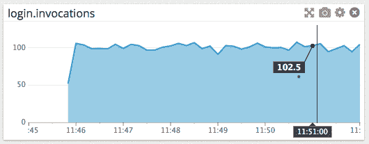

# 使用 StatsD(一种实时监控标准)收集指标

> 原文：<https://thenewstack.io/collecting-metrics-using-statsd-a-standard-for-real-time-monitoring/>

杰出的开尔文勋爵说:“衡量就是了解。”。作为编写 web 服务的软件工程师，我们绝对需要度量和指标来实时了解我们的应用程序和基础设施的性能。

您可能会问自己这样的问题:这个查询有多慢？本页面被浏览了多少次？我的服务器内存不足吗？为了帮助你回答这些问题，以及更多的问题，这篇文章介绍了 StatsD，这是一种以最小的开销实时监控的标准。

本文首先简要介绍了 StatsD，并通过一个示例展示了 StatsD 蓬勃发展的环境。然后我们将深入研究 StatsD 数据报格式，它揭示了系统内部工作的重要细节。最后，我们将回顾您在设置初始 StatsD 配置时必须做出的决定，即 UDP 还是 TCP，以及您对后端的选择。

## 什么是 StatsD？

StatsD 是一个标准工具，通过扩展，它是一组工具，可用于从任何应用程序发送、收集和聚合自定义指标。最初，StatsD 指的是 Node.js 中 Etsy 编写的一个[守护进程。如今，术语 StatsD 既指原始守护进程中使用的协议，也指实现该协议的软件和服务的集合。](https://github.com/etsy/statsd/)

StatsD 系统需要三个组件:客户端、服务器和后端。客户机是一个库，在应用程序代码中调用它来发送指标。这些指标由 StatsD 服务器(有时也称为守护程序)收集。服务器汇总这些指标，然后定期将汇总数据发送到一个或多个后端。后端对您的数据执行各种任务——例如，Graphite 是一个常用的后端，它允许您查看指标的实时图表。StatsD 组件是模块化的，因此可以添加、删除或替换不同的实现，而不会影响系统的其余部分。

为什么 StatsD 采用这种客户机-服务器-后端模型？原因有两个:(a)语言独立性和(b)可靠性。依靠一个简单的、面向文本的协议，StatsD 很快为当今使用的大多数语言和框架开发了一个客户端生态系统。它还确保了应用程序(和 StatsD 客户端)与其余工具之间的严格隔离。如果 StatsD 服务器崩溃，除了丢失工具之外，对应用程序的性能没有任何影响。

## StatsD 示例

在深入研究 StatsD 之前，让我们看一个例子:如何在 web 服务中检测像身份验证这样关键的功能。

深入研究应用程序代码，找到这个函数(用 python 显示):

```
def login(username,  password):
    if password_valid(username,  password):
        render_welcome_page()
    else:
        render_error(403)

```

您想知道的第一件事是该登录被访问的频率。这很有用，原因有很多，例如:

1.  身份验证对于任何应用程序都是至关重要的，需要对其性能有充分的了解。
2.  登录次数的突然变化可能是严重问题的早期警告(例如，不正确的 DNS 更改、过期的 TLS 证书)。

使用 StatsD 客户端库，您可以修改函数:

```
<span style="color: #0000ff;">import statsd
statsd_client  =  statsd.StatsClient('localhost',  8125)</span>

def login(username,  password):
    <span style="color: #0000ff;">statsd_client.incr('login.invocations')</span>
    if password_valid(username,  password):
        render_welcome_page()
    else:
        render_error(403)

```

您添加的代码声明了一个 StatsD 客户端，它将知道在哪里可以找到您的 StatsD 服务器，然后在每次执行该函数时递增一个名为 login.invocations 的计数器。部署您的更改后，您可以检查相应的图表:

[](https://thenewstack.io/wp-content/uploads/2015/05/TNS-StatsD-article-image-1-1.png)

看起来我们的登录次数比预期的多，所以系统的负载比预期的高。您现在想知道这是否影响了您的应用程序的性能；在测试中，您确定 20 毫秒是执行该函数的合理时间。再次修改代码，添加下面突出显示的行:

```
import statsd
statsd_client  =  statsd.StatsClient('localhost',  8125)

<span style="color: #0000ff;">@statsd_client.timer('login.time')</span>
def login(username,  password):
    statsd_client.incr('login.invocations')
    if password_valid(username,  password):
        render_welcome_page()

```

这段代码测量登录函数的执行时间，然后将时间发送给 StatsD 服务器。部署代码后，再次检查图表:

[](https://thenewstack.io/wp-content/uploads/2015/05/TNS-StatsD-article-image-2.png)

登录时间仍然在 20 ms 左右，这意味着系统可以处理它正在接收的意外负载。

使用 StatsD，只需在应用程序中添加四行代码，您就可以收集两个定制的指标，并立即了解系统的状态。

## StatsD 和分析

您可以将相同的工具从您的开发环境带到生产环境中，而无需更改一行代码。StatsD 不要求您像探查器或调试器那样在特定环境中运行应用程序。正如我们将看到的，它对无连接协议的默认依赖对它的操作安全性至关重要。

## StatsD 服务器的作用

上面的示例显示了 StatsD 客户端向 StatsD 服务器发送指标。那么服务器的作用是什么呢？

服务器汇总从客户端接收的指标，并定期将结果转发到后端进行存储和可视化。这种情况发生的频率由*冲洗间隔*决定，默认设置为 10 秒。

在上面的示例中，StatsD 服务器在刷新间隔期间累积 login.invocations，并将实际计数以及速率(每单位时间的计数)转发给它所连接的后端。

将收集原始测量值的任务与聚集它们的任务分开是限制测量对运行中的应用程序的影响的另一种方式。

## StatsD 数据报

StatsD 客户端将指标编码成简单的、基于文本的 UDP *数据报*。虽然您的客户机负责形成这些数据报，但是通过研究数据报的格式，我们可以了解到有关 StatsD 协议支持的特性的重要信息。

包含单个度量的 StatsD 数据报具有以下格式:

```
&lt;bucket&gt;:&lt;value&gt;|&lt;type&gt;|@&lt;sample rate&gt;

```

### 水桶

桶是指标的标识符。具有相同桶和相同类型的度量数据报被服务器视为相同事件的出现。在上面的例子中，我们使用“login.invocations”和“login.time”作为我们的桶。请注意，可以在存储桶中使用周期来对相关指标进行分组。存储桶不是预定义的；客户机可以在任何时候发送带有任何桶的指标，服务器将适当地处理它。

### 价值

该值是与度量相关联的数字。根据指标的类型，值有不同的含义。

### 抽样率

采样率用于向服务器指示度量被下采样。采样率旨在减少发送到 StatsD 服务器的度量数据报的数量，因为服务器的聚合可能会变得非常昂贵。采样率决定了客户端应该向服务器发送多少百分比的度量点。服务器通过将其接收到的值除以采样率来说明这种采样。例如，如果一个指标的采样率为 0.1，那么只有 10%的指标会被客户端发送到服务器。然后，服务器会将这些指标的值除以 0.1(或乘以 10)，以获得附加指标的真实值的估计值，例如我们在上面的示例中使用的登录调用计数。

### 类型

类型决定了指标所代表的事件类型。有几种度量类型:

#### **计数器**

计数器计算事件的发生次数。计数器通常用于确定事件发生的频率，就像上面的登录示例一样。在数据报格式中，计数器指标的类型为“c”。计数器指标的值是您希望计数的事件的发生次数，它可以是正整数或负整数。许多客户端实现了“递增”和“递减”函数，分别是值为+1 或-1 的计数器的简写。

```
login.invocations:1|c        # increment login.invocations by 1
other_key:-100|c # decrement other_key by 100

```

#### **计时器**

计时器测量完成一个动作所花费的时间，以毫秒为单位。计时器的度量类型是“毫秒”。StatsD 服务器将计算一个刷新间隔内计时器的平均值、标准偏差、总和以及上限和下限。StatsD 服务器还可以配置为计算这些指标的直方图(有关直方图的更多信息，请参见[此链接](https://github.com/etsy/statsd/blob/master/docs/metric_types.md#timing))。

```
login.time:22|ms # record a login.time event that took 22 ms

```

#### **仪表**

量规是任意的、持久的值。一旦量表被设置为其值，StatsD 服务器将在每个冲洗周期报告相同的值。设定量测轨后，您可以在量测轨的值上新增符号来表示值的变更。仪表的类型为“g”。

```
gas_tank:0.50|g # set the gas tank metric to 50%
gas_tank:+0.50|g  # Add 50% to the gas tank. It now reads 100%
gas_tank:-0.75|g  # Subtract 75% from the gas tank. It now reads 25%

```

#### **设定**

集合报告在刷新期间收到的唯一元素的数量。集合的值是您希望计数的元素的唯一标识符。集合的类型为“s”。

假设在一个刷新周期内出现以下指标:

```
# unique_users = 0

unique_users:foo|s 
# count an occurrence of user `foo`. unique_users = 1

unique_users:foo|s 
# we’ve already seen `foo`, so again unique_users = 1

unique_users:bar|s 
# unique_users = 2

```

刷新后，unique_users 将重置为 0，直到收到另一个指标。

## UDP 和 TCP

StatsD 被设计为以尽可能小的开销发送指标。默认情况下，客户端通过 UDP 向服务器发送指标，这是一种“一劳永逸”的协议。这意味着客户端将不会尝试确保服务器收到度量；如果数据包在网络中丢失或服务器停机，客户端将不会尝试重新发送数据包。

一般来说，如果满足以下三个标准中的任何一个，通过 UDP 发送指标是有意义的:

1.  **指标发送频繁。** UDP 的“一劳永逸”特性意味着执行 StatsD 客户端代码的时间越少越好。如果频繁发送指标，可靠性和执行成本之间的权衡是有意义的:如果您发送一个指标来记录每秒发生一百次的事件，并且一个数据包被丢弃，对准确性的影响将是最小的。然而，如果您正在计算一个每天发生一次的事件的发生次数，一个丢失或错误的数据包将对您的仪器的准确性产生重大影响。
2.  **收集指标对于代码的目的来说是次要的。**回想一下我们上面的登录示例。如果在发送任何一个登录指标时发生错误，我们不希望 StatsD 客户机停止运行或应用程序崩溃，因为代码的主要目的是验证用户。发送度量对于代码的目的来说并不重要，所以在不影响代码正常运行的情况下，不发送度量是可以容忍的。
3.  指标通过“可靠的网络”发送通常，客户端将指标发送到运行在同一台机器上的服务器，或者内部网络中的某个地方。如果您要向世界另一端的服务器发送指标，通过 UDP 发送指标可能不是最佳选择，因为数据包被丢弃或包含错误的可能性更大。

最近，Etsy 的 StatsD 服务器增加了通过 TCP [发送指标的能力。TCP 与 UDP 的不同之处在于，如果某个度量被丢弃或包含错误，客户端将尝试重新传输该度量。如果您的服务器必须接收所有的测量数据，TCP 是比 UDP 更好的选择。然而，用 TCP 发送指标会产生更多的开销。](https://github.com/etsy/statsd/issues/204)

使用 TCP 向 StatsD 服务器发送指标有一些注意事项:

1.  在撰写本文时，TCP 支持是 StatsD 协议中相对较新的内容。因此，尽管 Etsy 的 StatsD 服务器支持该协议，但许多其他客户机和服务器不支持。
2.  TCP 试图确保将度量传送到服务器，但不确保度量有效。例如，如果客户端发送不符合 StatsD 数据报格式的度量，服务器将无法处理它。然而，由于客户端只关心指标的交付，它仍然会报告指标被成功交付。

## 选择您的后端

StatsD 支持几个可插入的后端，这些后端从守护进程接收指标，并根据您的需要执行不同的功能。例如，Graphite 允许您可视化数据，而 node-bell 可以检测数据中的异常。一个守护进程可以一次将指标转发给几个后端。后端将您的指标转化为有用的信息，因此您应该小心选择最适合您需求的指标。

你需要做出的重大决定是，是自己托管 StatsD 后端，还是使用托管的后端服务，比如 [Datadog](https://www.datadoghq.com/lpg/?utm_source=Advertisement&utm_medium=Advertisement&utm_campaign=TheNewStack-SponsorPost2015) 。托管自己的 StatsD 后端将使您在后端提供的服务方面更加灵活，但是您需要一些专业知识来正确设置它。此外，当您的系统出现问题时，您的 StatsD 后端——一个用于识别和解决问题的工具——也可能会关闭。如果你愿意自己管理，Graphite 是一个不错的起点。这里还列出了几个开源后端。

## 另外

在本文中，我们简要介绍了什么是 StatsD，它是如何工作的，以及如何使用它。一路上，我们希望我们也传达了为什么要使用它。StatsD 有许多有利的属性:它是轻量级的和对开发人员友好的，它的客户机和服务器已经用许多流行的语言实现了，并且它可以与几种不同的图形和监控后端一起工作。但是，StatsD 的最终优势当然是它为您提供的东西——指标、对您的应用程序和基础架构的实时可见性，以及 Kelvin 勋爵所说的知识。

<svg xmlns:xlink="http://www.w3.org/1999/xlink" viewBox="0 0 68 31" version="1.1"><title>Group</title> <desc>Created with Sketch.</desc></svg>