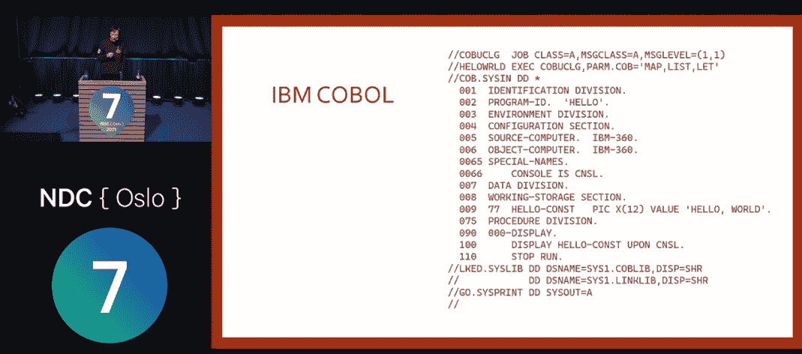

# 滑稽编码器设想有史以来最糟糕的编程语言

> 原文：<https://thenewstack.io/comical-coder-envisions-the-worst-programming-language-ever/>

开发者马克·伦德尔认为，那些没有从历史中吸取教训的人“无法重复历史，只会让它变得更糟。”

在去年挪威 NDC 会议上的一次精彩演讲中，这位幽默的程序员介绍自己是一名从事软件工作 30 年的. NET 开发人员，该演讲已经在开发社区广为流传。“在那段时间里，”他说，“我曾与一些真正可怕的[编程语言](https://thenewstack.io/category/development/)共事过。”

但随后他承诺与他的听众分享编程语言中最糟糕的特性，“这些特性在其他方面可能非常非常好，完全可以接受。

“我们将把它们融合在一起，创造出有史以来最糟糕的编程语言。”

[https://www.youtube.com/embed/vcFBwt1nu2U?feature=oembed](https://www.youtube.com/embed/vcFBwt1nu2U?feature=oembed)

视频

早些时候，Rendle 将他的注意力转向了 Python，他称之为“总体上非常好，非常合理”。但是随后他显示了两个看起来一样的代码块，其中一个抛出了一个错误，因为它的空白由制表符和空格的混合组成。(这是它与 F#、Haskell 和 Occam 共有的烦恼。)

所以 Rendle 的语言更进了一步:“我们将使用两个空格来缩进——但是如果你要缩进四个空格，那么你就要使用制表符。

“如果你缩进六个空格，那么你使用一个制表符和两个空格…等等，等等…”

Rendle 的语言也提供了自己的行号变体:它们只是偶尔使用，以标记 GOTO 语句的预期目的地。

但是，除此之外，“因为我是道格拉斯·亚当斯的超级粉丝，所以行数必须是 42 的倍数。”(这在亚当斯的《银河系漫游指南》中是一个重要的数字。)

而且递增必须以连续的顺序发生——因此，如果您稍后在程序中插入一个编号行，每个后续编号行的值都必须增加 42(在引用这些行号的每个 GOTO 语句中也会进行相应的更改)。

“我们将出售一款重构工具来帮你做到这一点，”伦德尔告诉他的听众。“两万美元。”

## 超越成功的深渊

语言设计师经常谈论为鼓励成功的编码实践而构建的平台，因此即使是初学者也仍然会落入“[成功的陷阱。但是伦德尔反驳说，这种模式“听起来一点也不好玩”，他提出了一种替代的设计模式，叫做“陷阱阿兹特克失败神庙”](https://blog.codinghorror.com/falling-into-the-pit-of-success/)

“你应该感觉像哈里森·福特从一块巨石前跑开，然后撞上一群人和一个纳粹考古学家用箭头指着你。”

[https://www.youtube.com/embed/db5rRtOExbA](https://www.youtube.com/embed/db5rRtOExbA)

视频

因此，做简单的事情应该“尽可能地困难”，而更复杂的任务应该完全交给程序员。在 PHP 中，Rendle 不仅采用了不一致的字母大小写，还采用了“无意义的变量前缀”因此，Rendle 的语言不再要求变量前面有美元符号，而是要求每个变量前面都有欧元符号。“这有一个额外的优势，那就是在大多数键盘上打字实际上相当困难……”

"对于字符串连接，我们将使用逗号，而不是加号."

Rendle 的语言还包括一个命令，该命令抛出一个无任何细节的全面异常。“我们将让程序员来分析堆栈跟踪和核心转储，以找出到底是什么出了问题。

“那个例外将被称为`HALT_AND_CATCH_FIRE`……它基本上类似于‘T1’——但更具戏剧性。”

为了增加效果，Rendle 采用了 Ruby 特有的`unless`语法——因此一个简单的命令检查未定义的“空”变量变得更加令人兴奋。

`HALT_AND_CATCH_FIRE`

`(unless €name != null)`

Rendle 的语言还要求所有的编程语句都以分号结尾，而不是以古希腊文的问号符号结尾。(看起来一模一样，但会被 Rendle 的语言视为一个完全独立的字符。)

“我们将出售带有特殊按键的键盘，上面有一个希腊问号，”伦德尔告诉他的观众。“我们会把它放在分号键的右边。你只要记住哪个是哪个就行了。”

## 易如反掌

随着谈话的继续，伦德尔的语言变得越来越狡猾。

*   以空格开始的一行被认为是注释——但是只有当空格数除以 2 剩下的余数为 1 时。正如他告诉听众的那样，“所以如果你用一个制表符和一个空格开始一行，或者一个制表符和三个空格，或者只有七个空格，那么后面的一切都是注释。”
*   22 除以 7 的结果就是馅饼的表情符号。
*   在 Visual Basic 默认 16 位整数的地方(32 位和 64 位整数有单独的语法)，Rendle 的语言只是把程序员限制在… 17 位整数。
*   他的语言既不是解释脚本语言，也不是编译语言，而是类似 Java 的半编译语言，生成自己的中间字节码。
*   字符串处理更加雄心勃勃。Rendle 的语言将支持 256 位字符，而不是使用经典的 8 位字符格式，这一设计决定“允许我们为太阳系中的每个亚原子粒子指定一个字符。”

他补充说，“我将建立一个网站，你可以上传任何你喜欢的血腥图片，我会还给你 UTF-256 编码，然后你可以在一个字符串中使用它，”他告诉他的观众。

“然后世界上所有的程序都必须到我的网络服务器来下载这个角色。”

## 来自地狱的错误消息

谈话包括一些严肃的观点。例如，Rendle 的语言没有从 [Rust](https://thenewstack.io/rust-by-the-numbers-the-rust-programming-language-in-2021/) 中借鉴任何东西，“因为 Rust 非常接近于完美的语言。”(在伦德尔看来，即使是 Rust 的错误信息也“像是来自编译器的拥抱。”)

“我们不会那样做，”他向观众保证。我们的错误信息将会是地狱！"

对于声明变量，Rendle 的语言实现了最烦人的类型化形式——既不是静态的也不是动态的，而是它自己的渐进类型化形式(利用 Python 中可用的类型“提示”[)。具体来说，Rendle 的语言包括一个新的类型定义关键字语法:`isProbablyA`。](https://www.infoworld.com/article/3630372/get-started-with-python-type-hints.html)

此外，该语言不仅进行类型检查，还进行*语法*检查，如果关键字出现在以元音开头的类型前面，就会生成编译器错误。(对于那些情况，Rendle 的语言提供了一个替代的关键字，`isProbablyAn`。)当定义多变量数组的类型时，语法正确的关键字再次变为`areProbably`。

对于增加的歧义，编译器错误是`"Invalid constant`。"

这种精神很有感染力。演讲结束时，Rendle 问听众他们对编程语言有什么不满，一名听众回答说，“我讨厌 MATLAB[和 T11，它会重复任何不以分号结尾的行。”](https://en.wikipedia.org/wiki/MATLAB)

Rendle 暗示他将把它添加到该语言的未来版本中——尽管可能会添加一些他自己语言特有的变化。“或者一个希腊问号，”他沉思着。

另一位观众一直讨厌多分支语句要求每个分支都以自己单独的`BREAK`语句结束——并建议 Rendle 也让它们成为他的语言的每一个`UNLESS`语句的强制。也是每个函数的结尾。

“我喜欢，”伦德尔说，并补充道，“你是一只扭曲的小狗。”

## 让语言变得更糟

随着伦德尔的讲话在网上流传，它引发了关于 T4 还有哪些可怕特征可以被包括在内的讨论。

伦德尔说，粉丝们有时甚至会直接向他提出建议。“用这样一个愚蠢的演讲获得这样的参与真的很令人满意，”他最近在 Twitter 上发布了。

但这只是为了好玩。Rendle 在 2014 年第一次发表演讲，并告诉他 2021 年的听众，当两位听众后来真的试图为这种语言创建 GitHub 库时，他感到震惊。

他的真正目的是恶作剧地模仿程序员每天使用的工具，以及生态系统中似乎提供不正当激励和任意奖励的更大怪癖。在某一点上，伦德尔甚至提出了他自己对格言“如果它没坏，就不要修理它”的变体。

“如果它没有坏，你应该修理它直到它坏了。然后跑了。”

然后他骄傲地给了茫然的观众一些建议:“雇用我吧。”

Rendle 演示了一个真正的“Hello World”程序，如果用 IBM COBOL 编写的话会是什么样子

有关编程语言的更多信息，请查看最近关于 Java 及其在云原生世界中的未来的新 Stack 播客。

<svg xmlns:xlink="http://www.w3.org/1999/xlink" viewBox="0 0 68 31" version="1.1"><title>Group</title> <desc>Created with Sketch.</desc></svg>