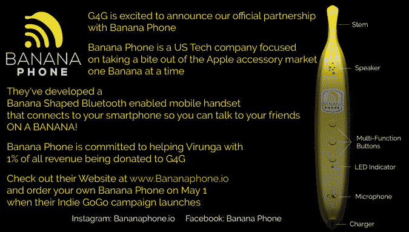

# 九月上市:香蕉手机

> 原文：<https://thenewstack.io/coming-september-banana-phone/>

这听起来像一个糟糕的杂耍短剧，但它真的发生了。现在有一个 Indiegogo 活动来制造世界上第一批香蕉手机。

在一个宣传视频中，总部位于旧金山的香蕉手机项目的发起人向你保证，他们真的在资助制造“一种可以连接到你的智能手机上的蓝牙手机，这样你就可以与你的朋友和家人通话。在香蕉上。”

他们的视频还看了看名字不太吉利的香蕉实验室，宣传材料上写道，“我们为你设计了一款强大的香蕉手机”。

"向世界展示你野性的一面——你代表着濒临灭绝的山地大猩猩."

是的，在营销天才的一击中，Banana Phone 也已经安排了他们销售额的 1%给[4 大猩猩](http://www.g4g.co.uk/)，这是一个保护刚果民主共和国东部稀有山地大猩猩的非营利组织。

来自 G4G.co.uk 的香蕉手机横幅广告

为 4 Gorilla 做准备的官方网站现在在其主页上承认了新的互联网赞助者，并大声疾呼“一家专注于从苹果配件市场分一杯羹的美国科技公司。”

尽管说“香蕉手机”很有趣，但还是让我们来看看这个设备。该活动的网页将其描述为“一个设计精美的手机，可以无线连接到你的智能手机。”当然，它的形状像香蕉…

你注意到的第一件事就是没有触摸板(因为是香蕉！).它具有语音功能，可以召唤 Siri 或谷歌助手(通过其蓝牙连接)来完成智能手机上的通话。它可以在不充电的情况下闲置长达 70 小时——实际上香蕉底部内置了一个 USB 充电端口。香蕉的内侧内置了耳朵高度的扬声器和嘴巴高度的麦克风，其他按钮显然是音量控制和接听(或发起)电话的“home”按钮。

整个装置将由“环保意识”的回收塑料制成，仅在四个月后——今年 9 月的某个时候——香蕉实验室预计开始运输它们。“我们现在已经选择了我们的首选制造商，并审查了他们及时交付高质量香蕉手机的能力，”他们的 Indiegogo 页面报道说。

那么谁是香蕉实验室的幕后黑手？管理团队中的一名成员是 Visa Inc. [的高级客户经理，Brian Brunsing](https://www.linkedin.com/in/brian-brunsing-540a2325/) 专门从事全球电子商务支付(并且是“香蕉的狂热爱好者”。)创始人兼首席技术官 [Charlie Katrycz](https://www.linkedin.com/in/charlie-katrycz-1bbab17a/?ppe=1) ，是 AutoDesk 的前常驻艺术家(也是一个“超级香蕉迷”))和[首席执行官马克思·布朗](https://www.linkedin.com/in/max-brown-5785b912/)是加勒特皮革的销售总监。当然，还有“所有香蕉的巨大支持者”

在他们的宣传视频中，他就是那个戴着假大猩猩爪子手套的人…

[https://www.youtube.com/embed/dIiZ3vvZ78s?feature=oembed](https://www.youtube.com/embed/dIiZ3vvZ78s?feature=oembed)

视频

这三个人是 15 年来最好的朋友——根据活动页面，他们都在加拿大安大略省做独木舟旅行的向导。但重要的是要记住，他们对将产品推向市场是认真的。“在过去的 5 个月里，我们与 10 家制造商合作，审查了 7 家制造商的提案，并收到了 3 家制造商的全功能原型。”

这是互联网似乎喜欢的那种疯狂的激情。活动进行到第四天时，香蕉电话已经筹集了 12，000 美元，达到了其筹资目标的 40%。这是一个“灵活目标”的活动，因此它不必达到 30，000 美元的目标就可以获得资金。但到周四，香蕉电话的预购额已经超过了 23000 美元——想必是受到了一些知名媒体报道的帮助。对记者来说，写一部香蕉手机的诱惑是不可抗拒的，在 [CNET](https://www.cnet.com/news/banana-phone-indiegogo-crowdfunding-bluetooth-handset/) ， [Mashable](http://mashable.com/2017/05/04/banana-phone-indiegogo/#kxu2H_7nIPqN) ， [The Verge](https://www.theverge.com/circuitbreaker/2017/5/4/15545232/banana-phone-indiegogo-campaign) ，甚至[美食&美酒](http://www.foodandwine.com/news/banana-phone-indiegogo)(“下次你爸爸拿起香蕉，放到耳边，回答‘你好？’然后递给你说‘这是给你的’，你可能要重新考虑翻白眼，把他当回事……”)

这场运动不可避免地激起了 Fark.com 更多的愚蠢行为。一位评论者开玩笑说:“显然，我们仍然没有接近承诺的手机技术巅峰。”他贴出了一张 20 世纪 60 年代电视侦探麦克斯韦·斯马特(Maxwell Smart)对着他的鞋子说话的照片 …其他海报分享了一系列不着边际的香蕉视频:

[https://www.youtube.com/embed/EJ1a0ymGCKA?feature=oembed](https://www.youtube.com/embed/EJ1a0ymGCKA?feature=oembed)

视频

Indiegogo 活动简洁地描述了水果形状手机的价值主张:“活一点！香蕉手机让人们脸上露出笑容，开始精彩的对话。”但该活动的视频表明，这也是一个回到复古世界的好方法，在那个世界里，电话只用于语音通话。“你是否厌倦了推送通知、电子邮件、短信和 Snapchats？”

正如 Indiegogo 运动所说，“用你的声音，而不是你的拇指，帮助我们让说话再次变得酷起来。”

对于带着香蕉形状的手机走向市场，这些企业家似乎有正确的精神。“从一开始，这个项目就非常有趣、有益、鼓舞人心，”他们在自己的竞选页面上总结道——并添加了最后一个听起来既热情又真诚的推销词。

“我们非常兴奋能把香蕉手机拿到你手里。”

* * *

# WebReduce

<svg xmlns:xlink="http://www.w3.org/1999/xlink" viewBox="0 0 68 31" version="1.1"><title>Group</title> <desc>Created with Sketch.</desc></svg>