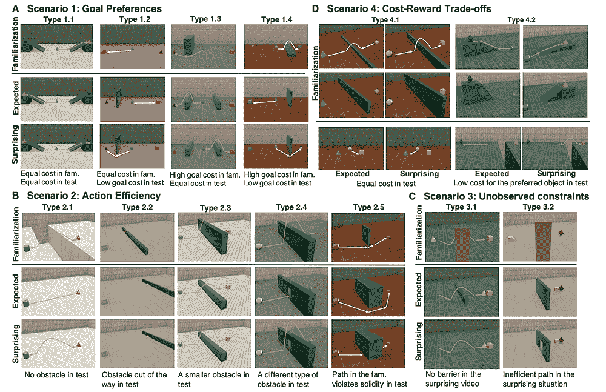
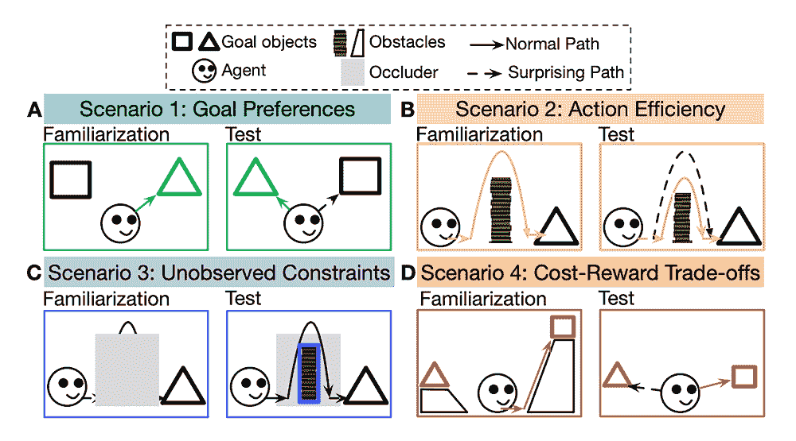

# “常识”测试可能导致更聪明的人工智能

> 原文：<https://thenewstack.io/common-sense-test-could-lead-to-smarter-ai/>

实现所谓的[人工一般智能](http://www.scholarpedia.org/article/Artificial_General_Intelligence)的目标——或者一个工程系统显示类似人类一般智能的能力——仍然是未来的一段时间。尽管如此，人工智能领域的专家无疑已经完成了一些重要的里程碑，包括开发能够进行[深度神经推理](https://thenewstack.io/googles-deepmind-ai-now-capable-deep-neural-reasoning/)、[触觉推理](https://thenewstack.io/mit-robot-uses-tactile-reasoning-ai-to-play-jenga-like-a-human/)的人工智能，甚至具有初级[社交技能](https://thenewstack.io/ai-algorithm-social-skills-cooperates-better-humans/)的人工智能。

现在，在人工智能更像人类智能的又一步中，来自 [IBM](https://thenewstack.io/ibms-k8s-based-codeflare-framework-takes-ai-from-laptop-to-the-cloud/) 、[麻省理工学院](https://thenewstack.io/this-ai-can-automatically-decipher-lost-ancient-languages/)和[哈佛大学](https://thenewstack.io/harvards-new-open-source-ai-algorithm-simplifies-protein-folding-puzzle/)的研究人员开发了一系列测试，评估人工智能使用机器版本的“常识”的能力——或者以几乎所有人类共有的方式感知、理解和判断的基本能力。

对于大多数人来说，常识不一定需要明确教授，但可以在婴儿期通过反复试验来学习，以便获得一种实用的判断，帮助我们在日常生活中导航。想象一下婴儿通过不断操纵或掉落物体来观察发生了什么，从而快速学习物理定律。相比之下，常识对机器来说不是天生的，因为它们受到训练数据集的限制，并且必须遵循其底层算法的规则。

然而，即使人工智能不太有能力教会自己一些常识，研究人员仍然热衷于寻找方法来测量人工智能的核心心理推理能力。

正如研究小组解释的那样:“对于机器智能体来说，要想在现实世界中成功地与人类互动，它们需要对人类的精神生活有所了解。直觉心理学是一种对驱动可观察行为的隐藏心理变量进行推理的能力，这种能力对人来说是天生的:即使是不会说话的婴儿也能区分代理和对象，期望代理在给定的约束下有效地行动以实现目标。尽管最近对推理其他智能体的机器智能体产生了兴趣，但尚不清楚这些智能体是否学习或掌握了驱动人类推理的核心心理学原理。”

为了更好地评估机器如何推理，研究人员团队创建了一个名为**A**action-**G**oal-**E**efficiency-co**N**straint-u**T**ility 的基准，简称为 [AGENT](https://arxiv.org/pdf/2102.12321v4.pdf) 。代理测试由一组 3D 动画组成，这些动画受到之前认知发展实验的启发。

正如 IBM 研究人员[解释的那样](https://research.ibm.com/blog/evaluating-common-sense-in-ai?utm_content=CCCWW&p1=Display&p2=347470318&p3=168394382)，这些动画显示了一个虚拟代理在不同的物理限制下与不同的项目进行交互:“这些视频包括不同的试验，每个试验都包括一个或多个代理在特定物理环境中的典型行为的‘熟悉’视频，与同一代理在新环境中的行为的‘测试’视频配对，这些视频被标记为‘预期’或‘意外’，给出了代理在相应熟悉视频中的行为。”

## 直觉心理学

受研究儿童认知发展的实验的启发，代理测试围绕所谓的直觉心理学的概念进行构建，人类婴儿在学会说话之前就学会了直觉心理学。直觉心理学的这些前言语方面包括像目标偏好、行动效率、未观察到的约束和成本回报权衡这样的变量。

通过目标偏好，测试子集将确定人工智能是否理解虚拟代理根据其偏好选择追求特定的目标或对象，在不同的物理条件下追求相同的目标可能会导致不同的行动。对于动作效率，另一个测试子集将查看模型是否理解虚拟代理可以受其环境的物理约束，并倾向于采取最有效的动作过程来实现其目标。

未观察到的约束测试探究模型是否可以基于观察代理的行为来推断隐藏的障碍。最后，成本回报权衡子测试试图确定人工智能是否理解代理的偏好，以及他们是否基于效用来计划他们的行动，方法是观察他们愿意为实现目标而花费的“成本水平”。

在测试中展示这些动画后，人工智能模型必须评估与“熟悉”视频相比，虚拟代理人在“测试”视频中的行为有多令人惊讶。使用代理基准，来自人工智能的这个评级然后与从观看同一组视频的人类收集的评级进行验证。

有趣的是，该团队故意保持数据集相对较小，以确保人工智能不只是随机得出正确的答案。“仅仅在我们的数据集上从头开始训练是行不通的。相反，我们建议，为了通过测试，有必要获得额外的知识，要么通过架构中的归纳偏差，要么通过对额外数据的培训"[研究人员](https://arxiv.org/pdf/2102.12321v4.pdf)说。

虽然测试仍在改进中，但该团队认为 AGENT 可能是一种有用的诊断工具，用于评估和进一步提高人工智能系统的常识。此外，这项研究表明了在未来翻译传统的发展心理学方法来评估智能机器的潜力。衡量人工智能的推理能力很重要，因为我们想知道人工智能在不可预测、不明确、没有严格规则定义的情况下会如何表现。

在这些未定义的情况下，某种[自我监督学习](https://thenewstack.io/can-self-supervised-learning-teach-ai-systems-common-sense/)将帮助人工智能系统更好地预测接下来会发生什么，即使可用数据质量较低或未标记。这将减少训练时间，减少对人工监督的需求，以及人工智能系统对大规模数据集的依赖——所有这些都有助于提高效率和降低成本。

看团队的[论文](https://arxiv.org/pdf/2102.12321v4.pdf)。

<svg xmlns:xlink="http://www.w3.org/1999/xlink" viewBox="0 0 68 31" version="1.1"><title>Group</title> <desc>Created with Sketch.</desc></svg>