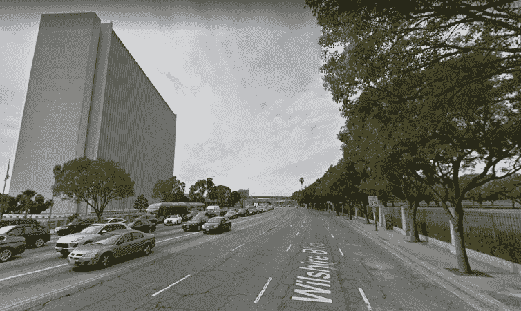
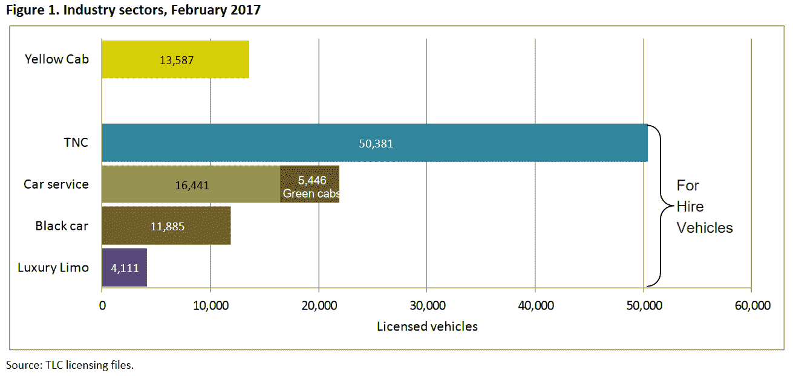
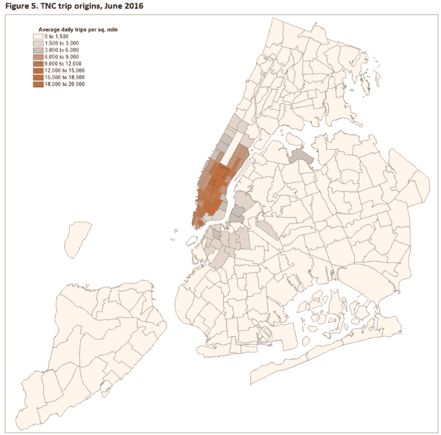

# 未来的通勤:数据显示了什么

> 原文：<https://thenewstack.io/commute-future-data-shows/>

除了高昂的住房成本，城市科技工作者还面临另一个生活质量问题:交通。

幸运的是，现在可以收集我们出行模式的数据了——让我们更详细地了解交通拥堵的根源，并提示可能的解决方案。那么未来的通勤会是什么样子呢？

CNN 最近[看到了一个可能的场景](http://money.cnn.com/2017/09/18/technology/future/lyft-streets-autonomous-vehicles/index.html)——由 Lyft 提供。

“想让你的城市解决交通问题吗？它应该从缩小街道和植树开始 CNN 最近的一个标题这样说道，而这篇文章称赞了“好的城市设计被忽视的秘密。”Lyft 与交通咨询公司尼尔森/尼加德和建筑公司 Perkins+Will 合作，试图重新想象未来的街道。他们将注意力转向洛杉矶的威尔希尔大道，提议为骑自行车的人开辟受保护的专用车道，为(自动)公交车开辟专用车道——当然，还有一个专用于拼车的“装载区”(就像 Lyft 的一样)。

通过使车道变窄，就有了更宽的人行道空间，有了舒适的长椅和欢迎的“景观”来鼓励更多的步行(和步行到公共交通)。尼尔森/尼加德公司的战略主管杰夫·图姆林说:“让驾驶成为可能的最好方法是让司机轻松地做些除了驾驶以外的事情。”。他告诉美国有线电视新闻网，目前，68%的洛杉矶司机独自驾车，占用的道路空间是骑自行车或乘坐公共汽车的 10 倍。

他们预测，他们对威尔希尔大道的重新设计可以运送四倍多的人，而车辆数量只有两倍。仔细看看 CNN 的信息图表，你会发现公共汽车乘客的数量从 3800 人增加到 35000 人(同时还有 7500 名新的自行车乘客和 22000 多名行人)。

Lyft 已经与南加州政府协会(代表 6 个县和 191 个城市)合作，“以实现更智能街道的愿景。”为了促进他们对更好通勤的承诺，Lyft 在整个 10 月份在整个洛杉矶地区打折 20%。CNN 写道，在应对交通拥堵方面，“毫不奇怪，该公司认为它应该主要从拼车开始”。

但是其他人认为拼车服务可能是问题的一部分。

布鲁斯·夏勒(Bruce Schaller)是一名长期的交通顾问，也是纽约市的前高级交通官员，他决定看看这些数据。纽约已经要求出租车乘车数据，并在拼车服务进入城镇时扩大了这一要求。利用车队规模、行程和里程的数据集来确定拼车应用的影响，他对拼车服务(或“交通网络公司”)在美国一个主要城市的扩张进行了“首次详细、全面和数据驱动的观察”。

它检查了出租车和拼车服务的出行记录(以及出租车和豪华轿车委员会的每周总结)，加上出租车许可费和车辆里程检查。它还包括纽约大都会运输管理局关于乘坐公共汽车和地铁的人数的统计数据，以及纽约运输部的自行车骑行人数。它甚至包括了来自市长管理报告的渡船数量的数据。最后，它使用了纽约大都会运输委员会关于家庭个人旅行偏好的调查。夏勒今年早些时候在 T2 公布了他的结果。

尽管人们通常认为拼车减少了拥堵，但“这项分析的结果指出，情况远比讨论假设的要复杂得多。”自 2013 年以来，至少有一部分额外行驶的里程来自从一个付费车费到另一个付费车费的拼车司机——如果人们只是驾驶自己的汽车，这种驾驶就不会发生。但是除此之外，拼车服务似乎鼓励人们*而不是*乘坐公共交通。三月份《纽约时报》报道称，尽管城市人口在增长，地铁乘客数量却自 2009 年以来首次下降。

与此同时，超过 60，000 名司机正在城市里巡游，提供拼车服务——超过 46，000 名司机来自优步(“尽管他们也可能为其他服务工作。”)

夏勒称它们是没有自己汽车的人增加城市出行的主要来源，他指出，即使你减去过去乘坐出租车(和其他私人汽车服务)的乘客，自 2013 年以来，仍然有 3100 万次额外的旅行(和 5200 万乘客)，他的报告归因于拼车应用程序——这意味着旅行里程增加了 14%至 19%。他的结论是，大多数使用拼车应用的人之前都是步行或骑自行车，或乘坐公共交通工具——在每种情况下，最终都会让更多的汽车上路。是的，他们中的一些人也会叫一辆出租车，但是许多其他人做了一次他们可能会跳过的旅行。

夏勒的报告还得出结论，“没有稳定的迹象。”在纽约，拼车服务运载的人数在 18 个月内增加了两倍，街道上增加了 5 万辆车。去年 10 月，优步平均每天提供 226046 次乘车，Lyft 提供 35908 次。三年来，他们已经行驶了超过 5 亿英里。

《纽约时报》报道称，纽约的旅行速度比 2010 年的 T4 低了 12%。

Lyft 的一位发言人告诉《泰晤士报》,该公司的目标是“取代私家车所有权，而不是公交、步行或骑自行车”——但消费者有自己的想法。夏勒还引用了 2016 年在旧金山三个社区进行的一项研究，该研究发现，如果没有拼车应用，只有 7%的人会自己开车，而高达 43%的人会步行、骑自行车或使用公共交通工具(从而减少拥堵)。

一项研究确实发现，使用拼车应用的人也更有可能使用公共交通工具，这可能是因为它鼓励人们完全停止拥有汽车——但夏勒并不信服。最近在纽约、波士顿、芝加哥和华盛顿特区进行的研究发现，使用拼车应用的人和不使用拼车应用的人在驾车出行次数上几乎没有差异。(尽管研究确实发现使用拼车应用的人不太可能*拥有*汽车。)在随后对七个大城市的调查中，62%的受访者表示拼车并没有改变他们自己的驾驶习惯，而即使对其他人来说，他们过去开车的里程数也“大致被拼车服务的里程数抵消了”。

夏勒的结论？这种趋势“不是一种可持续的城市发展方式。”

他报告的标题是“不可持续？”

他告诉其他城市，拼车应用的增长与他们当前交通选择的吸引力有关。一线希望？拼车服务的数据“鲜明地说明”了公众希望从交通服务中获得什么，并为满足公众对快速、可靠、舒适和实惠的交通服务的需求提供了一个看似无可辩驳的论据。

《T4 时报》指出，新泽西州萨米特市的官员为他们的公交站提供打折的优步乘车服务，而不是建造一个新的停车设施。

《纽约时报》甚至报道称，一些出租车司机转向了打车应用，“导致许多出租车闲置在停车场和车库里，以至于被称为‘出租车墓地’另一个附带的问题是，这个城市也因为出租汽车牌照的销售而亏损(以及出租车 50 美分的附加费)。与此同时，曼哈顿研究所(Manhattan Institute)的一名高级研究员表示，拼车应用的费用被风险资本现金补贴人为压低了。(据 TechCrunch 报道，截至 4 月，优步已经筹集了 88 亿美元，而 Lyft 已经筹集了 26.1 亿美元。)这个家伙告诉《泰晤士报》*,拼车应用只是让“最低效的交通方式”更容易出行。"*

 *那么，为什么人们认为拼车服务会减少路上的汽车数量呢？《纽约时报》指出，优步和 Lyft 都有自己的拼车服务——Uber pool 和 T2 Lyft Line。但夏勒的报告指出，尽管打车服务提供拼车选择，但“专属乘车旅行仍占主导地位。”他的最终结论？“通过 UberPool、LiftLine 和 Via 等选项进行共享出行不一定会减少里程数的增加。”

当我们都拥有自动驾驶汽车时，会发生什么？夏勒报告中的一个突破指出，自动驾驶汽车可能会增加更多的乘坐次数(从而增加拥堵)。但它也认为，我们已经看到了自动驾驶汽车的未来——因为由于汽车共享选项的需求响应可用性，乘坐人数已经在增加——即使这些汽车是“由真人驾驶的”

但是人们正在更仔细地研究这个问题——并且他们正在使用数据来研究这个问题。提供实时交通信息和分析的 SaaS(和 DaaS)公司 Inrix 最近查看了 38 个国家 1064 个城市的交通数据。他们的结论？在交通拥堵最严重的 25 个城市中，美国占了 11 个——成为交通拥堵最严重的国家。他们二月份的报告称洛杉机为世界上最拥堵的城市[。(其次是莫斯科、纽约、旧金山、波哥大。)](http://inrix.com/press-releases/los-angeles-tops-inrix-global-congestion-ranking/)

可以预见，DaaS 公司有一个解决方案。“在交通官员探索战略资本投资的同时，利用大数据和技术改善现有道路的运营对交通流量和流动性产生了更直接的影响。”

希望未来的城市规划者能够做出更好的选择。

* * *

# WebReduce

<svg xmlns:xlink="http://www.w3.org/1999/xlink" viewBox="0 0 68 31" version="1.1"><title>Group</title> <desc>Created with Sketch.</desc></svg>*