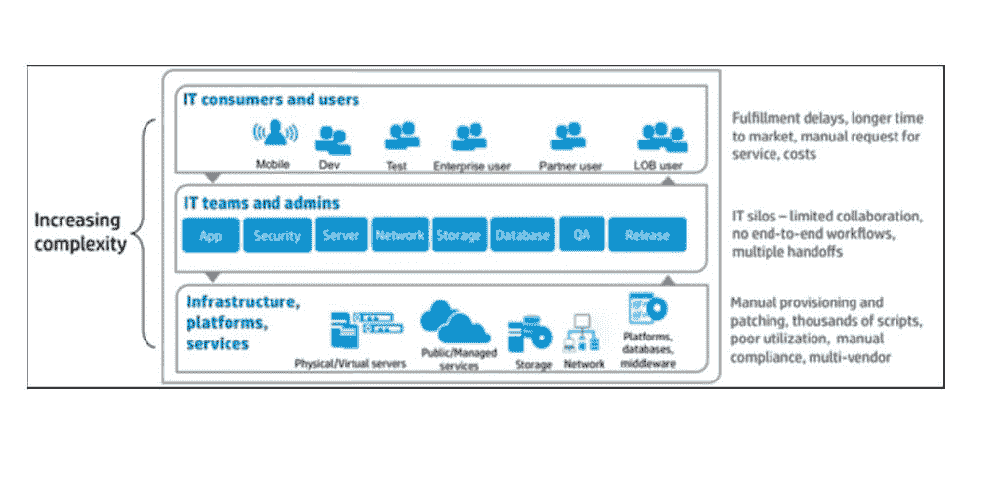
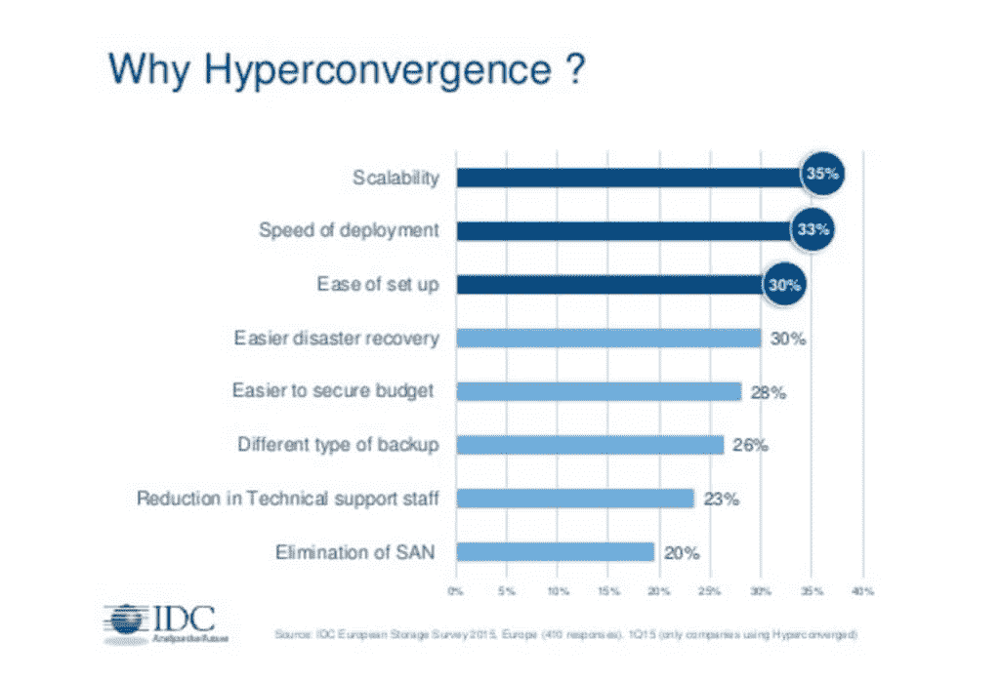
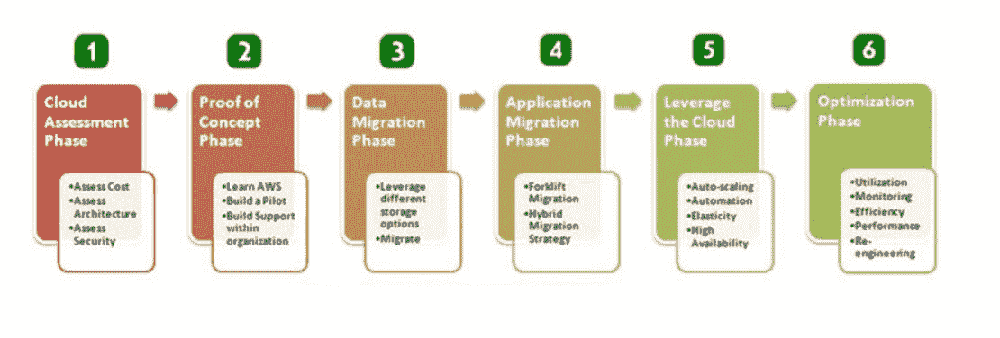

# 云架构师如何拯救 IT 部门免于消失

> 原文：<https://thenewstack.io/companies-defining-critical-role-cloud-architect/>

IT 部门的每个人都在谈论摆脱孤岛。你必须将你的数据和应用从运行它们的封闭系统中“解放”出来，以利用三大优势:云基础设施、大数据和实时分析。然而，没有人谈论一个可能会抵消所有其他去孤岛化收益的孤岛:IT 管理本身。

正如克里斯·沃尔夫[在《虚拟化评论](https://virtualizationreview.com/articles/2016/08/01/the-digital-architect.aspx)中所写的那样，在一个 It 运营中，通常会发现不同的团队在处理不同的设备和应用类型。每个团队都有自己的策略、流程和目标，通常很少有共同点。结果就是 Wolf 所说的“令人费解的混乱”,因为团队专注于他们的个人目标，而不是业务目标和客户需求。

结果是 IT 部门本质上是为自己工作，而不是为业务工作。难怪每个部门都希望通过选择和使用很少或没有 it 投入的云服务来控制自己的命运呢？直线经理通常没有意识到的是，同样的问题数据隐私和安全性、身份验证、策略执行以及供应/取消供应也适用于云服务，就像它们适用于内部系统一样。

这种情况为云架构师带来了一个新的、扩展的角色，Wolf 称之为“数字架构师”。此人负责从宏观角度看待公司的数据运营，包括移动设备、台式机、内部服务器和网络以及云资源。

## 宏观视角

Wolf 认为，数字架构师最重要的职责是“拥有向人们交付应用程序和内容的决策权”。这样做需要在贯穿整个 IT 部门的领域中给予该职位自主权。该角色需要实施一致的安全策略，并在策略和服务级别管理方面发挥领导作用。

有不止一种类型的孤岛，其中最难克服的一种孤岛也很容易被忽略:将 IT 管理与业务部门分离的孤岛。来源:惠普企业

目标是简化应用和内容向多个云的交付，增强仪表板界面，并在所有应用交付机制中应用单一、一致的安全策略。TechTarget 的 Christine Parizo 表示，云优先的方法正在改变所有类型和规模的企业，这需要彻底改变传统的 IT 模式[。您不再是从零开始构建内部系统，而是在弥合传统 IT、移动、云和一线业务流程之间的鸿沟。](http://searchsoa.techtarget.com/news/450303230/Changing-enterprise-architect-role-opens-new-doors-closes-others)

集成和可访问性是领先云应用管理平台的两个关键特征。此外，用户应该寻找一个具有清晰仪表板界面的平台，以便在几秒钟内享受调配数据库、应用程序和应用程序堆栈组件所需的所有控制，无论资源是驻留在本地还是公共、私有或混合云中。

## 将技术与业务目标联系起来

打破传统 IT 管理操作各自为政的关键是将直线经理和其他员工引向最能帮助他们实现个人目标、部门目标和整个企业目标的技术。因此，云架构师经常扮演教育者的角色，了解各种技术替代方案的优缺点。

TechTarget 的 Parizo 强调了云架构师必须在以下两者之间保持平衡:确保整个组织内 IT 服务提供的一致性，以及在需要一种可能与既定策略相冲突的独特方法时具有足够的灵活性来识别这些实例。与此同时，云架构师是 DevOps 开发和运营的粘合剂。这通常需要将开发运营与业务目标相匹配，并将应用和服务与最佳平台相匹配。

## 结束了吗？

一些科技预言家甚至宣称，传统 IT 部门的消亡就在眼前。随着云、移动、物联网和其他技术分散数据和应用程序，各个业务部门在管理重要的企业数据资产方面发挥着主导作用。在 Gadget 的一篇文章中，Barry Cashman 讨论了 VCE 最近的一项研究结果，该研究调查了向融合基础设施的转变将如何将 IT 转变为单个业务部门的延伸。

与其说是车在拉着马，不如说是车自己在拉着马。正如《VCE 报告》所言，“它需要回收技术，否则将永远失去话语权。”根据 Cashman 的说法，未来成功的关键是停止建设基础设施，而是投资于“将缓解其过渡的超融合解决方案”

《2015 年 IDC 欧洲存储调查》指出了 IT 经理通过采用超融合所期望获得的优势。来源:IDC 欧洲，通过 Slideshare

VCE 的调查发现，80%的受访者认为他们对“先进和灵活的 IT 环境”的投资将“降低风险和复杂性”，同时为他们组织的未来发展奠定基础。不利的一面是，68%接受调查的首席信息官认为传统信息技术是“创新的障碍”，而嵌入式系统的增加往往会忽视信息技术在实现业务目标中的作用。首席信息官将 IT 视为实施想法的地方，而不是想法萌发的地方。

## 扭转消失的趋势

让 IT 部门再次发挥作用是云架构师面临的主要挑战。IT 世界在不断变化，如果你不走在变化的前面，你就会被它们踩在脚下。这是 Gartner 研究总监 Mindy Cancila [在最近的 Gartner Catalyst 会议](https://www.techrepublic.com/article/how-to-develop-a-cloud-first-architecture-and-strategy/)上提出的云采用六步骤的结果。

首先，弄清楚两件事:你的员工拥有的技能，以及确保你的关键应用在云环境中平稳高效运行所需的工作。一旦你知道你在内部的位置，你就可以开始第二步了:选择云提供商。Cancila 确定了应用迁移的五个级别:

1.  **主机更换**:升降移位。
2.  **重构**:修改基础架构和/或 app。
3.  **重新架构**:更换基础设施。
4.  **重建**:更换基础设施或返工应用程序。
5.  **替换**:基础架构和 app 得到引导。

将数据和应用程序迁移到云的过程几乎涉及业务的每个方面，因此需要有人来组织该过程，以将服务与业务需求相匹配。来源:亚马逊网络服务。

在您知道需要做多少工作之后，您就可以估计账单，并将所需的治理落实到位。除了使用供应商的成本计算器之外，还要准备一份概念证明，展示完整的付款模式。随着财务和监管问题的解决，实际的转让开始了。

Cancila 将这些步骤比作一个链条中的环节:只有在您能够确认每个自动化操作都按预期运行时，您才能快速进行。如果严格遵循前五个步骤，最后一个操作步骤可能只需要部署扩展、维护、更新和故障排除流程。在运营阶段，IT——或以前的 IT——扮演云服务中介的角色，混合和匹配以设计出满足每个业务部门需求的云解决方案。

与《华盛顿邮报》互动“[嘿，让我们都制作自己的唐纳德·特朗普帽子](https://www.washingtonpost.com/news/the-fix/wp/2015/10/06/hey-lets-all-make-our-own-donald-trump-hats/)”页面一起设计的专题图片。

<svg xmlns:xlink="http://www.w3.org/1999/xlink" viewBox="0 0 68 31" version="1.1"><title>Group</title> <desc>Created with Sketch.</desc></svg>