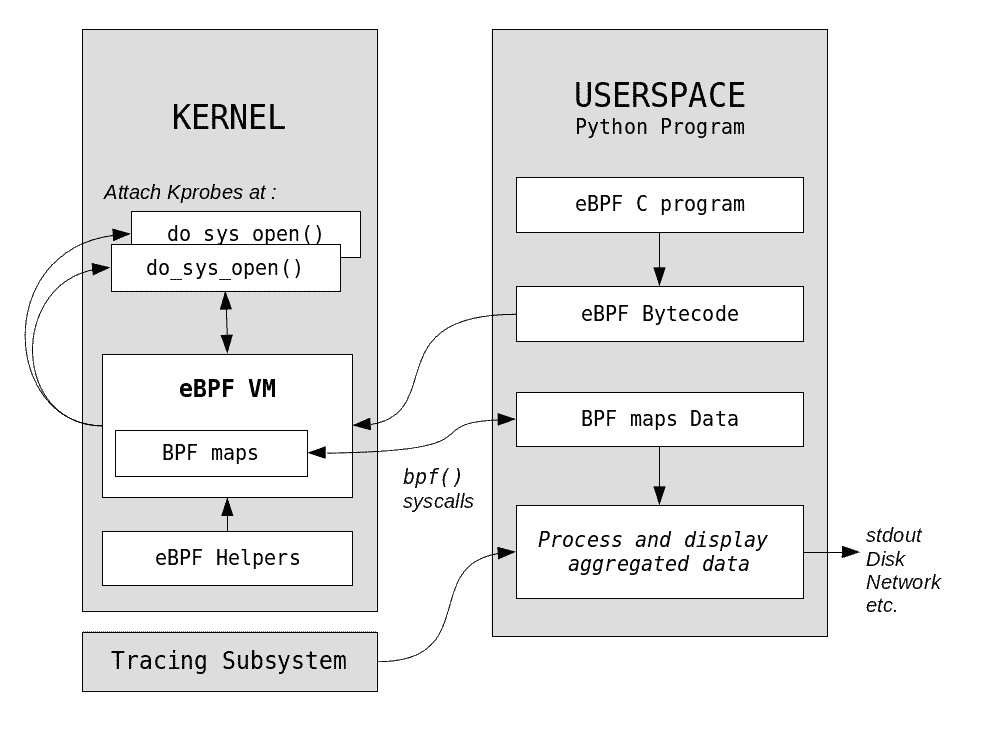

# Linux 网络、跟踪和 IO Visor，分布式世界的新系统性能工具

> 原文：<https://thenewstack.io/comparing-dtrace-iovisor-new-systems-performance-platform-advance-linux-networking-virtualization/>

每平方毫米硅中的原始能量比以往任何时候都多。随着分布式计算以及在专用硬件上运行的云和容器技术的出现，性能分析工具主要面临两个挑战:

*   以统一而灵活的方式提供所有这些层的性能分析。
*   这样做对运行系统的影响最小。

我们在本文中讨论的主要问题是最小化系统的开销或影响，并给予分析工具尽可能多的灵活性。在进入 IO Visor 内部之前，我们先从跟踪工具的初级入门开始。

## 描摹

传统的调试和分析工具无法准确定位错误。使用调试器，您可能会错过短暂的错误——在很长时间的运行中偶尔会出现一次。此外，在调试器中暂停应用程序的固有问题可能会扭曲依赖于时间的执行配置文件，这意味着您可能会错过依赖于时间的错误，如竞争条件，因为程序运行得比以前更慢。恰当地说，这些被称为[海森堡](https://en.wikipedia.org/wiki/Heisenbug)。

为了克服这个诊断噩梦，我们使用跟踪:运行程序，同时以最小的开销记录有关其执行的信息。与代码中的断点类似，可以静态(编译时)或动态(运行时)插入特殊的跟踪点。由于操作系统内核在任何基础设施中的复杂性和重要性，操作系统内核一直是这些追踪器的重要目标。Solaris、Linux 甚至 Windows 对跟踪工具的支持已经有一段时间了。跟踪可以在内核和用户空间级别执行，并且已经证明是性能分析不可或缺的工具。

### 动态跟踪

易用性和灵活性的最重要因素是在特定探测点动态跟踪内核和用户空间应用程序的能力。动态跟踪有两个目的:第一，可以根据需要插入探针，第二，当我们完成分析时，可以删除/禁用探针。因此，我们可以精确地控制系统上跟踪工具的开销。

早在 2000 年， [LTT + DProbes 项目](http://lkml.iu.edu/hypermail/linux/kernel/0011.3/0183.html)就实现了惊人的壮举:面向 Linux 的动态追踪；然而，这个项目并没有集成到 Linux 内核中。在此期间，其他项目已经重新发明了动态跟踪，包括 Sun 的大量销售和生产安全的 DTrace 工具。幸运的是，对于 Linux 来说，多年来已经集成了各种较小规模的功能，包括 tracepoints、ftrace、perf_events、kprobes 和 uprobes。许多较新的 Linux 项目——包括 SystemTap、LTTng 和 ktap——只是建立在这些跟踪功能的基础上。例如，SystemTap 使用 uprobes 和 kprobes 机制来提供动态跟踪。LTTng 还提供了基于 kprobes 的动态内核跟踪。然而，这些更新的工具还没有集成到 Linux 内核中。

为了扭转局面，以 eBPF 的形式开始了另一项努力，它已经找到了进入内核主线的方法。从 Linux 4.3 开始，通过编写内核内置的用户空间前端，现在可以为 Linux 构建一个功能丰富的跟踪器。这也是 [IO Visor](https://www.iovisor.org/) 和 [BCC](https://github.com/iovisor/bcc) 项目正在缓慢前进的方向。下面我们来详细看一下。

> 如果给一个性能工程师一个内核工具来动态地收集、探测或过滤数据，它会立刻成为热门！

## IO Visor

IO Visor 最近在西雅图 Linux 大会上被宣布为 Linux 基金会的合作项目。尽管技术术语有时可能有点模糊，但我仍会尝试将其定义为一种基础设施，以高效、安全地利用 Linux 中的 I/O 和网络应用程序——使它们可编程且动态。

IO Visor 背后的主要技术是[扩展的 Berkeley 包过滤器](https://www.kernel.org/doc/Documentation/networking/filter.txt) (eBPF)。在 Linux 内核中相当长的一段时间里，一个经典的 BPF 一直作为一个微小的包过滤虚拟机存在。除了包过滤，它还在 [seccomp](http://lwn.net/Articles/475043/) 中用于系统调用过滤。然后，一些内核开发人员决定继续前进，将这个工具从内核网络子系统中取出来，使其更加通用。他们扩展了它，改进了它的架构，并增加了对 BPF 字节码的 JIT 编译的支持。它还配备了一个新的易于使用的`bpf()`系统调用和高效的数据共享机制，其形式为 [BPF 地图](https://github.com/iovisor/bpf-docs/blob/master/bpf-internals-2.md#bpf-maps)。在我们知道之前，经典的 BPF 已经演变成 eBPF 了！

现在，我们还需要一种方法，以脚本/程序的形式表达更高级别的跟踪需求，然后有一种机制将其转换为 eBPF 字节码，以便在内核 eBPF VM 中插入和随后执行。IO Visor 开发人员很快开始研究生成 eBPF 字节码的有效方法，并确定了基于 LLVM 后端的方法。从 LLVM v3.7 开始，可以使用一个新的 BPF 目标来使用 clang 生成 eBPF 字节码。现在事情越来越有趣了。看看 IO Visor 是如何形成的:



现在，eBPF 程序可以用类似“受限 C”的格式编写，并转换成 eBPF 二进制文件。然后可以从生成的二进制文件中提取 eBPF 字节码，并通过`bpf()` syscall 加载到内核中，最终由 eBPF VM 执行。一个小小的 eBPF JIT 编译器可以将这种字节码转换成本机代码，从而将 eBPF 程序的平均执行速度提高大约三倍。

这是一件至关重要的事情。为什么？因为，eBPF 程序可以动态地附加到某些位置，比如 Kprobes、socket filters 等。这意味着在每次 Kprobe 命中时，BPF 程序将被执行。为了最小化任何执行开销，我们需要这个 eBPF 程序尽可能快。使用 BPF 映射，动态插入的代码可用于收集/聚合散列映射或数组中的数据，并将其发送到用户空间以执行进一步的处理、分析和显示。有了这样一个内核基础设施来在内核中安全地执行代码，可能性是无限的，特别是在网络、跟踪和其他性能分析领域。

### 秘送

BPF 编译器集合(BCC)是由 PLUMgrid 和 Big Switch Networks 等多个贡献者正在进行的工作，旨在创建一种改进的、更简单的方法来使用 eBPF 来满足跟踪和网络需求。使用 BCC，开发人员可以混合使用 BPF 语法和 Python 来非常容易地创建复杂的性能分析工具。

### 跟踪示例

要将 eBPF 与 BCC 一起使用，请先查看要求和[安装说明](https://github.com/iovisor/bcc/blob/master/INSTALL.md)。这里有一个我刚刚想到的 eBPF 程序的简单例子，每当一个进程试图进行一个`open()` syscall:
时，它打印“sys_open”以及进程名和 PID

```
<span style="font-size: 0.92em;">#!/usr/bin/env python 

from bcc import BPF

prog  =  """
int message(void *ctx) {
  bpf_trace_printk("sys_open\\n");
  return 0;
}
"""
b  =  BPF(text=prog)
b.attach_kprobe(event="sys_open",  fn_name="message")
print  "{:&gt;20} {:&gt;20} {:&gt;10}".format("TASK",  "TIMESTAMP",  "MESSAGE")
b.trace_print(fmt="{0:&gt;20} {4:&gt;20} {5:&gt;10}")  
</span>

```

在这里，BPF 程序`message()`本质上是对`bpf_trace_printk()`助手函数的调用，该函数在 Linux 内核中被附加到一个 Kprobe 的`sys_open()`函数调用上。输出被写入内核的 debugfs 跟踪管道(`/sys/kerneldebug/tracing/trace_pipe`)，然后由`trace_print()`以适当的格式打印到`stdout`。我选择从跟踪管道中提取并打印任务名称{0}、时间戳{4}和消息{5}。下面是跟踪工具的输出:

```
<span style="font-size: 0.92em;">$sudo  ./opentrace.py
                TASK            TIMESTAMP    MESSAGE
 vim        5022410.92052 sys_open
 vim        5022410.92054 sys_open
 vim        5022410.92058 sys_open
 vim        5022413.99273 sys_open
 vim        5022413.99282 sys_open
          irqbalance        5022416.97293 sys_open
          irqbalance        5022416.97326 sys_open
          irqbalance        5022416.97339 sys_open
 systemd        5022422.77757 sys_open
</span>

```

你看，用几行 BCC 和 eBPF 代码，就可以创建一个便宜的动态跟踪工具！这是一个最简单的例子——IO Visor 技术现在变得越来越强大。考虑到 eBPF 的低开销，看看一些 [BCC 示例](https://github.com/iovisor/bcc/tree/master/examples)和[工具](https://github.com/iovisor/bcc/tree/master/tools)现在能够更高效、更准确地生成。Brendan Gregg 和 Brenden Blanco 等 PLUMgrid 开发人员一直致力于改进 BCC，使开发跟踪工具更容易、更高效。为了让您更感兴趣，下面是我最喜欢的工具之一 funclatency 的一个示例输出，Brendan 最近将它移植到 eBPF:

```
  <span style="font-size: 0.83em;">  $  ./funclatency  -u  do_sys_open
Tracing do_sys_open...  Hit Ctrl-C  to end.
^C
usecs :  count distribution
    0  -&gt;  1          :  20 |******                                  |
    2  -&gt;  3          :  125      |****************************************|
    4  -&gt;  7          :  83 |**************************              |
    8  -&gt;  15 :  18 |***** |
 16  -&gt;  31 :  7        |**                                      |
 32  -&gt;  63 :  2        |                                        |
Detaching...
</span>

```

可以看到`do_sys_open()`在内核中被调用了多少次，以及所用时间的分布。所以函数延迟通常是两到三微秒。Brendan Gregg 最近在他最新的[博客文章](http://www.brendangregg.com/blog/2015-09-22/bcc-linux-4.3-tracing.html)中展示了更多的工具。你可以在 BCC 的 [Github repo](https://github.com/iovisor/bcc) 了解更多关于 BCC 及其“超能力”的信息。如果你对 IO Visor 及其底层技术的兴趣仍然没有得到满足，请通过阅读一些[文档](https://github.com/iovisor/bpf-docs)来更深入地了解它。

感谢 [Alexei Starovoitov](https://twitter.com/alexei_ast) 最近为 Linux 内核中的 eBPF 所做的工作，以及 [Brendan Gregg](http://www.brendangregg.com) 对本文的投入和反馈。

<svg xmlns:xlink="http://www.w3.org/1999/xlink" viewBox="0 0 68 31" version="1.1"><title>Group</title> <desc>Created with Sketch.</desc></svg>