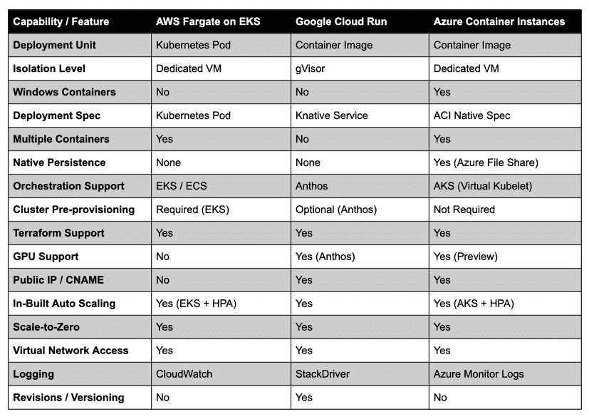

# 比较:AWS Fargate vs . Google Cloud Run vs . Azure 容器实例

> 原文：<https://thenewstack.io/comparison-aws-fargate-vs-google-cloud-run-vs-azure-container-instances/>

在仔细研究了 Amazon Web Services 的 Fargate 及其弹性 Kubernetes 服务(EKS) 之后，让我们了解一下该平台的局限性，然后快速与其他无服务器容器平台进行比较。

## AWS Fargate 在 EKS 要考虑的 5 个关键因素

### **1)在 Pod 定义中使用适当的名称空间或标签**

请记住，具有 [Fargate](https://aws.amazon.com/fargate/) 配置文件的 EKS 集群不需要工作节点。您只需要主节点暴露控制平面。附加到 EKS 集群的 Fargate 配置文件将一个或多个名称空间和标签与 Fargate 控制平面相关联。

当一个 pod 定义提交给 EKS 时，如果它不针对某个名称空间或者不包含标签，那么它永远不会被 Kubernetes 调度。它将停留在挂起状态，直到您将节点组与工作节点连接起来。要确保 pod 能够到达 Fargate，请确保它与 Fargate 配置文件中定义的名称空间和/或标签相匹配。

### **2)配置 ALB 从公共互联网访问 Pods】**

从目前的版本来看，EKS 的 Fargate 可以在没有连接互联网网关的 VPC 的私有子网中启动 microVMs。运行 pod 的 EC2 实例不会与公共 IP 相关联。这个限制限制了对部署在 Fargate 内的吊舱的访问。为了从公共互联网访问 pod，创建一个与 pod 相关联的 ClusterIP 服务，并使用指向 ClusterIP 服务的侦听器配置一个应用程序负载平衡器(ALB)。这是进入部署在法盖特的分离舱的唯一机制。

### **3)利用 Sidecar 模式模拟 Daemonsets**

虽然您可以在 Fargate 中运行打包为 Kubernetes pods 和部署的容器，但是您可能无法将它们作为 daemonsets 启动。如果您需要在每个节点上运行一个容器，那么就把它变成一个 pod 中的 sidecar。这个模式将模拟 Fargate 中的 daemonset 控制器。

### **4)使用垂直 Pod 自动缩放进行动态资源优化**

垂直 Pod 自动缩放器(VPA)将用户从为其 Pod 中的容器设置最新资源限制和请求的必要性中解放出来。配置后，它将根据使用情况自动设置请求，从而允许在满足资源要求的节点上进行适当的调度。

通过在具有 Fargate 配置文件的 EKS 集群上配置 VPA，调度程序可以将 pod 与具有足够 CPU 和内存的 microVM 相匹配。这种机制将确保当 pod 规范在运行时发生变化时，它在具有正确的 vCPU 和 RAM 的 EC2 实例上得到(重新)调度。

### **5)依靠外部服务实现持久性和状态管理**

在当前版本中，Fargate 上的 pods 不支持持久卷和持久卷声明。这意味着您只能在 Fargate 上运行无状态服务。要管理状态，您可以使用 AWS 服务，如 S3、DynamoDB 或带有 Fargate 的 ElastiCache。确保 Fargate 配置文件的 pod 执行角色有足够的权限与外部服务对话。

## 比较

在下一节中，我们将比较 EKS 上的 AWS Fargate 与 Google Cloud Run 和 Azure Container 实例。因为它们都是基于 Kubernetes 构建的，并且普遍可用，所以将它们放在一起比较是公平的。

### AWS 法盖特/EKS 与谷歌云运行

[Google Cloud Run](https://cloud.google.com/run/) 是谷歌云平台上可用的无服务器容器平台。它建立在 Knative 服务之上，以简化开发人员的体验。

Cloud Run 是一项独立的、完全托管的服务，不需要现有的 GKE 集群。适用于 Anthos 的 Cloud Run 在 GKE 或 GKE 本地提供，这依赖于 Kubernetes。Google 构建了 Cloud Run 来为开发者提供类似 PaaS 的体验。一旦容器映像进入 Cloud Run，它就会创建一个可公开访问的 URL。

AWS Fargate/EKS 可与 Anthos 的 Cloud Run 相媲美。两者都在 Kubernetes 的上下文中运行，可以访问集群中运行的其他对象。Cloud Run 不直接支持 Kubernetes pod 作为可部署单元，而 AWS Fargate 可以接受 pod 定义。云运行支持自动扩展和零扩展，这是 Knative Serving 的独特价值主张。关于被动发球的背景，请参考我在[之前的一篇文章](https://thenewstack.io/knative-brings-event-driven-and-serverless-computing-to-kubernetes/)。AWS Fargate 不支持开箱即用的自动缩放和缩放到零。但是，它可以配置为水平 Pod 自动缩放(HPA)或垂直 Pod 自动缩放(VPA)。

当在 Anthos 的上下文中运行时，Cloud Run 提供了 Kubernetes pod 的默认隔离。而托管云运行服务使用基于 gVisor 的隔离。

云运行一次只调度一个容器。如果您运行的是多容器 pod，则必须单独启动每个容器。

与 AWS Fargate/EKS 不同，Cloud Run 只需要几秒钟就可以部署一个容器，并将其公开在公共 URL 上。它还支持基于容器映像的唯一标记在部署的多个版本之间切换流量。

在开发者体验方面，Cloud Run 得分很高。这是公共云中最快、最好的无服务器容器平台之一。

### AWS Fargate/EKS 与 Azure 容器实例

微软是业内第一个通过[Azure Container Instances](https://azure.microsoft.com/en-us/services/container-instances/)(ACI)在公共云中推出无服务器容器的公司。该平台在高度优化的轻量级 VM 中调度容器，该 VM 可以可选地与公共 IP 地址相关联。ACI 提供了与 Docker Run 命令相似的体验和工作流程。

像 AWS Fargate/EKS 一样，ACI 的隔离级别是一个 VM，它提供了更好的安全性。但是，ACI 不能接受现有的 Kubernetes pod 定义。它有自己的规格，模仿 pod 规格。

ACI 有一个容器组的概念，可以将多个容器部署到同一个 VM 中。这种设计类似于 AWS Fargate/EKS 公司在同一个 microVM 中调度一个 pod 中提到的所有集装箱的方式。ACI 容器组是围绕 pod 规范建模的，在一个部署中可能有多个容器。

得益于 [Virtual Kubelet](https://virtual-kubelet.io) ，一个将 ACI 控制平面与 Kubernetes 连接起来的项目，可以将 ACI 虚拟机列为 Kubernetes 节点。当我们在配置了虚拟 Kubelet 的集群上运行 *kubectl get nodes* 时，ACI 中运行的每个容器都显示为一个节点。虽然 AWS 没有在 EKS 的 Fargate 上使用虚拟 Kubelet，但它提供了类似的体验。

ACI 可以与 Azure 文件共享相关联，以公开容器中的现有挂载点。这种集成为 ACI 实例提供了现成的持久性。

ACI 也可以使用 NVIDIA GPUs 来执行 AI 加速，这使其成为运行 ML 推理的理想候选。Fargate 还不支持 GPU。

## 并排比较

## 摘要

虽然 EKS 上的 AWS Fargate 的概念、设计和架构很优雅，但它缺乏直观的开发人员体验。由于存在对 EKS 集群的依赖性，在 Fargate 上部署现有的 pod 定义至少需要 20 分钟。从 AWS 控制台进行配置时，pod 执行角色、私有子网和名称空间的创建会降低服务的效率。创建一个 ALB，将它与运行 Fargate pod 的私有子网相关联，这对于在公共互联网上公开工作负载来说工作量太大。尽管最新发布的 *eksctl* 会处理这些问题，但您仍然需要使用标准的 *aws* CLI 或 aws 控制台来创建 ALB。在 *eksctl* 、 *aws* 和 *kubectl* 之间切换会降低开发人员的工作效率。

无服务器容器平台的承诺是提供类似于 PaaS 的开发者体验。EKS 的 AWS Fargate 要求开发人员在部署第一个 pod 之前做一些繁重的工作。亚马逊最终可能会推出一个托管的 Fargate 服务，通过暴露堆栈的最顶层，使 EKS 和 ECS 完全不可见。想象一下将一个 Kubernetes pod 提交到一个不强迫您事先启动集群的环境中的能力。

Google Cloud Run 和 ACI 都通过隐藏基础设施操作来直接关注开发者体验。他们都承诺一旦容器映像部署完毕，就提交一个 URL。

EKS 的 AWS Fargate 是朝着正确方向迈出的一步。但它必须改善开发人员的体验。

<svg xmlns:xlink="http://www.w3.org/1999/xlink" viewBox="0 0 68 31" version="1.1"><title>Group</title> <desc>Created with Sketch.</desc></svg>