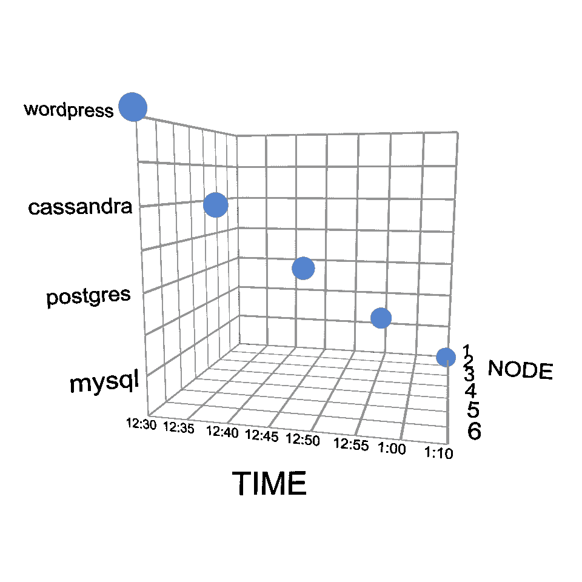
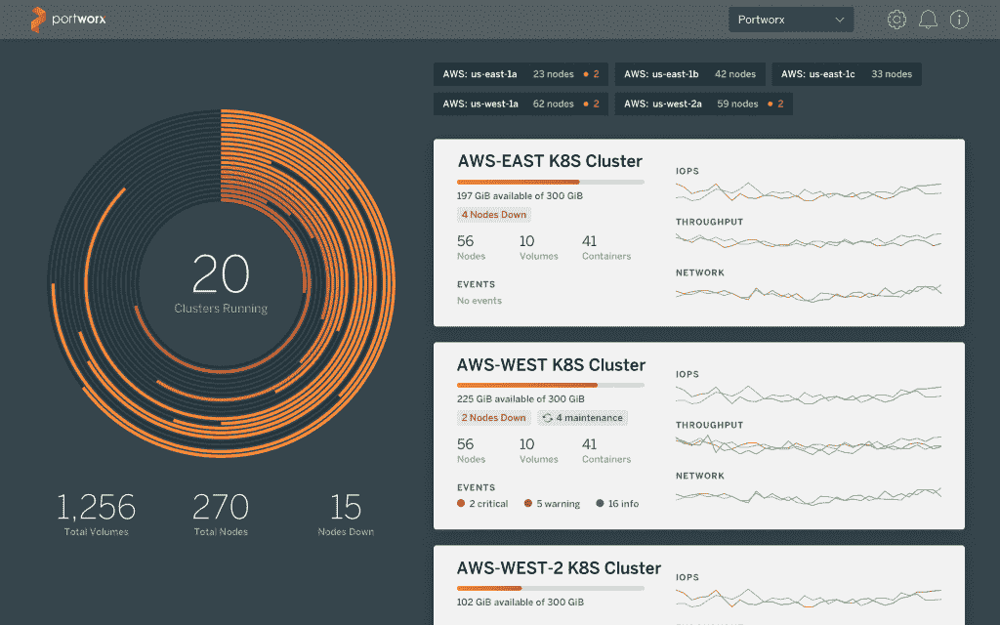

# 复杂的状态应用和多云部署，现在在 Kubernetes 上变得更加容易

> 原文：<https://thenewstack.io/complex-stateful-apps-and-multicloud-deployments-now-even-easier-on-kubernetes/>

 [苟饶，Portworx

苟饶，Portworx 联合创始人兼首席技术官，曾任戴尔数据保护部门和思杰系统 ASG 公司首席技术官；Ocarina Networks 和 Net6 的联合创始人兼首席技术官；也是英特尔和洛克希德·马丁公司的主要架构师。他拥有计算机科学学士(班加罗尔大学)和硕士(宾夕法尼亚大学)学位。](http://www.portworx.com) 

Portworx 非常兴奋地宣布 PX-Enterprise 1.4，这是迄今为止 PX-Enterprise 最重要的版本。作为 Kubernetes 的[云原生存储](https://portworx.com/cloud-native-storage/)的领导者，[我们的客户](https://portworx.com/customers/)真的一直在挑战有状态容器的极限。此版本包括我们为之服务的 15 家全球财富 1000 强公司所要求的新功能。

我们最感兴趣的两个特性是一组卷的**应用一致性**快照，一个我们称为 3DSnap 的特性，以及一个面向 PX-Enterprise 的全新 UI，专注于多云部署。我将在下面给你一个这些新特性的概述，但是首先我想分享一下为什么这些特性对我们在生产中运行有状态服务的客户如此重要。

## 毕竟这是一个微观(服务)世界

微服务架构正在推动容器的采用。基于微服务的架构的一个关键原则是，每项服务都应该依赖于自己的数据库，而不是过去由 Oracle 或 RDS 提供的集中式整体数据库。这意味着部署的数据库数量正在激增，因为以前的单一应用程序被分解成几十个微服务。此外，随着用户的指数级增长、连接设备的数量、传感器的分辨率和其他因素，每个数据库的大小都在飞速增长，产生的数据超过了软件架构师和运营专业人员需要处理的数据。

## 进入 Kubernetes

部署服务数量的增加以及这些服务的重要性——Portworx 的客户包括存储和处理来自喷气发动机的关键数据的 [GE Digital 和依靠传感器数据运行的自动驾驶汽车制造商 NIO——使得 Kubernetes 和 Mesosphere DC/OS 等调度软件的出现成为必要，这些软件能够自动化大规模部署的操作。这种自动化的结果是，与传统虚拟化相比，许多不同的应用程序最终可以在相同的物理硬件上运行。物理硬件(裸机服务器)或硬件虚拟化(虚拟机)不再为运营管理提供足够的解决方案。我们需要理解应用，而不是服务器。](https://portworx.com/ge-mesosphere-dcos-portworx/)

## 多云可用性，多云利用

虽然所有这些都在进行，但一些知名企业最近明确表示，客户不会选择一个位置来运行他们的所有应用程序。众所周知，Dropbox 从亚马逊迁移到了本地环境，在这一过程中节省了 7500 万美元。但他们也在继续使用亚马逊的一些新应用。同样，AWS 的典型代表网飞正在尝试在谷歌上运行一些工作负载，尽管这项工作的范围目前还不确定。

在未来 5 年内，多云工作负载将成为大多数企业的标准操作程序。为什么？首先，因为应用程序是每个现代企业的命脉。出于可用性和安全性的原因，企业不能将所有鸡蛋放在单个云篮子中。他们需要各种云提供商不断提供的快节奏硬件功能的灵活性，例如 GPU。他们还需要不依赖于一家提供商的成本灵活性。其次，企业需要保持与云服务合作伙伴的谈判优势。能够可靠地将云中的应用程序带回本地，或者从一个云转移到另一个云，可以显著地提供这种优势。当然，挑战在于这说起来容易做起来难。云提供商也知道这一点。

## Kubernetes 提供应用程序一致性快照

正是在这种背景下，我们刚刚发布了 PX-Enterprise 1.4，这是我们迄今为止最重要的 PX-Enterprise 版本。上述大趋势——微服务、Kubernetes 和多云——产生了一些新问题，如果企业打算在容器中部署他们最重要的应用程序，这些问题是必须克服的。其中一个问题是在不同环境之间移动应用程序，包括其数据。这方面的一个例子是从 AWS 迁移到 Google，但其他例子包括从测试环境迁移到 QA 环境再到生产环境，或者在第二个区域或可用性区域维护备份环境。

所有这些例子的问题一直是数据重力。有了 Portworx 这样的云原生存储解决方案，单个数据卷在容器环境之间的移动已经成为一个解决的问题。但更复杂的应用程序，如分布式数据库，甚至多节点 Postgres，MySQL 或 WordPress 部署，对客户来说都具有挑战性，因为它们涉及以一致的方式同时在多台机器上制作数据副本。在制作副本时，即使很小的差异也会导致数据损坏。

PX-Enterprise 1.4 通过将**应用感知**快照逻辑直接引入 Kubernetes，朝着解决这个问题迈出了一大步。从 MySQL 和 PostgreSQL 开始，随着其他数据库即将推出，Portworx 客户可以为其整个多节点应用程序拍摄应用程序一致性快照，并将这些快照移动到另一个数据中心、区域或云，在那里它们可以作为一个独立的环境重新部署，并保证应用程序一致性。我们将此功能称为 3DSnap，因为与仅关注时间和空间(特定服务器)的传统快照不同，3DSnap 包括应用程序维度。

第三个维度很重要，因为现代应用是分布式的，不仅仅在一个节点上运行。相反，它们运行在许多不同的服务器上，每个服务器都有许多不同的容器。举一个经常被视为简单化的例子:WordPress，实际上，它涉及 PHP、MySql、文件存储、Nginx 等等。您需要一个多容器、多节点和一致的数据管理解决方案，以便将这个“简单”的应用程序恢复到某个时间点。

这如何帮助解决上述问题？首先，提供管理整个应用程序的能力，不管它运行在多少不同的服务器上，为有状态应用程序提供了强大的自动化水平。其次，因为整个应用程序可以在多个环境中复制和运行，所以它加快了企业迈向多云世界的步伐。

## 多云部署是真实的。所以让我们简单点！

说到多云世界，中间层 DC/OS 1.11 最近宣布支持多云集群。Kubernetes 也在朝这个方向发展。凭借在不同环境之间移动整个应用程序(包括其数据)的能力，3DSnap 加速了这一未来。但是现在出现了一个新问题:我在多个位置有我的数据的多个副本。我如何管理这些数据？我如何保护它？如何将应用程序恢复到以前的时间点？PX-Enterprise 1.4 还包括几个旨在让这个多云世界变得更容易的功能。

首先，我们为多云集群重新设计了用户界面。这可能是多个公共云区域(例如..AWS East 和 West)、混合云(内部和公共云)或多公共云(例如 Azure 和 Google)。现在，客户可以从台式机、智能手机或平板电脑上轻松查看和管理他们的 PX 企业集群，包括所有集群的鸟瞰图，无论它们在哪里运行。为超级用户设计的其他新功能包括云拓扑感知节点图，显示哪些服务器位于哪个数据中心，强大的搜索功能，本地快照和 CloudSnap 快照的类似时间机器的视图以及卷配置管理。

其次，我们引入了一些旨在保护数据安全的安全特性。Px-Enterprise 1.4 支持容器级别的数据卷加密，这是许多多租户环境的要求。此外，这些密钥现在可以存储在 Mesosphere DC/OS Vault 中，因此客户可以将加密密钥存储在 DC/OS 内置的 Vault 服务中，而不是创建一个单独的服务。

波特沃克斯是新堆栈的赞助商。

<svg xmlns:xlink="http://www.w3.org/1999/xlink" viewBox="0 0 68 31" version="1.1"><title>Group</title> <desc>Created with Sketch.</desc></svg>