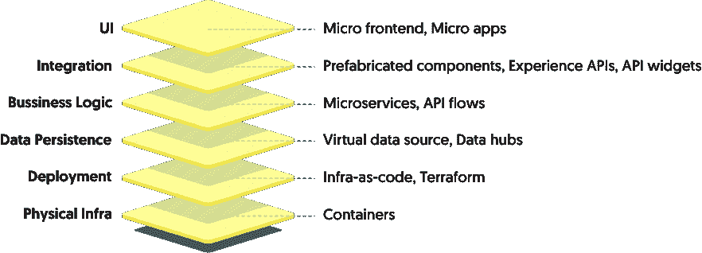
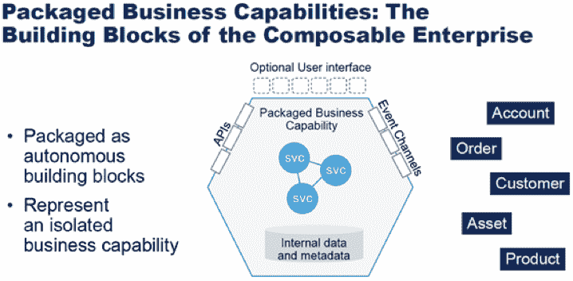
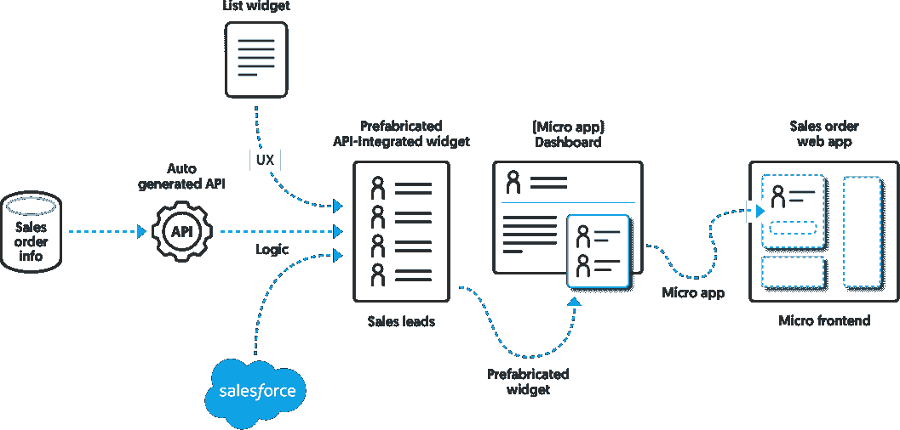
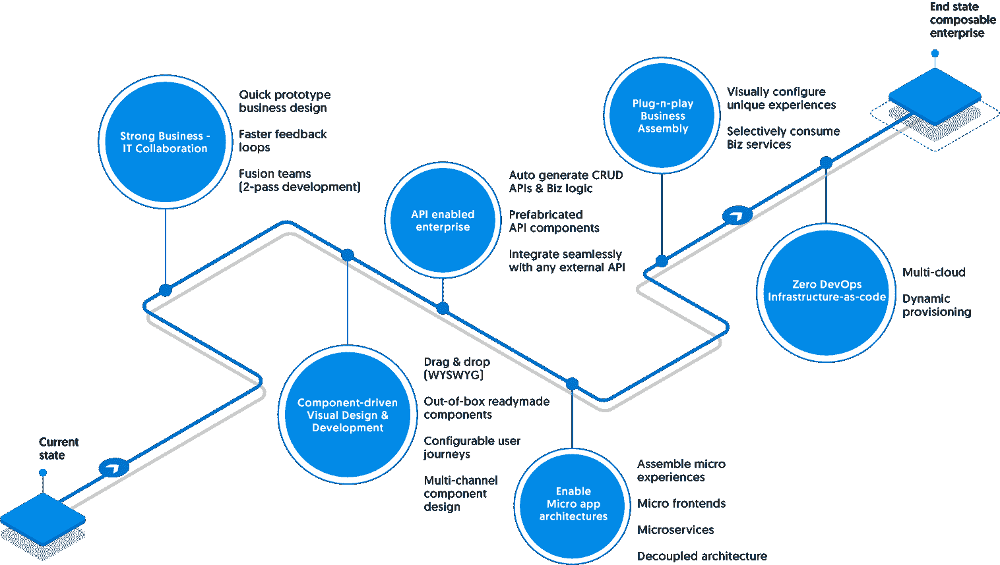

# 可组合企业将建立在低代码的基础上

> 原文：<https://thenewstack.io/composable-enterprises-will-be-built-on-low-code/>

 [马尤尔·沙阿

马尤尔·沙阿是 Wavemaker 的产品管理高级总监。Mayur 带来了深厚的企业 B2B 软件产品管理和开发经验。在过去的 20 年中，Mayur 从一开始就构建并推出了许多产品，涵盖多个领域，包括业界首个网络身份策略服务器、实时事件流平台和现代低代码平台。Mayur 对技术的可能性充满热情，并为其创造强大的价值主张。Mayur 喜欢撰写关于前沿技术的文章，并定期向行业出版物投稿。](https://www.linkedin.com/in/mayur-shah-8769022/) 

这是一个进入软件世界的迷人时刻！多渠道参与、嵌入式体验、微应用、超级定制和低代码/无代码技术都在重新定义应用的构建、打包、交付和重新配置方式。我们构建而非“组合”应用程序的方式发生了翻天覆地的变化，这推动了新的商业模式和重大的行业转型。

> “未来的应用程序体验将建立在可组合的业务功能之上，这些功能可以快速实现新的业务场景。”

-Gartner (2021 年可组合应用未来战略路线图)

可组合企业是一种采用模块化业务方法的企业，在这种企业中，使用称为打包业务功能(PBC)的预先存在的构建块来交付成果。即插即用模式是有效的，在这种模式下，这些 PBC 可以很容易地快速重新配置和重新组装。可组合企业可以更快地进入市场，快速适应快速的业务变化，并实现更大的创新。

## 现在关于可组合性有什么新的东西？

自从早期的编程以来，软件的编写、打包和消费方式一直在不断发展，以提高效率和可重用性。其中大部分都集中在定义良好的业务逻辑代码上，这些代码是孤立的，在过去的十年中，它们被具体化为 API 契约。定义良好的 API 可以很容易地集成、互换和组合。

近年来，多云、基础设施即代码和可配置多渠道用户体验等趋势迫使应用团队考虑整个应用堆栈的灵活性、可配置性和可组合性。随着开发技术的进步，使用可组合的软件组件来管理整个应用程序结构就不足为奇了。同样，这些组件也可以用类似乐高的方法一个接一个地建立起来，稍后会有更多的介绍。

图 1:跨云原生全栈应用的可组合元素。

## 打包的业务功能

PBC 是构建可组合应用程序的关键。它是一个功能齐全的组件，用户体验、底层业务逻辑、API 和配置都集成到一个包中。例如，如果您正在构建一个订单管理移动应用程序，想象一下简单地用 PBC(订单、库存、客户)组装应用程序。这样做，你不仅策划了一次用户体验之旅，还提供了所有必要的逻辑来组装一个功能齐全的应用程序。

PBC 的好处有很多——您可以将它们直接映射到业务服务。公民开发人员或不太熟练的程序员可以通过使用可视化消费机制组装 PBC 来构建应用程序。PBC 还可以管理最终用户体验，为整个应用带来一致的外观和感觉。在许多情况下，应用程序团队也可以使用 PBC 来构建平台，并以高效的方式向客户提供功能。

图 Gartner 的打包业务功能参考

## 微前端、微应用和微旅程——应用可组合性的最终前沿

当新的应用程序体验可以使用现有的 PBC 以即插即用的方式轻松地缝合在一起时，可组合性的最终好处就产生了。令人欣慰的是，近年来，UI 技术和框架有了很大的进步。与单一的用户界面相反，现代界面是特定任务的单一用途的应用程序，本质上是上下文相关的。这些单一用途的应用程序也称为微应用程序，然后可以通过微前端技术轻松组装成功能齐全的应用程序。

从后端数据源到前端用户专门构建的应用程序体验，堆栈的每一层都可以进行组合和组装。请看这个例子，它展示了订单管理应用程序体验是如何由可组合的构建块可视化地组合而成的。

图 3:由构建块组成的订单管理应用程序

## 用低代码将所有这些结合在一起

基于使用现成组件(PBC)可视化构建应用程序和服务的低代码原则、集成和设计模式与可组合性理论完全一致。通往可组合性的道路可能是一个充满许多里程碑的漫长旅程，企业可以选择低代码路线来加快速度和降低复杂性。

图 4:低代码的可组合企业之路

成为一个可组合的企业需要全新的思维模式、冒险文化和正确的技术组合。对于一个走上敏捷、协作和可重用之路的企业来说，低代码有望成为[完美的可组合工作台](https://www.wavemaker.com/)来构建功能强大的应用程序，这些应用程序可以轻松地插入到企业生态系统中，几乎没有中断。

<svg xmlns:xlink="http://www.w3.org/1999/xlink" viewBox="0 0 68 31" version="1.1"><title>Group</title> <desc>Created with Sketch.</desc></svg>