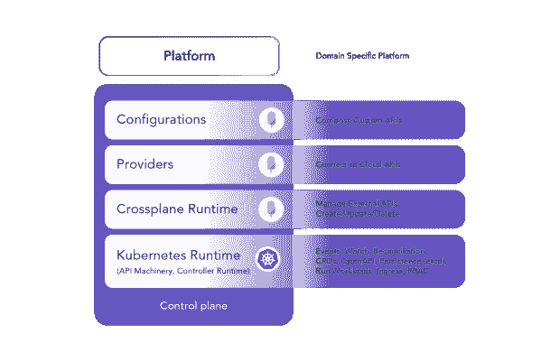
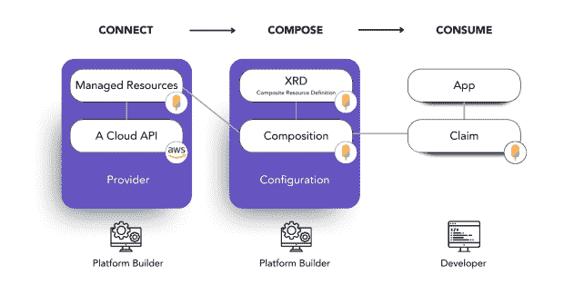

# 通过修补交叉平面资源来构建平台

> 原文：<https://thenewstack.io/composing-a-platform-by-patching-crossplane-resources/>

交叉平面是 [KubeCon + CloudNativeCon 北美](https://www.cncf.io/kubecon-cloudnativecon-events/?utm_content=inline-mention) 2022 讨论最多的话题之一。它在主题演讲和谈话中被提及，周围的闲言碎语充斥了整个展厅。Crossplane 正在全球 2000 强组织的生产中部署，在 KubeCon，Grupo Boticario、Adobe 和 Autodesk 等公司分享了他们如何采用 Crossplane。

对于那些可能不熟悉的人来说，[交叉平面](https://crossplane.io/)是一个使用[控制平面](https://thenewstack.io/gitlab-deploys-the-crossplane-control-plane-to-offer-multicloud-deployments/)构建内部云平台的框架。

## 控制飞机动力平台

你可能会问，“为什么我应该使用控制平面？”先说大局。每个更大的公司都有某种内部“云、开发、平台”组织。让我们称他们为“平台团队”他们管理公共云和内部服务的运营和消费。在基础设施即代码(IaC)工具的第一波自动化之后，这些平台团队已经意识到，单纯的 IaC 方法是不够的，因为他们经常无法解决两个基本问题:

*   我们如何在一个中心位置管理基础设施和服务，以确保它们得到高效利用，并符合我们的安全和其他标准？
*   我们如何解除开发团队的障碍，实现不需要深入的基础设施作为代码知识的自助服务？

各种方法都试图解决这些目标，并承诺以较低的成本通过单一窗口实现自助服务。但是所有的产品都有权衡:它们将平台团队锁定在特定的技术或基础设施供应商，并且它们对所提供的抽象层过于固执己见。

交叉板供电控制面板的组件

这里缺少的是一个控制平面。基于控制平面的架构为您提供了一种定义和管理资源的声明式方法，一种消除配置偏差的持续协调，并为策略实施和权限管理等问题提供了单点控制。

这让我们回到 Crossplane，一个运行在 Kubernetes 之上的[开源框架](https://thenewstack.io/crossplane-a-kubernetes-control-plane-to-roll-your-own-paas/)，使用基于控制平面的架构来构建平台。让我们看看这实际上是如何做到的。

## 用交叉板构建平台

构建和使用基于 Crossplane 的平台包括三个主要步骤:**将**连接到您想要管理的资源，**将**不同的资源组合成一个为您的团队定制的 API，最后**由开发人员消费**这些资源:

用交叉板构建平台的三个步骤

## 通过提供商连接到云

平台团队的第一步是连接到他们希望在内部提供的云 API。对于 Crossplane，这涉及到创建一个定制的资源定义(CRD)并运行一个控制器来进行相应的 API 调用。这些特定的 CRD 被称为[托管资源](https://crossplane.io/docs/v1.9/concepts/managed-resources.html)，并被捆绑到一个特定的[交叉平面提供者](https://crossplane.io/docs/v1.9/concepts/providers.html)。

社区中一致的信息是，提供商的质量和覆盖范围对他们采用 Crossplane 非常重要。有数百个贡献和开源列表可用，但通常不清楚哪些是最高质量的，并且发现最新或更相关的贡献变得越来越困难。

正因为如此， [Upbound](https://www.upbound.io/?utm_campaign=2022_Q3_EVER_GBL_The-NewStack-GENERAL&utm_medium=The-New-Stack&utm_source=referral&utm_content=inline-mention) 创建了[Upbound market place](https://marketplace.upbound.io/)作为 Crossplane 的一站式商店，包括官方提供商和其他列表。这是一个了解项目进展的好地方。市场为用户提供:

*   托管交叉面板包的地方。
*   发布给它的包的自动生成的 API 文档。
*   查找和了解不同交叉板扩展以及如何使用它们的简单方法。
*   [Upbound 官方提供商](https://blog.upbound.io/first-official-providers/):一组由 Upbound 维护、测试和支持的交叉板提供商。

截至今天，该市场提供了 1，182 种云资源可供选择。这从亚马逊网络服务(AWS)的[、谷歌云提供商(GCP)和微软 Azure 的](https://aws.amazon.com/?utm_content=inline-mention)到更小的云提供商，如 [Civo](https://marketplace.upbound.io/providers/civo/provider-civo/v0.1) 、 [DigitalOcean](https://marketplace.upbound.io/providers/digitalocean/provider-digitalocean/v0.2.0) 和 [Equinix、](https://metal.equinix.com/?utm_content=inline-mention)以及其他“特殊”提供商，如 Kubernetes、Helm 甚至 [Terraform](https://marketplace.upbound.io/providers/crossplane-contrib/provider-terraform/) 和 [Ansible](https://marketplace.upbound.io/providers/crossplane-contrib/provider-ansible) 。Upbound 已经发布了第一批官方提供商，并向整个 Crossplane 社区开放。

此外,[社区](https://www.upbound.io/learn/resources/upbound-marketplace-launch-partners)继续贡献许多提供者。我们将继续支持这一努力，如果你想为你的 API 生成一个提供者，请参见 [Upjet](https://github.com/upbound/upjet) 作为一个生成提供者的伟大工具。

## 通过修补资源构成

有了这么多可供我们使用的服务，现在是时候进入下一步了:合成。使用 Crossplane，您不必向开发人员公开原始 API。相反，您提供了一个定制的 API，我们称之为[复合资源定义](https://crossplane.io/docs/v1.9/concepts/composition.html) (XRD)。因此，不是给开发者一个原始的[PostgreSQL instance](https://marketplace.upbound.io/providers/upbound/provider-aws/v0.18.0/resources/rds.aws.upbound.io/Instance/v1beta1)，而是通过提供一个定制的[xpostgresqlininstance](https://marketplace.upbound.io/configurations/upbound/platform-ref-aws/v0.4.1/resources/aws.platformref.upbound.io/XPostgreSQLInstance/v1alpha1)来设置护栏。现在，开发人员只能更改您已经启用并且平台团队已经允许的选项；其余的都是预先定义好的，随时可以使用。

为了让这个新的 API 成为现实，您需要通过配置一组资源并组合它们来构建一个组合。这就是我们所说的打补丁，你可以把 [XPostgreSQLInstance](https://marketplace.upbound.io/configurations/upbound/platform-ref-aws/v0.4.1/compositions/xpostgresqlinstances.aws.platformref.upbound.io/aws.platformref.upbound.io/XPostgreSQLInstance) 看做一个例子。组合一套资源是非常强大和有趣的(像 YAML 一样有趣；-).因此，Crossplane 社区的下一个重要步骤是通过创建一些补丁来提供新的令人兴奋的 API。

我创建的最后一个补丁是一艘船的[数字替身。所以，我想挑战你创造一些更有趣和有用的东西。如果你正在寻找一个起点，我想指出我们的参考平台:](https://github.com/luebken/platform-example-logistics/blob/main/demo.md) [upbound/platform-ref-aws](https://github.com/upbound/platform-ref-aws) 、 [upbound/platform-ref-gcp](https://github.com/upbound/platform-ref-gcp) 或[upbound/platform-ref-azure](https://github.com/upbound/platform-ref-azure)。你也可以跟随我们的快速入门从 [AWS](https://marketplace.upbound.io/providers/upbound/provider-aws/latest/docs/quickstart) 、 [GCP](https://marketplace.upbound.io/providers/upbound/provider-gcp/latests/docs/quickstart) 或 [Azure](https://marketplace.upbound.io/providers/upbound/provider-azure/latest/docs/quickstart) 开始。还有一定要加入[https://slack.crossplane.io/](https://slack.crossplane.io/)和 ping 我 [@luebken。](https://twitter.com/luebken)

<svg xmlns:xlink="http://www.w3.org/1999/xlink" viewBox="0 0 68 31" version="1.1"><title>Group</title> <desc>Created with Sketch.</desc></svg>