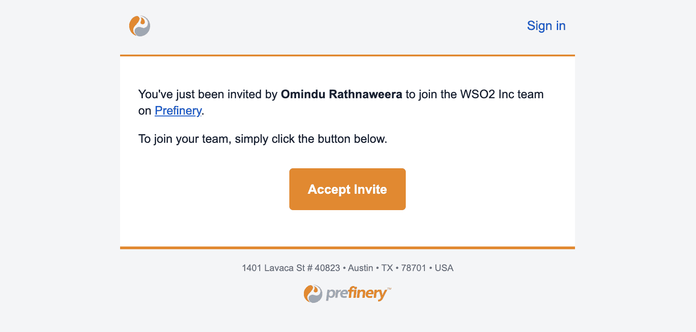
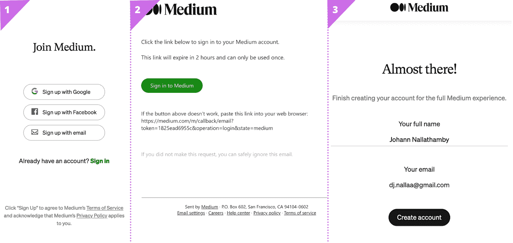
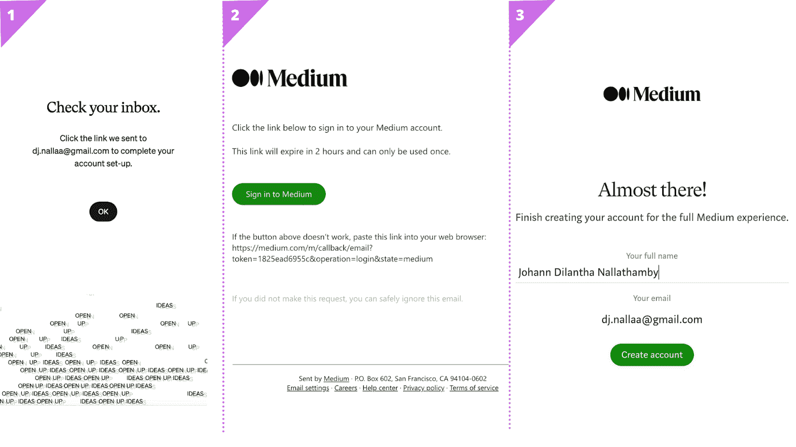
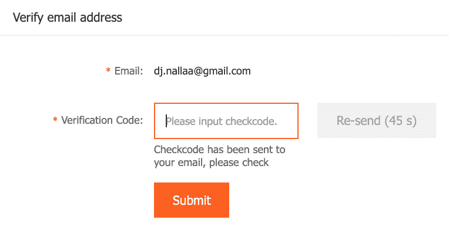
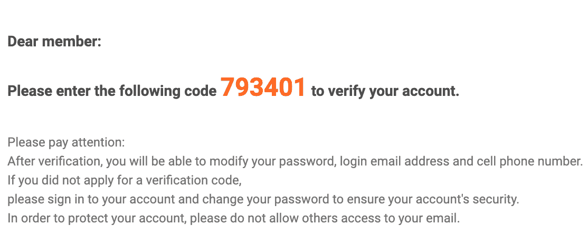
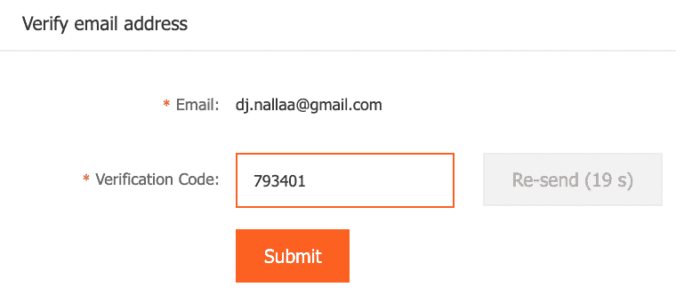
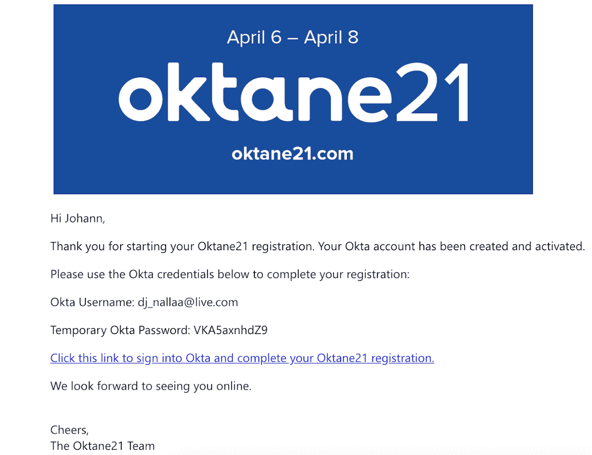

# 构建有效的消费者入职工作流，第 1 部分

> 原文：<https://thenewstack.io/composing-effective-consumer-onboarding-workflows-part-1/>

[Johann Nallathamby](https://www.linkedin.com/in/johann-nallathamby/?originalSubdomain=lk)

[Johann 是 WSO2 的 IAM 解决方案架构主管。此前，他是 WSO2 Identity Server 的首席架构师。](https://www.linkedin.com/in/johann-nallathamby/?originalSubdomain=lk)

消费者入门是客户身份和访问管理(CIAM)解决方案最重要的功能之一。过于复杂的入职工作流程会显著降低消费者体验。在不影响安全性的情况下提供有效、吸引人且高效的入职工作流一直是安全和风险专业人员面临的挑战。

这个由两部分组成的文章系列的灵感来自于 [WSO2](https://wso2.com/identity-and-access-management/) 在过去 15 年中在 CIAM 消费者的入职和登录过程中实施的许多客户实现。在本文中，我们将讨论我们在实践中看到的最常见的消费者入职工作流的类型和风格。

## 抽象消费者入职工作流

以下是基于启动方法的三种最常见的抽象工作流:

1.  自助注册工作流
2.  邀请工作流
3.  即时供应工作流

### 自助注册工作流

在此工作流中，最终消费者通过提供他/她的详细信息，发起在系统中提供帐户的请求。这是 B2C 解决方案中吸纳消费者的主要方法之一。亚马逊和易贝等电子商务网站，以及 Twitter 和 Instagram 等社交媒体网站都使用这种方法。

图 Flickr 中的自助注册工作流

### 邀请工作流

在邀请工作流中，管理员或组织内具有相关授权的人员发起请求以配置消费者帐户，该帐户进而向消费者的已验证双因素身份认证(2FA)渠道发送邀请，如已验证的电子邮件地址或已验证的手机号码。当只有选定的消费者需要加入时，此工作流特别有用。事实上，此工作流的先决条件之一是消费者的验证 2FA 渠道已在系统中注册以发送邀请。这是 B2B 解决方案中吸纳消费者的主要方法之一。

邀请包含一个“验证者”——一个共享的秘密——用来证明消费者的身份。在本文的后面，我们将探索更多关于验证器的内容。收到邀请后，消费者将向系统出示验证器，以便继续工作流程。

图 2:企业 Prefinery 中的邀请工作流

在系统之间迁移现有消费者时，有时需要批量消费者邀请。此外，支持批量邀请的端点通常需要支持没有 API 集成功能并且依赖于传统集成(如文件集成和变更数据捕获(CDC))的传统系统。

### 即时供应工作流

尽管这个工作流在技术上可以称为自注册，但它是一种流行且有效的技术，值得进行分类。终端消费者发起一个[联合登录](https://johann-nallathamby.medium.com/federated-identity-management-38b97b690788)，在系统中提供一个账户。

此工作流的两个主要用例是:

1.  社交注册——通常在 B2C 关系中
2.  B2B 关系中与客户身份提供者的联合登录

图 3:使用脸书登录的即时供应工作流

## 验证者

在讨论邀请工作流时，我们看了被称为验证器的抽象结构。现在，让我们深入到验证器的更具体的实现。以下是三种最受欢迎的验证器。然而，重要的是要理解验证器的语义在以下三个方面是不变的:

1.  确认码
2.  一次性密码(OTP)
3.  临时密码

### 确认码

这大概是互联网上最流行的验证器的味道了。确认码是一个很长的字符串，通常包括 16 个或更多的字符，通常由随机的字母数字字符组成，人类无法读取和记忆，更重要的是，它是唯一的和不可猜测的。确认码被编码到回调 URL 中并被发布。

一旦确认码被发布到回叫 URL，消费者就被引导到通知页面，通知他/她检查确认码被发布到的频道。消费者将访问该频道，并简单地点击回叫 URL，这将用户引导到系统，在该系统中，确认码被验证，并且工作流将继续。

图 4:带有确认码的电子邮件，用户定向到媒体中的回拨 URL

由于上述消费者体验，确认码比手机号码更适合作为电子邮件地址的验证器。

### 一次性密码(OTP)

这可能是你在互联网上遇到的第二种最受欢迎的验证器。OTP 是一个短字符串，通常由四到八个字符组成，通常由随机数字组成，可读且容易记忆。动态口令可能有也可能没有到期时间。

消费者体验如下:

1.OTP 被发布到双因素身份认证(2FA)通道，并且消费者被定向到工作流 UI 中的后续步骤，在该步骤中他/她被提示输入 OTP。

图 5:提示消费者输入发布到 Alibaba.com 移动电话号码的动态口令

2.消费者收到动态口令。

图 6:Alibaba.com 手机号码收到的 OTP

3.消费者将在应用程序中输入 OTP 并提交它。

图 7:消费者输入 OTP 并提交

4.提交将被验证，工作流程将继续。

与确认码和临时密码相比，动态口令是手机号码最合适的验证形式，因为它们更容易从短信中读出并输入应用程序。

### 临时密码

这可能是最不受欢迎的验证器了。临时密码是一个字符串，通常类似于非常强的密码，通常由随机的字母数字字符组成，人类无法读取和记忆，更重要的是，它是唯一的和不可猜测的。但是，临时密码与其他两个密码的主要区别在于，临时密码可重复使用，并且只有在入职工作流完成时才失效。它也可以有一个终止时间。

图 14:在“Oktane21”活动的电子邮件邀请中发送的临时密码

如果已经使用了永久密码，临时密码可能不适合自助注册和 JIT 供应工作流，因为它可能会导致混乱。同样，在这两个工作流程中，只需要几分钟时间就可以完成验证。因此，确认码和动态口令对用户体验的影响可能会更小。

临时密码有时被认为不太安全，因为消费者更倾向于将它们复制到剪贴板并粘贴。它们仅在工作流完成后失效，以降低使用共享计算机的安全风险。

## 关键要点

*   自助注册工作流是 B2C 解决方案中吸纳消费者的主要方法。
*   当只有选定的消费者需要加入时，邀请工作流特别有用，并且是 B2B 解决方案中加入消费者的主要方法之一。
*   即时供应工作流用于 B2C 解决方案中的社交注册，以及 B2B 解决方案中与客户身份提供商的联合登录。

验证者是消费者入职工作流程中的一个重要安全元素。确认码、OTP 和临时密码是受欢迎的验证方式。在为您的解决方案选择验证器时，您必须考虑它的安全性和用户体验含义。

在第 2 部分中，我们将看看组成入职工作流的不同类型的组件。

<svg xmlns:xlink="http://www.w3.org/1999/xlink" viewBox="0 0 68 31" version="1.1"><title>Group</title> <desc>Created with Sketch.</desc></svg>