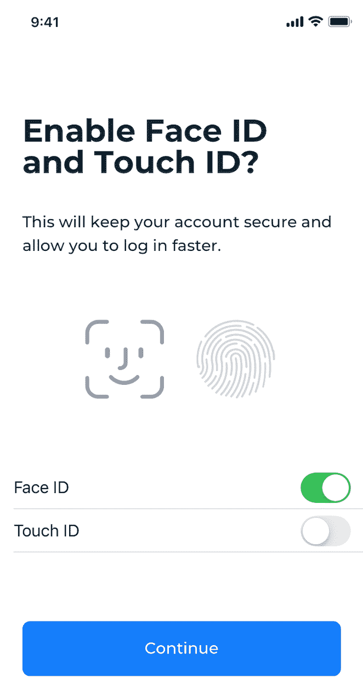

# 构建有效的消费者入职工作流，第 2 部分

> 原文：<https://thenewstack.io/composing-effective-consumer-onboarding-workflows-part-2/>

在本系列的第 1 部分中，我们介绍了三种最常见的基于启动方法的抽象工作流。但是使抽象工作流成为具体工作流的是组成工作流的不同类型的组件。在本文中，我们将看看这些组件。

## 入职工作流组件

### 验证码

CAPTCHA 实现是评估安全性和可用性之间平衡的好例子。为了避免自动表单提交和互联网上的垃圾邮件，许多入职门户网站使用验证码。根据研究，引入这种方法后，客户转换率会迅速下降。然而，谷歌的 reCAPTCHA 是对传统验证码实现的重大改进，消费者现在可以证明他们是人类，而不必解决一个问题。

图 4: Google reCAPTCHA 在 Medium 中的自助注册

### 身份验证

 [约翰·纳拉桑比

Johann 是 WSO2 的 IAM 解决方案架构主管。此前，他是 WSO2 Identity Server 的首席架构师。](https://www.linkedin.com/in/johann-nallathamby/?originalSubdomain=lk) 

验证消费者声称的身份与其真实身份相匹配并颁发凭据以证实这一点的过程称为身份验证。这通常嵌入到入职工作流程中。在社交媒体环境中，你可以注册一个双因素认证渠道，如电子邮件地址或带自我验证的手机号码，这很难告诉你消费者的真实身份。然而，在商业环境中，由于风险很高，使用了更严格的身份验证要求，如基于知识的答案、带照片的身份证或护照文件、现居住地证明、信用局查询、国家身份登记处等。

文档验证、图像处理、视频处理和生物识别领域的技术进步推动了自助在线身份验证在大众市场的采用。生物特征识别中的活性检测和非接触生物特征识别等技术是一些被广泛使用的关键技术。市场上也出现了许多支持这些技术的专业厂商，如 [Jumio](https://www.jumio.com/) 、 [Idemia](https://www.idemia.com/) 和 [Evident](https://www.evidentid.com/) 。

### 第二因素认证

正如我们在邀请工作流中看到的，该组件有助于验证和确保用户实际上是他/她所声称的合法消费者。但是，它也可用于自助注册和即时配置工作流，具体取决于工作流的构成方式。

### 提示附加属性

在某些工作流中，例如邀请工作流和即时供应工作流，可能需要收集发起者或联合登录没有提供的附加属性。该信息通常直接来自消费者，以填充系统中消费者简档中的某些强制属性。

图 5:在 Adobe Spark 中使用脸书登录进行即时供应——从消费者处收集出生日期

### 同意

在今天的客户身份访问管理中，通过在提供帐户之前显示存储在系统中的信息及其目的来获得消费者的同意通常是强制性的。条款和条件协议、隐私政策声明、营销传播偏好等可能需要额外的同意。

### 多级人工批准

此组件允许您要求特定用户或属于特定组或角色的用户批准工作流中的特定阶段，以继续下一个组件。这可以扩展到需要多个用户的多级批准。

### 帐户设置

该组件负责在系统中提供消费者帐户，这实际上是入职工作流的本质。

### 设置密码

该组件提示消费者输入新密码，并将其设置到他/她的帐户。

图 Prefinery 中的邀请工作流-提示新密码

图 7:在 LinkedIn 中使用 Google 登录即时提供密码——提示新密码

互联网上的应用程序根本不需要设置密码就可以访问系统，这种情况并不少见。例如，Medium 不支持基于密码的登录；它只提供魔链登录和社交登录。像 Dropbox 这样的应用程序提供社交注册，不需要用户在入职工作流程中设置密码。然而，Dropbox 也提供了从帐户设置部分创建密码发布的选项。

### 注册双因素身份认证(2FA)通道

要求主要 2FA 渠道并允许可选次要渠道的入职工作流在互联网上非常普遍。消费者可以通过自助消费者门户选择二级渠道。

图 8:在 Alibaba.com 将手机号码注册为二级 2FA 渠道的自助消费者门户

在笔记本电脑被盗、手机号码被回收等情况下，授权消费者使用多个 2FA 通道有助于提供额外的身份认证保障。

组件的顺序和放置取决于多种因素。例如，自助注册工作流通常对互联网开放，任何消费者都可以加入。然而，保持开放会导致潜在的自动批量帐户创建攻击，这也可能通过耗尽超出计划容量的服务器资源而导致 DDoS 攻击。一个可能的对策是实施 2FA 通道注册，以确保在请求的另一端有一个合法的消费者。

### 注册生物认证因子

在当今大众市场广泛采用的因素中，生物认证因素可能是最难被窃取和欺骗的。由于现代智能手机制造商，以设备为中心的生物识别认证因素，如 Face ID 和指纹，正迅速受到欢迎。

图 9:在银行应用程序中注册生物认证因素

### 帐户锁定/解锁

这是一个安全组件，在工作流中用于阻止对系统的访问，直到通过工作流中的某个阶段。此类组件的一个重要安全要求是，工作流阶段必须在与其前一个组件相同的事务中完成。这降低了系统的脆弱性。

### 自定义工作流组件

定制工作流组件是一种通常由供应商提供的功能，用于将定制逻辑包含到入职工作流中。该组件通常可用于调用外部系统，如 Restful 服务、企业服务总线或业务流程/业务规则引擎。

## 结束语

大流行后的世界将不再是昨天的样子。我们正在目睹戏剧性的转变，这种转变将一切都带到了网上，并使互联网在我们的生活中变得更加突出。作为战略计划启动的数字化转型项目现已快速加速。有效且吸引人的消费者入职之旅不再仅仅是美好的，而是你与竞争对手之间的关键区别。与此同时，欺诈者变得越来越活跃，越来越有创意。[客户身份和访问管理](https://wso2.com/solutions/ciam/)帮助您加速数字化转型，同时确保网络安全和卓越的消费者体验。

<svg xmlns:xlink="http://www.w3.org/1999/xlink" viewBox="0 0 68 31" version="1.1"><title>Group</title> <desc>Created with Sketch.</desc></svg>