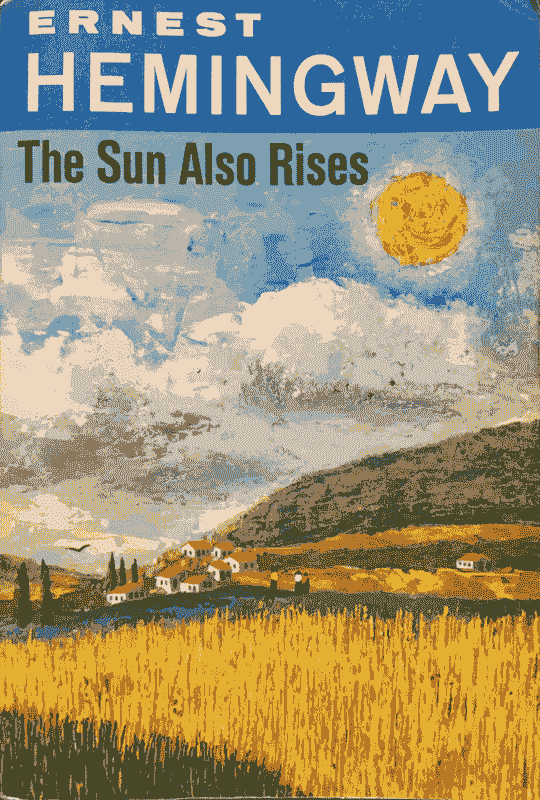

# 电脑为全国小说创作月忙碌起来

> 原文：<https://thenewstack.io/computers-get-busy-national-novel-generating-month/>

写作是所有艺术中最容易、最轻松、最快乐的打发时间的方式
*―*

上个月，GitHub 上出现了近 200 个参赛作品，挑战程序员编写可以生成 5 万字小说的计算机代码。“唯一的规则是，你至少要分享一部小说，最后还要分享你的源代码，”该活动的组织者大流士·卡泽米(Darius Schmidt)发布道，他自 2013 年以来每年 11 月都举办“全国小说创作月”。

“你想怎么定义‘小说’都行。“喵”这个词可能重复了 50000 次它可以从古登堡计划中随机抓取一本小说。没关系，只要是 50k+字就行。"

参赛作品是通过在活动的 GitHub 资源库上打开一个问题[来制作的，这实际上是一种参与意向。今年共有 188 期“特刊”，标题耐人寻味，比如《拥有任意多张面孔的英雄》、《赛博鲸——莫比·迪克的赛博朋克版》、《条款与条件——一部法律惊悚片》然后，公众可读的作品被链接到这些评论中——大部分小说生成代码也托管在 GitHub 上——一些有趣的极客讨论随之而来，所有讨论都以 GitHub 评论的形式进行。例如，一位人工智能辅助作者生成了一个名为《太阳照常升起》的故事，比欧内斯特·海明威的原著更简洁明了。](https://github.com/dariusk/NaNoGenMo-2015)

“黄铜。黄铜。黄铜。黄铜。黄铜。单调。单调。加州大学黄金分校。黄铜。黄铜。黝黑的皮肤……”

“我拍了一张《太阳照常升起》的封面照片，将其转换为 PNG 格式，然后对 PNG 进行解码，并为每个像素获得最接近的命名颜色，”作者在他的小说的官方 GitHub 发行页面上写道。“长 800 章，803218 字(据 wc)。还有一个有声读物版本，时长 173 小时，大约 2.5 场演出。”你可以在这部小说的官方网页上听到一个令人愉快的样本。

而 GitHub 上的第一条评论指出“第 786 章包含了一句话‘黑，看不见’。…看起来您的图像只有一个透明(alpha 通道=0)像素！这可能是整部小说的亮点。

“我读不了 800 章，所以我写了一个脚本来帮我读。就当这是克里夫的笔记版本吧，”他们写道，并贴出了一张…《太阳照常升起》的封面。

[](https://thenewstack.io/wp-content/uploads/2015/12/The-Sun-Also-Rises-0e72c8be-98e1-11e5-8260-65ab7cbd6682.png)

这非常有趣，吸引了大量的开发人员。今年的参赛者之一是奥莱利媒体公司 Safari 的首席技术官[丽莎·戴利](http://lizadaly.com/)，她使用 Python
生成了*六翼天使*，“一本基于伏尼契手稿的超过 5 万字的“书”另一位是康涅狄格州保险公司的软件工程师 Michael Paulukonis，他在 2014 年开始使用 JavaScript 创建“Proppian 叙事故事生成器”。凯瑟琳·麦克马洪在她的网页上描述自己是旧金山湾区的一名高中生(也是 Make School 暑期学校的校友)，她“对软件开发和构建事物充满热情。”布莱恩·希克斯是圣路易斯阿斯特里斯公司的高级开发人员。

但也许这场竞赛只是反映了我们向更科技化社会的进化。在过去的 16 年里，11 月是“全国小说写作月”，这是一项挑战业余作家在 12 月 1 日之前写出 5 万字小说的免费活动。但是两年前，它突然加入了这个为有艺术倾向的计算机程序员举办的配套活动，被称为 NaNoGenMo——在 Twitter 上画一些适合极客的笑话。

```
10  print  "It was a dark and stormy night..."

```

```
"Announcing millionMonkeys.js, a new plugin for the type:Writer framework"

```

```
for  i  in range(50000):
  print("buffalo ")
  print(".")

```

对于某些有创造力倾向的极客来说，这是一个不可抗拒的挑战。“这听起来是一个很棒的主意……”竞赛公告的一个回复这样写道。“怎么会有人不参加呢？”

但最具标志性的推文可能来自一位名叫 Jason Veatch 的 Python 开发人员，他在 MailChimp 工作。在一个计算机现在可以生成小说的世界里，他发现自己在写小说和编码之间左右为难！“我正计划今天开始真正的 NaNoWriMo！现在不知道了。”

“我不能两者兼顾…！”

* * *

## WebReduce

<svg xmlns:xlink="http://www.w3.org/1999/xlink" viewBox="0 0 68 31" version="1.1"><title>Group</title> <desc>Created with Sketch.</desc></svg>