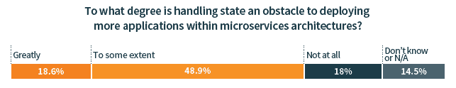
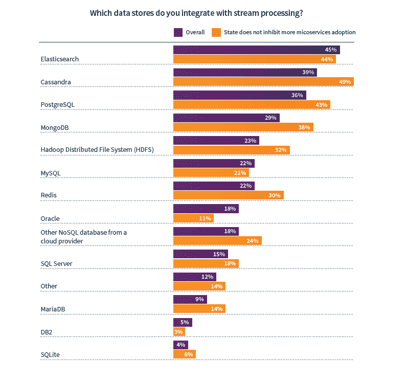

# 随着更多的应用程序使用流处理，对“状态”的关注减少了

> 原文：<https://thenewstack.io/concern-about-state-lessens-as-more-applications-use-stream-processing/>

根据新堆栈与 Lightbend 合作进行的关于流处理的[调查](https://thenewstack.io/your-new-use-cases-require-streaming-data-now-what/),随着用户获得更多关于容器、微服务和现代数据库的经验，在微服务架构中持久存储数据变得不那么成问题。

让我们明确一下，68%的受访者表示，处理状态至少在某种程度上是在微服务架构内部署更多应用程序的障碍。不过，这不是一个永久的障碍，一旦开发人员实际获得了使用新技术的经验，许多问题都会得到缓解。

来源:流数据和未来技术栈。n=560。58%的受访者在生产中使用微服务。在超过四分之一的应用程序使用流处理的企业中，这一数字跃升至 74%。

只有 18%的受访者认为州根本不是采用微服务的障碍。然而，在超过一半的应用程序中使用流媒体的用户中，41%的人认为状态根本不是障碍。这是因为流处理的高级用户正在使用能够更好地处理动态数据的设计模式和数据库。换句话说，设计的新应用程序可以利用批处理和实时数据处理，因此不太可能出现状态管理问题。

许多关于处理持久存储的问题是由于现有的应用程序是为旧的数据库和架构设计的。Cassandra、MongoDB 和 Redis 等现代数据存储的用户不太可能相信政府在禁止采用微服务。由于 71%的受访者对重构微服务应用非常满意，因此将新的流处理用例连接到这些云原生数据库应该不成问题。

来源:流数据和未来技术栈。n=342。Elasticsearch 和 Cassandra 是当前流处理用例的核心。

2018 年，我们[报道了](/this-week-in-numbers-apache-kafkas-metamorphosis/)Kafka 保存和交流状态微服务架构的使用大幅上升，至少根据 Kafka 用户的调查。2019 年，我们只是缩小了问题的焦点，以便 Kafka 的核心存储和消息传递能力与其流媒体引擎相区分。使用这种方法，我们发现一些流处理技术的早期采用者更容易受到状态的困扰。在那些认为 state 极大地抑制了微服务进一步采用的人中，Apache Kafka、Apache Spark Streaming 和 Elasticsearch 的生产级采用率平均比样本整体高 36%。

人们没有使用正确的工具来解决正确的问题，这是持续状态继续被认为是一个问题的原因。然而，随着与流处理和现代数据库相关的新设计模式的采用，这些担忧似乎减轻了。

## 报告中的更多数据

*   42%的流处理用户认为部署正在取代其组织内的现有技术。这没有考虑到那些东西流处理只是补充他们现有的堆栈。相信流处理正在取代数据库的组织更有可能使用 MySQL 和 Hadoop 作为流处理的数据源。这些技术都不是为快速处理流数据用例所涉及的数据量而设计的。由于这些是开源数据存储，人们可能认为用另一个开源产品替换它们更容易。
*   根据其他调查问题，我们发现使用流处理的应用程序比例较高的组织正在利用更持久的数据集和存储模型。这与他们不太关心持久状态的事实是一致的。更多细节和图表，请下载[完整报告](https://www.lightbend.com/white-papers-and-reports/survey-streaming-data-future-tech-stack)。

来源:流数据和未来技术栈。左图，n = 514 右图，n=213。流处理用户通常从微服务之间的 ETL 和消息传递开始，然后进入更高级的用例。

Lightbend 是新堆栈的赞助商。

<svg xmlns:xlink="http://www.w3.org/1999/xlink" viewBox="0 0 68 31" version="1.1"><title>Group</title> <desc>Created with Sketch.</desc></svg>