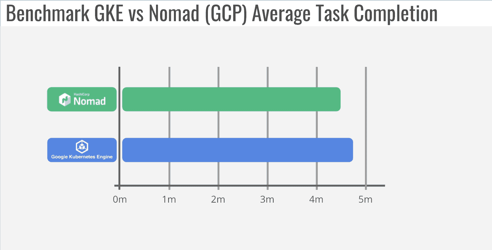

# 指挥家:为什么我们从库贝内特斯迁移到游牧民族

> 原文：<https://thenewstack.io/conductor-why-we-migrated-from-kubernetes-to-nomad/>

[Conductor Technologies](https://www.conductortech.com/) 从单一云供应商的托管 Kubernetes 开始其数字化现代化之旅。随着我们的业务随着多云产品的不断扩展，我们开始超越现有平台，并最终迁移到 HashiCorp Nomad。以下是我们如何以及为什么做出这个决定的故事，以及我们对 Nomad 的体验。

## 关于导体

 [乔纳森·克罗斯

Jonathan 是 Conductor Technologies 的首席软件工程师，从事后端工作，专注于跨多个云的渲染。](https://www.linkedin.com/in/jonathan-cross-bb006118/) 

作为最大的基于云的视觉效果渲染平台之一，Conductor 为各种电影工作室、精品 VFX 商店和独立艺术家提供快速、安全和高效的一键式服务。指挥渲染平台已用于制作“[死侍](https://www.imdb.com/title/tt1431045/)”、[权力的游戏](https://www.imdb.com/title/tt0944947/?ref_=nv_sr_srsg_0)、[盟军](https://www.imdb.com/title/tt3640424/?ref_=fn_al_tt_1)、[星际迷航超越、](https://www.imdb.com/title/tt2660888/?ref_=fn_al_tt_2)、 [The Walk](https://www.imdb.com/title/tt3488710/?ref_=fn_al_tt_1) 、[加勒比海盗:死无对证](https://www.imdb.com/title/tt1790809/?ref_=fn_al_tt_1)等众多知名电影、电视节目和商业广告的场景。视觉效果(VFX)工作流程类似于软件开发，正如像 [CircleCI](https://circleci.com/) 这样的工具自动化和简化软件开发流程一样，我们帮助艺术家通过简单的体验编排和安排他们的渲染任务，以便他们可以专注于创造性工作，而不是处理复杂的基础设施技术。

## 使用托管 Kubernetes 进行平台重构

 [卡洛斯·罗布莱斯

Carlos 是 Conductor Technologies 的高级 DevOps 工程师，负责确保公司以一致、可重复和安全的方式进行构建和扩展。](https://www.linkedin.com/in/carlos-robles-2514a4a0/) 

当 Kubernetes 公司开始将其运行在虚拟机上的遗留系统转变为云原生平台时，我们决定采用 Kubernetes。我们在谷歌 Kubernetes 引擎(GKE)上选择了托管 Kubernetes，因为我们主要在谷歌云上运行，作为一个两人平台团队，我们希望将日常运营任务卸载到托管服务上。

在我们看来，GKE 是管理最好的 Kubernetes 服务。它在我们的中小型部署中一直工作得很好。我们也通过在 GKE 的重建之旅获得了丰富的经验和知识。这些经验有助于我们快速调整我们的平台，使之与其他 orchestrators 兼容。

然而，随着我们的业务增长，平台达到了拥有数千个云实例的大规模，我们开始遇到一系列问题。很明显，对于批处理相关的工作，我们已经不能满足 GKE 的需求了，尽管我们仍然使用它来交付我们的服务。我们最终将核心渲染应用程序转移到了 HashiCorp Nomad。

## 转变背后的原因

我们转向 Nomad 的主要原因包括可扩展性、资源利用率、驱动程序支持和调度吞吐量。让我们仔细看看每一个:

### **可扩展性**

我们是大量批量作业用户。我们遇到的与这种工作类型相关的第一个主要问题是 GKE 自动缩放器。随着客户工作负载的增加，我们开始遇到这样的情况，即待处理的任务呈指数级增长，但却没有任何扩展。在检查了 Kubernetes 源代码之后，我们意识到[默认的 Kubernetes 自动缩放器](https://kubernetes.io/docs/tasks/run-application/horizontal-pod-autoscale/)并不是为批处理作业设计的，批处理作业通常对延迟的容忍度很低。我们也无法控制 autoscaler 何时开始删除实例。作为静态配置，它被设置为 10 分钟，但是累积的空闲时间增加了我们的基础架构成本，因为一旦没有什么可做的了，我们就不能快速缩减。(像 [Atlassian](https://blog.developer.atlassian.com/introducing-escalator/) 这样的公司在 Kuberenetes 的 autoscaler 上也遇到了类似的问题，最终他们创造了自己的工具作为解决办法。)

我们还发现 Kubernetes 作业控制器，一个执行批处理的 pod 的管理者，是不可靠的。系统会失去对工作的跟踪，并处于错误的状态。(其他批量用户也遇到过类似问题，在本次 [2018 KubeCon talk](https://youtu.be/mvrFqRDBgqs?list=PLaJSjzjuoyhTG0sHi4Tm1KUU3Bh3Q3ykX&t=2069) 中有所提及。)

还有另一个可伸缩性问题。在控制平面方面，无法看到 GKE 集群控制平面的大小(值得注意的是，GKE 最近开始使用 Stackdriver 提供日志)。随着负载增加，GKE 会自动扩展控制平面实例，以处理更多请求。但是升级通常会导致长时间的等待。在此期间，即使现有的 pod 仍在运行，我们也无法对集群进行重大更改或提交新的作业。等待时间降低了我们的业务吞吐量。(其他用户反映过[类似经历](https://deploy.live/blog/the-shipwreck-of-gke-cluster-upgrade/)。)

所有这些问题最终说服我们开发自己的内部自动缩放器。

### **资源利用**

GKE 在运行系统级作业的每个节点上都有相当大的内存占用。虽然在大型节点上可能不明显，但它会消耗总计算资源的很大一部分。对于我们的小型节点，如双核或四核机器，在实际可用资源只有 60%到 70%的情况下调整客户工作负载尤其困难。我们开始看到许多内存不足的警报，即使节点并没有真正用尽内存。随着我们的集群规模的扩大，这导致了平台本身保留的资源的大量浪费。

### **驾驶员支持**

我们的平台需要支持广泛的渲染解决方案和工具。许多基于 GPU 的软件需要最新的驱动程序。但由于过时的驱动程序，我们无法通过 GKE 获得最新的 GPU 功能。我们也有基于 Windows 的应用程序，Kubernetes 对 Windows 服务器容器的支持仍然很原始。我们花了太多时间寻找放置自定义图像的变通方法。这最终成为我们在 GKE 部署的障碍。

### **调度吞吐量**

我们运行一个多租户系统，允许不同的客户同时运行他们的渲染工作负载。部署请求会快速连续提交，以加快处理速度。然而，GKE [将](https://cloud.google.com/kubernetes-engine/quotas#:~:text=GKE%20API%20requests.-,Limits%20per%20project,50%20regional%20clusters%20per%20region) API 请求限制为每分钟 600 个，这降低了我们的调度吞吐量。

## 转折点——精神开销

当我们运行 GKE 集群时，我们还以传统方式管理 Google Cloud 上基于虚拟机的遗留应用程序，并开始扩展到 Amazon Web Services。管理 GKE 的过度努力使我们当时甚至没有考虑 EKS，因为它需要更多的实际操作和额外的运营成本。我们选择 AWS 批处理服务是因为它简单。但是因为每个平台都有一组特定的限制和挑战，所以找出不同的解决方法很快就成了一件令人头疼的事情。

随着业务的持续增长，处理多种托管服务的精神负担变得难以承受。虽然我们很高兴能够实现多云并支持更多客户，但很明显，我们需要整合我们的部署工具和工作流，以便高效扩展。这让我们想到了 [HashiCorp Nomad](https://www.nomadproject.io/) ，一个采用[不同方法](https://www.hashicorp.com/blog/a-kubernetes-user-s-guide-to-hashicorp-nomad)的开源 orchestrator。

## 与 Nomad 的全新体验

来自 Kubernetes 世界，Nomad 的操作简单是一个令人耳目一新的选择。我们能够在一个周末完成一个 Nomad 集群，并在两周内将其投入生产。客户在一个月内被转移到游牧生产集群。这是我们第一次能够在短短几周内将新技术部署到生产中，并让它正常工作。我们得到的好处包括:

### **更快的吞吐量**

Nomad 的调度能力非常好，这实际上给我们带来了一个意想不到的问题。在 Nomad 之前，停止一项工作和开始下一项工作之间的时间足够我们执行一系列清理任务。使用 Nomad，延迟只有 2-3 秒——如此之快，以至于我们不得不重写代码来更快地工作。

### **减少空闲时间**

在使用 Nomad 之前，集群升级和管理是操作繁重的任务。根据我们的经验，由于升级过程很容易花费几个小时，因此销毁整个 Kubernetes 集群并从头开始重建通常比运行就地升级更好。这还不包括我们在不同地区部署集群时更长的空闲时间。

有了 Nomad，我们现在有多种选择来升级服务器组，比如零停机滚动更新。由于 Nomad 代理是具有一个配置文件的单个二进制文件，我们可以轻松地将其预烘焙到节点映像中，这使得一旦我们启动新的云实例，就可以立即调度 Nomad 客户端。这减少了以前花费在下载、配置和等待节点加入集群上的空闲时间。

### **灵活的工作负载支持**

我们现在可以灵活、全面地支持 Conductor 渲染软件所需的自定义图像。我们还可以通过单个工作流协调我们的传统应用程序、基于 Windows 的应用程序和容器化作业。Nomad 灵活且可定制的设备插件让我们能够从最先进的渲染软件中获得更多功能。

### **云不可知论者**

Nomad 在内部数据中心和公共云中的部署和操作方式相同。这使我们能够在企业客户自己的数据中心或我们支持的任何云中为他们实施统一的流程编排解决方案。在维护多个系统、工具和流程以及对其进行故障排除时，拥有一个统一的、单一的 orchestrator 可以大大降低我们的认知负荷。

## 游牧民族与 GKE 的基准对比

为了更好地理解 Nomad 带来的性能提升，我们进行了一次标准案例基准测试，将 Nomad 与 GKE 进行了比较。该测试没有提供绝对的速度测量，但它帮助我们衡量解决方案在 Conductor 用例中的相对性能。

我们用的是迈克·潘的 [canonical BMW 汽车搅拌机演示。基准的其余部分包括:](https://download.blender.org/demo/test/BMW27_2.blend.zip)

*   具有 1000 帧(任务)的相同作业。
*   相同的实例类型:在 Google 计算引擎管理的实例组上是 n1-standard-4。
*   相同的内部自动缩放器实施，具有相同的计时、间隔、冷却、元数据检查和约束设置。

以下图表显示了每个 orchestrator 上三次运行的最佳结果，以及适用的标准偏差。

### **提交至第一次启动(分钟)**

【T2

该指标显示了从指挥作业“挂起”到第一次确认渲染代理开始或作业“运行”的时间 GKE 采取多个步骤，通过我们无法控制的用户数据来创建新的实例。这延长了等待时间，增加了我们的成本，因为直到我们的渲染代理启动后，我们才开始向客户收费。相比之下，Nomad 的机器映像可在我们的 CI/CD 流程中使用 Packer 进行定制，因此运行速度提高了 63%:

### **平均任务完成时间(分钟)**

此指标显示每个任务或帧从指挥“开始”到“完成”的平均时间。由于在创建 cgroup 时能够获得更多的 CPU 和内存，Nomad 的性能稍好一些。GKE 基于百分比的预留阻止我们使用一些机器资源，从而导致平均运行时间稍长。我们相信一个自我管理的 Kubernetes 集群将与 Nomad 的结果相匹配。

### **完成时间(分钟)**

该指标说明了从指挥工作“待定”到所有 1，000 个框架和/或任务完成的总时间。随着数百个实例上累积的用户数据开销，GKE 需要相当长的时间来完成整个工作。另一方面，Nomad 受益于预烘焙到机器映像中，并且 Nomad 的批处理调度器被优化为使用 Berkeley 的 [Sparrow](https://cs.stanford.edu/~matei/papers/2013/sosp_sparrow.pdf) 调度器中描述的两种选择的能力来快速排列实例。总之，最佳运行速度提高了 42%:

### **峰值实例计数**

我们的最终指标跟踪运行该作业的集群的峰值实例数。结合基准测试的总运行时间，更小的集群规模和更快的完成速度显著降低了我们和我们的客户的开销成本。Nomad 完成同样的任务所需的集群数量一直比 GKE 少，标准偏差约为 20 个实例。虽然 GKE 的最佳结果非常接近 Nomad 的结果，但其标准差几乎是它的五倍。

## 游牧者与管理下的库伯内特人

您可能会认为，对于 Conductor 的精益运营团队，默认的系统迁移或现代化解决方案是依靠托管 Kubernetes 来尽可能减少运营开销。

但是，借助开源版本的 Nomad，我们能够设计自己的解决方案，复制托管服务体验，轻松扩展到多个云和内部数据中心，更好地利用资源，获得更好的驱动程序支持，并实现更高的调度吞吐量，而不会随着我们的发展而增加额外的复杂性。例如，我们最近在 Nomad 的一个区域中创造了 275，000 个并发内核和 4，000 个实例的新内部记录。相比之下，我们之前的记录是大约 150，000 个并发内核和 2，500 个实例。

具体来说，我们已经能够充满信心地进入世界上更多的地区，这是我们在 GKE 一直犹豫不决的。例如，我们仅在两个地区使用谷歌云上的 GKE，但即使是我们的小团队，我们目前也在五个地区使用谷歌云上的 Nomad。这为我们的客户工作负载提供了更好的可用性。更重要的是，通过缩短渲染项目的总体完成时间，Conductor 和我们的客户都节省了大量成本。

欲了解更多信息，请观看我们在 2021 年 HashiConf Europe 上的[与流浪者一起制作电影魔术](https://www.hashicorp.com/resources/making-movie-magic-with-hashicorp-nomad)的会议。

<svg xmlns:xlink="http://www.w3.org/1999/xlink" viewBox="0 0 68 31" version="1.1"><title>Group</title> <desc>Created with Sketch.</desc></svg>