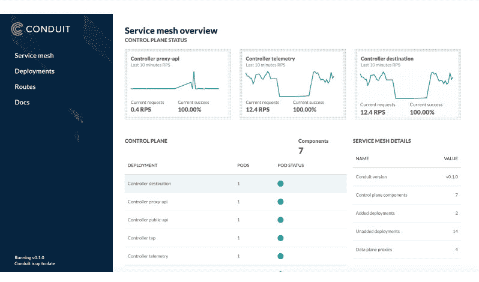

# conduit:Kubernetes 的轻量级服务网格

> 原文：<https://thenewstack.io/conduit-lightweight-service-mesh-kubernetes/>

在本周举行的[kube con+CloudNativeCon 2017](http://events.linuxfoundation.org/events/kubecon-and-cloudnativecon-north-america)上，在所有关于服务网格的讨论中， [Linkerd](https://linkerd.io/) 项目背后的公司发布了一个专门针对 Kubernetes 的版本，名为 [Conduit](https://buoyant.io/2017/12/05/introducing-conduit/) 。

开源 [Linkerd](https://github.com/linkerd/linkerd) 创建了一个独立的通信层来透明地处理诸如服务发现、负载平衡、故障处理、工具和云原生应用的服务路由之类的事情。这是一个为[云本地计算基金会](https://www.cncf.io/)设计的项目，Kubernetes 是这个项目的最佳指挥者。

赞助商公司[floppy](https://buoyant.io/)的首席执行官[威廉·摩根](https://github.com/wmorgan)解释说，Linkerd 建立在 Finagle、Netty、Scala 和 JVM 等组件的基础上，在扩大规模方面表现出色，但在资源有限的环境中，如基于 sidecar 的 Kubernetes 部署，则表现不佳。

当 Linkerd 在 2015 年发布时，编排市场是分散的，许多人在 Nomad，Mesos，Kubernetes 和其他人还没有决定要做什么。

“使用 Linkerd，我们非常明确地尽可能多地进行集成，”他解释道。两年后，Kubernetes 在编排领域占据主导地位。虽然 Linkerd 有许多客户使用替代品，但 Kubernetes 是增长最快的受众，该公司希望专门解决这一问题。

他说，该公司通过倾听客户意见来建立渠道。

“现在，人们已经了解了服务网格及其可以提供的价值，他们想要的是 Linkerd 的好处，但是是在一个极其小巧轻便的包中。他们希望从一开始就有安全原始人，”他说。

管道 [Kubernetes 服务网格](https://thenewstack.io/category/service-mesh/)部署在一个 Kubernetes 集群上，作为由轻量级代理组成的*数据平面*，它们作为 sidecar 容器与您的服务代码一起部署，以及协调和管理这些代理的进程的*控制平面*。

单个管道代理具有亚毫秒级 p99 延迟，运行时的 RSS 小于 10mb。

数据平面承载服务实例之间的应用请求流量。代理透明地拦截每个 pod 之间的通信，并添加重试和超时、工具和加密(TLS)等功能，以及根据相关策略允许和拒绝请求。

控制平面也是聚合指标的来源。

数据平面写入 [Rust](https://www.rust-lang.org/) ，控制平面写入 [Go](https://golang.org/) 。

“Rust 让我们能够编写本机代码，所以它的速度和你编写软件的速度差不多，但它也保证了内存安全。这意味着我们回避了一系列关于缓冲区溢出、CVE 和云泄漏的问题，它们甚至不是数据平面的问题。这对我们来说非常重要，因为数据层深入到了您的堆栈中。它暴露于 PII(个人身份信息)、HIPAA 数据、信用卡信息，”摩根说。

Go 是一个自然的选择，因为它在 Kubernetes 社区中非常普遍，是一种容易上手的语言，使得社区贡献的障碍很低。

控制平面 API 设计得足够通用，允许在其上构建其他工具。虽然初始版本尚不支持定制功能，但在未来，gRPC 插件可以作为控制平面的一部分运行，而无需重新编译 Conduit。

人们通过命令行界面(CLI)或用于控制集群的 web 应用程序与服务网格进行交互。

摩根说，Kubernetes 提供了一种自然的方式来使用 sidecar 方法，这是实施某些类型的高级安全策略所必需的。

“要做边车，你要尽可能小。你并不是真的要处理那么多流量，只是单个实例的流量，但它必须做到可靠，而且非常小。”

该公告涵盖了 0.1 版本。“这么 alpha，只支持 [HTTP2](https://http2.github.io/) 。它甚至不支持 HTTP1，”他说。

他概述了在准备生产之前必须具备的一系列特性，包括:

*   可靠性语义，如重试、超时和断路。
*   请求路由，对流量如何流动的编程控制。
*   安全政策——“我们已经有了基本的东西，但是还没有做到，”他说。

它的路线图包括代理透明，处理服务间所有通信的能力，而不仅仅是 HTTP 默认情况下提供服务间的认证和保密，扩展 Kubernetes API 以支持各种真实世界的操作策略，并支持特定于环境的策略插件。

摩根说，管道的扩建对 Linkerd 的开发、支持和维护几乎没有影响。它专注于在尽可能多的环境中使用的集成，以及跨环境的能力。

<svg xmlns:xlink="http://www.w3.org/1999/xlink" viewBox="0 0 68 31" version="1.1"><title>Group</title> <desc>Created with Sketch.</desc></svg>