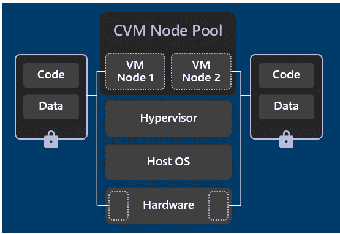
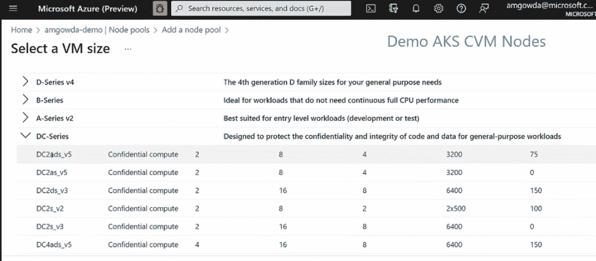

# 使用 Kubernetes 在 Azure 上进行机密计算

> 原文：<https://thenewstack.io/confidential-compute-on-azure-with-kubernetes/>

除非你非常擅长安全，否则[超大规模云提供商](https://thenewstack.io/cdn-providers-rival-hyperscale-clouds-for-web-developers-deploying-jamstack/)在[安全](https://thenewstack.io/category/security/)方面可能比你的组织更好:他们有更多的安全专业知识，他们打补丁更快，他们对管理员进行背景调查，他们有强大的操作安全性。

但是仍然存在风险，无论是来自您自己的管理员还是对[云数据中心](https://thenewstack.io/category/cloud-native/)的攻击，来宾或主机操作系统中的漏洞——或者仅仅是这样一个事实，即尽管数据在静态和动态时都是加密的，但在您使用它时通常不会加密。

对于受监管行业中极其敏感的数据和机密工作负载来说，这可能足以让云变得不合适。机密计算即使在使用、存储和计算过程中也会对数据进行加密，因此从创建数据到删除数据，您都可以控制数据，即使操作系统或虚拟机管理程序中存在安全漏洞(假设机密计算堆栈本身没有缺陷)，恶意的内部人员、管理员或黑客也不会发现数据。

这是因为计算是在基于硬件的可信执行环境(TEE)中进行的，在这个环境中，您可以确保数据和代码的完整性以及数据的机密性。除了内存和其中的数据被加密之外，您在云中运行的代码也受到保护，您可以验证它没有被篡改(并且活动历史也是不可变的和可审计的)。

## 机密云

在最近的微软 Ignite 大会上，Azure Confidential Computing 产品负责人 Vikas bhat ia[解释说，有了 confidential cloud，“数据在其整个生命周期中都处于客户的控制之下，无论是静止的、传输中的还是使用中的”。“云提供商在可信计算基础之外。您在云中运行的代码受到您的保护和验证，您是拥有远程证明能力的客户。”](https://www.linkedin.com/in/vikascbhatia/)

“我们今天看到的是，我们的客户希望尽可能少地信任，”他指出。“他们希望完全控制数据生命周期。”

[分析师 Everest Group 预测](https://confidentialcomputing.io/wp-content/uploads/sites/85/2021/10/Everest_Group_-_Confidential_Computing_-_The_Next_Frontier_in_Data_Security_-_2021-10-19.pdf)机密计算将快速增长，并可能成为端到端安全的标准，特别是对于公共部门以及银行、金融服务、保险、医疗保健、生命科学、国防和其他受监管行业或涉及关键基础设施的企业。

Bhatia 列出了 Azure confidential 的早期用户，包括电信等受监管行业、在保密环境中使用来自多个医疗服务提供商的数据进行疾病诊断的医疗保健团队，他们可以在研究完成后完全销毁数据，零售和广告公司希望进行多方机器学习，金融服务机构正在构建[反洗钱](https://www.dowjones.com/professional/risk/glossary/anti-money-laundering/kyc-vs-aml/)系统。

“这在机密计算领域开创了全新的场景，这在以前是不可能的，”来自 Azure 机密计算团队[的](https://ignite.microsoft.com/en-US/sessions/d14e97a1-2a96-4df3-aca9-a9afeec52ec6)[阿玛尔·高达](https://www.linkedin.com/in/nramar/)在一次会议中解释道。“这使得两个不同的机构无法在数据上合作，因为它将 PII 带入了这种环境。现在，由于有了证明、内存保护和完整性保护，您可以放心，数据不会离开边界[或落入他人之手]。”

## **Azure 上的机密计算**

保密计算从硬件信任根开始；Azure 拥有使用 SGX、AMD SEV-SNP(在本月的预览版中)和 NVidia A100 张量核心 GPU 和安培保护内存的机密虚拟机，这些虚拟机在 CPU 和 GPU 上的可信执行环境之间有一个安全通道(在保密和完整性至关重要的 ML 培训和大数据 AI 工作负载的有限预览版中)。

SGX 代表软件保护扩展，将你的应用划分为不可信和可信区域，敏感代码进入可信环境。虚拟机内存和 RAM 都是加密的，并且有特定于应用程序的 Enclave 保护缓存(EPC)内存。使用 SGX 时，加密内存量过去非常少，但当前一代的 DCsv3 虚拟机拥有更多加密内存(高达 256GB)来处理大型数据工作负载。

AMD SEV-SNP 代表[安全加密虚拟化和安全嵌套分页](https://www.amd.com/system/files/TechDocs/SEV-SNP-strengthening-vm-isolation-with-integrity-protection-and-more.pdf)，它提供针对恶意虚拟机管理程序和加密内存的硬件保护:虚拟机内存完全加密，并使用 AMD CPU 生成的密钥进行完整性保护，这些密钥可以保存在 Azure Key Vault 或 Azure Managed HSM(其本身依赖于机密计算)中，此外，您可以选择预加密操作系统磁盘。这不需要任何代码更改，因此只需将工作负载部署到机密的 DCasv5 或 ECasv5AMD EPYC 虚拟机中，就可以使应用保密，而[的性能差异最小](https://community.amd.com/t5/business/microsoft-azure-confidential-computing-powered-by-3rd-gen-epyc/ba-p/497796)。

不必重新编写代码来使用机密计算，这使得微软更容易提供自己的云服务作为机密计算服务(并提供像新的微软云这样的商业云，以主权为目标，面向希望使用公共云的政府)。

SQL Azure 多年来一直使用 SGX 进行加密，但现在您可以在 AMD confidential 虚拟机上运行 SQL Server IaaS，Azure 虚拟桌面现在可以在 AMD confidential 虚拟机上运行 Windows 11，Azure Databricks 的保密计算版本可能会在今年发布。

如果你正在使用开源的[保密联盟框架](https://ccf.microsoft.com/)来构建分散的网络，很可能有多个组织参与其中:新的 [Azure 托管保密联盟框架](https://techcommunity.microsoft.com/t5/azure-confidential-computing/microsoft-introduces-preview-of-azure-managed-confidential/ba-p/3648986)(构建于 Azure 保密计算之上，目前处于私有预览版)避免了一个组织必须运行该网络的基础设施。

Azure Confidential Ledger 是一个基于区块链的安全防篡改分类帐，它使用运行在 Azure Kubernetes 服务(AKS)上的 CCF，[Azure Confidential computing 团队的主要项目管理经理 Graham Bury](https://www.linkedin.com/in/grahambury/) 告诉新的堆栈:“你可以认为微软构建的许多这些服务是托管的 PaaS 服务，只是碰巧运行在利用机密计算的 Kubernetes 上。”

但微软也希望为基于 Kubernetes 的客户提供保密计算。

## **机密集群**

机密计算可以保护容器和虚拟机。 [Azure Container Instances](https://thenewstack.io/azure-container-instances-mean-cheaper-agile-container-tools-way/) (适用于不需要编排的孤立容器场景，如机器学习和人工智能工作负载或你希望安全地突发到云的短期工作负载)现在在有限的预览版中提供无服务器机密计算(公共预览版即将推出)。

这不需要更改您的容器映像，并为您提供了一个专用的虚拟机管理程序，每个容器组都有内存加密。它还具有完整的来宾证明，因此您可以验证容器是否只运行您期望运行的组件。

微软表示，这在部署 Python 容器以与 Azure 机器学习一起使用的数据科学家中很受欢迎，这可以在没有可能影响模型的代码更改的情况下保密。

当您确实需要编排时，因为 AKS 上的每个节点都是您在 Azure 中提供的虚拟机规模集中的一个虚拟机，这些虚拟机可以是机密虚拟机。

自 2020 年以来，作为第一个使用英特尔 SGX 虚拟机运行使用 Open Enclave SDK 构建的容器化应用的云[，AKS 实际上已经获得了机密计算支持，但这意味着](https://thenewstack.io/microsoft-azure-brings-confidential-computing-to-kubernetes/)[对这些应用进行更改](https://learn.microsoft.com/en-us/azure/confidential-computing/application-development?source=recommendations)以对应用进行分区，因此可信代码将在 SGX enclave 中运行，或者使用第三方工具，如 [Anjuna](https://www.anjuna.io/microsoft-azure) 、 [Edgeless](https://github.com/edgelesssys/constellation) 、 [Fortanix](https://www.fortanix.com/solutions/use-case/fortanix-for-azure) 或 [SCONE](https://scontain.com/#pyspark) 为您处理这些。安全消息服务 Signal[使用 AKS 中的英特尔 SGX 节点来存储用户联系信息](https://customers.microsoft.com/en-us/story/1374464612401582154-signal-nonprofit-azure-security)，Signal 和微软的管理员都无法查看这些信息。

现在 Azure 是 Kubernetes 中第一个支持 AMD SEV-SNP 机密计算的云服务。因为机密虚拟机节点池现在可以使用 AMD 机密虚拟机，所以您可以将容器提升并转移到机密环境中，或者通过向现有 AKS 集群添加机密节点池来使其处于更安全的状态，但是如果您只需要在处理敏感数据的特定节点上提供额外保护，则不必将整个集群设为机密。

机密节点池与完整的 AKS 功能集一起工作，如自动缩放、AKS 插件、Azure CNI、Azure Defender for Containers 等。他们使用定制的 Ubuntu 20.04 映像(微软正在与 Canonical 合作，以确保 Ubuntu 支持所有 Azure 机密服务)。ARM64 和 Mariner 图像目前还不可用，但高达说 Windows 服务器节点将很快推出。

AKS 支持异构集群，其中并非所有节点池都使用机密计算。

您可以像当前部署节点池一样为 AKS 部署机密节点池，使用 ARM 模板或 Azure CLI 或门户创建节点池，并选择用于该目的的虚拟机大小，只需选择提供机密计算的 DC 系列或 EC 系列虚拟机即可。您不需要更改在容器或容器映像中运行的代码:只需编辑 pod YAML 规范来部署机密节点池(如果您使用节点亲缘关系，您可以选择机密计算节点池作为亲缘关系)。

除了使用内存加密保护使用中的数据之外，您还拥有[远程客户证明](https://github.com/Azure/confidential-computing-cvm-guest-attestation/blob/main/aks-linux-sample/cvm-attestation.yaml)，因此您可以确信您的工作负载已部署在您期望的环境中，并且只有您放入这些容器中的内容正在该硬件上运行。

机密虚拟机 AKS 节点池现已正式上市。机密节点池所基于的 AMD 机密虚拟机已经在美国东部、美国西部、欧盟北部和欧盟西部地区提供，东南亚地区即将推出，微软计划在“不久的将来”将它们扩展到更多地区，因此所有这些地区都有机密节点池。

## **机密变普通**

AKS 不需要重新编写代码来使用机密计算，这对于在自己的基础设施上使用基于 Kubernetes 的应用程序的客户来说是一个很有吸引力的选择，因为他们不太可能启用机密计算，因为这样做的服务器硬件非常新。

Bury 建议说，他们现在可以将那些因为担心隐私、安全合规性或数据法规而不习惯的应用程序转移到云上。“我的愿望是如何将更多的工作负载转移到公共云，因为我希望它在默认情况下就在那里:让我的整个容器工作负载保持原样，我甚至不用考虑它，因为它是加密的内存。”

他说，这适用于运行代码构建代理和代码签名以实现软件供应链强化的 IT 组织，执行数据处理管道以动态旋转容器化作业的金融机构，以及满足 Schrems II 和其他数据监管合规性的电信提供商。“此外，我们的内部微软代码签名服务正在加入我们在 AKS 中的机密虚拟机功能。”

如果你想自己在 Azure 上运行 Kubernetes，你可以使用机密计算虚拟机来托管它并自己管理 Kubernetes 部署。Bury 指出，一些客户通过 [AKS-Engine](https://github.com/Azure/aks-engine) 或[Kubernetes Cluster API Provider for Azure](https://github.com/kubernetes-sigs/cluster-api-provider-azure)做到了这一点，“但我们交谈的大多数客户都希望我们将保密计算和增加的隔离直接引入到我们的托管 AKS 中。”

从长远来看，一旦硬件广泛可用，微软预计机密计算将从需要“英雄式”数据保护的多方数据分析等专业需求变成加密静态和传输中数据的标准。

“我们希望看到计算总体上从明文计算发展到保密计算，无论是在云中还是在边缘，”Bury 说。“随着时间的推移，我们确实看到它变得更加通用。随着时间的推移，我们希望机密计算功能能够渗透到我们的基础架构平台中，因为我们可以让具有这些数据保护功能的硬件渗透到所有地方。如果我们能在一夜之间更新我们所有的硬件，并拥有这些功能，那该多好啊！”

机密计算也将开始与旨在在 Kubernetes 中创造更多隔离的软件开发保持一致。

在今年的 [Kubecon+CloudNativeCon](https://www.cncf.io/kubecon-cloudnativecon-events/?utm_content=inline-mention) 大会上，微软宣布了对 AKS 中 [Kata Containers](https://katacontainers.io/) 支持的有限预览，其中一个轻量级虚拟机在每个 pod 的专用内核中运行，使用 VT 虚拟化扩展为网络、内存和 I/O 创建更强的工作负载隔离。这承诺了同一集群上不同工作负载的更高安全性，并且 Bury 暗示，隔离可能是微软向开源 Kubernetes 空间贡献机密计算概念的方式之一。

“有了 Kata containers，我们可以看到 AKS 中可用的开源隔离技术的统一，并专门用于我们在 AKS 中的机密计算堆栈，”Bury 说。

“AKS 和 Kubernetes 通常可以从 Kata containers 之类的东西中受益，通过专门调整的内核实现这种级别的容器隔离，然后我们可以考虑我们在机密计算方面做些什么，在这种情况下，您拥有一个特定的硬件，使您能够验证您是否在该硬件上运行，并添加了数据保护和内存加密。

“我们能让所有这些东西一起工作只是时间问题，”他建议道。我们可以创建越来越多的隔离和数据安全保护，同时保持 Kubernetes 的本地体验。"

他还指出 ACI 中的机密计算支持是 Azure 想要为 Kubernetes 提供的一个例子。“从安全和隐私的角度来看，他们的容器具有尽可能多的隔离和数据保护，我们如何才能做到非常用户友好？”

为您的节点池选择一个机密计算虚拟机，AKS 会自动为该节点池启用内存加密

<svg xmlns:xlink="http://www.w3.org/1999/xlink" viewBox="0 0 68 31" version="1.1"><title>Group</title> <desc>Created with Sketch.</desc></svg>