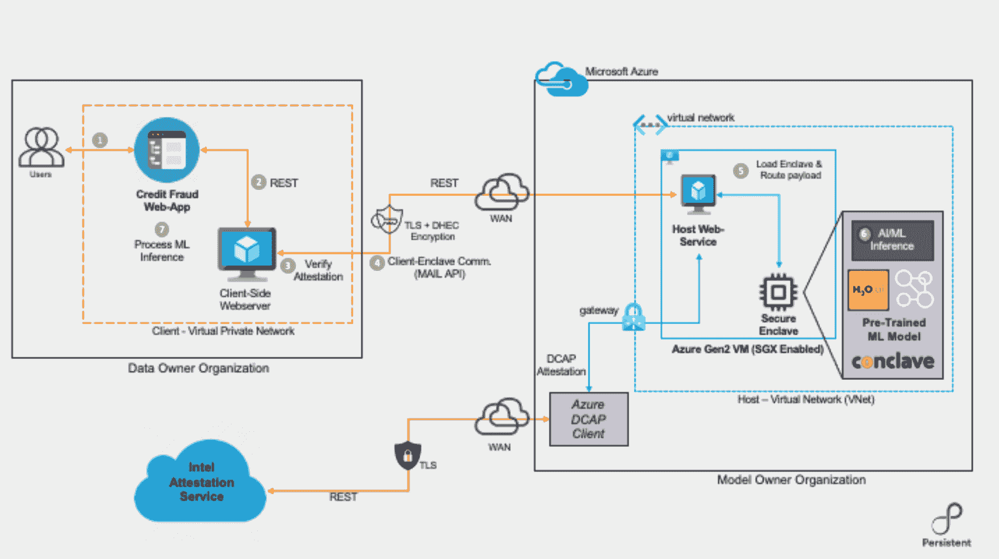
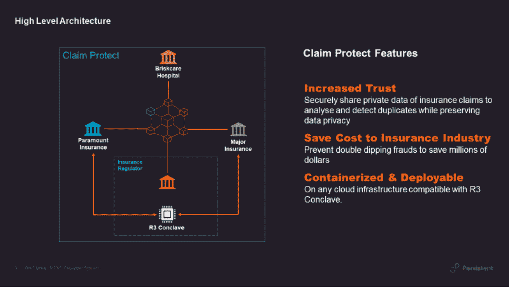

# 机密计算正在改变医疗保健、金融

> 原文：<https://thenewstack.io/confidential-computing-is-transforming-data-encryption-in-healthcare-finance/>

 [潘杜朗·卡马特博士

潘杜朗·卡马特博士是持久性系统公司的首席技术官。他帮助企业通过技术和创新释放商业价值。在加入 Persistent 之前，他是 IAC Search and Media 的分析总监，也曾在贝尔实验室和惠普实验室工作，开发安全通信和数字媒体产品。他拥有新泽西州罗格斯大学的计算机科学博士学位。](https://www.linkedin.com/in/pandurang) 

机密计算是一项新兴技术，在过去的几个月里引起了热议。谷歌甚至称之为“突破性技术”基本理念是，它为整个数据生命周期带来保密性，保证数据在传输、存放和使用过程中受到保护。

但是这是如何工作的，正在开发的用例是什么？在 [Persistent](https://www.persistent.com/) ，我们几个月来一直在深入研究机密计算，甚至[与领先企业区块链技术软件公司](https://www.r3.com/press-media/r3-launches-confidential-computing-platform-conclave/)合作开发机密计算解决方案，我们认为有两个有希望的使用案例可以改变组织对数据迁移到云的看法。

但首先，让我们讨论一下保密计算 101。

## 机密计算是如何工作的？

机密计算背后的想法是，数据传统上只在两个阶段加密:静态和传输中。例如，当数据存储在数据库中时，以及通过网络连接传输时，数据都是加密的。

然而，处理阶段传统上没有被加密。所以，当数据被使用时，它实际上是非常脆弱的。保密计算是如何解决这个问题的？

它通过硬件创建“可信执行环境”(TEE)或与不可信代码隔离的安全区域来实现这一点，不可信代码包括操作系统和系统上运行的其他应用程序。这个 TEE 使用可以解密私有数据并在计算中使用它的加密密钥。在使用时，代码和数据驻留在安全区域内，系统的其他部分无法访问。enclave 包含事先授权的可信代码，在向其发送私有数据之前，可以远程验证其完整性。

由于这是一个新兴的研究领域，到处都有新的用例出现，但我们已经确定了两个我们认为特别有前途的用例。

## BFSI 基于 ML 的欺诈检测

随着组织利用机器学习(ML)来改善客户体验、优化运营和减少欺诈，出于安全原因，他们仍然对将敏感和个人身份数据迁移到云中持怀疑态度。

机密计算可以促进 ML 软件公司提供他们的垂直特定和专门的 ML 模型即服务，具有密码保证的客户数据的机密性和安全性。

数据所有者(例如银行)可以将基于 ML 的远程欺诈检测工作流集成到其现有的内部应用程序中，并通过网络控制进行保护。模型所有者(如软件供应商)通过云中的安全飞地提供欺诈检测服务，利用弹性、DDoS 保护等功能。该欺诈预测模型可由客户端远程证明和验证，从而实现系统中的端到端信任。

图 1:R3 秘密会议的机密 ML 推理参考系统

## 打击医疗保险欺诈

机密计算的另一个潜在应用领域是医疗保险欺诈。

例如，当向多个保险公司提交一份保险索赔，导致保险公司每年损失数十亿美元时，就会发生双重保险欺诈。虽然通过共享索赔数据可以很容易地检测到重复的索赔，但由于数据隐私方面的法规限制以及对竞争提供商之间数据共享的担忧，数据共享不会跨越组织边界。

借助保密计算，保险提供商现在可以相互协作并安全地共享理赔数据的必要属性，而不必担心数据泄露或违反隐私法规。

图 2:用持久和 R3 秘密会议声明保护特征

## 云中的数据，安全。

虽然我们深入探讨了上面提到的两个使用案例，但是机密计算对于任何处理个人身份数据的组织来说都是非常宝贵的，尤其是在将工作负载迁移到云的时候。我们现在能够将预先训练好的机器学习模型直接加载到 secure enclave 中进行推理。安全的协作共享有可能释放新的业务洞察力，甚至在竞争对手之间建立互利的战略，例如反欺诈。它安全、适应性强且灵活，是任何希望利用保密计算的企业的绝佳选择。

<svg xmlns:xlink="http://www.w3.org/1999/xlink" viewBox="0 0 68 31" version="1.1"><title>Group</title> <desc>Created with Sketch.</desc></svg>