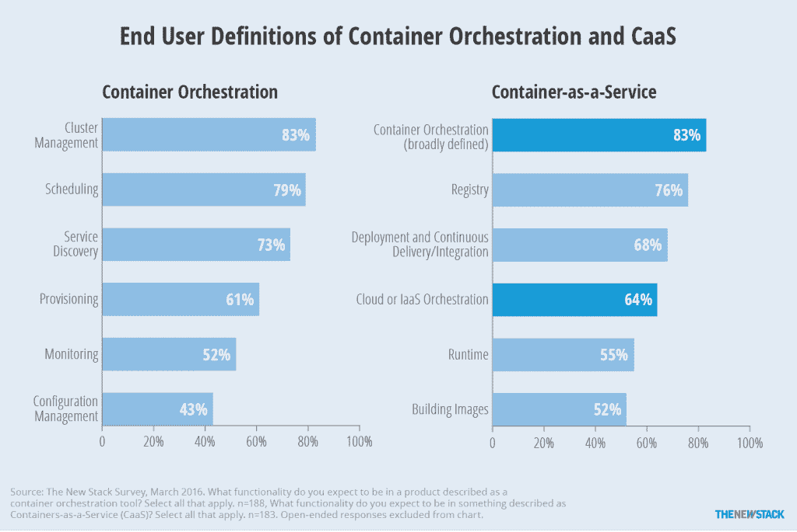

# 工作负载协调的五种风格

> 原文：<https://thenewstack.io/configuration-management-orchestration/>

工作负载协调是提供数字服务的现代方式与五年前不同的地方。许多人问，与所有其他产品相比，这款产品有什么新的地方？答案是工作负载的协调。我们现在可以将我们的服务器执行的功能和我们向客户提供的服务视为工作负载，而不是具有品牌的应用程序，或者具有金主和覆盖保护的虚拟机。

## 支持流程编排的关键力量

编排现象是由几个不断发展的行业趋势融合而成的:

*   虚拟化将程序从运行它们的服务器硬件中解放出来。
*   **Web 服务**实现程序功能之间的通信，无需中间件。
*   **数据存储**通过使用特定于任何一个应用程序或任何数量的应用程序的路线，将巨大的数据池从处理中解放出来。
*   **云动态**使程序所需的资源能够以精确的增量按需供应。
*   容器化**将程序和它们所需的少量依赖项收缩包装成紧密的包，可以由它们自己的操作环境托管。**
*   **软件定义的网络**和存储使调配和部署工作负载的环境成为一个可塑的、灵活的、容错的网格，能够适应手头工作的需求。

这六种力量带来了真正分布式计算的新现实。令人震惊的是，他们不是故意合谋这么做的。所有这六种信息科学都是为其独特的目的而创建的。但是，一旦它们被集中在数据中心，它们就产生了一个全新的机会，可以完全围绕可完成的工作来构建和管理系统。

尽管如此，协调的工作负载必须与传统应用程序甚至遗留软件共存。寻求在其数据中心内实施工作负载协调的组织必须制定一项策略，使新旧系统能够以合理的效率协同工作，并且不会降低工作效率和安全性。

## 工作负载协调的五种风格

配置管理、持续集成/持续部署(CI/CD)和按需云服务供应在现代企业中发挥着不同程度的作用。因此，组织可能采用不同的编排策略，甚至可能为不同的角色和不同的部门采用多种策略。

### 1.基于 Docker 的系统

从可用性的角度来看，Docker 的原生编排系统一点也不复杂。该系统是基于命令行的，开发人员和管理员都熟悉 Linux 命令行。但是它潜在的假设是，它正被开发人员在准备他们的工作的过程中使用。

Docker 中运行容器本身的部分称为守护进程。包含这个守护进程的组件称为 Docker 引擎。它的目的是在当前为它设置的环境中运行容器。默认情况下，这是一台机器(物理或虚拟)的典型内存地址空间。

等式的分发部分与 Docker Swarm 一起进入(Docker [最近将其并入核心 Docker 引擎](https://thenewstack.io/docker-engine-1-12-will-come-built-orchestration-capabilities/))。它将多个地址空间收集到一个中央集群中，执行“反向虚拟化”操作，将该集群的复杂性从 Docker 引擎中抽象出来。因此，引擎认为 Swarm 创建的空间只是一个非常大的池，或者是一台巨大的计算机。

第三个组件， [Docker Compose](https://docs.docker.com/compose/) ，引入了一两个来自[软件配置管理](https://www.pearsonhighered.com/samplechapter/0321200195.pdf) (SCM)的元素。一个名为 Dockerfile 的文本文件使用 [YAML](http://yaml.org/) 代码来描述容器中托管的应用程序的需求。这个文件被“转”到 Docker 引擎，后者根据 Docker 文件的内容执行命令，从而产生一个完全活跃的运行环境。

生产编排系统的公司可能会争论这些工具是否构成了真正的编排方法。但是，Compose 用来启动、监视、停止和访问容器中正在运行的服务的命令是足够规则的，可以自动执行。按照这个标准，编排确实是可能的。我们在这本电子书中的一大重点是公司和用户决定什么是编排，我们对我们的调查受访者所说的进行了细分。

该图表显示了终端用户期望从容器编排和容器即服务产品中获得的功能。对于 CaaS，相对知情的受访者通常希望不仅是容器的编排。

### 2.调度多租户、微服务平台

当今一些最受认可的编排平台是支持微服务的平台。谷歌是第一个尝试这种架构的组织之一，它建立了一个名为 [Borg](https://thenewstack.io/google-learned-borg-container-management/) 的编排系统。它的原则被传递给了一个名为 [Kubernetes](/category/kubernetes/) 的开源项目，该项目由谷歌管理。

像 Swarm 一样，Kubernetes 维护一个由服务器集群组成的池化分布式计算环境，每个服务器(虚拟的或物理的)都被视为一个节点。在这些节点中，Kubernetes 识别称为 pod 的容器组，这些容器可以共享资源，但也可以同时运行。

pod 在建立工作负载分配策略方面发挥着重要作用。在面向微服务的系统中，单个服务和功能可能会被多个应用程序同时使用。将具有相似资源需求的功能划分到 pod 中，可以实现一种管理方案，pod 中的功能可以根据当时运行的应用程序的需求重新调配资源。

这改变了负载平衡的功能，负载平衡从复制服务器开始，变成了复制应用程序之一。现在，应用程序不必仅仅因为它们的功能需要整体扩展，就必须整体扩展。

Apache Mesos 是另一个广泛用于汇集容器资源和调度工作负载在该资源池上执行的开源工具。 [Mesosphere](https://d2iq.com/) 生产了一个商业编排环境，它将其描述为“数据中心操作系统”(DCOS)，包括在一个服务器集群上运行的多个工作负载的实时可视化表示。马拉松是 Mesosphere 为在其 DCOS 平台上调度容器工作负载而开发的工具之一，最初是作为 Kubernetes 的替代产品提供的。如今，该公司将这两种编排系统都包含在 DCOS 中，并允许客户在实际使用案例中选择使用其中一种或两种。

### 3.Jenkins-集成变更控制平台

就其本身而言，Jenkins 不是一个容器编排者。它是一个开源的 CI/CD 平台，在将应用程序部署到生产环境之前，可以自动执行开发、测试和试运行流程。更重要的是，Jenkins 的目的是规范人们在实现新软件时需要做的工作。在 Jenkins 中，可以自动化和脚本化的工作阶段被称为管道。

最初，Jenkins 和其他 CI/CD 系统中的工作负载被封装为虚拟机。随着组织开始采用 Docker，人们很快发现，与容器相关的人工工作流程与虚拟机的维护并不一一对应。生产商业版 Jenkins 的 CloudBees 制造了一个名为 Workflow 的插件，该插件重新定义了 Jenkins 的连续交付概念，使其更加开放于集装箱化。随后，Docker 中添加了一个工作流的配套插件，它使用用 [Groovy](http://www.groovy-lang.org/) 语言编写的脚本(与容器开发人员日常执行的流程类型更相称的脚本)来启用管道的入口点。

这里需要注意的是，使用 CloudBees Jenkins 以这种方式转移工作负载的本质与 Kubernetes、[CoreOS](https://coreos.com/)' architectural(一个商业 Kubernetes 发行版)和 Mesosphere/Marathon 的典型用例完全不兼容。虽然 CI/CD 管道侧重于使用容器自动化开发过程，但这些其他编排平台侧重于使用容器管理部署和常规使用。

[cyclone slider id = " ebook-3-赞助商"]

然而，在当今的企业中，坚持 CI/CD 的理念与接受 CM 的委托是并行不悖的。Jenkins 经常与 Chef、Puppet、Salt 和 Ansible 等 CM 工具集成。虽然这些配置管理工具的供应商把他们自己描绘成与编排工具兼容，但是在今天的实践中，许多企业认为它们是重复的，并且不一起使用它们。

Docker Cloud 是一个替代的 orchestrator，旨在从一开始就与 Jenkins 及其流水线工作流兼容。它以一种非常简单的、类似 Amazon 的风格呈现工作流自动化，It 管理员可能会觉得很舒服。

### 4.软件配置管理无关的集成平台

几乎在每一个软件行业，都有一些平台展现出“端到端”的优点。几十年来，已经有了“生命周期管理”工具，并且许多 SCM 软件包已经被推向市场，不管是好是坏。但是，这种平台经常同时一起使用，这一事实说明了一个未被发现的事实，即组织内部的“终端”往往会移动。

Shippable 生产了一个基于云的持续集成平台，它与 Docker 集成，但避免了 Jenkins。它还通过部署容器映像的方式绕过了典型的配置管理。选择将容器视为持久的而不是短暂的，可运输的方法是监视容器使用的实际资源，并相应地调整它们的配置。因此，Shippable 通过动态分析来自动化配置，而不是通过脚本来自动化配置。

### 5.微分段混合虚拟机平台

因为容器化平台没有传统虚拟机的位置，所以 VMware 必然会直接解决 Docker 用户的需求。该公司设计了一种“拥抱和扩展”策略，包括将 Docker 容器包装在一个名为“ [jeVM](https://pftf.blogspot.com/2015/11/virtualized-containers-jevm.html) 的信封中，以便其现有的 vSphere 环境可以像任何其他虚拟机一样接受它。

通过包含该公司的光子操作系统(OS)，容器可以由 [VMware](https://www.vmware.com/cloud-solutions/app-modernization/cloud-native-apps.html) 虚拟机管理程序而不是 Linux 内核托管。该方案中的编排变成了在现有环境中暂存容器实例(如虚拟机)的问题。虽然这使得微服务在当前模式下没有任何前景，但这种模式确实具有与企业现有 CM 和 CI/CD 平台即时集成的优势。然而，这种模式下基于容器的应用程序的相对可伸缩性还有待证明。

<svg xmlns:xlink="http://www.w3.org/1999/xlink" viewBox="0 0 68 31" version="1.1"><title>Group</title> <desc>Created with Sketch.</desc></svg>