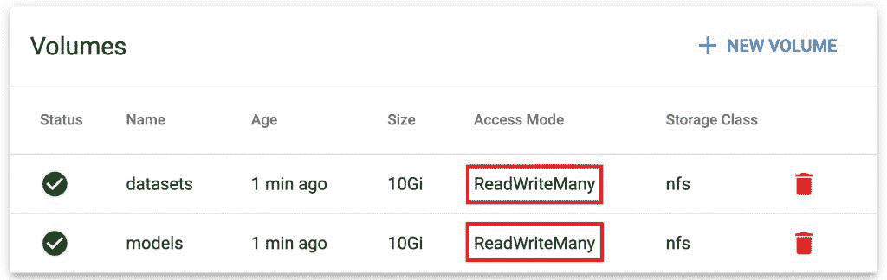
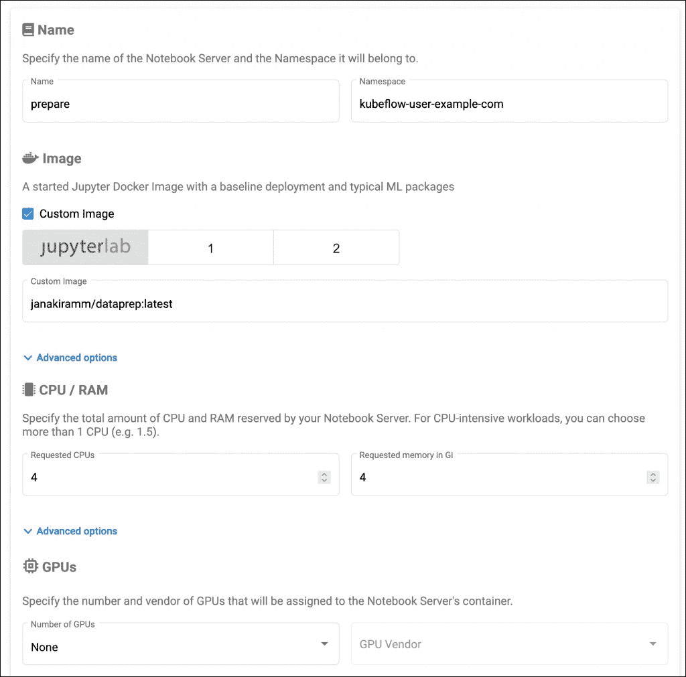
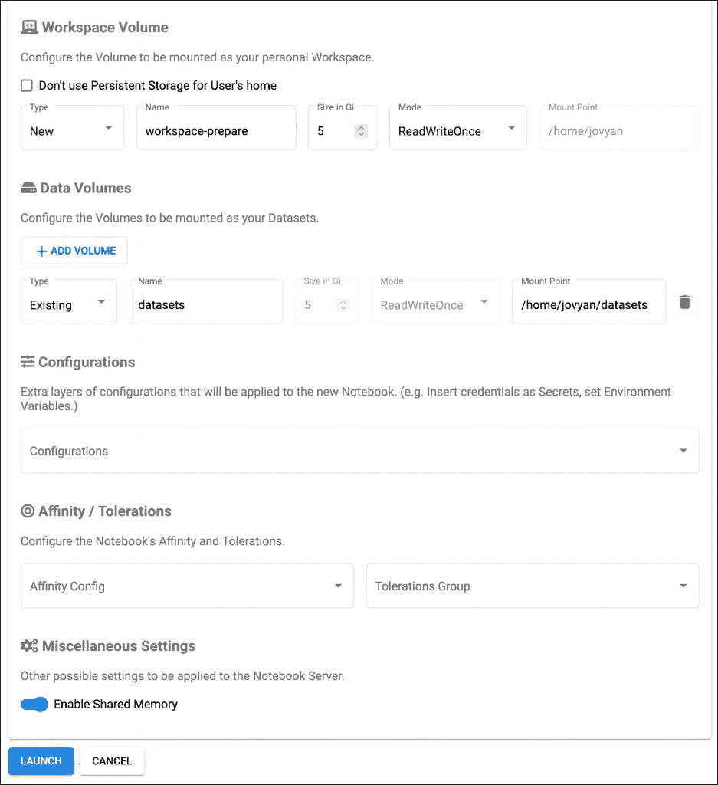
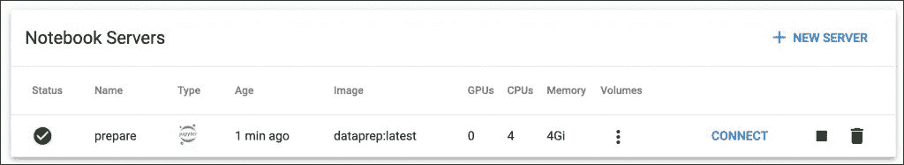
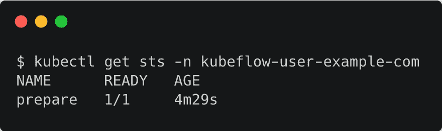
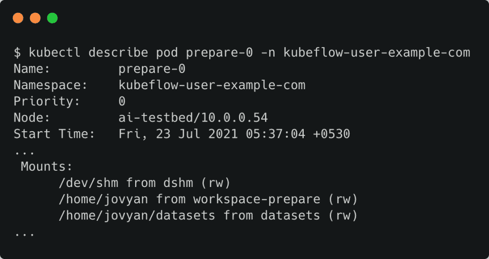
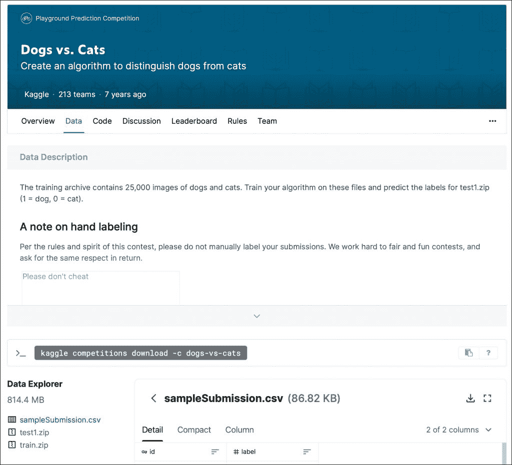
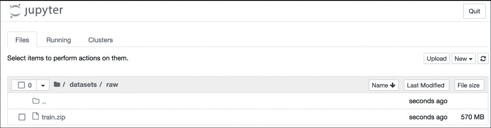
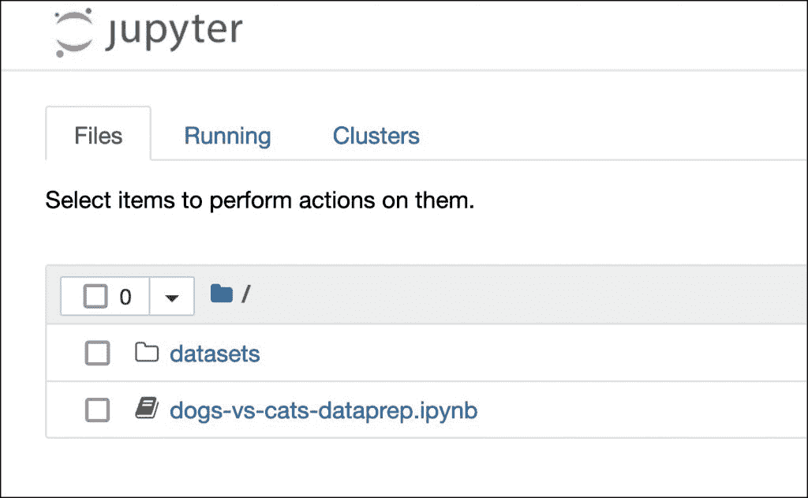

# 为数据准备配置 Kubeflow Jupyter 笔记本电脑服务器

> 原文：<https://thenewstack.io/configure-a-kubeflow-jupyter-notebook-server-for-data-preparation/>

本教程是

[explanatory series on Kubeflow](https://thenewstack.io/5-new-kubeflow-1-3-features-that-machine-learning-engineers-will-love/)

，谷歌流行的开源机器学习平台 Kubernetes。请每周五回来查看未来的分期付款。

在本系列的[最后一部分](https://thenewstack.io/tutorial-configure-storage-volumes-for-kubeflow-notebook-servers/)中，我们创建了共享的 PVC 来实现数据科学家、[机器学习](https://thenewstack.io/category/machine-learning/)工程师和 [DevOps](https://thenewstack.io/category/devops/) 团队之间的协作。在此之前，我们还[构建了基于 CPU 和 GPU 的容器映像](https://thenewstack.io/tutorial-build-custom-container-images-for-a-kubeflow-notebook-server/)，用于在 [Kubeflow](https://www.kubeflow.org/) 中推出 [Jupyter 笔记本服务器](https://jupyter.org/)。

接下来，我们将利用存储卷和容器映像，基于三台独立的笔记本服务器构建一个简单的机器学习管道。每个环境都专注于数据准备、训练和推理的特定任务。


本系列的目的不是构建一个极其复杂的神经网络，而是展示 Kubeflow 如何帮助组织进行机器学习操作(MLOps)。

本教程系列的当前部分重点关注为数据科学家构建一个笔记本服务器，以将一组图像转换为数据集，供 ML 工程师用来构建和训练模型。

我们将从上传包含来自流行的 [Kaggle 竞赛数据集](https://www.kaggle.com/c/dogs-vs-cats/data)的猫和狗的图像的 ZIP 文件开始。在本教程结束时，我们将有两个包含训练和测试数据集路径的 CSV 文件。

确保您已经创建了共享的 PVC，并且在 Kubeflow 仪表板中可见。这些 PVC 将被安装在笔记本服务器 pods 中，以编写共享工件，如数据集和模型。



让我们从本教程上一部分创建的基于 CPU 的容器映像创建一个基于 Jupyter 环境的笔记本服务器。自定义容器映像具有准备和处理数据集所需的所有 Python 模块。

在导航栏的“笔记本”部分，单击新服务器。

为笔记本服务器指定一个您选择的名称，并选择自定义映像选项，以提供为数据准备而构建的 Docker 映像的名称。根据可用资源，分配 CPU 和 RAM 的数量。这个环境我们不需要 GPU。



添加为笔记本电脑服务器创建个人工作空间所需的卷。这将成为用户的主目录。对于数据卷，我们将挂载先前创建的现有共享卷`datasets`。处理后的数据将存储在该卷支持的目录中。



准备就绪后，单击“启动”按钮来配置笔记本电脑服务器。环境准备就绪可能需要几分钟时间。



在幕后，Kubeflow 基于`kubeflow-user-example-com`名称空间中的定制容器映像启动了一个 Kubernetes statefulset。



让我们检查 pod 的“volumes”部分，以验证卷是否安装正确。



切换回 Kubeflow 仪表盘，点击 connect 访问笔记本服务器。您应该在环境中看到`datasets`目录。

让我们将原始数据集放入环境中。从 Kaggle 的狗对猫比赛中下载`train.zip`文件。



在`datasets`目录下创建一个名为`raw`的目录，并将下载的`train.zip`上传到其中。由于文件超过 500MB，上传可能需要一段时间。



我们现在准备处理原始数据并将其转换成数据集。

从 [GitHub 库](https://github.com/janakiramm/kubeflow-notebook-tutorial/raw/main/dogs-vs-cats-dataprep.ipynb)下载 Jupyter 笔记本，上传到笔记本服务器的根目录。



启动 Jupyter 笔记本并运行每个单元格以开始处理数据集。

我们导入已经安装在定制容器映像中的所需 Python 模块。

```
import pandas as pd
import matplotlib.pyplot as plt
import random
import os

from matplotlib import pyplot
from matplotlib.image import imread

```

接下来，我们将解压缩原始数据集并进行检查。

```
!mkdir  -p  datasets/dogs_vs_cats

```

```
!unzip  -j  -o  datasets/raw/train.zip  -d  datasets/dogs_vs_cats/

```


让我们通过访问每个类的前几幅图像(狗和猫)来检查数据集。

```
folder  =  'datasets/dogs_vs_cats/'

for  i  in range(9):
    pyplot.subplot(330  +  1  +  i)
    filename  =  folder  +  'dog.'  +  str(i)  +  '.jpg'
    image  =  imread(filename)
    pyplot.imshow(image)
pyplot.show()

```


我们现在将解析目录中的文件，并为每个类别生成一个列表。

```
from os import makedirs
from os import listdir
from shutil import copyfile
from shutil import move
from random import seed
from random import random

train=[]
val=[]

dataset_home  =  'datasets/dogs_vs_cats/'
seed(1)
val_ratio  =  0.25

src_directory  =  'datasets/dogs_vs_cats/'
for file in listdir(src_directory):
    category='cat'  if file[0:3]=='cat'  else  'dog'
    if random()  &lt;  val_ratio:
        val.append([src_directory+file,category])
    else:
        train.append([src_directory+file,category])

```

我们现在有两个列表——`train`和`val`——包含每个类别的文件路径。让我们借助熊猫库把它们变成 CSV 文件。

```
import pandas as pd
train_df  =  pd.DataFrame(train,  columns=['filename','category'])
train_df.to_csv('datasets/dogs_vs_cats-train.csv')

val_df  =  pd.DataFrame(val,  columns=['filename','category'])
val_df.to_csv('datasets/dogs_vs_cats-val.csv')

```

此时，`datasets`目录有两个 CSV 文件，它们充当我们在下一节中构建的模型的训练和验证数据集。

有了数据集，我们就可以启动训练环境来构建和训练卷积神经网络来对图像进行分类。请继续关注下一部分，重点是培训。

<svg xmlns:xlink="http://www.w3.org/1999/xlink" viewBox="0 0 68 31" version="1.1"><title>Group</title> <desc>Created with Sketch.</desc></svg>