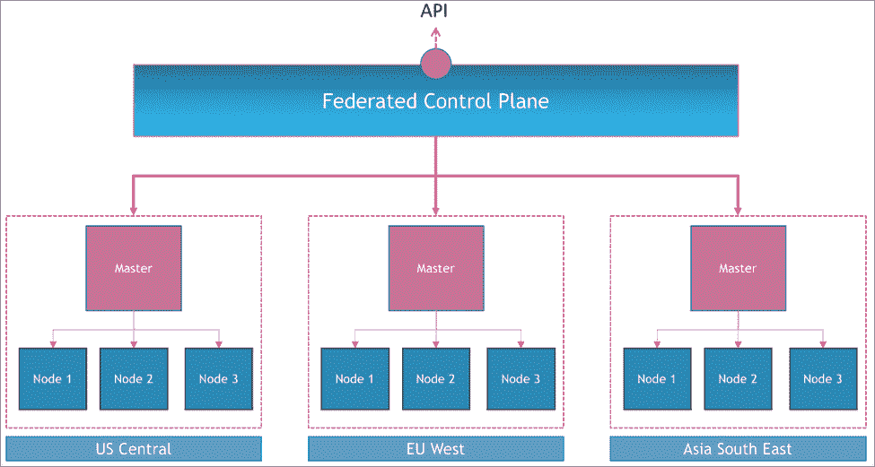
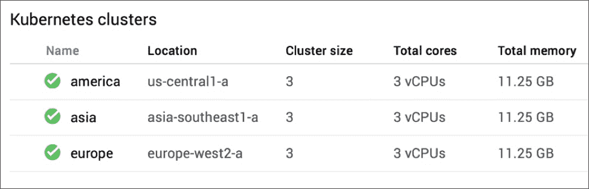
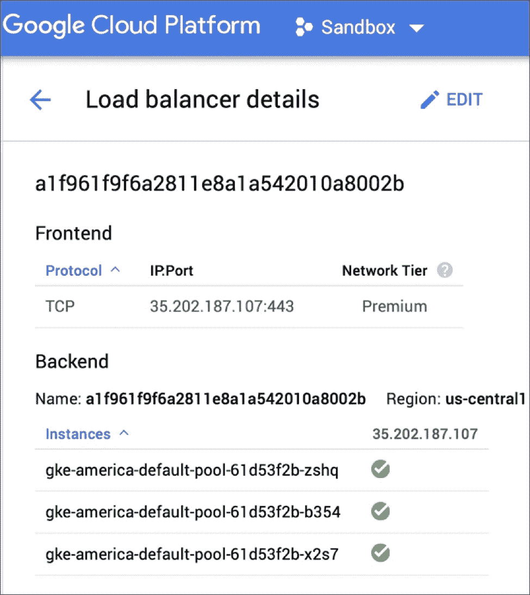
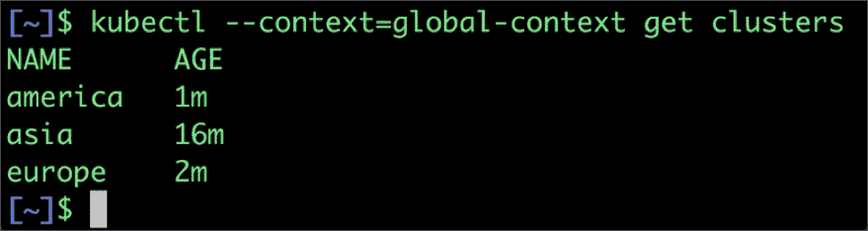

# 配置 Kubernetes 集群联盟以创建全局部署

> 原文：<https://thenewstack.io/configuring-kubernetes-cluster-federation-to-create-a-global-deployment/>

在 Kubernetes 中运行工作负载的优势之一是易于配置所需的状态。一旦副本集、状态集或部署被配置为运行一定数量的 pod，Kubernetes 控制平面将确保这些实例是可用的。受管理的 Kubernetes 产品，如[谷歌 Kubernetes 引擎](https://cloud.google.com/kubernetes-engine/)和 [Azure Kubernetes 服务](https://azure.microsoft.com/en-us/services/container-service/kubernetes/)以高可用性模式提供节点，这提高了弹性。

Kubernetes 中的集群联合通过使集群具有弹性，将高可用性的概念提升到了一个新的层次。可以联合多个分布式集群，以确保工作负载至少在一个集群中可用。理解集群联合的最佳方式是将跨多个 Kubernetes 集群的元集群可视化。想象一个逻辑控制平面，它编排多个 Kubernetes 主节点，类似于每个主节点控制自己集群中的节点。



在本教程中，我们将配置一个联合集群，该集群跨越在亚洲、欧洲和美洲三大洲运行的 Kubernetes 集群。

当与全局入口结合使用时，流量可以自动路由到最近的集群。如果任何特定集群中的应用程序运行状况检查失败，请求将自动转发到下一个可用集群。

还可以联合在不同环境中运行的集群，包括公共云和内部数据中心。但是，为了简单起见，我们将坚持使用[谷歌云平台](https://cloud.google.com/)作为本指南。

要完成教程，你需要一个安装了 [Google Cloud SDK](https://cloud.google.com/sdk/) 和 [kubectl](https://kubernetes.io/docs/reference/kubectl/kubectl/) 工具的 Ubuntu 盒子。当然，您还需要有一个 GCP 的有效帐户来部署资源。如果您有自定义域，请更新 DNS 设置，将其指向 [Google Cloud DNS 名称服务器](https://cloud.google.com/dns/update-name-servers)。

让我们从在 Google Cloud DNS 中为域创建一个区域开始。这将由联合控制平面用于跨集群服务发现。

```
$  gcloud dns managed-zones create gfed  \

```

```
           --description  "Kubernetes Federation Zone"  \
             --dns-name cloudreadylabs.xyz

Verify the zone creation before proceeding.
$  gcloud dns managed-zones describe gfed

creationTime:  '2018-06-07T07:28:59.581Z'
description:  Kubernetes Federation Zone
dnsName:  cloudreadylabs.xyz.

```

```
id:  '8535855681944743838'
kind:  dns#managedZone
name:  gfed
nameServers:

-  ns-cloud-a1.googledomains.com.
-  ns-cloud-a2.googledomains.com.
-  ns-cloud-a3.googledomains.com.
-  ns-cloud-a4.googledomains.com.

```

现在，让我们在亚洲、欧洲和美洲创建三个 Kubernetes 集群。

```
$  gcloud container clusters create asia  \
             --zone asia-southeast1-a  \
             --scopes cloud-platform

$  gcloud container clusters get-credentials asia  \
             --zone asia-southeast1-a  

$  kubectl create clusterrolebinding cluster-admin-binding  \
             --clusterrole cluster-admin  --user  $(gcloud config get-value account)

```

上面的命令创建一个集群，将 kubectl 指向它，然后将 GCP 用户添加到集群管理员角色。让我们重复这些步骤来创建剩余的两个集群。

```
$  gcloud container clusters create europe  \
             --zone europe-west2-a  \
             --scopes cloud-platform 

$  gcloud container clusters get-credentials europe  \
             --zone europe-west2-a  

$  kubectl create clusterrolebinding cluster-admin-binding  \

```

```
             --clusterrole cluster-admin  --user  $(gcloud config get-value account)

# Create a cluster in US Central 
$  gcloud container clusters create america  \
             --zone us-central1-a  \
             --scopes cloud-platform

$  gcloud container clusters get-credentials america  \
             --zone us-central1-a  

$  kubectl create clusterrolebinding cluster-admin-binding  \
             --clusterrole cluster-admin  --user  $(gcloud config get-value account)

```

检查 GCP 控制台将显示所有三个集群都已启动并运行。



因为我们将切换集群上下文，所以重命名本地 kubeconfig 中的条目是有意义的。默认情况下，GKE 根据 GCP 项目 id、集群 id 和区域来命名上下文，这使得使用起来很麻烦。

运行以下命令会将默认的 GKE 集群上下文重命名为更具代表性的名称。

```
$  kubectl config set-context asia-context  \
    --cluster gke_janakiramm-sandbox_asia-southeast1-a_asia  \
    --user gke_janakiramm-sandbox_asia-southeast1-a_asia 

$  kubectl config delete-context  \

```

```
             gke_janakiramm-sandbox_asia-southeast1-a_asia

```

```
$  kubectl config set-context europe-context  \
    --cluster gke_janakiramm-sandbox_europe-west2-a_europe  \
    --user gke_janakiramm-sandbox_asia-europe-west2-a_europe

$  kubectl config delete-context  \
             gke_janakiramm-sandbox_europe-west2-a_europe 

$  kubectl config set-context america-context  \
    --cluster gke_janakiramm-sandbox_us-central1-a_america  \
    --user gke_janakiramm-sandbox_us-central1-a_america 

$  kubectl config delete-context  \

             gke_janakiramm-sandbox_us-central1-a_america

```

不要忘记用你自己的 GCP 项目 id 替换 *janakiramm-sandbox* 。让我们通过运行 *kubectl config get-contexts 来检查 kubeconfig 文件中的最新上下文。*您应该会看到每个上下文的较短名称。

我强烈建议您探索$HOME/上的 *config* 文件的结构。kube 位置。

我们现在已经做好了创建联合集群的一切准备。对于这一步，您需要下载 [kubefed CLI](https://github.com/kubernetes/federation) ，目前它只能在 Linux 上运行。

```
$  kubefed init global-context  \

   --host-cluster-context=america-context  \
   --dns-zone-name="cloudreadylabs.xyz."  \
   --dns-provider="google-clouddns"

```

这一步最为关键，因为它创建了联合控制平面。几分钟后，您应该会看到下面的输出。

```
Creating  a  namespace federation-system for federation system components...  done
Creating federation control plane service..............  done
Creating federation control plane objects  (credentials,  persistent volume claim)...  done
Creating federation component deployments...  done
Updating kubeconfig...  done
Waiting for federation control plane to come up.....................  done
Federation API server is running at:  35.202.187.107

```

在部署于美国中部的 GKE 集群中创建了一个联合控制平面。本地 kubeconfig 也被更新。两个 CLI 的 API 端点——ku bectl 和 kube fed——都可以在 35.202.187.107 获得。

如果我们访问 GCP 控制台的云负载平衡器部分，我们会注意到那里有一个新的负载平衡器。由于联盟由部署在 us-central1-a 中的集群托管，因此负载平衡器也在同一个集群中进行配置。



当请求被发送到控制平面时，它通过负载平衡器到达响应 API 的一个节点。

让我们继续将所有三个群集加入联合控制平面。

```
$  kubefed  --context=global-context join asia  \
   --cluster-context=asia-context  \
   --host-cluster-context=america-context

$  kubefed  --context=global-context join europe  \
   --cluster-context=europe-context  \
   --host-cluster-context=america-context

$  kubefed  --context=global-context join america  \
   --cluster-context=america-context  \
   --host-cluster-context=america-context

```

是时候检查是否所有集群都成功注册到联合控制平面了。

```
$  kubectl  --context=global-context get clusters

```



由于 kubefed 中的一个错误，联邦控制平面中不存在默认的名称空间。我们可以用下面的命令创建它。

```
$  kubectl  --context=global-context create ns default

```

我们现在已经完成了创建联盟的所有步骤。下一步是部署一个工作负载并测试它，我们将在本教程的第二部分继续。

我将介绍一个来自 Google 的开源工具 kubemci，它可以配置一个多集群入口。利用这一点，我们将能够通过单个 IP 地址公开分布式工作负载。请继续关注第二部分和最后一部分。

<svg xmlns:xlink="http://www.w3.org/1999/xlink" viewBox="0 0 68 31" version="1.1"><title>Group</title> <desc>Created with Sketch.</desc></svg>