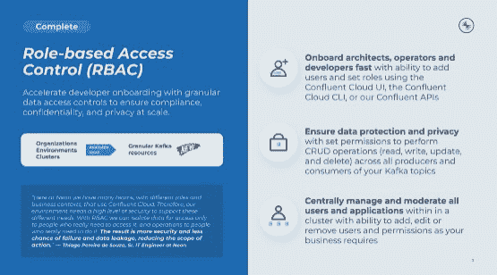
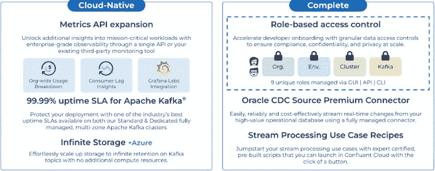

# 汇合增加了更紧密的 RBAC，格拉法纳和其他功能

> 原文：<https://thenewstack.io/confluent-adds-tighter-rbac-grafana-and-other-features/>

[融合](https://www.confluent.io/?utm_content=inline-mention)为其融合 Q2 22 云捆绑包版本的平台增加了许多新功能，包括增强的基于角色的访问控制(RBAC)和 Grafana-metrics 支持。该版本代表了其最新的努力，旨在扩展基于开源 [Kafka](https://kafka.apache.org/) 的数据流支持和服务，为需要流媒体的组织提供实时或接近实时的大规模数据访问。这些组织还经常依赖缓存内存来改善数据连接延迟，并使用共享数据层，当与分布式记录系统相关的数据更新时，共享数据层会不断刷新(该过程也称为[变更数据捕获(CDC)](https://en.wikipedia.org/wiki/Change_data_capture#:~:text=In%20databases%2C%20change%20data%20capture,taken%20using%20the%20changed%20data.) )。

## 扩展访问控制

Confluent 对单个 Kafka 资源的 RBAC 控制现在扩展到 Kafka 主题(描述记录的不同数据系统)、消费者群体和交易 id。虽然这种更严格的 RBAC 对 onboarding 的控制总是可以手动完成，但确保正确的用户访问正确的数据的过程“一直到单个 Apache Kafka 主题”需要时间和资源，而大多数企业都没有这些时间和资源，【Confluent Cloud 产品负责人 Dan Rosanova 告诉 New Stack。企业可以为访问数据的人员设置明确的角色，让他们只看到他们使用新的 RBAC 功能时特别需要的区域。

Rosanova 说，除了帮助解决扩展数据库时与访问控制相关的挑战，RBAC 还使组织能够快速加入开发团队，并将管理特定 Kafka 资源的责任移交给他们。“这确保了 Kafka 资源由真正的所有者管理，在过去，由于需要编写复杂的脚本，管理起来非常复杂，”Rosanova 说。

提供的其他流媒体功能包括:

[完全托管的 Oracle CDC 源连接器](https://www.confluent.io/blog/confluent-cloud-q2-2022-launch/#oracle-cdc-source-connector)。此功能支持对 [Oracle CDC Source Connector](https://cnfl.io/solution-brief-oracle-cdc) 的 source-connector 支持，以前需要投资专有解决方案、许可费用或内部资源来设计、构建和测试 Oracle CDC 的定制连接器。该版本还支持[亚马逊 S3 源](https://docs.confluent.io/cloud/current/connectors/cc-s3-source.html?utm_campaign=tm.lifecycle_cd.ingress-newsletter-feb2022&utm_source=marketo&utm_medium=marketingemail&mkt_tok=NTgyLVFIWC0yNjIAAAGDlN9MSG6Ej7-68R6ckYQLVDh-0gU2SW5wsX5a855C24UKoVkA-NAF-LkWoz_VuOyMHAYfqHlgtdOxKfc66Jg#cc-s3-connect-source)、 [Azure Cosmos DB 源](https://docs.confluent.io/cloud/current/connectors/cc-azure-cosmos-source.html?utm_campaign=tm.lifecycle_cd.ingress-newsletter-feb2022&utm_source=marketo&utm_medium=marketingemail&mkt_tok=NTgyLVFIWC0yNjIAAAGDlN9MSYo_qFFLm-gx5z3MsQv9Dbc3O509Ntokq6c9KSf2lxvTnnimxyfA3k_aQJ5tR0MJgSKIckft0Qt3HVI#cc-azure-cosmos-source)、 [InfluxDB 2 源](https://docs.confluent.io/cloud/current/connectors/cc-influxdb2-source.html?utm_campaign=tm.lifecycle_cd.ingress-newsletter-feb2022&utm_source=marketo&utm_medium=marketingemail&mkt_tok=NTgyLVFIWC0yNjIAAAGDlN9MSd4KlXpCrMHsqfB0uwyWXoBfMWPIpwb0CJsRXJsyGTCCK_EVEqAgNGhzFHcMZTnIBexp6JwiP_SGBz0#cc-influxdb2-source)、 [InfluxDB 2 接收器](https://docs.confluent.io/cloud/current/connectors/cc-influxdb2-sink.html?utm_campaign=tm.lifecycle_cd.ingress-newsletter-feb2022&utm_source=marketo&utm_medium=marketingemail&mkt_tok=NTgyLVFIWC0yNjIAAAGDlN9MSecXoD1X9TB1bl_nOxSugziBcvlVipa3xVSelx0NphmEfKUQEhxEByUz_VZU17DnxruJXt0B6cg6mFk#cc-influxdb2-sink)和[吉拉源](https://docs.confluent.io/cloud/current/connectors/cc-jira-source.html?utm_campaign=tm.lifecycle_cd.ingress-newsletter-feb2022&utm_source=marketo&utm_medium=marketingemail&mkt_tok=NTgyLVFIWC0yNjIAAAGDlN9MSYBFX6en-ZEOQ6A-IDvBWfBRn82y0ZKFxONnLoNHyPaaeblIS1xKOGnEgHHOgNJJP_UhVBw0SkS97bw#cc-jira-source)连接器。

[Metrics API 扩展和 Grafana 云集成](https://www.confluent.io/blog/confluent-cloud-q2-2022-launch/#metrics-api-expansion)。为了更好地观察指标，通过直接访问和支持 [Grafana Cloud integrations](https://grafana.com/docs/grafana-cloud/integrations/integrations/integration-confluent-cloud/#install-confluent-cloud-integration-for-grafana-cloud) 来改善指标访问，这些组织依赖 Grafana Cloud 的流行可视化和观察工具，并希望使用 Grafana 进行数据流性能监控。Confluent 的 Metrics API 还为组织退款提供了[主体 ID 细分](https://docs.confluent.io/cloud/current/monitoring/metrics-api.html#query-for-metrics-for-a-specific-principal-id)，为性能监控提供了[消费者滞后度量](https://docs.confluent.io/cloud/current/monitoring/monitor-lag.html)。

## 真正的云原生

Rosanova 说，Confluent 正在为未来开发的这些和其他增强功能是其使命的一部分，旨在重建其在云中的产品，使其成为“真正的云原生产品”。Rosanova 说:“这导致许多企业在融合云中开始他们的数据流之旅，现有客户采用融合来管理混合和多云环境。“跨云的一致体验提供了企业所需的所有安全性和可管理性，这使得融合成为基本选项。”

Confluent 也没有改变其赌注，即流媒体，尤其是基于 Kafka 的流媒体服务，将在未来的 CDC 发展中发挥关键作用，因为组织寻求扩展其数据库和依赖于它们的运营，通常跨越不同的地理区域。

“我们相信数据流是公司正在经历的下一波主要技术创新的中心，”Rosanova 说。“驾驭信息技术的能力将是决定每家公司竞争力的关键因素，尤其是在实时体验和运营成为赌注的时候。开源的 Apache Kafka 从移动开始，在财富 100 强企业中有超过 80%的企业采用了它。

Rosanova 说，对于刚刚开始使用流媒体的组织来说，采用通常始于使用开源软件控制数据流的单一用例。然而，这个平台的一个关键方面是，这些数据流意味着共享，这些数据流吸引了新的应用程序。

“这是一个良性循环，推动了平台的采用:应用程序带来了流量，反过来又吸引了更多的应用程序。随着用例的增加，与管理 Kafka 相关的成本和时间也会增加，”Rosanova 说。“对于希望减轻运营负担的组织，我们提供全面管理的 Kafka 服务。我们提供流“即服务”,不需要您了解底层基础架构。相反，你可以专注于数据和从中获得的价值。”

<svg xmlns:xlink="http://www.w3.org/1999/xlink" viewBox="0 0 68 31" version="1.1"><title>Group</title> <desc>Created with Sketch.</desc></svg>