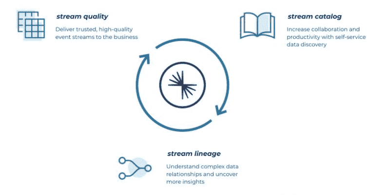
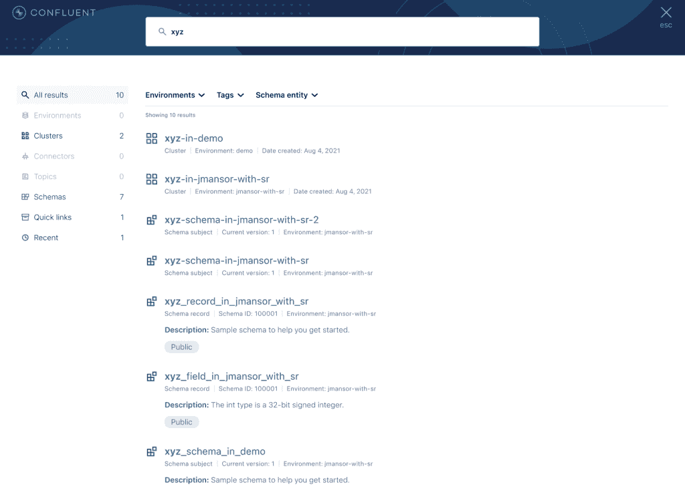

# 汇流给卡夫卡带来了多云流治理

> 原文：<https://thenewstack.io/confluent-brings-multicloud-stream-governance-to-kafka/>

组织看到了在分布式环境中维护应用程序和数据的明显优势，但在转移到分散的数据分布环境时，往往会面临失去对治理和其他数据管理功能的控制的安全风险。

虽然微服务可以帮助支持数据湖、数字集成中心(DIH)和数据流，以支持跨多个云的实时或接近实时的访问，但 DevOps 团队可能更愿意让安全问题超越分布式数据的感知优势，并选择将关键数据存储区保留在内部环境中。

正是由于这个原因，数据流提供商 [Confluent](https://www.confluent.io/?utm_content=inline-mention) 推出了流治理，以缓解对跨多云环境的数据流失控的担忧。

“我们的目标是通过为用户提供简单的自助服务体验来发现、了解和信任在企业中流动的实时数据，从而在保护和民主化移动数据之间取得平衡。“我们相信，当分散的团队能够一起探索、理解和信任运动中的数据时，他们就可以利用其全部价值，”【Confluent 的数据治理产品经理 David Araujo 说。“公司可以加快实时体验的开发，推动差异化并提高客户满意度，同时坚持严格的内部和外部合规要求。”

Araujo 说，流治理基于三个“支柱”。它们包括:

*   **提高流质量**:提高信任度和事件流的技术质量，满足最终用户在服务发展过程中维护数据完整性的需求。
*   **流目录**:通过自助式数据发现提高协作和生产力，允许团队分类、组织和“找到他们需要的事件流”
*   **流沿袭**:理解复杂的数据关系，通过交互式的端到端事件流地图来揭示更多的洞察力。

## “谨慎行事”的代价

融合流治理的创建是为了专门满足那些选择采用 Apache Kafka 进行跨(例如)多云、本地和(在许多情况下)地理区域数据流传输的组织的技术和安全需求。

Araujo 说，随着对使用 Kafka 和其他工具进行实时数据管理的事件驱动系统的需求急剧增加，对动态数据进行组织治理的需求也在“快速增长”。

“虽然构建和维护长期兼容的事件流的工具已经存在，但是在团队之间安全有效地共享这些流以供广泛使用的能力还没有出现。Araujo 说:“对于部署分布式、事件驱动的微服务的企业来说，这种需求最为迫切，这些微服务是由小型、分散的流数据专家团队构建的。“随着对微服务投资的增加和数据源规模的扩大，任何个人或团队都越来越难以理解和管理流经企业的所有数据流。”

从历史上看，数据治理工具的设计主要是为了支持数据合规性和风险缓解。“虽然重要且必要，但这些工具使团队难以访问和利用他们需要的有价值的数据。目标基本上是锁定数据，不惜一切代价保证其安全，”Araujo 说。“此外，这些工具是为静态数据(数据库中静止的数据)构建的，需要与每个系统进行点对点集成。这些系统通常是一种充满挑战和痛苦的操作，不断追求永远不会完全实现的同步和准时状态。”

Araujo 说，相反，组织需要的——以及流治理提供的——是一个解决方案，以回应 DevOps 团队通常对多环境数据流的以下问题。这些问题包括:

*   如何从 10 个话题扩展到上千个话题？
*   如何从几个开发者走到上千个开发者？
*   如何从分散在业务中的一些用例转变为一个中枢神经系统，协调业务各个角落的数据移动？
*   当许多人都不熟悉动态数据时，如何带领整个组织一起前进？

Araujo 解释说，开发新的应用程序通常也很慢，效率也很低，因为缺乏对业务中已经存在的数据的可见性，这些数据来自哪里，如何使用以及在请求访问时与谁联系。如上所述，流治理旨在通过支持开发人员来克服这些挑战，这些开发人员在使用 Kafka 创建数据流应用程序时，一直在努力提高技术质量，尤其是安全性和可见性。

“许多开发人员不得不手动开发数据质量控制以实现合规性。我们已经看到客户通过将信息保存在电子表格和内部网页面中来解决这个问题，这是一个容易出错、经常不同步的过程，随着规模的扩大，情况只会变得更糟，”Araujo 说。使用触手可及的新流目录，自助式数据发现工具可以帮助您了解存在哪些数据、数据在哪里、数据负责人以及数据目前的使用情况

Araujo 说，虽然 Stream Governance 是针对开发人员的，但运营团队可以使用它来“实时查看每个从平台生产和消费数据的人，并确定与平台使用相关的中断的根本原因”。

<svg xmlns:xlink="http://www.w3.org/1999/xlink" viewBox="0 0 68 31" version="1.1"><title>Group</title> <desc>Created with Sketch.</desc></svg>