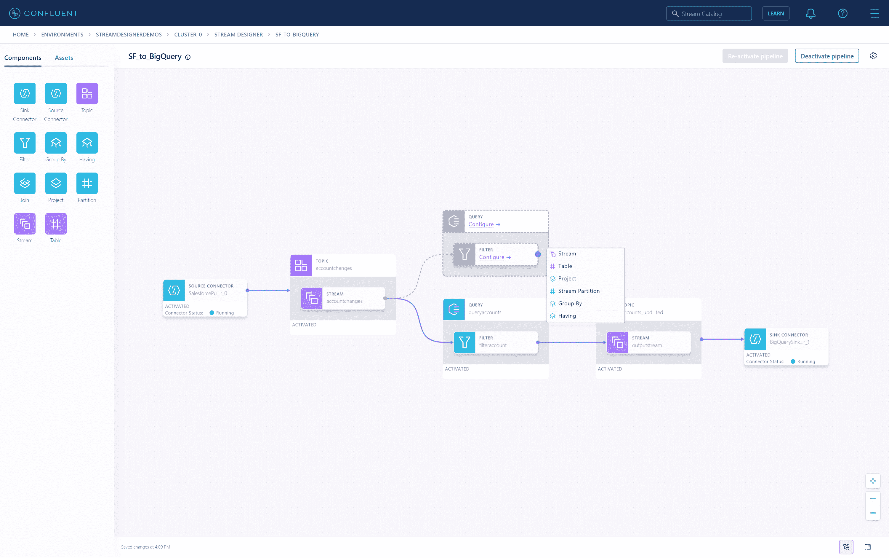
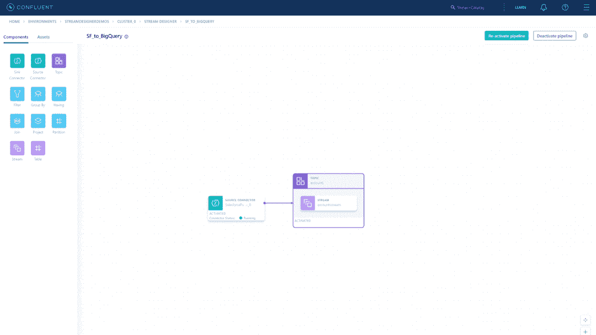

# 融合为基于卡夫卡的数据流带来了视觉设计

> 原文：<https://thenewstack.io/confluent-brings-visual-design-to-kafka-based-data-streams/>

数据平台提供商 Confluent 推出了一个名为 Stream Designer 的可视化界面，使开发者能够在该公司基于 Kafka 的平台和云服务上构建和部署流数据管道。

“通过 Stream Designer，我们希望将这种数据流的运动民主化，并使实时成为组织中所有数据流的默认设置，”Confluent 首席执行官[杰伊·克雷普斯](https://www.linkedin.com/in/jaykreps/)在一份新闻稿中说。

该公司在本周于得克萨斯州奥斯汀举行的[当前 2022 峰会](https://thenewstack.io/confluent-expands-stream-governance-capabilities/)上揭开了新用户界面的面纱。新的堆栈坐下来与汇合的主要产品经理乔恩范西讨论产品。

流设计器提供了一种基于 SQL 的方法来构建数据流逻辑。

简而言之，Stream Designer 的目标是抽象出构建 Kafka 数据流管道的所有细节，而不是抽象出太多以至于源代码和 UI 之间没有视觉上的精确定位。

Fancey 表达了为开发人员在应用程序中实现 Kafka 提供一个更短的“入口”的重要性。他说，开发这个产品的团队花了很多时间考虑所有不同的用例。即使是有经验的 Kafka 开发者也会发现这个界面很有帮助。

## **告诉我们更多！**

Stream Designer 没有添加任何新的抽象，并遵循 1:1 的映射模式和通常的 Kafka 构建实践。Stream Designer 将代表您创建主题，并将其添加到图形界面的画布中。一旦指定了主题，它还会将其添加到源连接器中。它构建了数据从生产者到主题再到消费者流动所需的所有逻辑。

除了易于创建管道之外，Stream Designer 还提供了从连接到源再到主题的数据流的可视化表示。管道内消息检查也是可用的。

定制数据模式功能也是可用的。，例如销售数据或需要按区域位置分解的数据。范西说，一旦你“开始建立并理解你的第一条管道，你就可以以任何你想要的方式扩展和增强它”。

Stream Designer 没有运行时，所以这不会成为应用程序的瓶颈。Stream Designer 制作了显示为管道的工件。一旦构建了管道并生成了代码，就可以通过 UX 或 CLI 部署代码。

详细的指标和模式自动注册在 Confluent 的模式注册表中，管道迭代和多用户环境也是允许的。

## **代码到接口—然后再返回**

当被问及 Stream Designer 团队面临的最大技术挑战是什么时，Fancey 毫不犹豫地说:视觉。界面。但不仅仅是开发人员或任何需要查看 GUI 的人可以看到的界面部分。这是背后的整个想法。什么是重要的？什么可以被抽象掉？必要和讨厌之间的界限在哪里？

最后，一切都归结到了细节上，通常都是这样。

“细节很重要。Fancey 解释了这一挑战:“我们从一开始就有一个清晰的映射，因为我们的目标是开发人员，让他们能够从代码到图形画布来回切换。

如果删除了太多的源代码，那么画布“就会变得与你所包装的东西完全脱离”，而且因为这基本上是为那些理解源代码并能在需要时进行艰苦学习的人构建的，“理解这东西是如何工作的很重要。”

最终结果是管道和画布很好地互补。画布上图形中的节点自动反映管道。节点和连接器之间存在关系，因此开发应用程序的开发人员可以在幕后查看哪些主题是由 Stream Designer 创建的。因为虽然有一个非常详细的画布，但源代码也是可见的，以至于开发人员可以在两个屏幕之间切换。

只有时间能告诉我们这种新产品是如何被开发者所吸收的，但是合流流设计团队不会很快解散。全面发布只是一个开始，还有其他功能和更大平台集成的计划，如与 Stream Lineage 的集成，尽管该功能没有发布日期。

<svg xmlns:xlink="http://www.w3.org/1999/xlink" viewBox="0 0 68 31" version="1.1"><title>Group</title> <desc>Created with Sketch.</desc></svg>