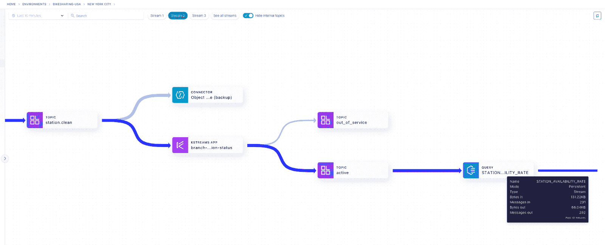
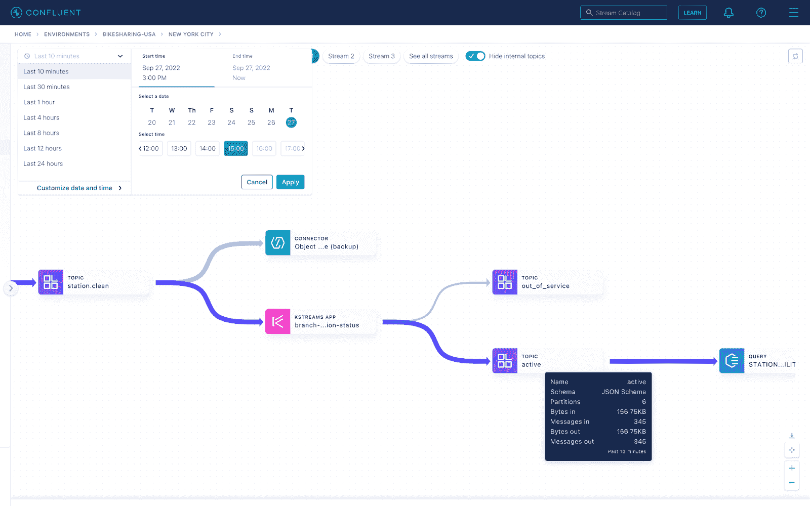

# 汇合扩展了流治理能力

> 原文：<https://thenewstack.io/confluent-expands-stream-governance-capabilities/>

数据平台提供商 [Confluent](https://www.confluent.io/?utm_content=inline-mention) 为[流治理](https://www.confluent.io/product/stream-governance/)添加了一个新的功能层，这是一个针对 Apache Kafka 和 data in motion 的完全托管的治理套件。

“客户需要更多的控制和先进的功能以及更容易的扩展方式，”融合高级产品营销经理 [Greg Murphy](https://www.linkedin.com/in/greg-murphy-28785219/) 在该公司的年度用户大会 Current 2022 峰会上公布了 Stream Governance Advanced 的创建。

“Stream Governance Advanced 建立在最初由[Stream Governance Essentials](https://docs.confluent.io/cloud/current/stream-governance/packages.html#packages-features-and-limits)引入的功能套件之上，提供了更多方式来轻松发现、理解和信任移动中的数据。有了可扩展的质量控制，组织可以跨团队民主化地访问数据流，同时实现永不停机的数据完整性和法规遵从性，”一份融合的新闻稿指出。

流治理的三个高级层主要不同于流治理，它们是流沿袭的新时间点回放、向流目录添加业务元数据的能力以及模式注册的全局可用性。

[合流首席产品经理 Jon Fancey](https://www.linkedin.com/in/jon-fancey/) 在发布前的一次一对一访谈中与新堆栈坐下来讨论流治理，并分享了一些关于企业客户为什么会选择其中一个的更多细节。他首先解释了名称和产品，“治理是确保您的数据干净且高质量的一种方式。流治理提供了基本要素。Advanced 将此提升到了一个新的高度。”

整个治理套件提供了与模式和模式注册中心的深度集成。它利用了描述数据的能力，因为我们有模式和模式注册。一旦你理解了数据的形状，你就能从中获得更多的价值。最初的流治理，现在名为流要素，现在将对所有融合云客户端免费。

## 溪流血统——回顾过去

范西问道，“周三下午 4 点，当支持票开始到达时，管道发生了什么？”和流血统答案。Fancey 解释说，Stream Lineage 提供了“深入研究和理解[或帮助找到]是什么促成或导致了[某个]特定问题的能力，方法是查看数据流以前是如何变化的，现在是如何变化的。

虽然在流治理中也可用，但是回看时间只有十分钟。高级流治理的下一个级别是以小时为单位的长达一周的时间或过去 24 小时的详细分析。以前的挑战是必须等待问题再次出现，因为它“发生在三天前”，这种挑战早已不复存在。

流沿袭的一个新特性是能够在沿袭图中搜索特定的对象，比如客户机 id 或主题。客户可以鸟瞰或深入了解具体细节。

## 添加业务元数据及其重要性…

大多数人不希望自己的社会安全号码出现在任何人的数据目录中，这是有充分理由的……但有时它就在那里。因为正确的原因…同意。让我们保证它的安全。流治理已经在其模式中提供了个人身份信息(PII)标签，但是随着业务元数据的增加，这又进了一步。

由于社会安全号码已经被标记为 PII，他们需要特别的许可。数据是不可见的，但在某些情况下，开发人员需要更深入地了解一些东西，并需要访问事件或主题。现在他们能够看到生产者、消费者和模式。虽然敏感数据不可用，但数据所有者或联系人是可用的。节省了宝贵的时间，并有联系信息，使资源更广泛可用。

客户端现在可以使用 GraphQL APIs 搜索目录，这个 API 就是构建 confluent 的 API。GraphQL 允许更多的声明性搜索，并有助于解决数据过量和不足的问题。

## Stream Registry 现已在全球范围内推出

Stream registry 现在包括 28 个区域，是以前的两倍多。Stream Registry 还具有 99.95%的正常运行时间服务级别协议(SLA)的弹性。简而言之，这意味着应用程序可以在更多的地区以更高的 SLA 运行。

Fancey 解释说，“如果你因为监管原因而固执己见，并且必须在特定区域的特定云上运行，我们现在提供了比以往更多的选择，能够做到这一点。”

<svg xmlns:xlink="http://www.w3.org/1999/xlink" viewBox="0 0 68 31" version="1.1"><title>Group</title> <desc>Created with Sketch.</desc></svg>