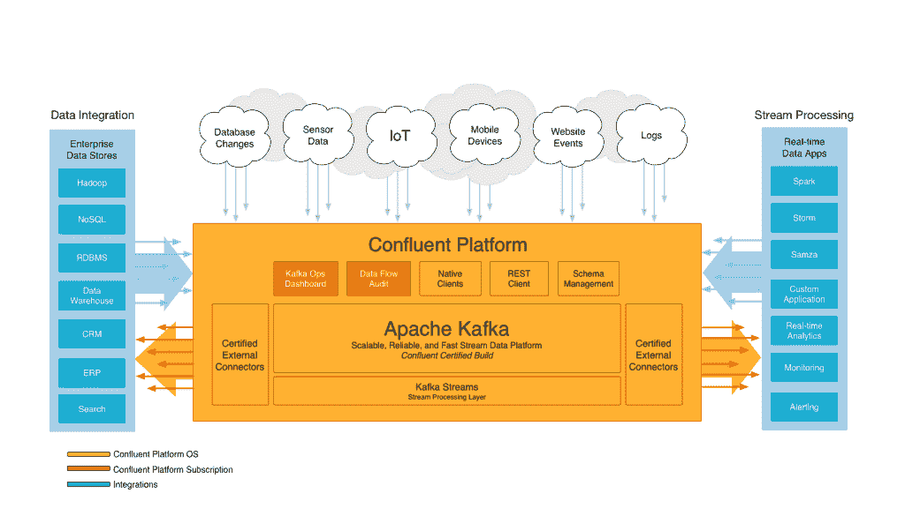

# 提供如何正确运行卡夫卡的课程

> 原文：<https://thenewstack.io/confluent-offer-kafka-classes/>

在当今的应用程序开发环境中，大数据占据着至高无上的地位。如果不收集用户数据，组织将处于明显的劣势。无论数据是来自应用程序、传感器还是网站表单，都必须能够随时访问。也许没有一项数据驱动的事业像 LinkedIn 的 Apache Kafka 数据流分析引擎一样深入，它不仅改变了 LinkedIn 处理数据馈送的方式，还在网飞、优步和其他各种组织中得到了应用。

[汇合](http://www.confluent.io/)平台是由构建 Kafka 的团队开发的。基于 Kafka，它提供了管理、收集和分析从企业来源收集的数据所必需的主干。虽然开始使用 Kafka 非常简单，但是管理大规模运行的集群很快就会成为一项挑战。

> 如果开发人员是自学的，他们可能已经自学了一些东西，当他们的集群规模增长时，这些东西可能会给他们带来问题。

为了准备周二在三藩市举行的 [Kafka 峰会](http://kafka-summit.org/)，Confluent 宣布了 [Kafka 培训和合作伙伴计划](http://www.confluent.io/training)，希望不仅能接触到那些直接与 Kafka 合作的人，还能接触到有兴趣了解该平台或在该平台上起步的开发者和公司。

## 汇流+卡夫卡

卡夫卡的创立者在构建合流时有一个独特的机会，那就是将他们的理论大规模应用于商业用途的能力。这使得我们不仅能够实际使用该平台，还能够在此过程中简化、改进和完善操作体验。这一经验直接转化为新的 Kafka 培训和合作伙伴计划。

“我们已经将自卡夫卡创作以来建立的所有最佳实践纳入了我们的培训材料，因此开发人员和运营人员可以确保他们在课堂上学习的内容将与现实世界直接相关，”Confluent 首席技术官 Neha Narkhede 说。

[课程](http://www.confluent.io/training)从卡夫卡的基本原理开始，同时也试图纠正任何可能不太理想的自学习惯。如果开发人员是自学的，他们可能已经自学了一些东西，当他们的集群规模增长时，这些东西可能会给他们带来问题。在公开课上，Confluent 发现 Kafka 用户之间的互动是体验的一个亮点。

与使用 Kafka 的其他人互动，了解他们如何使用 Kafka，或者他们如何处理他们面临的任何问题，这对该项目的学生非常有帮助。通过将这些经验与在使用卡夫卡方面经验丰富的教师相结合，Confluent 希望提供一个独特的学习环境，以增强那些与卡夫卡一起工作的人的创造力。“人们不仅将学习如何建立一个集群，还将学习如何扩展它以处理大量数据，以及如何解决不理想的配置设置可能导致的问题，”Narkhede 指出。

## 充分利用您的数据

通常，组织将其数据锁定在异地孤岛中，这使得很难获得所有数据的集中视图。Kafka Connect 工具实现了集中查看数据的功能，通过连接 Kafka 中的外部日志、指标和数据库，用户可以将各种系统的数据加载到 Kafka 中，而无需编写任何代码。

通过新的培训课程，Confluent 旨在教开发人员如何通过 Kafka Connect 利用他们的实时数据。对于操作方面的人员，提供了讨论如何配置 Kafka 进行安全数据访问的课程。Confluent 还讨论了个人和组织所面临的安全策略的差异，并教导运营团队如何配置 Kafka 的安全特性。

“人们使用他们理解的东西。Narkhede 说:“通过培训计划，团队可以利用 Kafka 等技术从数据中获得最佳价值。

在今天的发展生态圈里，有很多关于卡夫卡的信息。然而，如果信息指的是旧版本的卡夫卡，它可能会令人困惑、冲突或不正确。Confluent 提供的培训是由 Kafka 专家设计的，通过向他们提供所需的工具和正确的材料来节省开发人员的时间。实践练习的增加加强了学习，因此 IT 团队在离开他们选择的 Kafka 班级时会充满信心，认为他们拥有所需的技能和培训，可以充分利用 Kafka。

通过 Pixabay 的特征图像。通过[汇合](http://confluent.io)嵌入图像。

<svg xmlns:xlink="http://www.w3.org/1999/xlink" viewBox="0 0 68 31" version="1.1"><title>Group</title> <desc>Created with Sketch.</desc></svg>