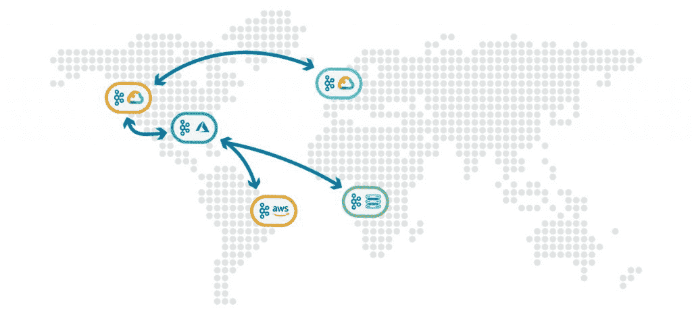
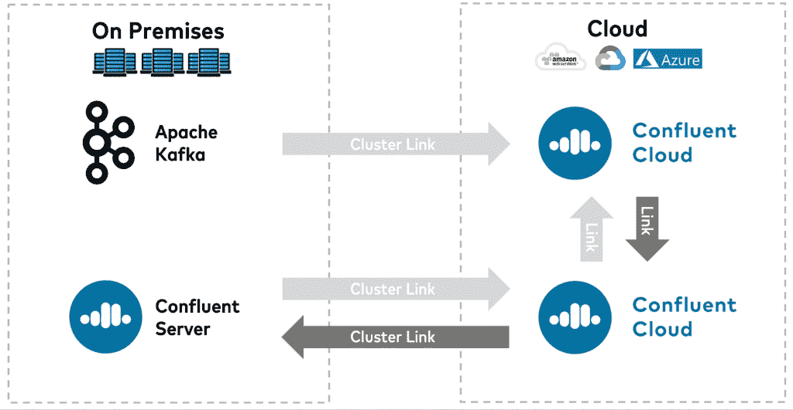

# 融合平台 6.0 旨在创建卡夫卡的全球网络

> 原文：<https://thenewstack.io/confluent-platform-6-0-designed-to-create-a-global-mesh-of-kafka/>

数据流平台 [Apache Kafka](https://kafka.apache.org/) 的广泛采用反映了对数据管理平台的需求激增，这种平台可以支持许多来源的数据操作和需求，通常是在全球范围内。例如，根据 Gartner 最近的报告[“了解云数据管理架构:混合云、多云和跨云，](https://www.gartner.com/en/documents/3985689/understanding-cloud-data-management-architectures-hybrid)”显示，几乎一半拥有数据管理运营的组织在内部和云环境(通常为多云)中管理数据。而 Gartner 表示，这些组织中有 80%以上依赖于多云环境。

实际上，像网飞这样的多媒体巨头需要为全球不同地理位置的数百万观众提供量身定制的视频流体验。一家夫妻店在线零售商需要为其遍布各大洲的供应链以及在线数据交易存储和管理提供实时数据流。这两种使用案例通常都涉及来自内部和多云服务器的流数据。

作为首席技术官办公室的首席技术专家，[本·斯托福德](https://uk.linkedin.com/in/benstopford)、[汇流](https://www.confluent.io/)，卡夫卡充当着“中枢神经系统”的角色，将通常位于全球不同角落的不同数据源连接起来；以及 [Addison Huddy](https://www.linkedin.com/in/addisonhuddy/) ，融合集团产品经理，在[博客帖子](https://www.confluent.io/blog/global-event-streaming-with-cluster-linking-confluent-cloud/)中描述。Confluent 为卡夫卡提供了一个扩展功能的平台。

融合云的产品管理负责人 [Dan Rosanova](https://www.linkedin.com/in/danrosanova/) 告诉新堆栈，如果没有 Kafka，“所有混合云的一个意想不到的后果是，在创建这些流、打破孤岛并将数据堆在一起的努力中，你实际上可能会在创建不同的数据流集时经常创建新的数据孤岛”。“他们只是没有联系在一起，你有点创造了一个新的问题来解决。”

当组织寻求通过单一平台或“中枢神经系统”管理数据时，Kafka 通过运行在不同数据环境中的服务器上的集群来部署。然而，卡夫卡的触及范围和功能有其缺点，融合说其融合平台 6.0 有助于解决。

作为其[项目蜕变](https://www.confluent.io/blog/global-event-streaming-with-cluster-linking-confluent-cloud/)的一部分(这可能是对著名的[弗朗兹·卡夫卡](https://en.wikipedia.org/wiki/Franz_Kafka)小说《变形记》的文学引用，在该小说中，主角变成了一只巨大的蟑螂)，融合平台 6.0 被创建来解决运营团队在管理 Kafka 集群时面临的几个问题。例如，这些问题包括必须手动将集群链接在一起。对于使用 Kafka 的运营团队来说，修复单个集群故障以及将它们连接在一起是一项非常耗时且耗费资源的任务。新的集群链接功能通过自动将不同的集群汇集到一个“Kafka 的全球网格”中来实现这一点

“以经济高效、实时完成且易于操作的实时方式将数据中心和云环境中的不同集群连接在一起，是一个很难解决的问题。但 Kafka 现在通过使用融合平台 6.0 集群链接功能在这方面做得非常好，”Huddy 说。“您可以将所有集群直接连接在一起，几乎创建了一个联合的单个集群，如果您愿意，可以将其描述为遍布全球的‘Kafka mesh’。有了它，你就可以开启大量的用例，”这可能包括视频分发或在伦敦和纽约的经纪公司之间共享交易信息。

平台 6.0 提供的其他融合通信功能包括:

*   **ksqlDB** :替代构建事件流应用程序所需的子系统。手动完成时，该过程也容易出错。“一个大客户和一个大量使用 Kafka 的用户说，他们有一整个团队花了所有的时间来移动这些分区，”Huddy 说。“有了自动平衡，你就不用担心了——你按下开关，系统就会自动平衡。”
*   **分层存储**:允许组织将数据保留在第二层存储中，与 Dropbox 相比，这种存储更方便，但成本更低。“本质上，数据进来后，经过一段时间，它会自动移动到第二层数据，如亚马逊网络服务(AWS)，这样 Kafka 的客户就不必去另一个系统读取数据。这是因为数据永远不会离开 Kafka——你所有的数据都在一个地方。”

Amazon Web Services 和 Confluent 是新堆栈的赞助商。

<svg xmlns:xlink="http://www.w3.org/1999/xlink" viewBox="0 0 68 31" version="1.1"><title>Group</title> <desc>Created with Sketch.</desc></svg>