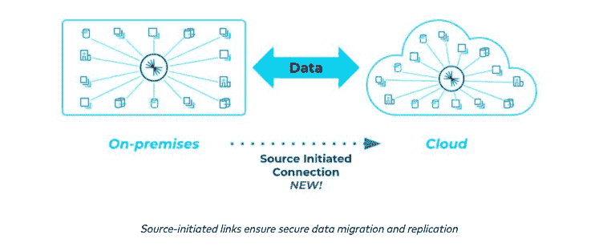
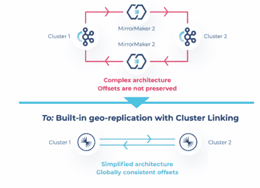

# 融合平台 7.0:跨多云的数据流

> 原文：<https://thenewstack.io/confluent-platform-7-0-data-streaming-across-multiclouds/>

挑战是显而易见的:如何提供对跨多个不同分布式环境不断刷新的数据的实时或接近实时的访问。对于来自不同来源(如多云环境和内部环境)的不同类型的数据流，通常在共享数字层(如所谓的数字信息中心(DIHs ))中的数据必须异步更新。为了保持一致的用户体验，这是必要的。

为此，数据流平台提供商 [Confluent 的 7.0](https://docs.confluent.io/platform/current/release-notes/index.html) 版本采用了该公司所谓的集群链接，用于跨多云和内部环境从不同的融合集群进行数据镜像。T4 说，基于开源数据流工具 [Apache Kafka](https://kafka.apache.org/) ，数百个不同的应用程序和数据系统可以使用它迁移到云或者在他们的数据中心和公共云之间共享数据。

传统上，在多个云之间或在内部和云之间同步数据“就像一场糟糕的电话游戏，”Confluent 的产品经理 Luke Knepper 告诉新堆栈。“您有这些点对点连接和批处理 ETL 作业，它们会慢慢地传递过时的信息。现在，混合建筑师可以使用集群链接，这就像一束激光束，可以在你需要的任何地方实时同步数据，”Knepper 说。“您不再需要尝试管理和审核错综复杂的电话线网络，这将节省大量时间和资源，并使您的应用团队能够提供丰富的实时用户体验、业务关键型应用和分析。”

Knepper 解释说，不要与 Kubernetes 集群混淆，融合集群提供了一个平台来启动数据，而 Kubernetes 集群提供了一个平台来运行应用程序和其他平台。“融合集群可以在许多不同的应用程序和区域之间移动数据。Kubernetes 集群可以托管这些应用程序，甚至可以托管一个融合集群，”Knepper 说。“我们选择自行托管其融合集群的客户可以利用 Kubernetes 的融合功能在其 Kubernetes 集群之上运行融合平台。”

该版本包括 Apache Kafka 3.0，它提供了一个开发人员预览版 [Apache Kafka Raft 元数据模式(KRaft)](https://developer.confluent.io/learn/kraft/) 。Knepper 指出，KRaft 是 Kafka 内置的一种新的共识机制，不需要 Apache Zookeeper。“卡夫使部署 Kafka 变得更容易，允许它扩展到数百万个分区，并使从代理故障中恢复的速度加快十倍，”Knepper 说。

## 卡夫卡合并

事实上，引入 KRaft 是为了消除 Apache Kafka 在元数据管理方面对 ZooKeeper 的依赖。“用 KRaft 取代外部元数据管理，通过将元数据的责任整合到 Kafka 本身，而不是将其分为两个不同的系统:ZooKeeper 和 Kafka，极大地简化了 Kafka 的架构，”[的高级产品经理哈桑·吉拉尼](https://www.linkedin.com/in/mhjilani)在[的博客文章](https://www.confluent.io/blog/introducing-confluent-platform-7-0/)中写道。“这提高了稳定性，简化了软件，使监控、管理和支持 Kafka 变得更加容易。它还允许 Kafka 为整个系统建立一个单一的安全模型，同时使集群能够扩展到数百万个分区，并在恢复时间方面实现高达 10 倍的改进。”

融合 7.0 提供的融合通信的其他新功能包括:

*   Knepper 指出，这个特性“对于强大查询的 SQL 开发人员来说是熟悉的。”现在支持 ksqlDB 0.22，其中包括外键连接。在 ksqlDB 的早期版本中，用户被限制只能根据每个表的主键来连接表。
*   Knepper 说:“Confluent Control Center 的管理模式:帮助客户利用 Confluent 的 Health+产品，并将昂贵的指标和监控卸载到云上。”
*   Kubernetes 的 Confluent 2.2:这是继 5 月份发布的 Kubernetes 的 Confluent 之后，它允许通过使用声明性 API 部署和操作 Confluent 来创建私有云 Kafka 服务。支持 Kubernetes 发行版，如 VMware Tanzu Kubernetes Grid (TKG)和 Red Hat OpenShift 或符合[云本地计算基金会(CNCF)](https://cncf.io/?utm_content=inline-mention) 一致性标准的发行版。

<svg xmlns:xlink="http://www.w3.org/1999/xlink" viewBox="0 0 68 31" version="1.1"><title>Group</title> <desc>Created with Sketch.</desc></svg>