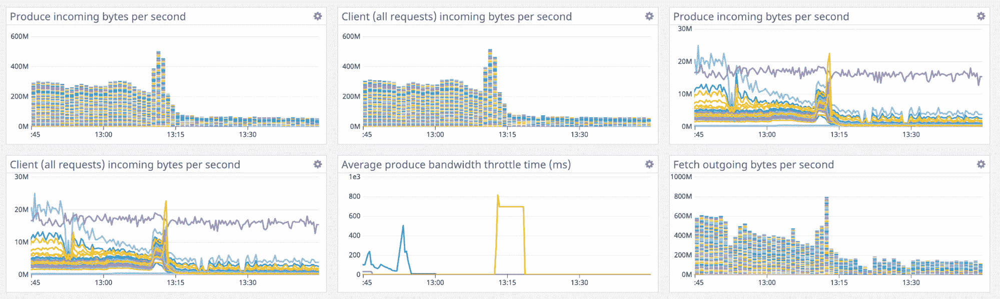

# 融合的“主动支持”旨在加快解决 Kafka 流数据问题

> 原文：<https://thenewstack.io/confluent-proactive-support-aims-to-speed-resolution-of-kafka-streaming-data-issues/>

Confluent 表示，其新的主动支持服务将进一步加快该公司用于管理流媒体数据的商业 Kafka 平台的故障排除时间。

主动支持是“基于我们在融合云中管理成千上万个集群的经验教训”，[融合云产品管理负责人 Dan Rosanova](https://www.linkedin.com/in/danrosanova) 告诉新堆栈。“通过融合云，我们能够看到大量不同规模的集群和不同的 Kafka 环境是如何运行的。我们将这些知识转化为主动支持，并能够将这种 SaaS 优势带给在内部管理 Kafka 的客户。”

该服务提供对性能和配置数据的持续实时分析，发送通知以提醒用户注意潜在的环境问题。该公司声称，当使用融合平台或融合云的主动支持来管理 Kafka 上的部署时，解决问题所需的工作单时间减少了高达 25%。

这一新增选项允许组织选择扩展的[融合平台 6.0 的](https://thenewstack.io/confluent-platform-6-0-designed-to-create-a-global-mesh-of-kafka/)功能，以更好地为使用 Kafka 管理集群的运营团队提供故障排除和警报。例如，基于 Kafka 的融合平台 6.0 旨在帮助 operations DevOps 团队成员实现任务自动化。Confluent 说，当 Kafka 集群失败时，DevOps 团队可以依靠[主动支持](https://docs.confluent.io/current/cloud/proactive-support.html)来改善问题的解决。

主动支持作为融合平台 6.0 的一部分功能，属于融合的[项目蜕变](https://www.confluent.io/blog/global-event-streaming-with-cluster-linking-confluent-cloud/)，可能是指[弗朗兹·卡夫卡的](https://en.wikipedia.org/wiki/Franz_Kafka)经典中篇小说《蜕变》。变形项目代表了 Confluent 帮助组织实现其数据事件流集群的全部潜力的总体努力，这些集群通常部署在世界各地的多云和内部环境中。融合平台 6.0 是为了解决运营团队在使用 Kafka 管理集群时面临的几个问题而创建的，也是该公司项目蜕变计划的一部分。

在 [Apache Kafka](https://kafka.apache.org/) 环境中，一旦发出作业传票，故障排除可能特别耗时。“鉴于其高度分散、复杂的性质，这是一个手动过程，”罗萨诺瓦说。“卡夫卡问题分为两个阶段，缓慢构建和突然爆发。借助主动支持对集群元数据的全天候分析，它有助于快速解决这两个问题。”

Rosanova 说，主动支持被配置为“当你面临问题的潜在危险区域时”对缓慢的构建发出警报。“对于这一首次发布，我们将能够在您的磁盘或网络过载时向您发出警报:这是组织在扩展 Kafka 时遇到的两个非常常见且代价高昂的问题。”

重点是在崩溃发生之前发出警报，并发布与集群性能相关的指标。该公司表示，通过提醒 DevOps 团队何时可以在灭火前更有效地缓解威胁，Kafka 可以有更多的时间用于数据流部署的工程和创新。

Rosanova 描述了这样一个案例，当突发事件发生时，“只有当它发生时才是显而易见的。”在这种情况下，主动式支持会通过电子邮件或 Slack 发送警报，以便联系 Confluent 的支持团队。Rosanova 说:“我们已经配备了您环境的实时健康指标，大大减少了在确定问题之前需要询问的问题数量。

Rosanova 说，上文提到的 Confluent 声称，主动支持有助于将解决 Confluent 平台支持问题的速度提高 25%，这在很大程度上是基于大部分诊断信息流的自动化，从而消除了在自我管理的 Apache Kafka 环境中识别问题所需的更多手动过程。

“在一个典型的支持电话中，我们需要要求人们点击他们的系统，以找出诸如 Kafka 版本号、磁盘和网络配置详细信息以及历史数据等内容，”Rosanova 说。“有了主动支持，我们已经有了实时运行状况指标，因此该流程变得更加上下文驱动和高效。”

<svg xmlns:xlink="http://www.w3.org/1999/xlink" viewBox="0 0 68 31" version="1.1"><title>Group</title> <desc>Created with Sketch.</desc></svg>