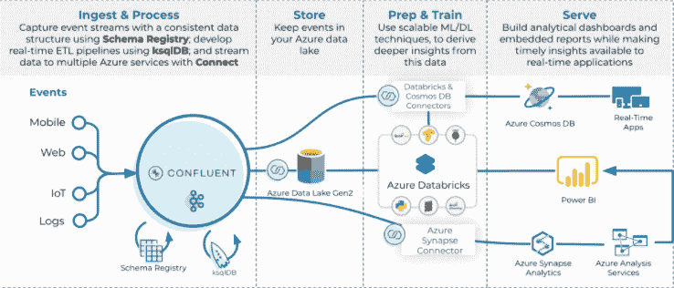

# Confluent 的 Kafka 平台成为 Azure 的集成服务

> 原文：<https://thenewstack.io/confluents-kafka-platform-becomes-a-first-party-service-for-azure/>

Confluent 用于管理流媒体数据的商业 Kafka 平台现在可以与微软 Azure 无缝合作，这样 Azure 的客户就可以访问 [Confluent Cloud](https://docs.confluent.io/current/platform.html) 而无需“离开 Azure 门户”， [Confluent](https://www.confluent.io/?utm_content=inline-mention) 的产品管理负责人[丹·罗萨诺瓦](https://www.linkedin.com/in/danrosanova)告诉新堆栈。

Rosanova 说，作为“第一批与微软建立这种集成的合作伙伴之一”，Confluent 和微软工程团队一直在合作，在 Azure 中专门为 Confluent 编写自定义接口。

以前，融合用户必须在融合云和 Azure 接口之间切换，而现在，“他们需要的一切都在一个地方，”Rosanova 说。用户可以使用他们相同的云身份与融合云交互，也可以从 Azure 门户中查看和跟踪他们的融合云资源。“没有这种新的本机集成，这是不可能的。我们与三大云提供商的支付集成已经有一段时间了，但这不仅限于用户体验和身份集成。”

根据 Confluent 的数据，80%的财富 100 强公司已经采用 Kafka 进行数据流传输，通常跨越位于世界各地不同地理位置的多个云环境。但是 Kafka 和 Kubernetes 一样，在没有支持平台和界面的情况下很难管理它。Confluent 的存在理由是提供平台支持，否则 Kafka 专家的内部团队将不得不提供这种支持。

Rosanova 说，与 Azure 相关的特性之一是需要 Confluent 的工程师进行配置工作，包括 Azure 如何“为控制平面提供资源”，以便创建和管理资源。Rosanova 说:“这对于 Azure 来说有点独特，但有许多优势，包括集成的身份验证和为许多不同类型的资源创建部署清单的能力，”Rosanova 说。"汇合现在在 Azure 主要有一个资源提供商."

Azure 上的融合云用户将很快注意到身份验证是如何与他们的 Azure 帐户集成的。“这意味着你的 Azure 账户，由 Azure Active Directory 支持，用于融合云的认证，”Rosanova 说。“第二件事是，你现在在 Azure 中有一个可见的资源，这是你的融合云实例。因此，这实际上远远超出了市场提供的范围。”

Rosanova 指出，Confluent 支持与亚马逊网络服务(AWS)和谷歌云的单点登录集成，但他表示，Confluent“正在与其他云提供商讨论类似的集成，但每个提供商的工作方式不同，因此集成也可能不同。”

“我们当然重视我们所有的云合作伙伴，并理解客户希望使用他们选择的云基础设施提供商，所以我们将尽一切努力以一种真实的方式成为最好的流媒体服务提供商，让云提供商的用户感觉很自然，”Rosanova 说。

通过融合云，融合云表示 Azure 客户现在可以访问 Azure 和微软服务的托管连接器，包括:

*   Azure 函数。
*   Azure Blob 存储。
*   Azure 活动中心。
*   Azure 数据湖存储第二代。
*   Microsoft SQL Server。

大卫·马克·德·皮沙贝特写

<svg xmlns:xlink="http://www.w3.org/1999/xlink" viewBox="0 0 68 31" version="1.1"><title>Group</title> <desc>Created with Sketch.</desc></svg>