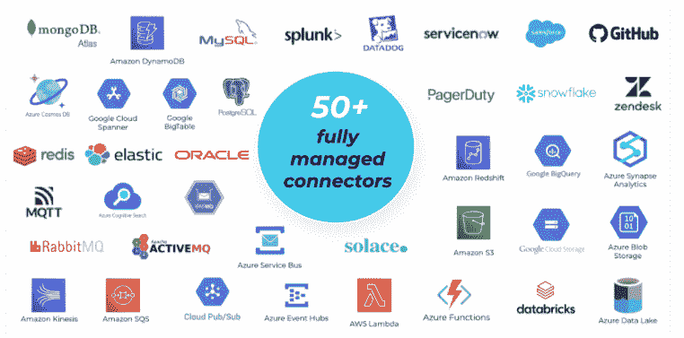

# 汇合的 Q1 更新:“数据网格与数据混乱”

> 原文：<https://thenewstack.io/confluents-q1-updates-data-mesh-vs-data-mess/>

[Confluent](https://www.confluent.io/?utm_content=inline-mention) 表示，它将每季度发布一系列对其数据流平台的更新。

在这一季度，更新包括许多从 Apache Kafka 开源分布式事件流平台构建的新功能。它们包括模式链接、按需缩减集群容量的新控件和新的完全受管 Kafka 连接器。

融合云产品负责人[丹·罗萨诺瓦](https://www.linkedin.com/in/danrosanova)告诉新堆栈，新功能“可以在创建数据网格和数据混乱方面产生巨大差异”。

托管连接器支持与流行的数据系统和应用程序进行实时集成。

## 不断的挑战

DevOps 面临的一个持续挑战是如何消除孤岛并促进开发、运营和其他利益相关方之间的协作。然而，并不是所有的团队和用户都需要访问生产环境，而限制访问仍然是标准的最佳安全实践。Rosanova 告诉新堆栈，Confluent 的[模式链接](https://www.confluent.io/fr-fr/blog/easy-data-migration-with-schema-linking/)给了组织开发的自由，而没有破坏生产的风险。

Rosanova 说:“开发人员和生产人员通常不会相互交流——因为生产环境非常敏感，你不想让每个人都有访问权限。借助构建在集群链接之上的模式链接，可以跨团队、组织和环境(例如混合和多云环境)实时共享同步的模式。Rosanova 说:“与我见过的人们通过电子表格共享模式的变通方法相比，这更具可扩展性和效率。”

大量的赘述都致力于扩展，但是如何在需要时动态地调整网络资源以节省资源来避免冗余常常没有被提及。正如 Rosanova 所指出的，组织通过增强其处理流量高峰和避免停机的能力来保持高可用性。

“我们增加了一种简单的自助方式来缩减容量，因此客户再也不用担心在他们不使用的容量上浪费资源。Rosanova 说:“这些集群还会在每次规模扩大或缩小时自动重新平衡数据。“这解决了在工作负载运行时重新平衡工作负载这一真正艰巨的挑战。就像给行驶中的汽车换轮胎一样。现在，您可以在不中断实时信息流的情况下优化数据放置。”

## 新连接器

融合的新版本现在具有超过 50 个融合云的托管连接器。Confluent 的 Apache Kafka 连接器背后的想法是，通过组织选择的数据源和接收器促进数据流的网络连接。

Rosanova 说，在过去的六个月中，Confluent 提供的托管连接器数量增加了一倍多。“一旦一个系统连接上了，还需要增加两个，以此类推，”他说。“我们将实时数据带到传统的非实时场所，以快速实现公司应用的现代化。这是一个持续增长的重大需求。"

Rosanova 说，Kafka 已经成为一个领先的数据流平台，Confluent 将继续与它一起发展。

“通过这些新功能，我们正在改善企业可以利用 Kafka 完成的事情。Rosanova 说:“实时数据流将继续在服务和体验中发挥重要作用，使组织脱颖而出。“我们希望让任何组织都可以获得实时数据流，并继续构建一个云原生、完整且随处可用的平台。”

汇合的连接器列表现在包括:

*   数据仓库连接器:[雪花](https://www.snowflake.com/?utm_content=inline-mention)，谷歌 BigQuery，Azure Synapse Analytics，亚马逊红移。
*   数据库连接器: [MongoDB](https://www.mongodb.com/cloud/atlas/?utm_content=inline-mention) Atlas，PostgreSQL，MySQL，微软 SQL Server，Azure。Cosmos DB，Amazon DynamoDB，Oracle 数据库， [Redis](https://redis.com/?utm_content=inline-mention) ，Google BigTable。
*   数据湖连接器:亚马逊 S3，谷歌云存储，Azure Blob 存储，Azure 数据。第二代湖存储，数据布里克斯三角洲湖。

此外，Confluent 改进了对流行的网络监控工具的访问。该平台现在提供与 Datadog 和 Prometheus 的集成。“只需点击几下鼠标，运营商就可以在他们已经使用的监控工具中更深入地、端到端地了解融合云，”[融合云核心产品和平台的集团产品经理 Ben Echols](https://www.linkedin.com/in/benechols) 在[博客文章](https://www.confluent.io/blog/real-time-data-integrations-at-scale-with-confluent-q1-22-launch/)中写道。

<svg xmlns:xlink="http://www.w3.org/1999/xlink" viewBox="0 0 68 31" version="1.1"><title>Group</title> <desc>Created with Sketch.</desc></svg>