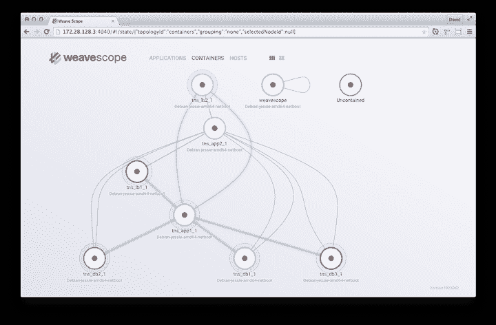
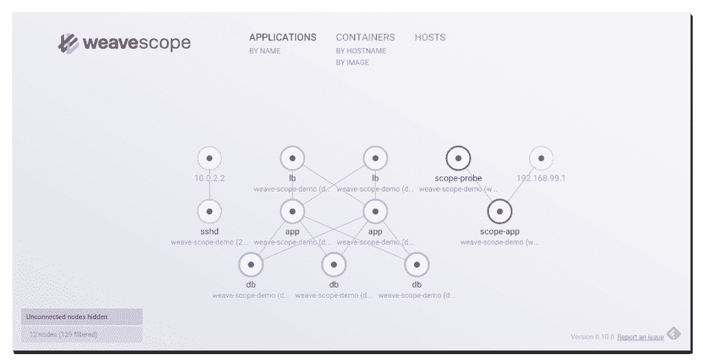

# Weaveworks 为容器带来了软件定义的网络

> 原文：<https://thenewstack.io/connecting-containers-weaveworks/>

如果一项技术被设计成“透明的”，那么它应该在不影响系统性能的情况下运行。这一点在使用容器时最为重要，因为在大规模部署时，资源管理至关重要。

上周， [Weaveworks](http://weave.works/) 宣布了 [Weave Net](http://weave.works/product/net/) v. 1.4，这是 Docker 的一种“微型路由器”技术，其功能类似于标准路由器，为容器提供 IP 地址，与其他路由器共享更新，以及服务发现。

此外，WeaveNet 1.4 允许容器停止和重启，即使网络遇到连接问题，这在大多数集群上的标准 Docker 部署中是做不到的。WeaveNet 处理跨主机协调，建立一个被称为“mesh”的通信网络，允许容器联网并被发现，而不需要传统的集群存储，如 [Consul](https://www.consul.io/) 或 [Zookeeper](https://zookeeper.apache.org/) 。

在 WeaveScope 中监控容器

与容器领域的其他供应商不同，Weaveworks 不销售容器平台。

“我们专注于在任何平台上工作的监控、可视化和管理，”Weaveworks 首席执行官 Alexis Richardson 在 Dockercon EU 2015 上接受新堆栈编辑 Alex Williams 的采访时说。预计到 WeaveNet 1.4 的发布，Weaveworks 在 2015 年 11 月推出了 [WeaveScope](http://weave.works/product/scope/) ，这款产品在与 WeaveNet 一起使用时可以很好地配对。

[Alexis Richardson，Weaveworks:帮助容器生态系统](https://thenewstack.simplecast.com/episodes/alexis-richardson-weaveworks-helping-the-container-ecosystem)

Weaveworks 在新兴的软件定义网络(SDN)领域扮演着一个有趣的角色。通过将网络移入虚拟平面，开发人员可以使用曾经只由网络运营商使用的工具。这些组织可以选择负载平衡器(根据服务器的流量在集群中分配负载)来自动完成这一过程，而不是购买传统的 PaaS 解决方案来联网其基础架构。

尽管负载平衡器越来越受欢迎，但由于其起源于网络运营生态系统，对于大规模工作的人来说，它们通常被视为遥不可及。对于容器生态系统来说，好消息是负载平衡可以在 Kubernetes 这样的容器引擎上自动完成。WeaveNet、[法兰绒](https://github.com/coreos/flannel)和 [Docker Networking](https://docs.docker.com/engine/userguide/networking/) 只是完成这项任务的几种网络工具。

Richardson 指出:“我们一直在等待第一代 sdn 的推出，但他们没有，因为它们是由网络天才编写的，并被卖给了网络运营团队。第二代 SDN 产品提供了多样化的选择，公司可以从中选择将其技术堆栈和部署在其中的微服务联网。

Weave 范围内的应用层

Docker 和 Weaveworks 是新堆栈的赞助商。

由 WebProJo 制作的特色图片，根据[知识共享协议 CC0](http://creativecommons.org/publicdomain/zero/1.0/deed.en) 授权

<svg xmlns:xlink="http://www.w3.org/1999/xlink" viewBox="0 0 68 31" version="1.1"><title>Group</title> <desc>Created with Sketch.</desc></svg>