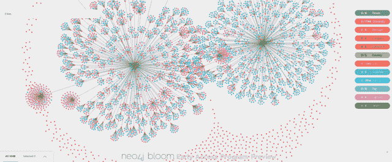

# 连接问题:在图中寻找正确的路径

> 原文：<https://thenewstack.io/connections-problem-finding-the-right-path-through-a-graph/>

在复杂的数据系统中——其中许多已经增长到关于最大链中最小链接的数十亿个事实的巨大缓存——几乎任何人可能感兴趣的任何事实都可以用图中的路径来指定。我所说的“图”是指一种在一个系统中绘制路线的方法，在这个系统中可以获得一个事实。

今天，我们遇到了我所说的“联系问题”在我们现有的系统中，往往有太多不相关的事实。因此，通过图路径通常是隐含的且不可发现的。如果路径确实存在，它太长或太难导航。你最终会得到一个令人困惑的无法使用的图表。

## 寻找增值

不要误解我，大量的事实是伟大的。然而，有时您希望没有 25 或 38 个系统！当然，机器学习已经突飞猛进，但 [ML 和 AI 从业者会告诉你](https://thenewstack.io/machine-learning-challenges-are-now-more-about-engineering-than-research/)那里的数据工程挑战是惊人的，连接这些点越来越痛苦。这些人更愿意[把时间花在预测建模上](https://thenewstack.io/use-the-drift-and-stability-of-data-to-build-more-resilient-models/)。他们实际上最终做的是数据工程；在做任何有价值的事情之前痛苦地把点连接起来。

您每天都会看到这一点，您执行的每次数据查找都是如此。首先，关系数据库的 JSON 文档促使您创建一个标识符方案，这样您就可以连接两个表，或者通过一个查找操作连接两个 JSON 文档。每次这样做，您都要再次付出相同的性能成本。

或者，您可以选择对整个数据结构进行反规范化。例如，您可以存储一个大表，而不是两个小表。通过拥有一个表，而不是连接它们，您已经简单地将这种关系融入到表模式中。

当你对你的数据进行反规范化时，你要为更大的数据冗余和更少的内聚性付出代价。因此，您可以规范化数据并在计算时间内付款，或者反规范化数据并以另一种方式付款。

对于这两种选择，你在某个地方失去了灵活性。当需要从数据中提取新的更深层次的关系时，您至少要考虑重新设计一切。最后，您得到的物理数据模型倾向于反映您的许多系统出于性能和连接性的原因需要如何运行，而不是反映主题专家实际上是如何考虑他们的领域的。

## 向上拉平

使用图表以一种连接的方式存储和使用数据是一个非常古老的想法，它提供了一个全新的视角。使用图形数据库可以降低冗余度。一个节点可以在一个图中存储一次，然后通过任意多的关系引用。

图表保持数据的高度内聚性，从而导致数据的可重用性和可维护性。当您需要针对新的功能或任务对图形数据模型进行调整时，它不会对您不利。

主题专家倾向于在网络环境中思考。他们在白板上画的“方框和线条”展示了他们所有的概念是如何结合在一起并相互关联的。图形数据模型就像这些网络一样。当您需要从数据中获得洞察力时，数据网络的结构就成了解决方案，而不是限制。

这里有一种需求——也许是一种迫切的需求——以一种完全不同的、更强大的方式来实现数据表示和存储。

为了让您和您的数据环境更上一层楼，如果您愿意的话，您不能仅仅在已经存在的典型 SQL 数据库或 JSON 文档集合的基础上再增加一些特性。你需要关注事实之间的空间:联系问题。

## 现代寻路

让我们从简单的问题开始:从阿拉斯加的安克雷奇向弗吉尼亚州的里士满运送包裹的最佳方式是什么？显然，物流公司找到的路线是通过他们的运输网络图的路径。对于不得不取消一些航线的航空公司来说，城市间的最短路径是什么？

航空公司为客户重新预订航班时，至少需要一条穿过其城市和航班图表的路径。但是让我们暂时把地图和地理排除在外。对于任何组织，你可能会问某个经理直接或间接管理多少人。该公司的每个人都有一个报告结构，这也是一个通过图表的路径。

通常，关系数据库会迫使您为每一种获取路径的方法构建并维护一些中间汇总结构。使用图形数据库结构，您可以立即遍历和汇总所有报告结构。这里没有魔法。这使用了经典的方法，例如广度优先和深度优先搜索。

通过图形可视化，您可以缩小视图，亲眼看到结构。在这里，当你专注于树木时，你不会失去森林。每个图的超结构都适用于实际的系统动态，而不是你已经厌倦管理的相同的颗粒事实列表。

## 更大的森林

我们已经讨论了企业和商业交易的结构。让我们继续放大一分钟。

21 世纪的生活相互联系的程度前所未有。20 世纪 90 年代和 21 世纪初迎来了一波全球化浪潮，各国之间建立了复杂的贸易联系。个别行业已经提高了他们的做法，导致更长的供应线和更复杂的物流。

2020 年的疫情撼动了全球供应链，集装箱船滞留在港口，市场混乱，造成芯片短缺和其他现象，这些现象将持续到 2022 年。

2016 年，国际调查记者联盟(ICIJ)曝光了[一个离岸银行账户网络](https://offshoreleaks.icij.org)，该网络在全球范围内促成了腐败和犯罪。一家公司拥有另一家公司或向另一家公司转移资金，这本身并不可疑。然而，当 ICIJ 缩小到照亮网络的上层建筑时，[团队暴露了以前深不可测的相关账户、公司和个人之间的资源流动](https://neo4j.com/case-studies/the-international-consortium-of-investigative-journalists-icij/)。从任何一个银行账户都看不到任何信号。他们使用图形数据库作为工具，成功地揭示了相互依赖和连接的模式，这些模式比数据点本身更能提供信息。

同样的原则也直接转化为一项任务，比如为媒体用户或零售购物者提供推荐。你可能喜欢与你有相似经历的人高度评价和使用的产品或服务。

在欺诈检测领域，金融转账模式发出了危险信号。在物流网络中，供应商一周的挑战可能导致下一周可预见的生产问题。人脉很重要。你正在寻找的关键见解可能来自森林，而不是树木。

## 变平意味着放手

作为数据从业者，如何才能提升水平？扩大你可以问的问题的广度，并采用多种框架来研究一个问题，这是一个很好的开始。如你所见，你今天使用的工具有一种微妙的能力来限制你思考问题的方式。俗话说，当你只有一把锤子时，一切看起来都像钉子。

提升意味着从细读事实清单过渡到思考[复杂系统动力学](https://www.nature.com/articles/ncomms8186)。这意味着找到一条穿过森林的路，而不仅仅是避免撞到下一棵树。为了实现这一点，您需要用正确的工具和全新的观点来处理连接问题。

当我学习软件开发的时候，我从 Java 开始，并且把所有标准的面向对象编程术语都记在了脑子里。感觉很棒。你知道那种感觉——当你最终“明白”并开始飞翔时，大脑中的“咔嚓”声。

但是 Java 不是一切；后来我了解了不同的范式——过程逻辑、功能逻辑、逻辑编程。就好像这个世界被倒立了一样。我知道如何用 Java 解决的所有问题，突然用不同的心智工具集看起来都不一样了。咔嚓咔嚓咔嚓。

如果您来自 JSON 文档和关系表领域，那么这就是图方法论带给您的感觉:一次大的“点击”还是你的数据！这一点没有改变。但是您获得了一个新的视角，启用了那些不自然出现的模式或者与其他数据库系统不习惯的模式。

作为技术专家，在一个完整的技术生成时间不超过五年的行业中，我们中的许多人已经习惯于成为专业的学习者。也许图形数据库不会改变应用程序开发的一切。然而，它可以为你提供一套新的心理工具，让你更好地为下一代带来的一切做好准备。

我们技术人员应该*在战略上对过时方法的局限性不耐烦*。这就是你如何提高你的实践水平。这就是垃圾收集在现代软件开发中如此流行的原因。这就是工作负载部署变得更加自动化的原因。这就是我们不断向前抽象的原因，从服务器到虚拟机再到无服务器。

通常，作为一名开发人员，你的成功取决于你能维持和维护多少旧东西。一些最新鲜、最有力的想法并不复杂或神奇，它们只是视角的转变:用新的方式看待老问题，以获得新的答案。

## 从哪里开始

<svg xmlns:xlink="http://www.w3.org/1999/xlink" viewBox="0 0 68 31" version="1.1"><title>Group</title> <desc>Created with Sketch.</desc></svg>