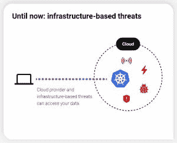
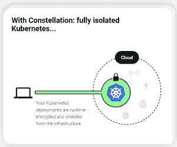
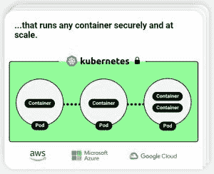

# 星座:第一个机密的 Kubernetes 发行

> 原文：<https://thenewstack.io/constellation-the-first-confidential-kubernetes-distribution/>

您如何在他人的基础架构上运行敏感的工作负载？“你没有”大概是这个问题常见的自发回答。然而，在一个以云为先的世界里，不在别人的基础设施上运行变得越来越不可行。

[机密计算](https://thenewstack.io/confidential-computing-is-transforming-data-encryption-in-healthcare-finance/)是一种相对较新的安全模式，通过技术解决了这一问题。从根本上来说，机密计算涉及两件事:(1)在处理过程中保持工作负载的加密和隔离；(2)通过加密证书(“远程证明”)使这种情况在外部可验证。

是的，没错，[通过保密计算](https://thenewstack.io/linux-foundation-forms-the-confidential-computing-consortium-to-protect-data-in-use/)，工作负载在运行时在内存中保持完全加密。只有 CPU 知道加密密钥，它只是临时解密其内部寄存器和缓存中的 64 字节块中的数据，其他软件和硬件无法访问这些数据。

凭借这两项基本功能，机密计算可让您在可能受损的系统上安全地运行工作负载。如果实施正确，机密计算可以有效地保护工作负载免受恶意管理员、操作系统内核、虚拟机管理程序和“冷启动”等物理攻击运行时加密和远程证明在这里同等重要。如果没有远程证明，受损的基础设施可以简单地谎报运行时加密及其运行的软件，并在您发送数据后访问您的数据。

随着[星座](https://www.edgeless.systems/products/constellation/)，Edgeless Systems 本月发布了可能是第一个作为开源的机密 K8s 概念的实现。Constellation 是 CNCF 认证的 K8s，从可用性的角度来看，应该像“普通”K8s 发行版一样工作。Constellation 在核心机密 K8s 概念中增加了类似于基于 [Sigstore](https://www.sigstore.dev/) 的供应链安全功能。星座的特性列表和基准比较可以在 [GitHub](https://github.com/edgelesssys/constellation) 上找到。

Constellation 目前与 Azure 和 GCP 合作，支持亚马逊网络服务和 OpenStack。

## 什么是机密 Kubernetes？

当英特尔在 2015 年开始为其客户端 CPU 添加一项名为软件卫士扩展(SGX)的功能时，它成为了保密计算的先驱。当时，英特尔主要将 SGX 定位为实施数字版权管理(DRM)的一种手段。从那时起，技术的焦点已经转移到了云上，AMD 和 Arm 分别凭借其安全加密虚拟化(SEV)和 Realms 功能赶上了这股潮流。

本质上，大多数最新的英特尔和 AMD 服务器 CPU 都支持机密计算，大型云提供商都在该技术上投入了大量资金，并准备好了相应的产品。

## **机密计算和 Kubernetes 如何融合在一起**

好吧，那么如果机密计算现在很流行，我们可以用它来运行我们的 Kubernetes (K8s)集群，并保持一切加密和屏蔽基础设施吗？

可惜没那么简单。迄今为止，云主要提供所谓的机密虚拟机(CVM)。这些是提供运行时加密和原始证明功能的普通虚拟机。在 CVMs 上运行 K8s 节点会自动为这些节点提供运行时加密。然而，正如我们在上面了解到的，仅仅运行时加密是不够的。我们还需要远程证明和验证。

这就是 K8s 集群中事情变得复杂的地方:在发送数据之前，节点 A 如何验证节点 B 的真实性？节点映像更新或节点故障后会发生什么？K8s 管理员在发送数据之前如何验证一个有很多节点的整个集群的真实性？所有这些都可以解决，但需要深思熟虑的设计和工程。

此外，人们会希望有一种机制来确保数据不“仅仅”在运行时被加密，而是传输到网络或云存储的每一个字节都被加密，这样就不会有间隙。

如果给出了以上所有内容，我们就有了一个看起来有点神奇的东西:K8s 集群，作为一个整体，它与基础设施隔离，并且其中所有数据都是加密的——静态、传输中和运行时。这样的“机密 K8s”就像是公有云上的私人雕琢。它可以防止恶意数据中心员工、云管理员、共同租户和黑客通过云基础架构软件访问数据。因此，机密 K8s 使公司能够将敏感或受监管的工作负载迁移到云，并提供更值得信赖的 SaaS。

<svg xmlns:xlink="http://www.w3.org/1999/xlink" viewBox="0 0 68 31" version="1.1"><title>Group</title> <desc>Created with Sketch.</desc></svg>