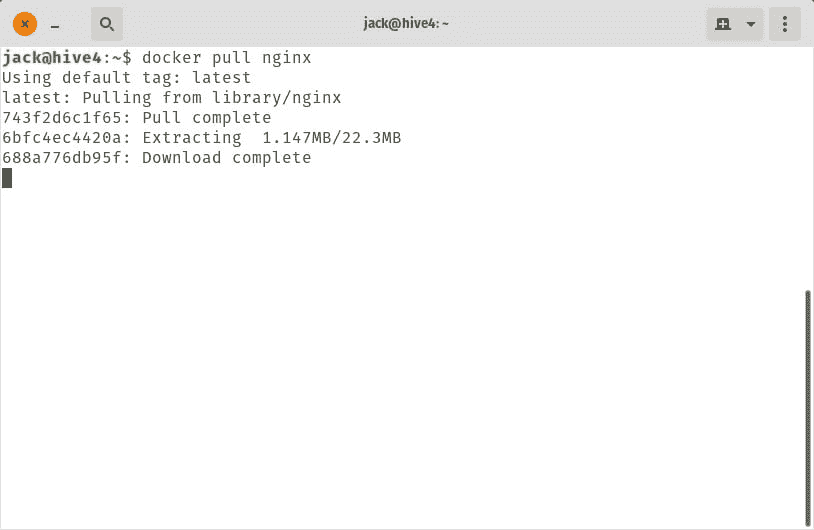
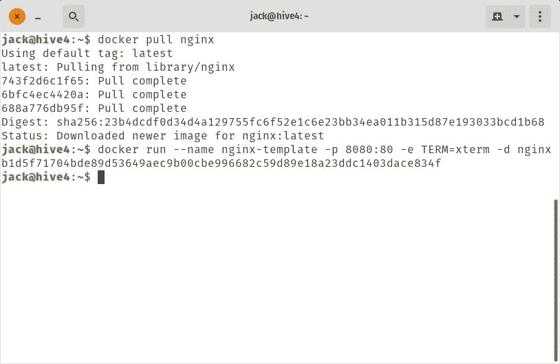
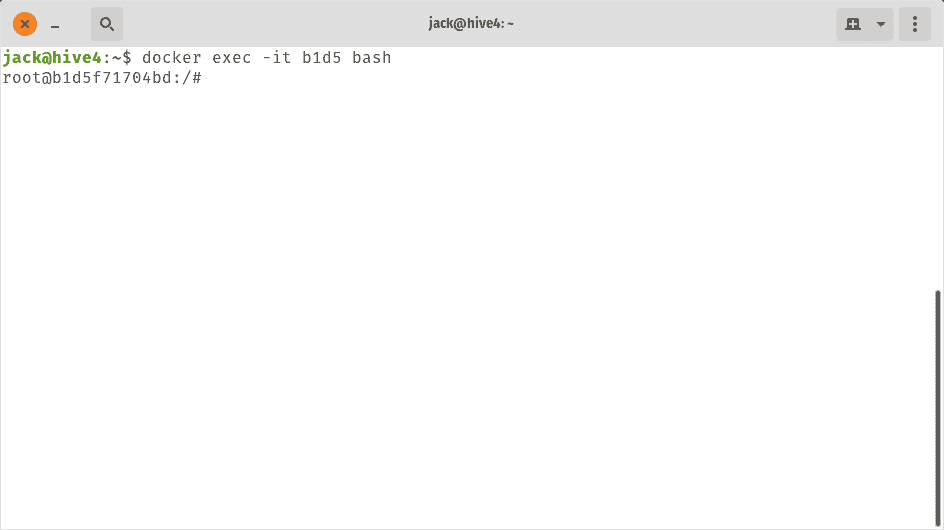
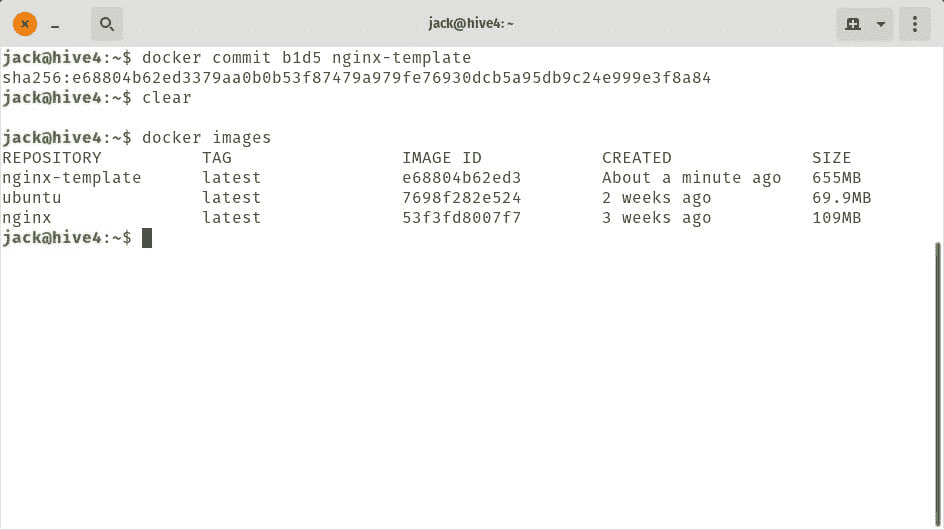

# 容器基础:如何提交对 Docker 映像的更改

> 原文：<https://thenewstack.io/container-basics-how-to-commit-changes-to-a-docker-image/>

Docker 是一个可以帮助你的公司变得更加敏捷和灵活的工具。借助容器，您可以基于预构建或定制的映像快速部署服务。即使有这种程度的灵活性，也有很多方法可以让 Docker 容器更加高效。其中一种方法是创建模板图像，用作容器的基础。比方说，您需要能够基于包含一组特定工具的映像来部署容器(例如包含 MySQL、PHP、build-essentials 和 nano 的 NGINX 映像)。与其每次推出容器时都必须构建相同的映像，为什么不用那些工具创建一个单一的映像，作为所有容器的模板呢？

信不信由你，创建这样一个模板并不难。为此，您需要构建您的映像，提交对映像的更改，然后就可以开始部署容器了。

使用这种方法有助于提高效率，大大提高容器的生产率。

让我们实现它。

我将使用[官方 NGINX 图像](https://hub.docker.com/_/nginx)演示这个过程，并将从 [Docker Hub](https://hub.docker.com/) 定制图像。我假设您已经在自己选择的平台上安装并运行了 Docker，并准备好了。

## 拉官方形象

这个过程的第一步是从 Docker Hub 上下载官方图片。要提取这个图像，发出命令:

图像应该很快拉低(**图 A** )。



**图 A:** 从 Docker Hub 下拉官方 NGINX 图片。

下载完映像后，我们现在可以部署容器，以便可以定制它来满足我们的特定需求。

### 部署容器

我们要做的是以这样一种方式部署我们的新容器，即我们可以访问相关的 bash 提示符(这样我们就可以在容器内工作)。为此，我们使用命令进行部署:

```
docker run  --name nginx-template  -p  8080:80  -e  TERM=xterm  -d  nginx

```

上面的命令分解成这样:

*   *docker run* 指示 docker 我们正在运行一个新的容器。
*   *–命名 nginx-template* 指示 Docker 将新容器命名为 nginx-template
*   *-p 8080:80* 指示 Docker 将内部容器端口 80 暴露给网络端口 8080。
*   定义了我们的终端变量。
*   *-d* 在后台启动容器。
*   *nginx* 是用于容器的图像名称。

### 访问和修改容器

我们的下一步是接近集装箱。当您发出上面的命令时，Docker 将报告容器的 ID(**图 B** )。这个 ID 是您用来访问容器的。



**图 B:** 我们新部署的容器 ID。

我们需要使用的是容器 ID 的前四位数字。在我们的例子中，我们用 b1d5。

```
docker exec  -it b1d5 bash

```

注意:当您运行该命令时，您将获得一个完全不同的 ID。

此时，您会发现自己在 NGINX 容器的 bash 提示符下(**图 C** )。



图 C: 我们新部署的容器的 bash 提示符。

### 安装我们的工具

下一步是安装必要的工具。记住，我们将安装 build-essential、PHP、MySQL 和 nano。在您尝试安装任何东西之前，您首先需要用命令更新 apt:

该命令完成后，使用以下命令安装必要的软件:

```
apt-get install nano
​apt-get install build-essential
​apt-get install php php-mysql
apt-get install mysql-server

```

完成上述命令后，使用 *exit* 命令退出 NGINX bash 提示符。

### 提交您的更改

是时候提交您的更改以创建基于我们添加内容的新图像了。为此，我们需要再次使用容器 ID(在我们的示例中是前四个字符 b1d5)。当我们提交这些更改时，我们有效地创建了一个新的映像，它将包括对原始映像所做的所有添加。执行此操作的命令是:

```
docker commit b1d5 nginx-template

```

该命令将在 30 秒内完成。当它完成时，发出命令 *docker images* 以查看您现在有了一个新创建的 NGINX 映像，它包含 MySQL、PHP、build-essential 和 nano ( **图 D** )。



**图 D:** 列出了我们新创建的图像。

恭喜，您现在有了一个定制的图像，您的容器可以基于这个图像。您可以使用命令
用这个映像部署一个新的容器

```
docker run  --name nginx-dev  -p  8080:80  -e  TERM=xterm  -d  nginx-template

```

一旦部署了容器，访问它的 bash 提示符(以与前面相同的方式)，你会看到所有的附加软件都在那里，随时可以使用。

## **简单容器模板**

这只是简化容器部署的一个途径。如果您倾向于推出容器，并且发现自己必须不断地将相同的基础软件添加到映像中，那么您可能想要考虑使用这种方法，以显著提高该过程的效率。

<svg xmlns:xlink="http://www.w3.org/1999/xlink" viewBox="0 0 68 31" version="1.1"><title>Group</title> <desc>Created with Sketch.</desc></svg>