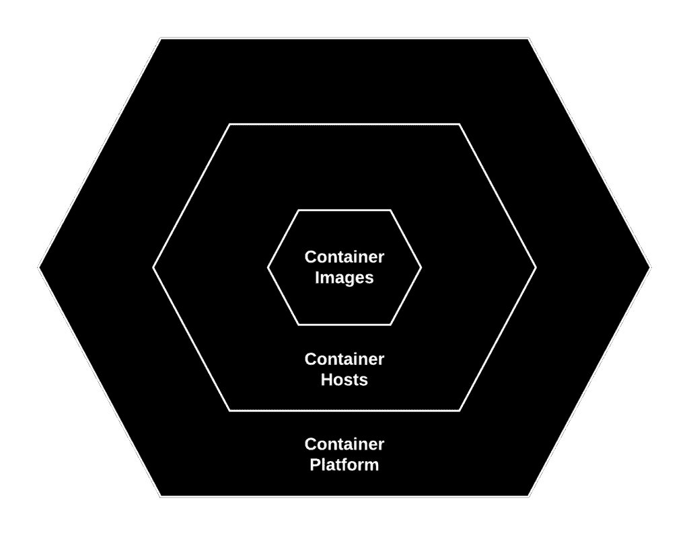

# 集装箱纵深防御

> 原文：<https://thenewstack.io/container-defense-depth/>

这篇文章是我们将从演讲者那里收集的一系列介绍性文章中的第一篇

[To the Cloud and Beyond](http://cloudnativecomputing.softwarecircus.io/)

，这是一个为期三天的关于云计算的精彩会议

[Software Circus](https://twitter.com/softwarecircus)

集体研讨会，8 月 31 日至 9 月 2 日在阿姆斯特丹举行。

基于图像的容器的新时代在 2013 年初至年中出现。自从 Docker 容器引擎的早期，我们就听到了它们是否足够安全的问题。我们自己的丹·沃尔什多次被听到说，“ [Docker 容器不包含](https://opensource.com/business/14/7/docker-security-selinux)”——所以问题是，我们能安全地使用它们吗？尤其是生产方面？

嗯，容器实际上只是[花哨的文件和花哨的过程](https://docs.google.com/presentation/d/139_dxpiYc5JR8yKAP8pl-FcZmOFQCuV8RyDxZqOOcVE/edit#slide=id.gc6f90357f_0_13)，这意味着我们现有的几乎所有信息保证技术都适用于容器。事实上，我们今天拥有的许多工具可以更有效地应用于容器。如果我们可以对我们的建筑师大脑进行一点重新编程，我们就可以将我们今天所知道的很多东西应用到容器上。

让我们从思考集装箱化环境中的控制点开始。生产容器环境有三个主要组件。我们可以在每一层控制[信息流](https://en.wikipedia.org/wiki/Information_flow_%28information_theory%29)。

容器环境的三个层次。

## 容器/图像

从中心开始，我们从容器图像本身开始。容器图像由以下部分组成:

*   操作系统二进制文件
*   操作系统库
*   语言运行时(Java、PHP、Ruby)
*   中间件(消息总线、应用服务器)
*   数据库、数据存储
*   开发者代码

 [斯科特·麦卡蒂

在 Red Hat，Scott McCarty 帮助教育 IT 专业人员、客户和合作伙伴有关 Linux 容器的所有方面，从组织转换到技术实现，并致力于推进 Red Hat 围绕容器和相关技术的走向市场战略。他还与产品和上游项目级别的工程团队保持联系，通过使用来自 Red Hat 客户和合作伙伴的反馈来帮助推动创新，从而为企业 IT 的真实世界增强和定制容器特性和功能。](http://www.redhat.com) 

我们当前的运营模式已经通过物理服务器和虚拟服务器控制了此类内容的流动，而且实际上也很容易应用于容器映像。我们可以利用和应用以下技术:

*   可信内容(容器中的内容很重要。不要从 hackme.com 安装。)
*   内容出处(跟踪谁更改了什么。)
*   安全扫描
*   补救/修补
*   材料清单
*   CVE 数据库
*   安全响应小组
*   限制根访问(不要过度推销用户名称空间。)
*   限制用户访问(谁控制内容。)

容器增加了轻松应用技术的能力，例如:

*   材料清单
*   签署
*   只读容器(只读服务器在 90 年代后期很流行。)
*   Atomic diff/Docker diff 查看容器中发生了什么变化。

## 容器主机

搬出一个戒指，交给容器主人。许多这些技术，我们今天都在应用。

*   内核质量
*   能力
*   只读图像
*   限制 ssh 访问(root 访问和用户)
*   很好理解/控制的配置([云初始化](https://cloudinit.readthedocs.io/en/latest/)，Ansible)
*   租用

由于容器只是具有良好控制的用户空间的花哨进程，因此更容易应用如下技术:

*   [SECCOMP](https://en.wikipedia.org/wiki/Seccomp)
*   [李倩](http://crunchtools.com/securing-docker-svirt/)
*   强化:NO_NEW_PRIVS，只读图像，–cap-drop = ALL，–user = user

## 集装箱平台

容器平台层是我们希望控制最终用户甚至管理员访问的地方。这一层存在于物理和虚拟服务器中，但通常是管理员专用的工具，如 vCenter 或 HPSA。在容器的世界中，将一些访问权委托给开发人员、架构师和应用程序所有者要常见得多。

*   基于角色的授权
*   认证(LDAP，对平台的网络级访问/限制)
*   环境隔离(开发、测试、生产)
*   用户分界( [kubectl exec](http://kubernetes.io/docs/user-guide/kubectl-overview/) )
*   网络分离
*   密钥管理

## 结论

我们今天所知道的关于信息保障和计算机安全的许多知识都可以应用于集装箱化的环境中。我们之前尝试过的一些安全技术(只读服务器、tripwire 等)很难在虚拟机上使用，但在容器上就变得简单了。容器不包含内容，但是良好的技术控制可以使[容器比常规流程](http://crunchtools.com/container-myths-redux/)更加安全——信息保证技术需要在各层中得到周到的应用。

来加入我的软件马戏团，让我们深入讨论容器防御。我将详细阐述上述概念，目的是让与会者能够在自己的环境中应用这些信息保证技术。

[Docker](https://www.mirantis.com/software/docker/kubernetes/) 和 [Red Hat](https://www.openshift.com/) 是新堆栈的赞助商。

由 [Aron Van de Pol](https://unsplash.com/@aronvandepol) 、[通过](https://unsplash.com/?photo=hXOGHaGCtdA) Unsplash 拍摄的特征图像。

<svg xmlns:xlink="http://www.w3.org/1999/xlink" viewBox="0 0 68 31" version="1.1"><title>Group</title> <desc>Created with Sketch.</desc></svg>