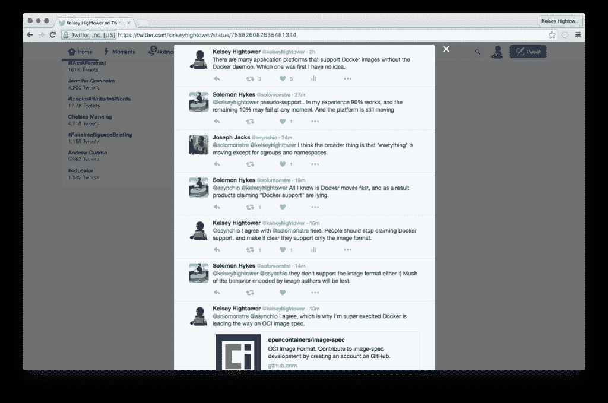
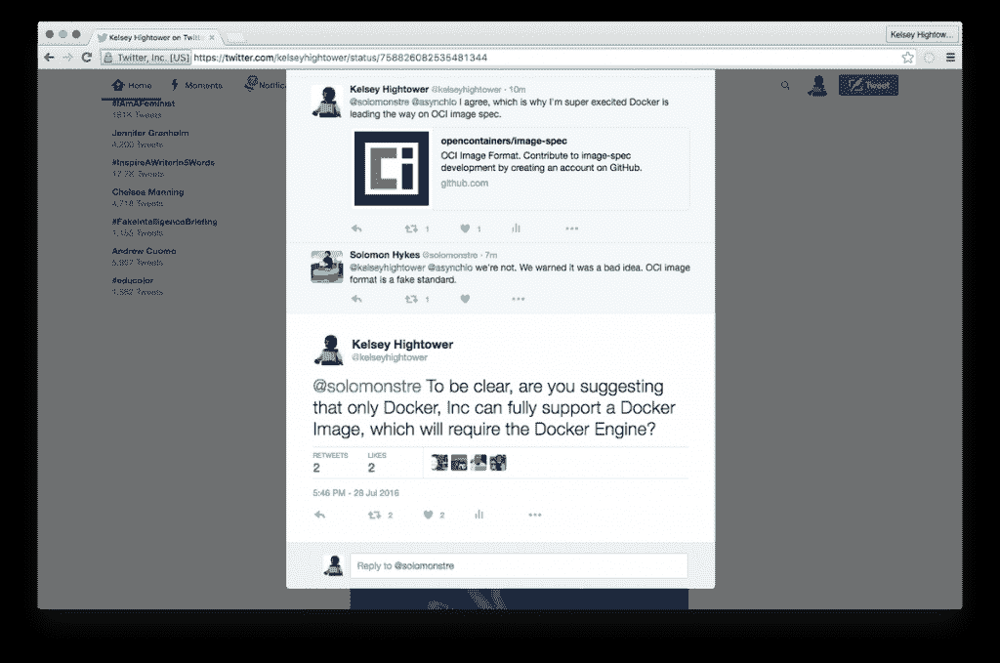
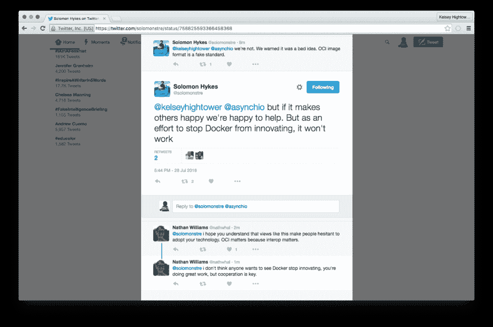
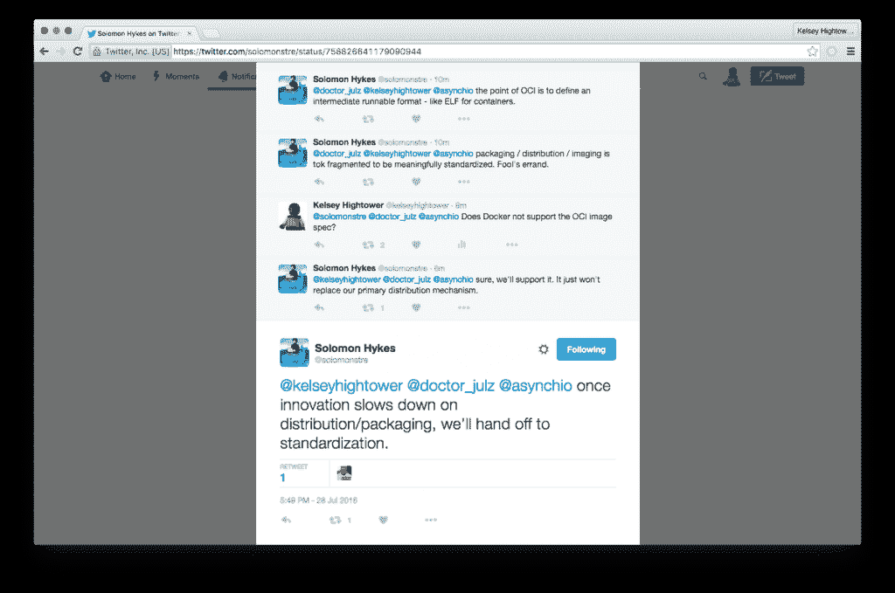

# Twitter 上的容器格式争议显示了 Docker 和社区之间的差异

> 原文：<https://thenewstack.io/container-format-dispute-twitter-shows-disparities-docker-community/>

Docker 容器图像格式应该完全标准化吗？或者 Docker 不应该在开放规范之前发展这种格式吗？这是上周谷歌传道者凯尔西·海托华和 Docker 的创造者 T2·所罗门·海克斯在推特上激烈争论的话题。

Hightower 希望看到 Docker 格式图像被完全标准化，这样包括 Docker 在内的公司就可以在规范的基础上构建额外的功能。然而，Hykes 拒绝完全标准化，声称这种格式仍然太新，发展太快。

争论的中心是 Docker 应该向[开放容器倡议](https://www.opencontainers.org/) (OCI)，和[一个建立厂商中立的容器映像和运行时规范的倡议](https://thenewstack.io/oci-reveals-governance-structure-amid-debate-focus/)贡献多少它的容器技术。图像是包，或者容器本身，用户可以用他们的应用程序填充它。运行时是运行容器的引擎，提供底层操作系统的所有支持。

上周 Apache Mesos 版本 1 的[发布似乎引发了一场辩论，当时 Hightower 在评论该发布时，想知道哪家公司是第一个发布可以运行 Docker 容器的第三方软件的公司(Joyent 是，](https://thenewstack.io/six-years-later-mesos-makes-version-1-0-now-real-fun-begins/)[他后来报道了](https://twitter.com/kelseyhightower/status/758691901549662208))。

理想情况下，他通过 Twitter 提出，运行容器映像[不应该局限于](https://twitter.com/kelseyhightower/status/758693561432846337)任何特定的运行时。他写道:“Docker 图像格式已经成为容器空间中的一个伟大的统一者，但只有当它们可以在任何地方运行时，才能发挥其最大潜力。”

Hykes 随后在一系列推文中插话说，任何声称支持 Docker 容器格式的第三方公司都只提供全部功能的子集，依赖这些第三方应用程序的用户可能会丢失一些功能。

Hykes 还认为 OCI 容器格式是“伪标准”，充其量只能作为一种中间格式。对于 Hightower 来说，这是一个令人惊讶的承认，因为迄今为止，Docker 一直支持 OCI 的工作，而[也一直公开](https://www.docker.com/docker-news-and-press/industry-leaders-unite-create-project-open-container-standards)这样做。但 Hykes 认为，Docker 对 Docker 格式的迭代如此之快，以至于标准化工作会减缓创新。

【T2

这个回复似乎让 Hightower 失望了，“我会一直称赞 Docker 将容器带给大众，但我担心一个人想要这么多的控制权，”他在推特交流后写道。

问题是基于 Docker 构建的第三方供应商只能使用不完整的标准。

“当时，大多数人试图在 Docker 的基础上进行构建，他们不一定具备所有这些功能，如服务发现、集群管理。很多东西都不在那里。在那个时候，我感觉 Docker 是一个公分母，”Hightower 在随后的采访中说。"所有有趣的东西都将建在上面."

尽管 Hightower 在 Twitter 上声明他并不代表他的雇主谷歌说话，他在谷歌是许多谷歌开源技术的传播者，包括 [Go 语言](/tag/golang/)和 [Kubernetes](/category/kubernetes/) ，这是一个支持 Docker 格式的容器编排工具。谷歌发布 Kubernetes 是为了鼓励使用容器的大规模工作，部分是为了[鼓励使用](https://thenewstack.io/google-container-engine-is-the-product-version-of-kubernetes-and-its-now-live/)谷歌自有的基于 Kubernetes 的基于容器的云平台。

Cloudcast 主持人[Brian gracey](https://twitter.com/bgracely)在这一集中警告说，如果 Docker 过于紧密地控制图像，它很可能类似于 VMware 对其虚拟机格式的控制，限制第三方供应商仅提供辅助工具。在[开放虚拟化格式](http://www.dmtf.org/standards/ovf) (OVF)中，已经做了一些工作来标准化 VM 格式，尽管到目前为止它还没有被广泛部署。

Hightower 在播客中说:“我们要求每个人都将他们的应用程序打包，之所以没有其他平台试图建立他们的图像规范或容器运行时，是因为我们相信 Docker 和 OCI 将是我们可以团结起来的东西。”。“如果我们只能达到 90 %,那么这就开启了一个不同的对话，关于我们要用那 10%做什么，那 10%是什么。”

这种不确定性可能对容器格式不利，企业采用容器格式[似乎已经停滞](https://thenewstack.io/parity-check-container-reality-check/)。

这不是一个新问题。甚至在去年，CoreOS 首席执行官 Alex Polvi 就曾公开担心 OCI 图像规范的定义过于狭隘。今年早些时候在 OSCON 录制的 TNS 播客中，红帽首席软件工程师 Vincent Batts 也讨论了这个问题。

[采访红帽公司文森特·巴茨谈开放集装箱倡议](https://thenewstack.simplecast.com/episodes/interview-with-red-hats-vincent-batts-about-the-open-container-initiative)

Docker 没有立即对此事做出回应。

科洛斯、[码头工人](https://www.mirantis.com/software/docker/kubernetes/)和[红帽](https://www.openshift.com/)是新堆栈的赞助商。

通过 Pixabay 的特征图像。

<svg xmlns:xlink="http://www.w3.org/1999/xlink" viewBox="0 0 68 31" version="1.1"><title>Group</title> <desc>Created with Sketch.</desc></svg>