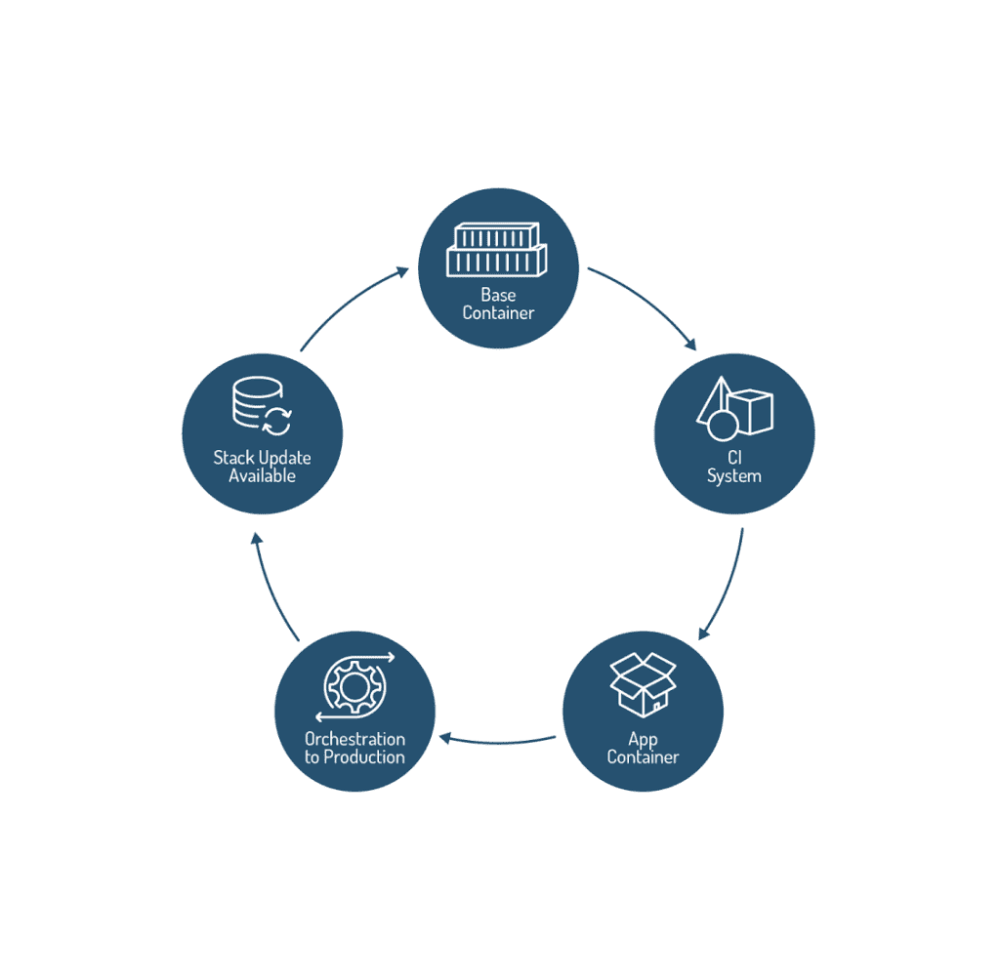

# 容器生命周期管理，第一部分:不是你父亲的虚拟机

> 原文：<https://thenewstack.io/container-lifecycle-management-part-one-not-fathers-vms/>

 [大卫·丹尼斯

大卫是比特纳米公司的技术营销副总裁。在加入 Bitnami 之前，David 曾在 foundation Open Source、Levanta、Mercury Interactive、Hewlett-Packard 和 Symantec 担任产品管理、技术营销和产品开发领导职务。](https://bitnami.com/) 

正是在圣克拉拉开放集装箱之夜会议的最后问答环节，我们在一个地方听到了关于如何管理生产或规模化集装箱的最集中的问题:

*“我如何处理安全令牌？”*

*“对于容器，什么是好的备份或灾难恢复策略？”*

*“我们正在研究使用容器，但对于现有的应用来说，这似乎是一个麻烦。”*

*“我们正在使用 Chef 将更新部署到容器中，但是效果不是很好……有什么好的替代方案吗？”*

我们不得不自己处理这些问题。

具体来说，这是一个挤满了 200 到 300 名 IT 和 DevOps 专业人员的房间，其中许多人在硅谷的知名公司工作，他们在 2 月份一个下雨的周二晚上花时间聆听关于容器的讨论，直到晚上。换句话说，这是一群经验丰富的专业人士，他们通常了解自己的工作。

然而，总的来说，关于如何在生产中管理容器，尤其是围绕系统架构和容器生命周期管理，混乱多于清晰。

这是怎么回事？

Bitnami 已经[通过创建、更新和管理超过 137，000 个独特的云和虚拟机映像](https://thenewstack.io/qa-erica-brescia-bitnami/)(以及使其高效的技术和流程)开展了业务，现在正在为容器做同样的事情。我们必须为观众提出的许多同样的问题找到答案。在基于容器的堆栈架构、打包和更新领域尤其如此，这是我们的核心竞争力。

[与比特纳米的埃里卡·布雷西亚](https://thenewstack.simplecast.com/episodes/a-talk-with-bitnamis-erica-brescia)的谈话

简而言之，许多已经成为虚拟机生命周期管理(无论是在内部还是在云中)最佳实践的过程、心智模型和技术工具在应用于容器时都是反模式的。

这将是一个由两部分组成的系列。在第一部分中，我们将阐述虚拟机和容器生命周期管理之间的一些重要区别。在第二部分中，我们将深入探讨一些特定的技术，我们开发这些技术是为了帮助简化容器应用程序的管理和更新。

## 容器不仅仅是更精简、更好的虚拟机

是的，容器倾向于比虚拟机更小更高效，主要是通过去除多余和重复的操作系统特性和功能。

虽然也有极简的 Linux 版本，基于云的虚拟机越来越小，越来越便宜(例如亚马逊的 T2。纳米实例)，无论虚拟机变得多小，这两者之间仍存在基本的架构差异:

当涉及到应用程序架构和生命周期管理时，这些差异的重要性经常被低估。

最初围绕虚拟机构建的应用程序不会简单地通过在容器中实现而自动变得具有 web 规模和弹性。如果通过永久存储实现，状态或配置信息可能会成为一个问题。

同样，在管理虚拟基础架构的 5-10 年中形成的生命周期、变更和配置管理技术和习惯也需要重新审视。考虑到容器短暂的本质，通过 Chef 或 Puppet 之类的工具向容器部署更新通常没有多大意义。

但是现在，我们遇到了一个工具和流程问题:大多数五年以上的组织都有根深蒂固的习惯、工具(Chef、Puppet、CFEngine、Red Hat Satellite、几个 VMware 产品等。)，培训和流程(ITIL 有人吗？)专为管理虚拟机而设计。试图将以虚拟机为中心的管理工具和流程强行安装到容器中可能会带来巨大的负面影响。

然而，相当一部分 IT 专业人员似乎没有使用任何自动化构建，这通常被认为是基于容器的开发运维的关键。在 2016 年 5 月 Bitnami 用户调查的数据中，3，589 名受访者中超过 50%的人报告说他们不使用自动化构建或 CI/CD 工具(36%的人“无”+27%的人“手动”)，很可能这些受访者要么手动做事(如果他们的容器使用规模较小，这种可能性更大)，要么使用传统的以服务器为中心的部署工具(如果容器使用规模较大，这种可能性更大)。

## 走向不变性

因此，如果服务器生命周期模型(虚拟的或物理的)及其相关的工具和流程不太适合基于容器的应用程序，那么替代方案会是什么样的呢？

[这对一些读者来说可能是补救性的，但对那些刚刚开始使用容器的人来说可能是新的信息。]

在围绕 CI 系统(如 Jenkins)和编排系统(如 Kubernetes 或 Mesos)构建的规范容器原生应用程序中，生命周期遵循类似于下图的模式:

1.  首先创建一个基本容器定义(Dockerfile ),包含最少的 OS、运行时、框架和应用程序组件。

2.  接下来，这被推送到 CI 系统。一旦它被清除(变为绿色)，应用程序容器就可以构建了。

3.  构建应用程序容器，包括任何需要添加的定制代码。

4.  应用程序容器被推送到编排系统，然后在集群中复制，以实现弹性、可伸缩性和滚动更新(下面将详细介绍)。

5.  当有新的容器更新可用时，不会修补任何东西。这是与虚拟机管理的一个关键区别。相反，会创建一个全新的、更新的容器。这将通过上述步骤继续进行，但这一次，当到达编排系统时，将应用滚动更新—群集中较旧的容器将被杀死，并由较新的版本替换。

按照这种模式，应用程序可以实现不变性，当转换成经典的 IT 运营术语时，相当于大大减少了停机时间和维护窗口。

听起来很棒，对吧？

## 寒武纪大爆发问题

当容器的种类相对较少时，上面描述的简单容器生命周期可以很好地扩展。

相比之下，在 Bitnami，我们有超过 137，000 个映像需要快速更新(Bitnami 目录中的所有应用程序 x 所有云供应商和本地下载，我们支持 x 数量的虚拟机实例大小)，因此这种多样性的爆炸是我们必须解决的问题。在撰写本文时，并不是所有的 Bitnami 应用程序都可以在容器中使用，但是很快就可以了。

现在你可能会想，“好吧，我不用担心这个，我们永远不会有那么多图像需要担心，”你可能是对的。但是如果你真的想以一种主要的方式使用容器，你可以很容易地找到几百甚至一千种变体:

这只是独特的图像——现在考虑在不同的修订级别保持它们的更新。

## 关键要点

在下一篇文章中，我们将详细探讨 Stacksmith，这是 Bitnami 开发的一项服务，用于帮助大规模自动化堆栈更新。

但同时，如果您开始认真考虑在生产中使用容器，请记住以下几点:

1.  容器不仅仅是更好的虚拟机。有一些重要的架构差异(存储、安全性)会影响应用程序的开发方式以及在生产中的管理方式。您可能需要让您的团队了解这些差异，以避免代价高昂的失误。

2.  遗留应用程序可能需要重新架构(全部或部分),以真正受益于微服务架构所承诺的敏捷性、可伸缩性和弹性的提高。简单地将一个应用程序(或其组件)塞进一个容器并不能神奇地让这些事情发生。

3.  您现有的更新和部署虚拟机的过程、习惯和工具可能不太适合容器。如果您计划在任何大规模的生产中使用容器，是时候开始研究替代工具了。

4.  手动创建和更新容器可能在小范围内有效，但是随着容器使用量的增加，图像的多样性及其变化率可能会成为瓶颈，限制您跟上关键安全性和堆栈更新的能力。这可能会使您的系统容易受到攻击，或者无法以市场要求的方式修复漏洞。规划增长并评估自动化容器创建和堆栈更新的方法。

[https://www.youtube.com/embed/m1Vqf0Q4nKk?feature=oembed](https://www.youtube.com/embed/m1Vqf0Q4nKk?feature=oembed)

视频

Bitnami 是新堆栈的赞助商。

专题图片:1934 年在法比安尼卡图[通过](http://nos.twnsnd.co/image/144705398794)新老库存的无线电房控制室。

<svg xmlns:xlink="http://www.w3.org/1999/xlink" viewBox="0 0 68 31" version="1.1"><title>Group</title> <desc>Created with Sketch.</desc></svg>