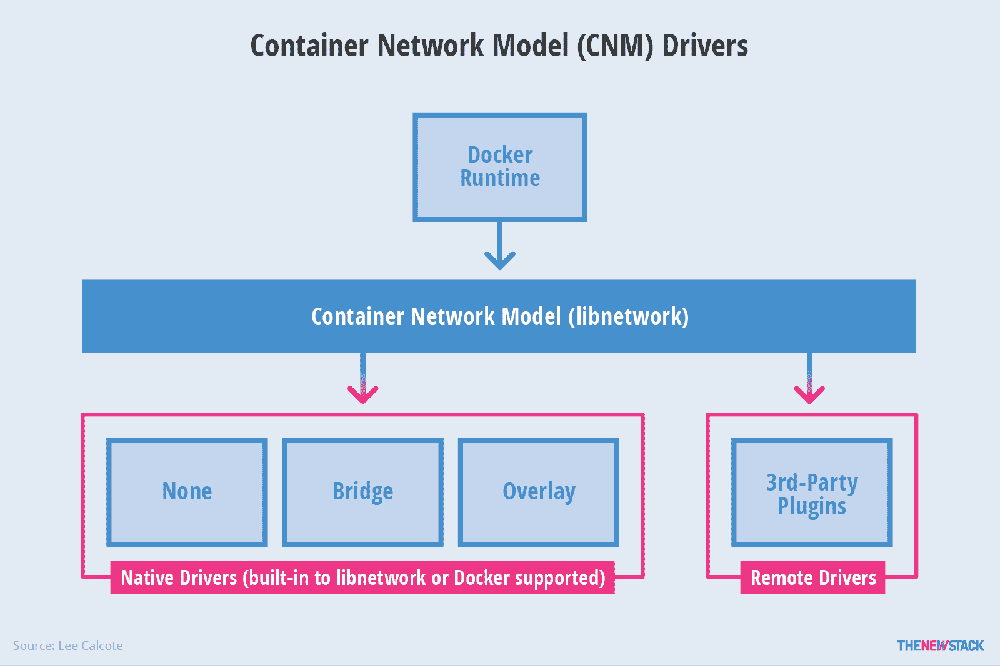
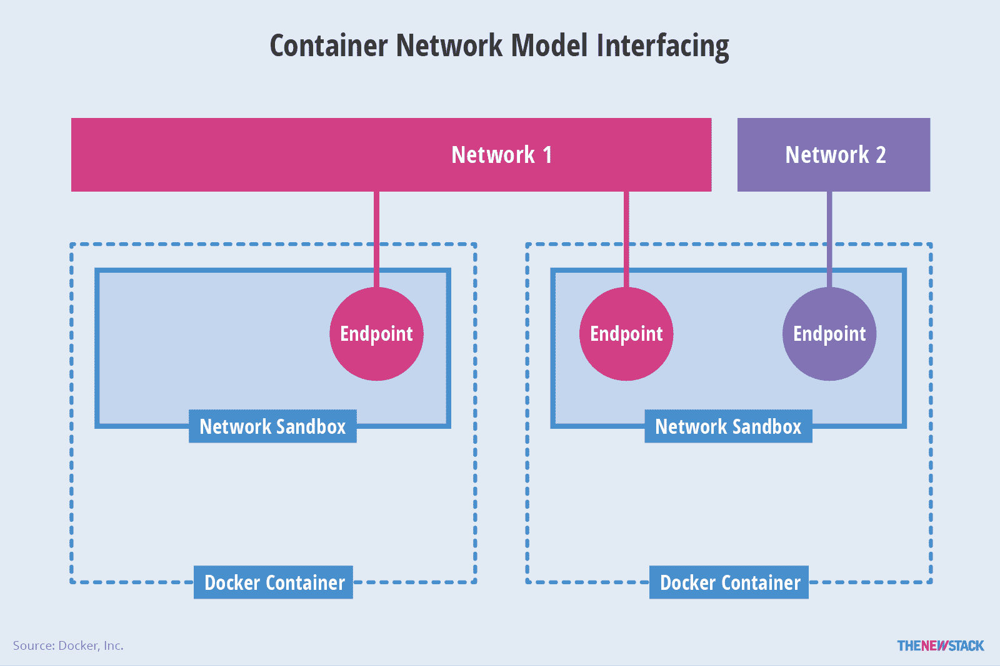
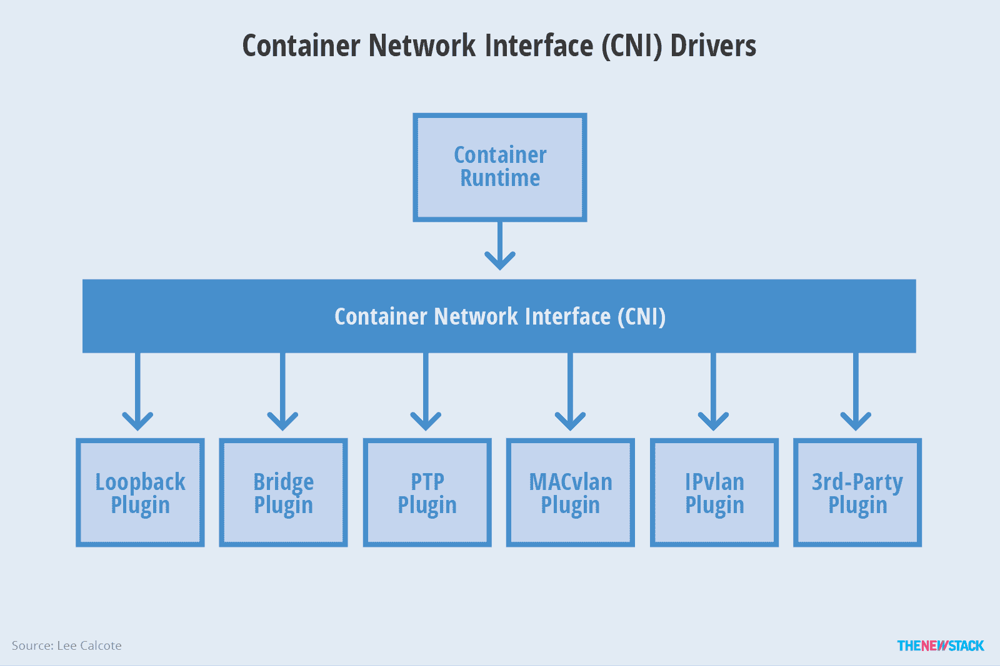

# 集装箱网络景观:来自 CoreOS 的 CNI 和来自 Docker 的 CNM

> 原文：<https://thenewstack.io/container-networking-landscape-cni-coreos-cnm-docker/>

[Lee Calcote](http://blog.gingergeek.com/about)

[Lee Calcote 是一位创新的思想领袖，热衷于开发面向云、容器、基础设施和应用的平台和管理软件。在 Seagate、Cisco 和 Pelco 任职期间，Calcote 始终关注先进和新兴技术。他是技术聚会和会议的组织者、作家、作者和演讲者，在技术社区非常活跃。](http://blog.gingergeek.com/about)

为 Linux 容器配置网络接口有两个推荐的标准:容器网络模型(CNM)和容器网络接口(CNI)。网络是复杂的，有许多方法可以提供功能。可以争论哪一个比下一个更容易采用，或者哪一个更少地依赖于他们资助者的技术。

在评估任何技术时，一些重要的考虑因素是社区采用和支持。对于哪种模式进入门槛较低，已经形成了一些观点。找到正确的度量标准来确定项目的速度是很棘手的。插件供应商还需要考虑为这两种模型编写插件的相对容易程度。

## 集装箱网络模型

[容器网络模型](https://github.com/docker/libnetwork/blob/master/docs/design.md) (CNM)是 Docker 提出的规范，被 [libnetwork](https://github.com/docker/libnetwork/blob/master/docs/design.md) 等项目采用，集成了[思科 Contiv](http://contiv.github.io/) 、 [Kuryr](https://wiki.openstack.org/wiki/Kuryr) 、开放虚拟网络(OVN)、 [Project Calico](https://www.projectcalico.org) 、 [VMware](https://github.com/vmware/docker-volume-vsphere) 和 [Weave](https://github.com/weaveworks/weave) 等项目和公司。

图 1: Libnetwork 提供了 Docker 守护进程和网络驱动程序之间的接口。

Libnetwork 是 CNM 规范的规范实现。Libnetwork 提供了 Docker 守护进程和网络驱动程序之间的接口。网络控制器负责将驱动程序与网络配对。每个驱动程序负责管理其拥有的网络，包括提供给该网络的服务，如 IPAM。由于每个网络一个驱动程序，多个驱动程序可以与连接到多个网络的容器同时使用。驱动程序被定义为本地的(内置于 libnetwork 或 Docker 支持的)或远程的(第三方插件)。本机驱动程序有 none、bridge、overlay 和 MACvlan。远程驱动程序可以带来许多功能。驱动程序还被定义为具有本地范围(单主机)或全局范围(多主机)。

图 2:通过一系列网络端点连接的容器。

*   **网络沙箱:**本质上是容器内的网络堆栈，它是一个包含容器网络配置的隔离环境。
*   **端点:**通常成对出现的网络接口。该对的一端位于网络沙箱中，而另一端位于指定的网络中。端点只加入一个网络，并且多个端点可以存在于单个网络沙箱中。
*   **网络**:一组端点。网络是一组可以相互通信的唯一可识别的端点。

最后一组灵活的 CNM 结构是**选项**和**标签**(元数据的键值对)。CNM 支持用户定义的**标签**(使用——label 标志定义)，它们作为元数据在 libnetwork 和驱动程序之间传递。标签是强大的，因为运行时可以通知驱动程序的行为。

## 集装箱网络接口

[容器网络接口](https://github.com/containernetworking/cni) (CNI)是由 [CoreOS](https://thenewstack.io/say-goodbye-to-coreos/) 提出的容器组网规范，被 [Apache Mesos](https://github.com/apache/mesos/blob/master/docs/cni.md) 、 [Cloud Foundry](https://github.com/cloudfoundry-incubator/guardian-cni-adapter) 、 [Kubernetes](http://kubernetes.io/docs/admin/network-plugins/) 、 Kurma、 [rkt](https://coreos.com/blog/rkt-cni-networking.html) 等项目采用。还有 [Contiv Networking](https://github.com/contiv/netplugin) 、 [Project Calico](https://github.com/projectcalico/calico-cni) 、、 Weave 等项目创建的插件。

图 3: CNI 是向网络添加和移除容器的最小规范。

CNI 是作为一个最小规范创建的，与许多网络供应商工程师一起构建，是容器运行时和网络插件之间的一个简单契约。JSON 模式定义了 CNI 网络插件的预期输入和输出。

多个插件可以同时运行，一个容器加入由不同插件驱动的网络。网络在配置文件中以 JSON 格式描述，并在调用 CNI 插件时被实例化为新的名称空间。CNI 插件支持在网络中添加和删除容器网络接口的两个命令。Add 在创建容器时被容器运行时调用。当删除容器实例时，容器运行时会调用 Delete。

### CNI 流

容器运行时需要首先给容器分配一个网络名称空间，并给它分配一个容器 ID，然后将一些参数(CNI 配置)传递给网络驱动程序。然后，网络驱动程序将容器连接到网络，并通过 JSON 将分配的 IP 地址报告给容器运行时。

[cyclone slider id = " ebook-4-赞助商"]

Mesos 是添加 CNI 支持的最新项目，并且有一个 Cloud Foundry 实现正在进行中。Mesos 网络的当前状态使用主机网络，其中容器与主机共享相同的 IP 地址。Mesos 希望为每个容器提供自己的网络名称空间，从而提供自己的 IP 地址。该项目正在转向每个集装箱一个 IP 的模式，并在这样做的过程中，寻求使网络民主化，以便运营商可以自由选择最适合其目的的网络类型。

目前，CNI 原语处理 IPAM、L2 和 L3，并期望容器运行时处理端口映射(L4)。从 Mesos 的角度来看，这种极简方法有几个注意事项，其中之一是 CNI 规范没有指定任何用于容器的端口映射规则；这种能力可以由容器运行时来处理。第二个警告是，虽然应该允许操作者改变 CNI 配置，但是规范中没有考虑当 CNI 配置被修改时容器操作的行为。Mesos 通过确保在重启 CNI 代理时，当 CNI 配置与容器的特定实例相关联时，它们将检查该配置来解决这种模糊性。

## CNI 和 CNM

在许多方面，这两个容器网络规范使得可以使用哪种类型的容器网络的选择民主化，因为两者都是基于驱动程序的模型，或基于插件的模型，用于创建和管理容器的网络栈。每个都允许多个网络驱动程序处于活动状态并被并发使用，因为每个都提供了网络到该网络驱动程序的一对一映射。两种模式都允许容器加入一个或多个网络。并且每一个都允许容器运行时在它自己的名称空间中启动网络，将把容器连接到网络的应用/业务逻辑隔离到网络驱动器。

这种模块化驱动程序方法对网络运营商比对应用程序开发者更有吸引力，因为运营商可以灵活地选择一个或多个满足其特定需求并适合其现有操作模式的驱动程序。运营商有责任确保满足服务水平协议(SLA ),并实施安全策略。

这两种模型都为网络驱动程序提供了独立的扩展点，即插件接口，以创建、配置和连接网络，并为 IPAM 提供配置、发现和管理 IP 地址的功能。每个函数一个扩展点鼓励可组合性。

CNM 不提供网络驱动程序对容器的网络名称空间的访问。这里的好处是 libnetwork 充当了冲突解决的代理。例如，当两个独立的网络驱动程序使用相同的路由前缀提供相同的静态路由，但指向不同的下一跳 IP 地址时，就会发生冲突。CNI 确实为驱动程序提供了对容器网络名称空间的访问。CNI 正在考虑在这种冲突解决方案中如何进行仲裁。

CNI 支持与第三方 IPAM 的集成，可以用于任何容器运行时。CNM 只支持 Docker 运行时引擎。根据 CNI 的简单方法，有人认为创建一个 CNI 插件比创建一个 CNM 插件相对容易。

这些模型通过由提供高级网络功能的第三方供应商培育创新生态系统来促进模块化、可组合性和选择性。网络微分段的编排可以变成简单的 API 调用来连接、分离和交换网络。接口容器可以属于多个网络，每个容器可以在不同的网络中发布不同的服务。将不同的网络结构视为一等公民的想法反映在从旧容器中分离网络服务并将其附加到新容器的能力中。

## 摘要

随着供应商和项目的不断发展，网络格局也在不断变化。一些产品已经合并或合并，如 Docker 收购 SocketPlane，以及法兰绒向 [Tigera](https://thenewstack.io/project-calico-flannel-join-forces-policy-secured-networking/) 的过渡——一家围绕运河形成的新创业公司[。运河是印花布和法兰绒的组合，是这两个项目的结合。CoreOS 将作为一个单独的项目为法兰绒提供持续的支持，并将 Canal 与他们为 Kubernetes 提供的企业解决方案——大地构造相集成。其他变化以新项目发布的形式出现。Docker 1.12 发布的网络特性，包括 underlay 和负载平衡支持，对该项目来说是一个不小的进步。](https://thenewstack.io/project-calico-flannel-join-forces-policy-secured-networking/)

虽然有大量的容器网络技术和非常独特的方法来实现它们，但我们很幸运，因为容器生态系统的大部分似乎都集中在两种网络模型上，并围绕这两种模型构建支持，至少目前是这样。开发人员希望消除集装箱化环境中的手动网络供应，除非那些对自己的工作不安全有误解的人，否则网络工程师也准备这样做。

与其他资源一样，自动配置的中间步骤是预配置，这意味着网络工程师将为网络预分配指定的特征和服务，如 IP 地址空间、IPAM、路由、QoS 等。，开发人员或部署工程师将从可用网络池中识别和选择部署他们的应用程序。预配置需要成为过去，因为我们都准备好转向自动化配置。

<svg xmlns:xlink="http://www.w3.org/1999/xlink" viewBox="0 0 68 31" version="1.1"><title>Group</title> <desc>Created with Sketch.</desc></svg>