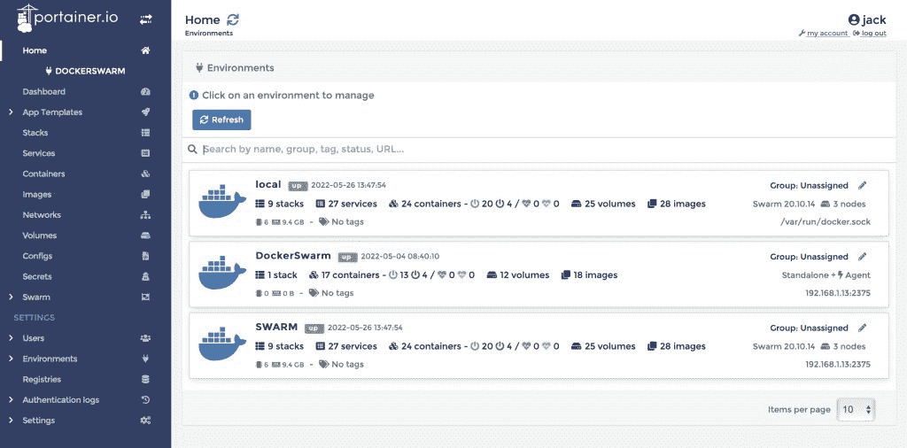
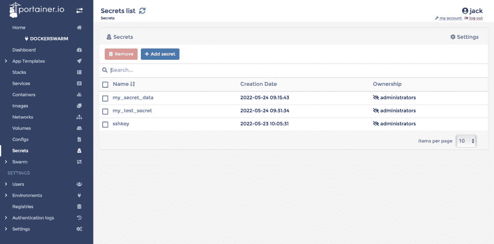
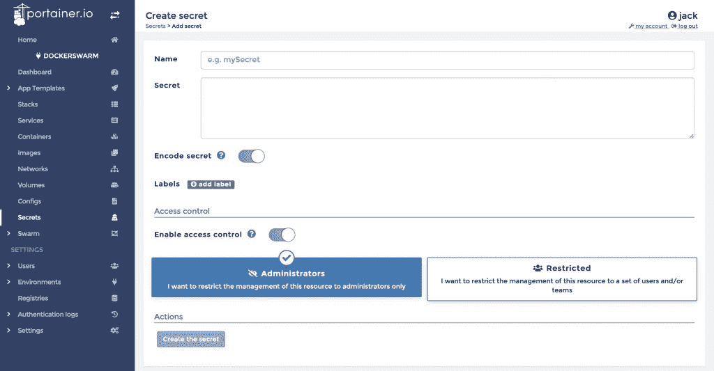
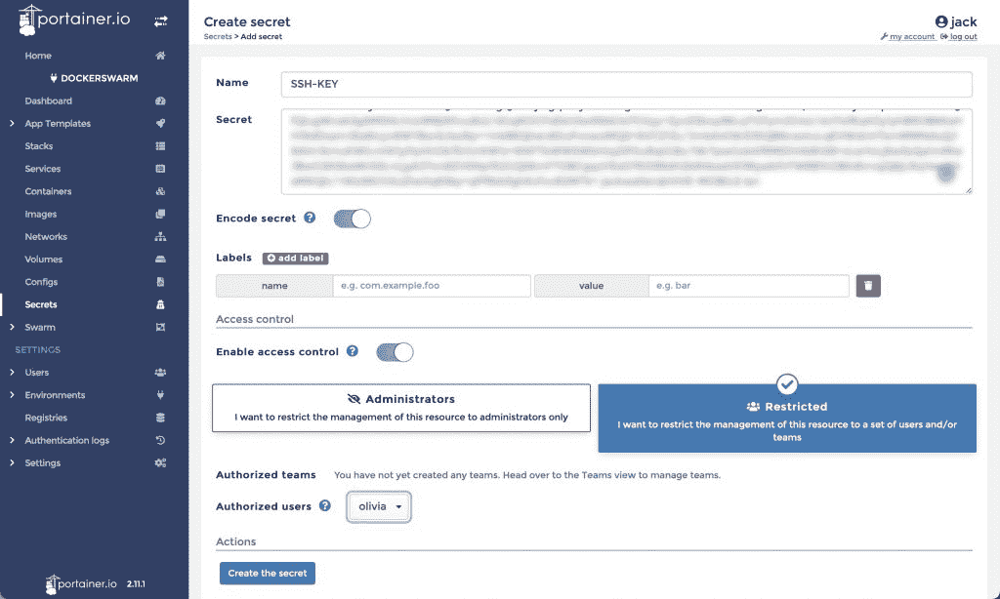
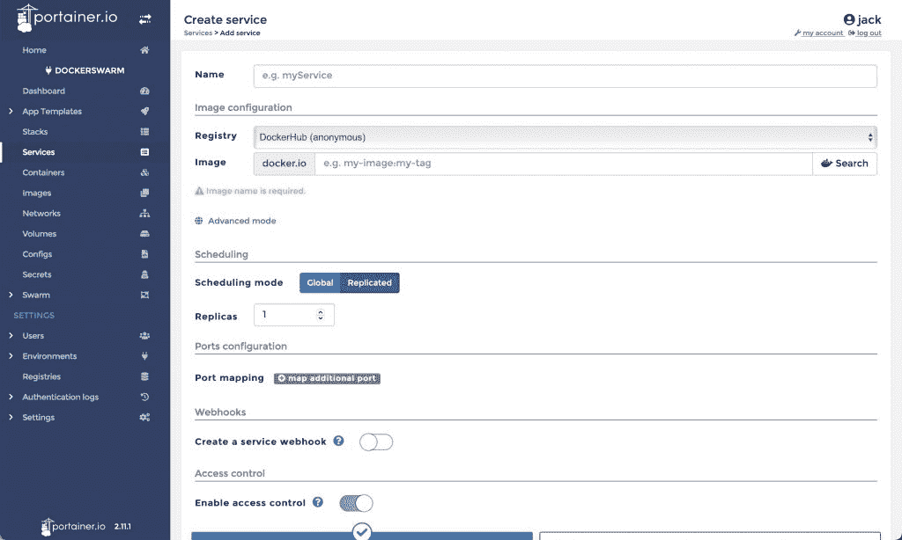
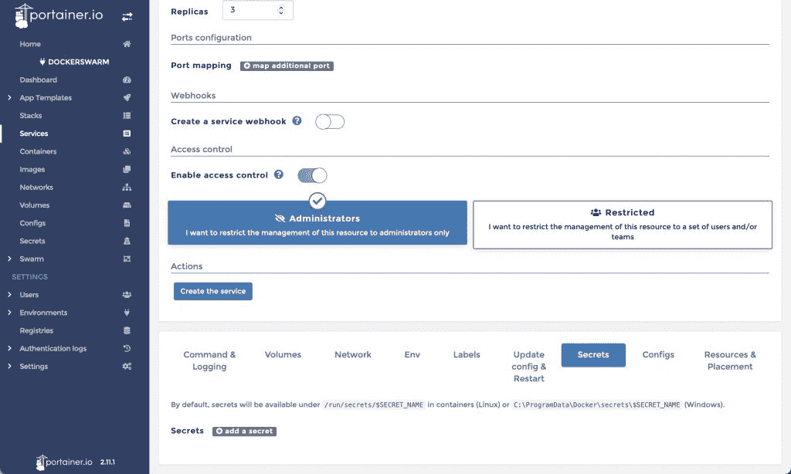
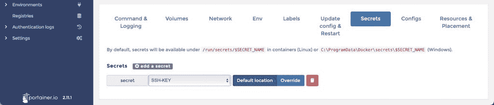
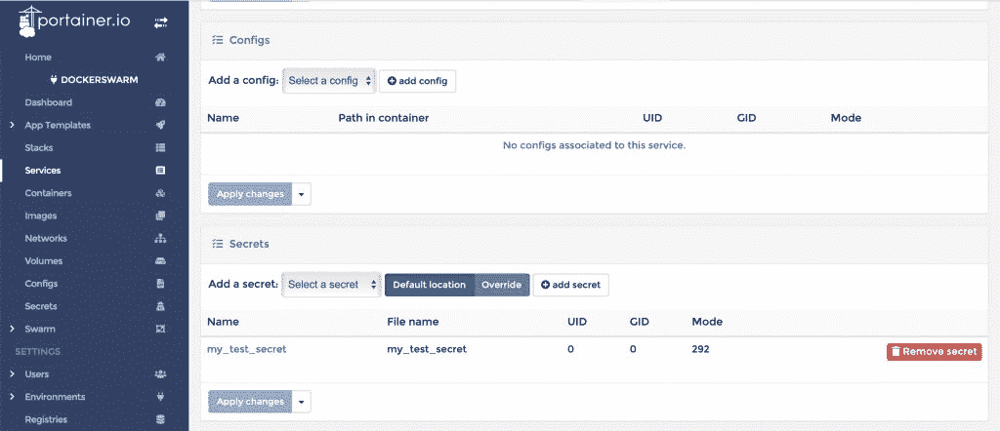

# 容器安全:用 Portainer 管理秘密

> 原文：<https://thenewstack.io/container-security-manage-secrets-with-portainer/>

Portainer 是市场上最强大的 Docker(和 Docker Swarm)管理器之一。借助该工具，您可以创建和管理容器部署的各个方面，包括服务、网络、映像、注册表、[卷](https://thenewstack.io/how-to-create-and-use-container-volumes-within-portainer/)、配置、[堆栈](https://thenewstack.io/deploy-a-full-stack-application-with-portainer/)、编排，甚至机密的管理。

没错，你甚至可以为你的容器管理秘密。

秘密有什么大不了的？嗯，如果你没听说过，容器可能非常不安全。考虑到您将在部署中发现的移动部分的数量，以这样一种方式来开发和部署某些东西可能太容易了，即使没有 wells 也很容易获得对正在运行的容器或服务的访问，然后利用它们在其中找到的密码、证书和密钥。有了这些秘密(即密码、证书和密钥)，他们就可以使用它们来访问您的服务、API、帐户等等。

你不想那样。相信我。

为了避免这种情况，Docker 让开发人员能够以加密的形式[将他们的秘密](https://docs.docker.com/engine/swarm/secrets/)存储在服务之外，然后调用连接容器来连接秘密。这是防止敏感信息被窥探的更好方法。

你猜怎么着？Portainer 让秘密工作变得简单。事实上，我还没有遇到过更简单的管理/使用秘密的方法。我将向你展示如何做到这一点。

## 必需品

要使用 secrets，您需要一个 Portainer 的运行实例(我在“[Deploy Portainer for easy Container Management](https://thenewstack.io/deploy-portainer-for-easier-container-management/)”中解释了如何部署 Portainer)。需要注意的是，Portainer 必须运行在 Docker 群上，否则，你将无法访问 Secrets 选项。要了解如何在 Swam 模式下部署 Docker，请务必查看“[教程:使用 Portainer 管理 Docker Swarm】”](https://thenewstack.io/tutorial-manage-docker-swarm-with-portainer/)

Portainer 启动并运行后，您就可以创建您的第一个秘密了。

## 创造一个秘密

我们要做的第一件事是创建一个秘密。登录 Portainer，选择您的环境，点击左侧导航栏中的 Secrets(**图 1** ):

图 1:运行中的 Portainer 主页。

在出现的窗口中(**图 2** ，点击添加密码:

图 Portainer 中的秘密管理窗口。

在下一个窗口(**图 3** )中，给秘密取一个名称，将实际的秘密添加到秘密字段中，并且(如果您使用的是纯文本秘密)确保启用了编码秘密:

图 3:在 Portainer 中添加新的秘密。

如果您需要启用对密码的访问控制，您可以选择管理员(默认)或单击受限并选择您想要授予对新密码的访问权限的用户(**图 4** ):

图 4:限制特定用户对新秘密的访问。

在完全按照您的要求配置好密码后，单击创建密码，配置将被保存。

## 用你的新秘密

好吧，现在让我们使用这个新的秘密。为了说明这一点，我们将部署一个使用这个秘密的基本 Redis 服务。虽然这可能不是完美的例子，但这是一种简单的方法来展示如何做。

要创建服务，请点按左侧边栏中的“服务”,然后点按“添加服务”。在出现的窗口中(**图 5** ，首先填写服务的基本信息:

图 5:从 Portainer 中添加新服务。

填写以下信息:

*   名称—*保密测试*
*   image-*redis:alpine*

向下滚动，直到看到机密选项卡(**图 6** ):

图 Secrets 选项卡在高级配置选项中

点击 Add a secret，从下拉菜单(**图 7** )中选择您刚刚创建的新密码:

图 7:选择我们刚刚添加到 Portainer 的 SSH-KEY secret。

最后，单击 Create service，服务将会部署。然后您将返回到服务列表，在这里您将看到您的新服务已经部署。如果您点击 *redis-secret-test* 条目，您将看到该秘密已经成功附加到服务中(**图 8** ):

图 8:我们的服务已经被部署，秘密保持不变。

如果有人获得该服务的访问权限，他们将无法查看该秘密，因为它已被加密，无法查看。事实上，即使有人获得了对 Portainer 实例的访问权，他们也可以查看机密列表，但不能查看机密本身。

随着服务的部署，您还会注意到已经创建了一个容器。但是，您将不会找到一个列表，甚至无法从容器列表中访问这个秘密。

另一件要记住的事情是，如果一个秘密正在被一个正在运行的服务使用，你不能删除它。所以，如果你发现需要删除一个秘密，先删除服务，然后你就可以删除这个秘密了。

## 结论

如果你想添加秘密，并让它们对你的 Docker 服务和全栈应用可用，Portainer 是一个很好的工具，让这个过程变得非常容易。我强烈建议您在开发环境中启动 Portainer，并在使用这个过程进入生产环境之前练习创建和使用秘密。请记住，您的容器有许多活动的部分，所以您最不希望做的事情就是添加未加密的秘密，以使坏人很容易侵入您的部署。

<svg xmlns:xlink="http://www.w3.org/1999/xlink" viewBox="0 0 68 31" version="1.1"><title>Group</title> <desc>Created with Sketch.</desc></svg>