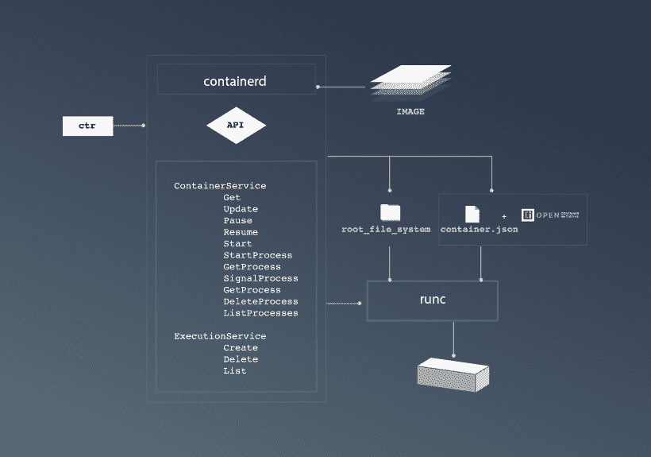

# Containerd 1.0 发行版成为容器的公众形象

> 原文：<https://thenewstack.io/containerd-1-0-release/>

在一个 OCI 标准集装箱内可能有多个操作部件，尽管目前有两个是最重要的。runccomponent 是 executive——使容器自身发挥功能的部分。谜题的第二部分， [containerd](http://containerd.io/) 充当“监督”容器生命周期的部分，并通过 API 调用与外界通信。

该功能可能会取代生产系统中持续存在完整容器引擎的需求，为 Kubernetes、Mesosphere DC/OS 和其他容器编排引擎扫清道路。

“有了 Docker 平台的下一个版本，开发者可以在他们的工作站上直接在 Kubernetes 上开发和测试应用，”[宣布 Docker Inc .的 Solomon Hykes 去年 10 月](https://blog.docker.com/2017/10/kubernetes-docker-platform-and-moby-project/) ( [Hykes 已经从首席技术官](https://thenewstack.io/solomon-hykes-changes-roles-docker/)晋升为副董事长)。“此外，运营部门可以获得 Docker 企业版的所有优势，包括安全的多租户、图像扫描和基于角色的访问控制，同时在生产环境中运行与 Kubernetes 或 Swarm 协调的应用。”

## 不再连接我们的引擎

尽管从那时起，基本上整个容器驱动的世界都在围绕配备 containerd 的结构构建平台，但直到 2017 年 12 月初，该项目才达到了必要的稳定性水平，使[Cloud Native Computing Foundation](https://www.cncf.io/)、[自去年 3 月以来的项目管理者](https://thenewstack.io/docker-donate-container-runtime-containerd-cloud-native-computing-foundation/)宣布该项目全面可用。

就在发布前几周，Docker 工程师 Stephen Day 向 DockerCon Europe 17 的与会者解释说，containerd 使 orchestrator 或 orchestrator 平台管理的插件组件能够有效地管理整个容器生命周期，而无需包含整个 Docker Engine 或其对应组件。Kubernetes 的工程师已经通过使用 orchestrator 的容器运行时接口来交付管理功能，展示了这一原则的实际应用——例如，通过 CRI-O 。

containerd 接管 Docker 的原始引擎，与主机操作系统进行交互，为容器的网络名称空间和文件系统设置原语，从注册表中获取容器的 OCI 映像，将该映像中的组件插入名称空间，并开始执行。它还为 Prometheus 等监控平台以及独立的开源 Bucketbench 项目等底层基准驱动程序收集和分发容器性能指标。

在最近的一次网络研讨会上，IBM 高级技术人员[Phil Estes](https://twitter.com/estesp)——bucket bench 的创建者——解释说，容器化的实现者需要某些功能，直到去年，这些功能一直被锁定在 Docker 引擎中，以便分解成单独的、标准化的、可互换的、可能“无聊”的组件。两年前，当 [CoreOS](https://coreos.com/) 引入一个与容器结构更松散耦合的竞争性运行时，这种对一个容器引擎品牌的明显依赖成为了[争论的焦点。](https://thenewstack.io/coalition-for-app-container-spec-shows-docker-is-not-the-standard-for-everyone/)

基于成员对相对深奥的体系结构原则的立场，像这样的混战带来了将容器开发社区分成不同阵营的危险。

## 少一点码头工人

从那时起，Docker Inc .使其技术背后的开源倡议从商业组织中剥离出来，[成为莫比项目](https://thenewstack.io/what-is-the-moby-project/)。在这样做的时候，它建立了一个贡献结构，有效地将 Docker 从其事实上的“仁慈的独裁者”(BDFL)的位置上赶了下来，并在它的位置上建立了一个技术指导委员会(TSC ),该委员会最初由 Docker 的工程师组成，但也包括来自 IBM 的 Estes 和工程总监 Laura Frank。

去年 12 月 13 日，Estes 在个人博客中宣布了这个委员会的结构。他认为正是这种结构使得莫比的项目对更广泛的开源贡献者来说更加容易理解和有趣。尽管 CNCF 是 containerd 的官方管理者，Estes 在去年 10 月的网上研讨会上说，莫比 TSC 将对其发展战略产生影响。

这一策略已经让莫比的投稿人不再以码头工人为中心，尤其是对 Kubernetes 而言。在 containerd 的 1.0 稳定版中，开发人员添加了一些在运行时的 0.x alpha 阶段没有尝试过的重要特性。其中一个被称为*容器扩展*,[文档将](https://github.com/containerd/containerd/releases)描述为一种方式，通过这种方式，寻求与容器运行时集成的组件可以在容器本身维护的数据结构中存储描述集成的 JSON 元数据。

这将有效地消除与容器引擎集成的需要，就像 Docker Inc .两年前设想的那样。

IBM 的 Estes 在他的网络研讨会上说:“Containerd 将是 TSC 覆盖的保护伞的一部分。“很多人已经期待这种改变有一段时间了，所以这真的是一个积极的消息，它肯定会使 containerd 和莫比旗下的其他项目更加开放，更加关注治理，并且应该更容易被那些仍然想知道 Docker 对这些项目的控制的更大的社区所接受。

“生产这些[*组件*的一个重要方面，尤其是将它们提供给基金会，”Estes 继续说道，“实际上是让它们有望在 Docker 引擎和 Docker 产品套件之外使用。”

## 非敌意收购

Estes 解释说，作为 Docker 容器面向外部的一部分，containerd 将承担最初委托给 Docker 守护进程的许多职责，回到它是一个将构建工具、客户机和守护进程的功能融合在一个组件中的单一二进制文件的时候。它将是 runc 执行程序的管理者或监督者(确切的语言仍在确定中),并且是 runc 提供了容器内部二进制组件的固有功能。

随着容器在其生命周期中的进展，containerd 利用广泛的子系统为每个主要里程碑触发显式事件，如实例化、启动、更新和删除，如上图所示(承蒙 [containerd.io](http://containerd.io/) )。在这个图中， **ctr** 充当与 API 通信的命令行，尽管在生产中，组件可以直接进行这种连接，而不仅仅是通过命令行。

通过基于 gRPC 的 API，这些事件可以触发例程。在任何需要监听这些事件的例程的源代码中，首先有一个方法实例化一个容器服务客户机的新实例。声明内存中的一个集合，它将包含返回事件的队列。然后，在最简单的形式中，无条件循环可以重复使用**。Recv()** 方法监听事件，然后跳转到适当的响应。

关于这种交互，最重要的是它不在 Docker 引擎或任何其他容器引擎和客户机之间。相反，它是客户端与容器本身的标准化元素进行接触。这样，orchestrator 不再与引擎争夺管理权限，也不必侦听引擎触发的事件，这些事件可能会以某种方式影响其自己的管理计划。

这种方法可以缓解谷歌工程师 Tim Hockin 去年 2 月提出的担忧，其中最重要的可能是必须通过 orchestrator 和容器引擎之间的接口传递事件的长长的组件链，就像消防队传递水桶一样。此外，Docker Inc .一直在构建 Hockin 所描述的负责生命周期管理的组件的“自以为是的堆栈”。“我什么都不想要，”他当时说。“对 Kubernetes 来说没有意义。”

现在，可以说所有的争论都已经成为过眼云烟。Estes 在他 10 月份的网络研讨会上评论道，“Containerd 是一个位于 CNCF 的项目，可以被各种各样的人使用，包括 VMware、Docker、Kubernetes、IBM Cloud 和 Amazon ECS Registry……所有这些参与者现在都有这个独立于 Docker 产品套件的核心容器运行时。”

云本地计算基金会、T2 代码协会和 T4 CoreOS 都是新堆栈的赞助商。

专题图片:Iwona Erskine-Kellie 在温哥华水族馆拍摄的一只[母白鲸和幼白鲸](https://commons.wikimedia.org/wiki/File:Delphinapterus_leucas_24.jpg)，在知识共享 2.0 下发布。

<svg xmlns:xlink="http://www.w3.org/1999/xlink" viewBox="0 0 68 31" version="1.1"><title>Group</title> <desc>Created with Sketch.</desc></svg>