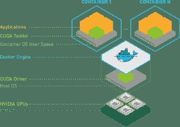

# 利用容器运行时间、Kubernetes 和 GPU 加速开发

> 原文：<https://thenewstack.io/containerds-important-role-for-nvidias-gpu-operator-and-ai-accelerated-cloud/>

Nvidia 是 GPU 市场的主导者，最近在云原生技术方面进行了一系列投资，包括客户端计划、其 GPU 云以及与 Kubernetes 的集成。首先，英伟达正在将它的 NVIDIA GPU 操作器与 T2 的容器运行时间整合，从 T4 的 Kubernetes 版本 1 . 4 . 0 T5 开始。

这对任何关注容器架构发展的人来说都是真实的。带有容器的 GPU 形成了一条通往机器学习可扩展性的道路，这反过来将创造人工智能在我们日常生活中的长期使用，这种使用方式将在我们的工作和生活中变得透明。如果不使用我们称为数据中心和云服务的巨型计算机的巨大处理能力，就不可能在我们的设备上扩展应用程序。它创建了一个软件层，抽象大规模应用程序开发中的复杂性。

## 差距

但是有差距。而差距就在规模上。

在 GPU 上建立正确的开发环境是一件痛苦的事情。首先是 Nvidia 显卡驱动，直接和硬件/GPU 通信；其次是 CUDA runtime 和 cuDNN 等各种库，这是一个用于深度神经网络的 GPU 加速原语库。

最后，安装像 [TensorFlow](https://www.tensorflow.org/) 或 [PyTorch](https://pytorch.org/) 这样的框架，它们可以通过堆栈与 GPU 对话。驱动程序、运行时、库和框架的版本应该相互兼容。任何偏差都会干扰培训的工作流程和绩效。

通过容器，Nvidia 在一个自包含的映像中提供了最兼容和优化的堆栈。这消除了为开发环境手工选择正确组件的微妙过程。当然，它也提供了可移植性。相同的图像可以用于一个 [Amazon EC2 GPU](https://aws.amazon.com/?utm_content=inline-mention) 实例或一个本地 GPU。容器包装允许开发人员将他们的应用程序和工具包容器化，并使用 Nvidia 研究人员和数据科学家构建和发布的模型。它使得整个工作流可以通过 Helm 在 Kubernetes 环境中部署。

容器是不可变基础设施的基础。它们是便携的，易于更换和优化。机器学习工程师可以构建 TensorFlow 模型，该模型可以与其所有库一起打包在一个容器中。GPU 加速培训，但不具备虚拟化的底层能力。它们的价值在于神经网络的速度和大规模处理。有了容器，优化后的模型可以在横向扩展的架构中分发和使用，为实现机器学习操作带来了真正的机会。

在过去的几年中，Kubernetes 架构因其在软件开发生命周期中作为容器编排器的作用而受到重视。有了 GPU，市场找到了并行处理海量数据集的方法。现在，随着算法开发变得更加容易，容器技术被视为一种使使用神经网络的算法在企业架构中更具可扩展性的方法，无论是在云环境还是私有的分布式环境中。英伟达的投资展示了无法虚拟化的 GPU 如何用于加速不同行业应用程序的对话式人工智能等模型的使用。

Nvidia 近年来已经将注意力转向 containerd 和 [CRI-O](https://cri-o.io/) ，现在这些开源运行时是那些使用基于容器的架构来管理 Kubernetes 上的应用架构的人的选择。CRIO-O 是由[红帽](https://www.openshift.com/try?utm_content=inline-mention)开发的，当时 Docker 正处于最受欢迎的时期，大约在 2016 年。CRI-O 是一个基于容器运行时接口(CRI)的运行时，用于开放容器倡议(OCI)。Containerd 是一个已经成为行业标准的运行时，它监督容器的生命周期，通过 API 调用与外界通信。

[英伟达的容器工具包](https://github.com/NVIDIA/nvidia-docker)允许用户构建和运行 GPU 加速 Docker 容器。该工具包包括一个容器运行时库和实用程序，用于自动配置容器以利用 Nvidia GPUs。

容器工具包扩展到运行相同 CUDA-X 堆栈的 edge 设备的 [Jetson 系列](https://developer.nvidia.com/embedded/jetson-modules)。开发人员可以从 Nvidia GPU 云中提取针对 [JetPack](https://developer.nvidia.com/embedded/jetpack) 优化的图像，JetPack 是支持人工智能操作的 Jetson 系列产品的软件堆栈。

Nvidia GPU Cloud (NGC)是一个用于构建机器学习模型的框架目录，如 TensorFlow、PyTorch 和 MXNet。NGC 还收集了 Kubernetes 的头盔图表，以及一系列模型，如人物探测器和面部识别功能。

Nvidia 对 Docker 进行了最初的技术投资，以开发 Nvidia Docker，使其能够运行 GPU 加速的 Docker 容器。根据 GitHub 上的[文档，它提供了一个库和一个命令行界面工具来配置利用 NVIDIA 硬件的 GNU/Linux 容器。](https://github.com/NVIDIA/nvidia-docker)

英伟达放弃了 Docker 这个名字，将其新服务命名为我们现在所知的英伟达容器工具包。英伟达将 Helm charts 用作在 Kubernetes 上运行的应用程序包管理器。该工具包可用于为 Helm 准备容器。舵图允许用户定义应用程序，安装并保持升级。根据英伟达[文档](https://docs.nvidia.com/ngc/index.html)，用户可以创建掌舵图，并将其推送到 NGC 组织和团队注册空间与他人共享。随着其向 Kubernetes 的推进，Nvidia 开发了一个 GPU 操作器作为 Helm installable。

在 Kubernetes 1.20 中，对 Docker 的支持[被否决了](https://kubernetes.io/blog/2020/12/02/dockershim-faq/)，促使许多人重新考虑他们未来对容器运行时的选择，Nvidia Cloud Native 团队的首席软件工程师 Kevin Klues 在 Nvidia 开发者博客的一篇[帖子中写道。“对于现有的 Docker 用户，显而易见且风险较小的选择是 containerd，因为 Docker 已经运行在 containerd 之上。从用户的角度来看，这种转变将是完全透明的。”](https://developer.nvidia.com/blog/announcing-containerd-support-for-the-nvidia-gpu-operator/)

Nvidia Operator 支持 Docker 和 CRI-O 运行时。用户要求运营商支持 containerd。值得注意的原因: [microk8s](https://microk8s.io/) ，正如 Klues 所指出的，它只能在 containerd 上运行。GPU 操作员运行 GPU 节点，就好像它们是 CPU 一样。它使用 Kubernetes 中的 operator 框架来自动管理配置 GPU 所需的所有 Nvidia 软件组件。

英伟达人工智能产品总监 Adel Al-Hallak 在去年的一次采访中表示，该运营商使 Kubernetes 环境中的 GPU 部署成为一等公民。该功能允许操作员管理单个黄金映像，而不是管理两个不同的映像，一个看到 CPU 节点，另一个也看到 GPU 节点。

带有 GPU 的容器的优势在于包装。传统实践要求数据科学家使用 TensorFlow 或 PyTorch 等框架从头构建模型。这项工作通常非常复杂，只有博士科学家才知道如何建立模型。根据威斯康辛大学的说法，由于复杂性和所需的知识，数据科学家每年可以赚[250 万](https://datasciencedegree.wisconsin.edu/data-science/data-scientist-salary/)美元。

英伟达现在正在为数据科学家开发工具包，允许他们将模型打包到容器中，开发人员可以通过英伟达 GPU 云注册表使用[转移学习](https://ruder.io/transfer-learning/index.html#whatistransferlearning)等技术来访问这些容器。通过转移学习，现有的神经网络能力可以转移到模型中。

这就是容器包装变得有用的地方。

“我们说‘嘿，这是一个(神经网络)转移的容器化工具包，我们称之为转移学习工具包，’”Al-Hallak 说，他在 Nvidia 之前在 IBM 担任机器学习、深度学习和认知系统的产品经理。“这是我们为您预先训练的一组模型，对吗？因此，可以对图像和计算机视觉进行分类或检测图像或视频中的对象的模型，或者可以识别异常的医学成像空间中的模型。你知道，任何给定的 CT 扫描或 x 光。”

对于可能不是训练有素的数据科学家的用户来说，容器减少了流程的复杂性。Nvidia 的 transfer learning toolkit 使用 Docker 容器来分发预先训练好的模型，用于计算机视觉和对话式 AI 用例。

Al-Hallak 说，集装箱提供了技术和商业价值。商业价值来自英伟达如何将其 GPU 与容器化的现成模型打包在一起。它为 OEM 提供了一种利用容器提供的云原生功能获得 GPU 处理能力的方法。

并且处理能力是巨大的。

“所以，想象一下，如果我有 10 个 GPU 节点，”领导 MSV 咨询公司的贾纳基兰·MSV 说。“如果我想优化我的机器学习训练性能，Kubernetes(运行在 CPU 上)将在主机级别、机器级别进行，Nvidia 的 CUDA(计算统一设备架构)将在 GPU 级别进行并行化。因此，当你在 Kubernetes 上用 10 台 GPU 机器运行机器学习训练作业时，你会获得 10 倍的性能。”

通常情况下，单个头盔安装将成为对话式人工智能虚拟天气机器人的参考应用，这是英伟达开发的一个例子。

GPU 不是为分布式计算而设计的，这使得它们对 ML 工程师很有用，但不是可以扩展的东西。CPU 是为满足计算、存储和网络需求的多种处理能力而制造的。Nvidia 正在提供 GPU 上的容器，可用于数据中心以加速数据处理，然后在基于 CPU 的分布式架构上可用。容器为 Nvidia 提供了一种销售其 GPU 的方法，容器是医疗保健等不同垂直市场中使用的模型的存储库。

“所以，看到 CPU，首先，可以虚拟化，”MSV 说。“计算、网络、存储，所有这些都可以虚拟化和容器化。例如，您可以使用计算机上的一个以太网卡，然后构建多个 VXLans 或虚拟 LAN，在 Kubernetes 中创建一个虚拟网络和覆盖网络，这非常有效。同样，您可以虚拟化存储。您可以拉出十个磁盘，并创建对 Docker 和 Kubernetes 可见的卷。CPU 是多个容器之间的时间共享，甚至没有意识到这一点。但当涉及到 GPU 时，它不能被虚拟化，并且它不是容器友好的。”

## 下一步是什么？

业界正朝着虚拟化 GPU 的方向发展。 [Run:AI](https://www.run.ai/) 和[bit fusion](https://www.vmware.com/company/news/updates/vmware-announces-intent-to-acquire-bitfusion.html)by[VMware](https://tanzu.vmware.com?utm_content=inline-mention)就是其中的一些例子

英伟达正在巩固其在人工智能加速云中的地位。Kubernetes 是交付如此复杂的软件堆栈的统一和一致的层。Nvidia 在容器架构的开源王国中的表现如何，将影响人工智能在公共云、数据中心和边缘环境中的出现。

詹妮基拉姆 post 对此文有所贡献。

<svg xmlns:xlink="http://www.w3.org/1999/xlink" viewBox="0 0 68 31" version="1.1"><title>Group</title> <desc>Created with Sketch.</desc></svg>