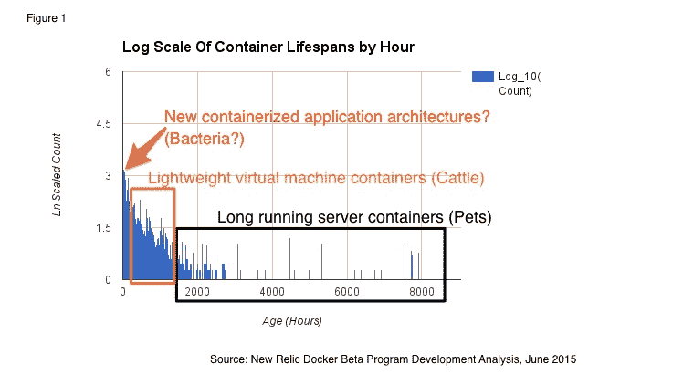

# 作为细菌和其他码头趋势的容器通过新的遗物

> 原文：<https://thenewstack.io/containers-as-bacteria-and-other-docker-trends-via-new-relic/>

ActiveState 的 Bernard Golden 最近提出，在宠物与牛的讨论中，[容器必须是鸡](https://thenewstack.io/pets-and-cattle-symbolize-servers-so-what-does-that-make-containers-chickens/)——更快更有效地成熟。但是新的遗迹表明它们可能更准确地被认为是细菌。

从使用其私人测试版 Docker 监控服务的 300 多名 New Relic 客户收集的数据中——每天使用 4 万到 6 万个集装箱——它发现很大一部分人的寿命不到一小时，许多人只有两分钟或更少。

【T2

New Relic 的解决方案营销高级总监 Abner Germanow 解释说，New Relic 大约一年前开始在内部使用 Docker，以便推出一项新服务，现在广泛使用它，但为了改善服务，它需要了解“独角兽”数据中心以外的客户是如何使用它的。

它的测试程序于 5 月开始，并于上周推出了 Docker 监控功能。

“DockerCon 带给我们的一个启示是，许多公司正试图更快、更一致地构建软件，并非常、非常快速地对软件进行迭代。这是一个难题，但也是很多人都在努力解决的问题，”他说。

他说，公司从测试中学到的东西包括:

*   各种各样的公司——按行业垂直和规模——都在使用容器。有些人只是涉猎这项技术，而其他人则在生产应用程序中积极使用这项技术。

“不仅仅是以网络为先的公司。它是大型企业、中型公司，在地图上非常明显。我们尤其在那些试图非常积极地改变他们的客户体验和关系的公司中看到这种情况。他们希望在网上、手机上、商店里、他们的制造工厂里创造新的数字体验。他说:“在那种必须进行大量试验的环境下，Docker 消除了很多复杂性。

*   不到两分钟的容器生命周期数表明客户正在构建一个全新的架构。这与人们在虚拟机上构建的东西完全不同。

*   客户希望在生产中使用 Docker 的指标是一个持续的对话。如果容器被用作轻量级虚拟机，那么它们可以作为主机被监控。如果容器不仅仅用作虚拟机，而是用作短暂的实体，那么容器类型行为的性能指标比虚拟机的传统监控更有意义。

在只持续一两分钟的容器监控中，整体观察它们的性能比单独观察每个容器更有意义。

它的[客户 Motus](https://try.newrelic.com/rs/412-MZS-894/images/Motus_CaseStudy.pdf) 估计，New Relic 已经帮助该公司减少了 30%的调查和修复 Docker 集装箱问题的时间。

Motus 基于云的移动应用程序以前被称为企业报销服务(CRS ),可帮助远程员工跟踪里程和报销情况。据技术副总裁斯科特·兰金(Scott Rankin)说，该公司只有 85 名员工，开发和运营人员很少，需要他们能够得到的所有帮助来简化他们的工作。

在过去的几年里，它从 PHP 转移到 Java，并在过去的一年里转移到使用 Docker 的基于微服务的架构。大约一年前，它开始在内部使用 Docker。

“最初在内部使用 Docker 使我们的开发和 QA 团队能够构建由所有这些不同服务组成的环境，而无需花费大量时间来配置和安装不同的软件。…在 2015 年初，我们开始将我们的暂存和生产环境也迁移到 Docker，”他说。

现在它在生产中大约 99%的应用程序都使用 Docker。

“早期，由于这是一个快速发展的生态系统，所以不清楚所有的最佳实践是什么。我们不得不自己发明很多东西，”他说。“随着标准和最佳实践的出现，我们对产品进行了多次修改。早期采用者总是面临挑战:你得到了一些好处，但并不是所有的事情都解决了。

> “编排总是一个挑战。Docker 一开始是一个在容器中运行应用程序的好方法，但我认为每个人都在试图弄清楚，‘好吧，我们有一个在容器中运行的应用程序，但我们如何组成一套应用程序呢？’？“我们如何让这些东西互相交流，”

“因此，我们从推出自己的动态环境服务开始，我们使用 Grails 构建该服务来动态编写 Docker 应用程序。当我们进入试运行和生产环境时，我们使用了中间层堆栈。他说:“在生产中，我们现在使用 Apache Mesos、Marathon 和 Chronos 来管理所有这些环境，效果非常好。

虽然 Motus 成为新的 Relic 客户已经有大约四年了，但由于没有 Docker 的支持，它失去了知名度。

“当我们将 Docker 迁移到我们的生产环境中时，事情变得有些混乱，因为我们失去了联系。应用程序仍然可以向 New Relic 报告他们的信息，服务器也仍然可以向 New Relic 报告他们的信息，但是在 New Relic 拥有 Docker 支持之前，两者之间的链接丢失了。这使得它更具挑战性。

> “我们会发现应用程序性能问题，必须寻找 Docker 容器以及它运行在哪个服务器上。…[现在]如果其中一个实例运行不佳，我们就有了一个更清晰的途径来查看堆栈中的哪个位置出现了问题。”

他说有一种误解，认为只有拥有成千上万生产节点的大企业才能从 Docker 中受益。但是选择合适的工具很重要。

“特别是现在所有的工具都上线了——我们看到的是从开发到测试再到生产的代码转移过程完全变得容易了，”他说。

ActiveState 和 Docker 是新堆栈的发起人。

专题图片: [Mathias Pastwa](https://www.flickr.com/photos/mpastwa/) 的《[细数方式](https://www.flickr.com/photos/mpastwa/2720141561/in/photolist-59nrjr-6449sV-9bx1zY-65ez49-ePXpR5-9fU8GZ-b9t3rH-kWoJaV-h3zPtr-qBcTYj-u3FRS-4FqG7k-6J24c3-5jgfvQ-6J23CE-8Z24i7-65fpy1-h77DB3-2gijVL-6rZg9q-je26fk-9Q33Rs-guHoVL-guHKy6-agsTgG-6rZg77-bjBnr2-avviQV-cuXmHh-guGw6h-guHM88-guH5UV-guGtHb-guH5Nx-guH4yt-ry6yFv-5dopRY-23pDER-23pDvD-23pDwc-23pDy4-23pDBi-6c1ik6-guHqEh-guH6Az-guHKMT-guGusY-9Vx5oX-cuXkt3-9Vx4dc)》在 [CC BY-ND 2.0](https://creativecommons.org/licenses/by-nd/2.0/) 下获得授权。

<svg xmlns:xlink="http://www.w3.org/1999/xlink" viewBox="0 0 68 31" version="1.1"><title>Group</title> <desc>Created with Sketch.</desc></svg>