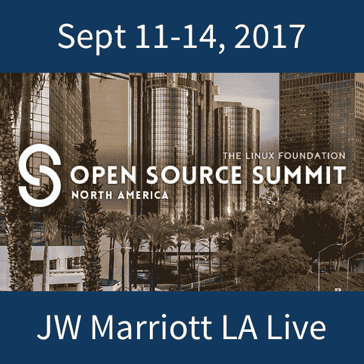

# 2017 年集装箱展将展示集装箱对生产系统的深刻影响

> 原文：<https://thenewstack.io/containers-come-age-nows-time-explore-innovate-containercon-2017/>

“今年感觉像是容器成熟的一年，”微软 [Kubernetes Helm](https://github.com/kubernetes/helm) 项目负责人马特·布彻说。作为即将在洛杉机[开源峰会](https://events19.linuxfoundation.org/events/open-source-summit-north-america-2018/)上举行的 ContainerCon track 的项目主席，Butcher 看到了一系列塑造容器前景的新兴趋势和主题——例如，Mesos 和 [Kubernetes](/category/kubernetes/) 等系统中的网络性能，新的和有趣的容器安全模型，以及云原生(或云优先)应用程序的开发。

Butcher 认为，随着[微软对开源项目](https://thenewstack.io/microsoft-shifting-emphasis-open-source/)和它们周围的社区进行更深入的投资，容器化的应用程序开发社区在成熟度方面向前迈出了一大步，使得容器编排技术最终被视为生产就绪变得可行。我们与 Butcher 坐下来讨论了今年 ContainerCon 即将推出的一些亮点。

**今年的 ContainerCon 有哪些技术亮点？**

马特·布彻

Matt 是微软的首席工程师，负责开源 Kubernetes Helm 项目。他参与了数百个开源项目，出版了八本技术书籍，以及 Kubernetes 儿童图解指南。他将在洛杉矶的开源峰会上展示“项目发展过快的七个教训”。

今年感觉像是集装箱成熟的一年。容器不仅引起了一线开发人员的极大关注，也引起了企业的极大关注。今年的[集装箱时间表](https://events19.linuxfoundation.org/events/risc-virvine2019/program/schedule/)确实反映了这一点。我们有一些工程师的精彩会议，他们正在推动集装箱技术的发展。但是，我们也很高兴能够就将容器集成到现有的大规模部署中展开讨论，包括:

这些会议的重点是容器在未来技术堆栈中的位置。但是除此之外，该时间表还包含了关于如何使用容器、如何调整容器技术，甚至如何选择正确的容器技术的会议。

**你对哪些课程特别感兴趣？**

我对挑战极限的会议感到兴奋。所以，对我来说最突出的是像这样的会议:

这些会议将挑战我们关于容器如何工作的假设。他们强调在这个新的生态系统中还有多少未被探索。

最近，容器是一个热门话题，但是在容器世界里还有什么更热门的话题呢？

Kubernetes 的崛起是每个人现在最喜欢的话题——理所当然。Kubernetes 正在重塑许多人将容器视为复杂应用程序部署生态系统的方式。但是，像 Mesos 和 Kubernetes 这样的系统中的网络性能现在是一个充满创新的领域。新兴的安全模型正在解决容器带来的独特的安全问题。

不过，我认为最重要的主题领域是软件开发人员如何构建云原生(或云优先)应用。从建筑学的角度来说，我们站在一个新的基础上，这使我们能够建造一种新的建筑。

积极地说，一件“不太热门”的事情是大型容器编排参与者之间的紧张关系。我很高兴看到一些关于 Kubernetes、Swarm、Mesos 和其他人的优缺点的深思熟虑的介绍。作为一个广泛的社区，我们越来越善于相互学习，而不是试图赢得一场受欢迎程度的竞赛。

【T2

你看到了哪些新趋势？

今年，我们超越了“能做到吗？”然后想，“我们能做得多好？”这是一个平台或技术家族整体稳定性的良好指标。因此，我认为今年容器编排技术可以说是生产就绪。

尽管如此，我们在现有的主题上有了新的周期。在我看来，存储和持久性一直是容器生态系统中最薄弱的地方。我很高兴看到从设计模式到底层实现的各种会议。例如，“[反模式之墙已经倒塌](http://sched.co/BDpx)”(黄家强著)解决了开发人员关心的问题。而 [OpenSDS 面板](http://sched.co/BDq3)真正突出了为解决这一问题所做的有组织的工作。

我也很高兴看到持续集成和编程测试成为需要以云原生方式解决的问题。

**与会者还能期待什么？**

ContainerCon 是其中一个会议，从设计上来说，它将引发该领域的创新。今年我们展示了如此广泛的技术，所有这些技术都在努力寻找我们技术的边界。像这样的会议是发现和发明的平等部分:与会者不仅会发现存在什么东西，还会发现哪些问题空间仍然开放(或刚刚被发现)。

如果有一个我认为贯穿我们所有会议的主题，那就是:“探索创新”——了解外面有什么，以便做新的和令人兴奋的事情。

这个故事是由 Linux 基金会赞助的。

[CodeShip](https://codeship.com/features/pro) 、 [Red Hat](https://www.openstack.org/) 和 [VMware](https://www.vmware.com/cloud-solutions/app-modernization/cloud-native-apps.html) 是新堆栈的赞助商。

由[万豪酒店](http://www.marriott.com/hotels/travel/laxjw-jw-marriott-los-angeles-l.a.-live/)提供的 JW 万豪会议中心特写照片。

<svg xmlns:xlink="http://www.w3.org/1999/xlink" viewBox="0 0 68 31" version="1.1"><title>Group</title> <desc>Created with Sketch.</desc></svg>