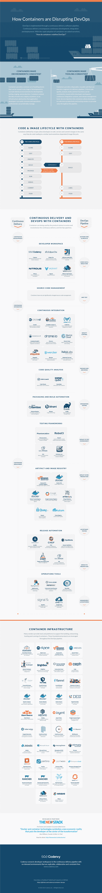

# 颠覆 DevOps:容器生态系统的市场地图

> 原文：<https://thenewstack.io/containers-disrupting-devops-infographic/>

在 New Stack 的几个月里，我们一直致力于为我们的新电子书系列(现在可以从[下载](https://thenewstack.io/ebookseries/))可视化 Docker 和容器生态系统。我们从所有不同的角度观察市场，但意识到没有简单的方法来分析它。有几个因素使它变得复杂:

*   Docker 和容器与整个堆栈相关。
*   有许多与 Docker 和容器生态系统相关的开源项目。
*   公司、产品、服务和开源项目之间存在重叠。

[Codenvy](https://codenvy.com/) 于 2013 年开始使用 Docker，成为最早采用容器技术的公司之一。对于 Codenvy，Docker 提供了一种快速配置连接到开发人员工作区的环境的方法。容器的使用意味着这些工作区从最初的创建，到跨职能开发团队中的管理，到单元测试、质量控制，甚至打包和归档，都保持一致。

从这个角度来看，Codenvy 用自己的方式来打破生态系统。看了一眼后，很明显他们的工程师找到了问题所在。他们开发了一种不同的方法来查看持续交付，这种方法显示了该过程如何从代码开发扩展到部署。

通过开拓持续发展，他们提供的信息图显示了整个 Docker 和容器生态系统的背景。它概述了使用容器的产品星座，以扩大连续交货的好处。它清楚地说明了连续交付如何影响 DevOps 世界，以及容器对新堆栈环境的影响。

我们很高兴作为该项目的研究伙伴与信息图相关联，帮助进一步定义这项正在进行的工作。Codenvy 将把信息图发布到 [GitHub](https://github.com/codenvy/container-devops) 上，并随着这个新市场的发展进行更新，但我们想让我们的读者先睹为快。

了解更多关于集装箱的[市场地图。](https://codenvy.com/solutions/continuous-delivery/)

Codenvy 的集装箱市场地图

<svg xmlns:xlink="http://www.w3.org/1999/xlink" viewBox="0 0 68 31" version="1.1"><title>Group</title> <desc>Created with Sketch.</desc></svg>