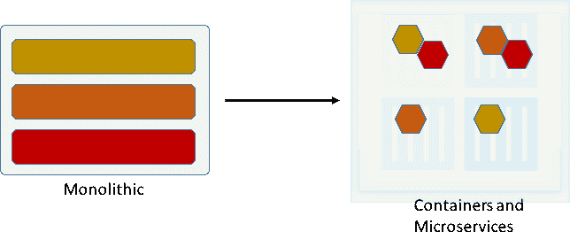

# 容器、微服务和多重云

> 原文：<https://thenewstack.io/containers-microservices-and-the-multi-cloud/>

 [比尔扎亚茨

比尔是一名沉迷于表演的销售工程师。在他目前的公司 Teridion，Bill 正在与一些公司合作，这些公司已经意识到互联网最初是被设计为可靠的，但不是快速的。他拥有应用和网络诊断方面的背景，并在整个职业生涯中与超大型开创性组织合作过。他的重点是找到一种更好更有效的方式来传递内容，使用传统技术是不可能的。](https://www.mirantis.com/software/docker/kubernetes/) 

在任何地方构建、发布和运行任何应用程序:这是 Docker[的一个非常强大的口号。](https://www.docker.com)

这个原则让我对容器，特别是运行在容器内部的微服务，在应用程序开发和部署中为我们提供的机会感到非常兴奋。

我们现在想象一个世界，在这个世界中，我们不再被前任或相邻团队做出的架构决策所束缚。

有一个[容器化的应用](https://thenewstack.io/containers-microservices-two-peas-devops-pod/)想从 AWS 迁移到 Azure 一个月？没问题！想要用 Python 构建您的搜索过程，而组织的其他部分用 Java 编写吗？开始吧！

容器内微服务的可能性是一个勇敢的新世界，但这里是我一路走来学到的几点。

## 新老方法

容器的概念并不新鲜。Java 虚拟机(JVM)是一个容器。新的是理解改变一个微服务不会影响分布中的其他服务。围绕内核级问题，容器存在一些安全问题，但是只要组织遵循一套最佳实践，这些问题就可以被最小化。

好消息是，有许多基于特定需求的[容器编排引擎](https://thenewstack.io/tns-research-present-state-container-orchestration/)可用。容器引擎使得容器的部署和管理比将每个容器作为自己的过程来管理要简单得多。此外，它们正在走向成熟，并允许组织通过一组单一的规则和法规来扩展由此管理的基础架构。

> 我第一次使用容器编排引擎时，我没有对我的帐户上 EC2 实例的数量进行任何限制。我从 AWS 那里得到了 300 美元的账单，因为我花了 15 分钟点击了编排引擎教程。

随着从数据中心到云再到多云的转变，两个云提供商之间的联系与内容和最终用户之间的联系一样重要。越来越多的组织正在利用多个云提供商来为单个用户的查询提供答案。当到两个云的连接变得拥塞或中断时，组织应该做什么？故障转移到另一个云？虽然从技术上来说这是可行的，但是它会给引擎增加额外的规则，并且会增加部署的成本。

相反，如果[边界网关协议](http://www.bgpexpert.com/what.php) (BGP)遇到问题，组织应该通过自动化更改，利用类似 [Teridion](http://www.teridion.com/) 提供的解决方案来确保互联网始终以最佳吞吐量运行，从而专注于避免点对点问题。对于那些云之间没有直接连接的云提供商来说，这是一个非常好的解决方案。希望利用多个云供应商的组织也可以从这种方法中受益。

## 按比例缩放

我第一次使用容器编排引擎时，我没有对我的帐户上 EC2 实例的数量进行任何限制。我从 AWS 那里得到了 300 美元的账单，因为我花了 15 分钟点击了编排引擎教程。

这种气球式扩展也是组织需要关注的问题，他们需要确保自己的微服务能够正确扩展。在确保只将必要的容器添加到分发中以获得最大性能同时最小化工作和成本之间存在一个平衡。休眠数据中心中始终开启的容器越来越受到关注。这些休眠数据中心通常用于故障转移或本地区域支持。

如果一个组织利用云实例来支持本地区域，通常是因为担心其他位置的互联网性能。拥有多个地理足迹还有其他原因，如数据隐私，但除了在指定区域内托管内容之外，这些要求无法通过任何其他方式来满足。如果一个组织能够减少运行其应用程序所需的物理位置数量，成本节约将是巨大的。同样，如果有一个数据中心能够横向扩展，以高效的方式动态处理流量，那么成本节约将非常可观。

## 部署的主要框架

容器可以存在于任何可以部署操作系统的地方。这并不意味着您的应用程序应该跨多个数据中心或云部署，而单个地理位置就可以了。

这个想法非常类似于大型机如何被定位为非常强大和安全的设备。所有这些单独编程的任务都存在于一个单一的单元中。微服务的聚合有点类似于这种部署架构。随着新的网络功能的出现，容器变得越来越难以穿透。

唯一缺少的是将微服务与世界其他地方分开的钢壳。组织应该有一种方法来部署大量的容器，而不需要外人知道入口点在哪里。在微服务和最终用户之间设置防火墙是一个好的开始，但是防火墙会成为一个潜在的攻击点。在对性能影响有限的情况下，最终用户和微服务之间的分离也是可能的。许多组织正在利用类似 VPN 的架构，使最终用户将端点视为外部 IP，然后将所有流量转发到真正的源头。

## 最后的想法

容器和所有外围组件是目前开发中最热门的领域。有些组织在他们的生产环境中利用容器。性能始终是任何 IT 计划的关键组成部分，容器允许在解决与大容量应用程序相关的大部分固有的可伸缩性问题时具有灵活性。

容器在处理性能和容器之间的内部网络吞吐量方面越来越成熟。这些微服务仍然取决于最终用户对互联网性能的兴趣。任何部署策略都必须包含对互联网带来的不稳定性和不安全性承担责任的程序；否则，成为基于微服务的组织的过程将导致低劣的用户体验。

Docker 和 [Teridion](https://www.mirantis.com/software/docker/kubernetes/) 是新堆栈的赞助商。

专题图片:美国爱荷华州马德里，照片由托尼·韦伯斯特拍摄。

<svg xmlns:xlink="http://www.w3.org/1999/xlink" viewBox="0 0 68 31" version="1.1"><title>Group</title> <desc>Created with Sketch.</desc></svg>