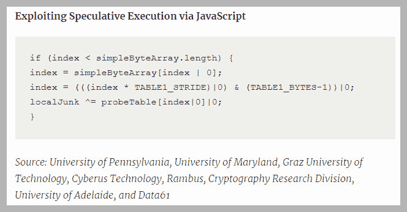

# 如果你知道该怎么做，容器可以很好的抵御幽灵和熔毁的攻击

> 原文：<https://thenewstack.io/containers-offer-good-protection-spectre-meltdown-attacks-know/>

软件容器可以在一定程度上缓解 Spectre 和 Meltdown 攻击——但是如果没有关键安全工具和实践的帮助，它们仍然是相对容易的目标。

“与虚拟机等其他系统相比，容器更难利用，也更容易保护。但是我并不是说你也没有什么可担心的，”迈克尔·切尔尼说，他是, [Aqua](http://www.aquasec.com/) 的研究负责人。“集装箱就像一栋单门房子。相比之下，云上的虚拟机可以有许多你可以用 Spectre 和 Meltdown 打开的门。”

当然，容器仍然像虚拟机和其他系统一样容易受到 Spectre 和 Meltdown 攻击，因为入侵者可以通过运行该软件的英特尔、AMD 和 ARM 设备中的安全漏洞进行访问。在 Spectre 攻击的情况下，通过利用丢弃的 CPU 代码并执行来自核心处理器的错误代码来渗透容器。Meltdown 攻击涉及对指令的访问和利用，这些指令随后会泄漏到物理内存缓存中。

**Docker 的安全主管 [David Lawrence](https://www.linkedin.com/in/endophage/) 说:“无论是在容器上还是在虚拟机上，这一点都没有实际意义，因为这些漏洞都是基于硅的。“对这些类型的漏洞的主要修复是在 Windows、macOS 和 Linux 的操作系统内核和 CPU 硬件级别。因此，我们建议您尽快遵循操作系统内核升级的标准程序。”**

 **容器特有的一个问题是它们的运行时被设计成管理它们的生命周期，而不是检测单独运行的容器的恶意行为，首席技术官和 Alcide 的联合创始人 Gadi Naor 说。

> 就像导致人类莱姆病的不同类型的细菌一样，黑人和白人黑客都在继续创造 Meltdown 和 Spectre 的变体，而现有的补丁还无法修复。

Naor 说:“Meltdown 和 Spectre 令人大开眼界的现实是，在未来几年内，CPU 将继续带有这些漏洞。对于容器化部署，使用相关修补程序更新底层操作系统并降低底层性能是第一步

实际上，安装补丁会导致性能延迟，延迟的程度还有待观察。“从性能的角度来看，就处理器速度而言，观点各不相同。这显然取决于你运行的有效载荷，但没有一个数字量化器，”Cherny 说。“我们现在所知道的是，补丁正在减慢它们的速度，或者在未来会更慢。”

## 前面的路还很长

还有一点经常被忽视，那就是现有的 Meltdown 和 Spectre 内核补丁将无法在未来修复容器漏洞，因为 Meltdown 和 Spectre 的不同变种将会存在。就像导致人类莱姆病的不同类型的细菌一样，黑人和白人黑客都在继续创造 Meltdown 和 Spectre 的变体，而现有的补丁还无法修复。

“业界仍在等待这些新的更新将发挥多大作用，”Cherny 说。“尘埃尚未落定。我们只是在做初步测试，等待数字。”

然而，好消息是，当容器的 CPU 内核补丁可用时，它们的部署相对简单。

[Portworx](https://portworx.com/) 产品管理副总裁 [Eric Han](https://github.com/erickhan) 表示:“虽然为 Spectre 和 Meltdown 打补丁不会包含一个而是多个补丁，但与虚拟机相比，用容器下载内核补丁要容易得多，因为虚拟机需要为每个应用程序的每个虚拟机内核打补丁。“有了容器，补丁安装的数量减少了，因为在一个共享内核上有许多应用程序。部署更加不可变和可预测。”

[](https://storage.googleapis.com/cdn.thenewstack.io/media/2018/02/9a8bb672-meltdown.jpg)

不过，Spectre 和 Meltdown 的出现，以及未来尚未披露的威胁，表明集装箱开发商以及一般的存储公司需要与安全公司更密切地合作，韩说。

“Spectre 和 Meltdown 真正展示了作为一个行业，我们需要如何将开发者运营和安全运营世界结合在一起，”韩说。“我认为你会看到更多的安全和集装箱公司之间的合作。这些类型的合作伙伴关系将使集装箱安全管理更加无缝。”

## 垃圾进，没有垃圾出

除了在芯片级开发和实施补丁，更严格地使用现有的安全工具也可以在保护容器免受 Spectre 和 Meltdown 方面大有作为。容器的美妙之处还在于它们在很大程度上被设计成隔离数据和应用程序。顾名思义，容器尤其适用于检测和控制可疑的数据流量。此外，扫描和白名单等工具尤其擅长防止入侵者成功发起 Spectre 或 Meltdown 容器攻击。

有了白名单，在出现 Spectre 或 Meltdown 生成的安全漏洞时，获得对文件的异常访问、扩展主机上的管理权限或建立出站连接的尝试就会减少。Cherny 说:“白名单对于确保数据从容器中过滤出来尤其重要。”"当有人试图做任何未经授权甚至不寻常的事情时，就会发出适当的警报. "

扫描工具有助于确保只允许信任的映像访问。“你必须只允许你已经起草的图像进入你的环境，”切尔尼说。“为了利用 Spectre 或 Meltdown，您需要能够运行本地代码。如果图像没有被扫描，它就不能在容器中运行。

作为最后的权宜之计，传统的容器防火墙可以像传统防火墙一样，通过防止数据一旦被破坏就从一个容器传输到另一个容器或网络上的其他地方来作为后备。Cherny 说，就像在将图像存储到容器之前将它们列入白名单一样，防火墙将因此防止智能芯片级 Spectre 或 Meltdown 攻击，即使数据已经过过滤。

## 自由与安全

尽管它们能够锁定容器以抵御 Spectre 和 Meltdown，但过度的扫描和白名单会限制它们在数据共享方面的灵活性。

**通过 JavaScript 利用推测执行**

```
if  (index  &lt;  simpleByteArray.length)  {
index  =  simpleByteArray[index  |  0];
index  =  (((index *  TABLE1_STRIDE)|0)  &amp;  (TABLE1_BYTES-1))|0;
localJunk  ^=  probeTable[index|0]|0;
}

```

*资料来源:宾夕法尼亚大学、马里兰大学、格拉茨技术大学、Cyberus Technology、Rambus、阿德莱德大学密码研究部和 Data61*

“保护容器免受 Spectre 和 Meltdown 攻击是一把双刃剑:一方面，您希望确保您的开发人员高效工作，以便他们可以利用一流的库并对业务问题做出响应。但这也意味着你有时需要准备好管理来自你没有完全审查过的来源的容器化应用程序，”韩说。“扫描和白名单工具当然至关重要，但你必须平衡安全问题和生产力，所以你需要担心这两者。有了 Spectre 和 Meltdown，知道在发生攻击时有一个以上的工具可用也是非常好的。”

Cherny 说，归根结底，容器代表了实用性和安全性之间的良好平衡，它们提供了对 Spectre 和 Meltdown 以及其他攻击的保护。“容器代表了一种特殊的情况——它们相对容易保护，但它们总是存在漏洞，容易被 CPU 代码利用，”Cherny 说。“但是，如果你有正确的工具和正确的协议，你会处于一个更好的位置。”

埃尔希德、[阿卡](https://www.aquasec.com/)和[波特沃克斯](https://portworx.com/)是新堆栈的赞助商。

通过 Pixabay 的特征图像。

<svg xmlns:xlink="http://www.w3.org/1999/xlink" viewBox="0 0 68 31" version="1.1"><title>Group</title> <desc>Created with Sketch.</desc></svg>**