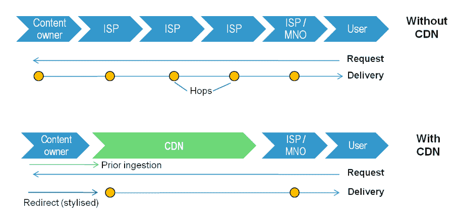
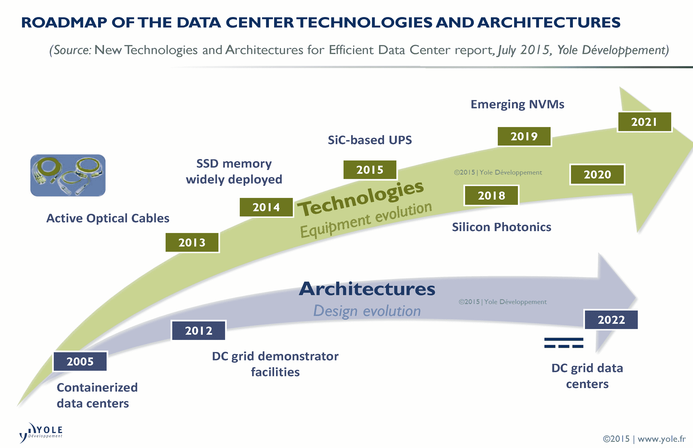

# 内容交付网络越来越靠近网络边缘

> 原文：<https://thenewstack.io/content-delivery-networks-move-closer-network-edge/>

 [布莱恩·惠勒

布莱恩·惠勒在 Morpheus Data 监管技术团队。在 Morpheus 之前，Brian 创办了一家软件开发咨询公司，为各种行业设计和开发解决方案，包括电网管理、票务系统、在线交易、社交网络和游戏、SOX 合规性和电子商务。Brian 拥有波莫纳学院的化学学士学位。](https://www.morpheusdata.com/) 

只有在计算机行业，你才能发现两种完全相反的趋势同时发生。数据怎么可能同时集中在云端，又分散到网络边缘？当您考虑以用户为中心的架构和超融合之间所需的平衡时，乍一看似乎违反直觉的事情开始变得有意义了。

内容交付网络(cdn)是一种新的“中间件”，它将在网络端点工作和生活的用户与越来越集中在云中的大量数据资源连接起来。许多行业观察人士承认，当“超大规模”数据中心的预期下降没有实现时，他们感到惊讶。[根据《数据中心知识》的一篇文章，数据中心的规模继续增长，但数据中心的总数并没有像预期的那样下降](http://www.datacenterknowledge.com/archives/2016/12/13/issues-2017-compute-power-truly-moving-edge/)。

相反，全球范围内正在运行或计划运行的大型数据设施的数量有所增加。因为这些“巨型中心”对电、水和其他资源有巨大的需求，所以它们往往位于大部分用户居住的城市中心之外。这给企业提供服务带来了新的障碍:老式的地理位置。

中小企业使用微软 Office 365 等云托管服务的用户越来越多地报告速度变慢和其他性能问题。长距离数据传输中固有的网络延迟导致许多组织在城市和中央商业区开设区域数据中心。这种现象是物联网驱动的整体趋势的一部分，即更多资源位于网络边缘或附近。

## 所有季节和所有原因

人们已经开始期待在与基于云的内容交互时获得近乎即时的响应，无论他们是在更新数据库、处理大量图形文件，还是在网飞疯狂观看《黑镜》。cdn 将高需求内容缓存在分散在世界各地的服务器上，这样数据到达用户的距离就更短了。简单吧？事实上，有些数据类型比其他数据类型更容易在 CDN 服务器上缓存。增强和虚拟现实、物联网和其他数据驱动技术的出现将使 cdn 达到并超越其极限。

内容交付网络将您最常请求的内容缓存在靠近网络边缘的服务器上，以加快向越来越不耐烦的最终用户交付内容的速度。来源:STL Partners / Telco 2.0

一个问题是，cdn 处理大数据对象(如视频和多媒体)比处理小对象(如从传感器接收的信号)更有效。您可能已经猜到，网络流量增长的很大一部分来自物联网，物联网的特点是这些小对象。

对持续带宽短缺的预测导致企业和接入提供商研究共享 CDN 设施，其中双方都有到领先内容提供商的交叉连接点。因此，“服务提供商边缘”越来越多地与企业网络的边缘重叠。

## cdn 将其覆盖范围扩展到更靠近网络边缘的地方

数据访问提供商面临的挑战有时似乎无法克服。根据康普的数据，仅一个新的数据源——可穿戴设备——在 2015 年就有 9700 万台设备投入使用，[每月总共产生 15pb 的数据](http://data-informed.com/analytics-living-on-the-edge-of-cloud-computing/)。增强和虚拟现实等新技术，以及对流媒体视频的持续需求，给网络带来了更大的压力。将交互性添加到组合中，您将获得仅在几年前还不可想象的数据需求。

现在考虑一下，企业客户对延迟的耐心越来越少，同时他们对网络吞吐量提出了前所未有的要求。难怪 cdn 越来越靠近网络边缘。诀窍是以高效、廉价和自我管理的方式创造优势。分析师预测，托管设施将激增，预计到 2020 年，托管所有企业数据中心的 50%，高于 2015 年的 30%。

主机托管允许公司服务器“模块化”,因此它们在能效和其他操作因素方面针对其位置的自然特征进行了优化。模块化数据中心可以放置在任何有足够电力和高速光纤网络连接的地方。事实上，电源管理成为托管设施的一大优势。例如，根据康普的数据，允许通过绝热或“自由冷却”系统进行冷却的环境可以实现低于 1.05 的电力使用效率，而数据中心行业标准为 1.7。

没有自我管理功能，模块化数据中心就不可行，这使得自动化基础架构管理和数据中心基础架构管理成为必要。此类系统提供对数据中心物理层、供应、电源、冷却和其他组件的远程监控。新企业边缘的最终使能技术是通过互联网交换对等实现数据中心和云服务之间的高速互联。随着硅光子学和其他光学技术的出现，这些高速链路的成本有望下降。

硅光子学、宽带隙(WBG)材料和直流电网等新的数据中心技术支持实现模块化数据中心所需的自我管理能力。来源:Yole dédevelopment。

## **DIY CDN 是你运营的最佳选择吗？**

直到最近，创建自己的内容交付网络还是网飞和其他数据消费巨头的事情。新服务和软件的出现——其中大部分是开源的——使得私有 cdn 的部署对于各行各业的组织来说变得切实可行。私有 CDN 只有在特定的情况下才有意义， [Pete Mastin](https://www.linkedin.com/in/petemastin) 在[一篇关于 DZone 的文章](https://dzone.com/articles/building-a-private-content-delivery-network-for-vi)中说，他曾是网络性能指标公司 [Cedexis](https://www.cedexis.com) (现在在 IBM)的传道者。

特别是，试图在 CDN 服务器上缓存视频内容可能会导致视频从缓存中过期时出现更多延迟和缓冲。据 Mastin 说，一旦用户看到那些缓冲轮在旋转，他们就会以高达 80%的比率放弃视频。为了避免与带宽相关的问题并提高用户的体验质量(QoE)，Mastin 为您的私人 CDN 推荐了一个六步规划流程:

*   创建一个**视频内容管理工具包**，它是根据您的数字媒体文件类型的来源定制的，所有这些都必须处理成自适应比特率格式。
*   从您的存在点(POP)中的**裸机服务器**开始，这样可以避免多租户和其他共享资源的情况。
*   在每台服务器上部署 Unified Streaming 的 Unified Origin 软件插件，**以每台客户端设备所需的格式动态重新打包内容**；该工具适用于 Apache、Nginx、Microsoft IIS 和 Lighttpd 服务器。
*   解决**数字版权管理** (DRM)问题，方法是使用统一起源(Unified Origin)之类的插件，自动为每个特定内容应用正确的 DRM 保护。
*   通过选择满足您独特交付架构要求的路由工具，将用户连接到**最佳源服务器**。
*   随着您的 CDN 不断发展以满足用户不断变化的需求，找到一种工具来确定部署新 pop 的最佳位置。

由 [Samuel Scrimshaw](https://unsplash.com/@samscrim) 通过 [Unsplash](https://unsplash.com/?photo=2oFdVd00xOg) 拍摄的特征图像。

<svg xmlns:xlink="http://www.w3.org/1999/xlink" viewBox="0 0 68 31" version="1.1"><title>Group</title> <desc>Created with Sketch.</desc></svg>