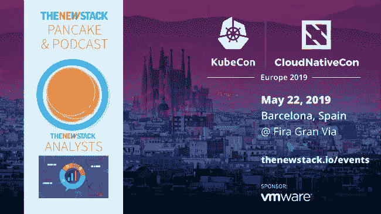

# 上下文:Apache Spark 用于人工智能和 AI 2.0

> 原文：<https://thenewstack.io/context-apache-spark-for-artificial-intelligence-and-ai-2-0/>

KubeCon + CloudNativeCon 和 [InfluxData](https://www.influxdata.com/) 赞助了这个播客。

[阿帕奇 Spark for 人工智能和 AI 2.0](https://thenewstack.simplecast.com/episodes/apache-spark-for-artificial-intelligence-and-ai-2-0)

今天，在 New Stack Context 中，我们将与首席运营官和 MinIO 的联合创始人加里马·卡普尔(Garima Kapoor)讨论如何在 Kubernetes 上大规模使用 Spark 处理人工智能和机器学习(AI/ML)工作负载。

Apache 和 Hadoop 生态系统过去与 Kubernetes 没有太多重叠，但正如我们去年 11 月在西雅图 KubeCon 上了解到的那样，这种情况正在迅速改变。正如 Iguazio 的 Yaron Haviv 在 TNS 上发表的一篇名为“【Kubernetes 会击沉 Hadoop 之船吗？”

“早期采用者意识到他们可以运行他们的大数据堆栈(Spark、Presto、Kafka 等)。)以一种简单得多的方式。此外，他们可以在同一个集群上运行所有酷炫的后 Hadoop 人工智能和数据科学工具，如 Jupyter、TensorFlow、PyTorch 或自定义 Docker 容器。”

快进到现在，我们正在接近下周将在旧金山举行的 Databricks 的 [Spark + AI 峰会](https://databricks.com/sparkaisummit/north-america)，我们很好奇……如今 Spark 是如何用于云原生架构的，例如，像 MinIO 这样的开源容器原生对象存储库是如何在 Kubernetes 上创建机器学习数据管道的？是什么推动了高性能对象存储的趋势？卡普尔在节目的前半部分分析了这些趋势。

在稍后的节目中，New Stack 的执行主编 Joab Jackson 向我们展示了本周在纽约举行的 [O'Reilly AI 会议的亮点。许多演讲者在那次活动中主张，既然机器学习已经牢牢地进入了企业界，我们需要找到让它变得健壮、可靠和安全的方法。](https://conferences.oreilly.com/artificial-intelligence/ai-ny)

在这次会议上，麻省理工学院(Massachusetts Institute of Technology)的教员亚历山大·马德瑞(Aleksander Madry)首次呼吁人工智能 2.0(尽管我们认为这个术语在这个行业可能是不可避免的)。今天的人工智能还不够强大，不够安全，而且仍然太不可预测。他在主题演讲中说，下一代技术必须“与我们人类认为重要的东西更加一致”。

事实上，许多讲座、演示和赞助商展位都围绕着让人工智能更加成熟的想法。在一次演讲中，微软数据科学家 Fidan Boylu Uz 和 Mathew Salvaris 展示了在生产环境中进行基于 ubernetes 的深度学习的三种方法。一种方法是使用 Kubectl 作为启动点——这种方法为那些知道如何管理 K8s 的人提供了最大的灵活性。另一种方法是使用 KubeFlow，这是一个谷歌项目，用于打包整个人工智能管道。这种方法最适合只想使用自己喜欢的库(如 TensorFlow 和 PyTorch)的科学家。最后，当然是 Microsoft AzureML 服务，这是最容易部署的，因为它本身做了大量的配置和构建工作，尽管与其他方法不同，您只能使用 Microsoft Azure 作为您的云。

尽管如此，社交媒体公司正受到巨大的批评，因为它们的人工智能算法往往会出现更极端、更彻底的有毒内容。在机器建议的最佳答案和我们人类认为可以接受的答案之间，仍然需要有一个调和。一个因素可能是劳动力缺乏多样性。Dataiku 的 Kurt Muehmel 在自己关于人工智能伦理的演讲中指出，开发团队越不包容——越同质化——人工智能就越有可能包含无意的偏见。

来自 Pixabay 的 Faizal Sugi 的特写图片。

<svg xmlns:xlink="http://www.w3.org/1999/xlink" viewBox="0 0 68 31" version="1.1"><title>Group</title> <desc>Created with Sketch.</desc></svg>